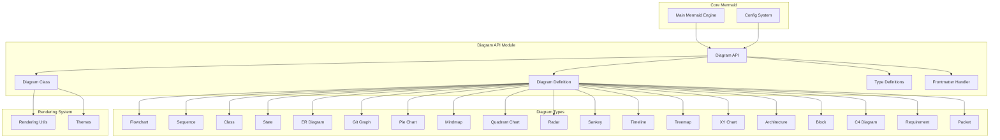
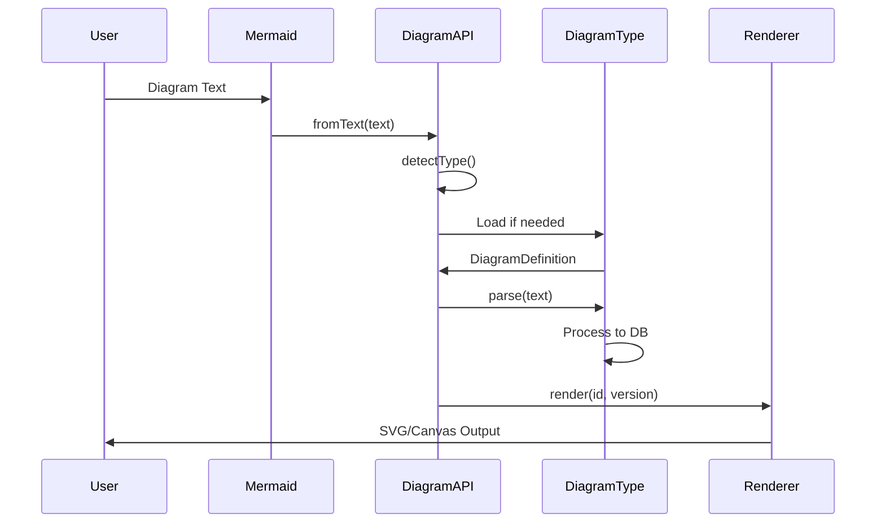

# Diagram API Module

## Overview

The diagram-api module serves as the central orchestration layer for Mermaid's diagram processing system. It provides the core infrastructure for diagram registration, parsing, rendering, and lifecycle management. This module acts as the bridge between the main Mermaid engine and individual diagram types, handling the dynamic loading and initialization of diagram processors.

## Architecture



## Core Components

### Diagram Class (`packages.mermaid.src.Diagram.Diagram`)

The main Diagram class serves as the primary interface for diagram processing. It handles:

- **Text Parsing**: Converts diagram text into structured data
- **Type Detection**: Automatically identifies diagram types from text content
- **Dynamic Loading**: Loads diagram processors on-demand
- **Rendering Coordination**: Manages the rendering pipeline

Key methods:
- `fromText()`: Static factory method for creating diagram instances
- `render()`: Renders the diagram to a DOM element
- `getParser()`: Returns the parser for the diagram
- `getType()`: Returns the diagram type

### Type Definitions (`packages.mermaid.src.diagram-api.types.*`)

Comprehensive type system defining:

- **DiagramDefinition**: Core interface for diagram implementations
- **DiagramDB**: Database interface for diagram data storage
- **DiagramRenderer**: Rendering interface for diagram visualization
- **DiagramMetadata**: Metadata container for diagram properties
- **ExternalDiagramDefinition**: Interface for external diagram types
- **ParserDefinition**: Parser interface for text processing
- **InjectUtils**: Utility injection interface

### Frontmatter Handler (`packages.mermaid.src.diagram-api.frontmatter.*`)

Handles YAML frontmatter processing:

- **FrontMatterMetadata**: Metadata extraction and validation
- **FrontMatterResult**: Structured result container
- **extractFrontMatter()**: Main extraction function

## Data Flow



## Integration Points

### With Core Mermaid Engine
- Receives diagram text and configuration
- Returns processed diagram objects
- Handles error propagation and validation

### With Configuration System
- Retrieves diagram-specific configurations
- Applies theme and styling options
- Manages display modes and accessibility settings

### With Rendering System
- Coordinates with rendering utilities
- Applies theme configurations
- Manages layout and positioning

### With Individual Diagram Types
- Provides standardized interfaces
- Handles lifecycle management
- Enables dynamic loading and registration

## Sub-modules

### [Types System](diagram-api-types.md)
Comprehensive type definitions and interfaces for the diagram API ecosystem, including core interfaces like `DiagramDefinition`, `DiagramDB`, `DiagramRenderer`, and related type definitions that form the foundation of the diagram processing system.

### [Frontmatter Processing](diagram-api-frontmatter.md)
YAML frontmatter extraction and processing for diagram metadata, providing functionality to parse and extract configuration, titles, and display modes from diagram text with YAML frontmatter blocks.

## Key Features

1. **Dynamic Diagram Loading**: Supports on-demand loading of diagram processors
2. **Type Safety**: Comprehensive TypeScript definitions for all interfaces
3. **Extensibility**: Plugin architecture for custom diagram types
4. **Error Handling**: Robust error detection and reporting
5. **Accessibility**: Built-in support for accessibility features
6. **Performance**: Efficient parsing and rendering pipeline

## Usage Patterns

### Basic Diagram Processing
```typescript
const diagram = await Diagram.fromText(diagramText);
await diagram.render('diagram-id', '1.0.0');
```

### Custom Diagram Registration
```typescript
registerDiagram('custom', {
  db: customDB,
  renderer: customRenderer,
  parser: customParser
});
```

### Metadata Handling
```typescript
const diagram = await Diagram.fromText(text, {
  title: 'My Diagram',
  config: customConfig
});
```

## Related Documentation

- [Core Mermaid Module](core-mermaid.md) - Main Mermaid engine integration
- [Configuration System](config.md) - Configuration and settings management
- [Rendering Utilities](rendering-util.md) - Rendering and layout utilities
- [Themes System](themes.md) - Theme and styling system