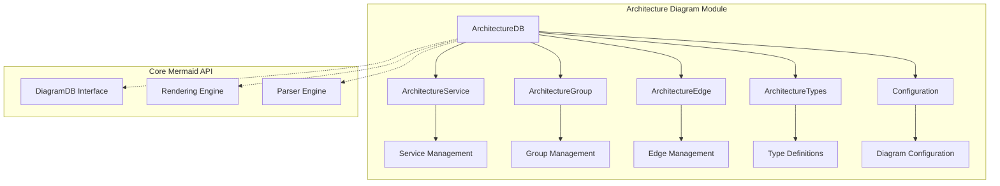
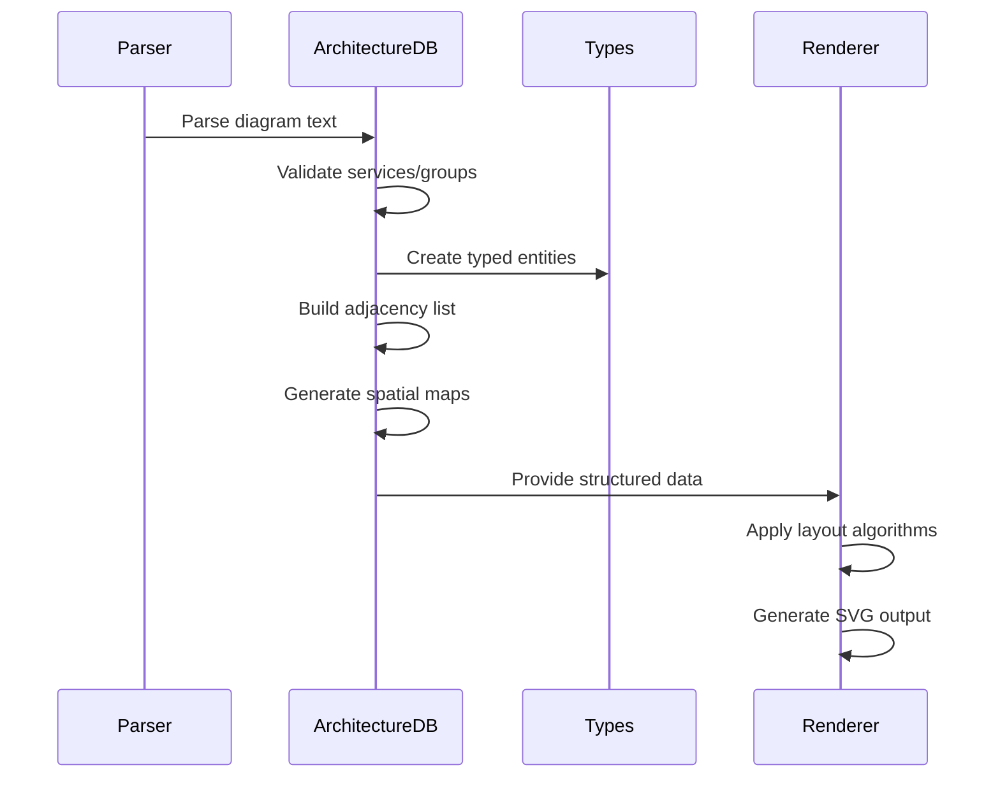

# Architecture Diagram Module

## Overview

The Architecture Diagram module is a specialized component of the Mermaid diagramming library that enables the creation of system architecture diagrams. These diagrams are designed to visualize the structure and relationships between different components in a software system, including services, groups, and their interconnections.

## Purpose

The primary purpose of this module is to provide a declarative way to create architecture diagrams that show:
- System services and their relationships
- Grouping of services into logical boundaries
- Directional connections between components
- Hierarchical nesting of services within groups

## Architecture Overview



## Core Components

### 1. ArchitectureDB (`architectureDb.ts`)
The central database class that implements the DiagramDB interface and manages all architecture diagram data:

- **Service Management**: Add, retrieve, and validate services
- **Group Management**: Handle hierarchical grouping of services
- **Edge Management**: Create and manage connections between components
- **Data Structure Generation**: Build adjacency lists, spatial maps, and group alignments
- **Validation**: Ensure data integrity and prevent circular dependencies

### 2. Architecture Types (`architectureTypes.ts`)
Comprehensive type definitions for the architecture diagram system:

- **Direction System**: L, R, T, B directional constants and utilities
- **Node Types**: Services and junctions with their properties
- **Edge Types**: Directional connections with source/target information
- **Group Types**: Container definitions for organizing services
- **Spatial Mapping**: Coordinate systems for layout algorithms

### 3. Configuration (`config.type.ts`)
Architecture-specific configuration options:

- **Layout Settings**: Padding, icon size, font size
- **Visual Properties**: Colors, dimensions, spacing
- **Integration**: Extends base Mermaid configuration system

## Key Features

### Hierarchical Organization
Services can be nested within groups, allowing for logical organization of system components:
```
group "Frontend" {
  service "web-app"
  service "mobile-app"
}
```

### Directional Connections
Edges support directional indicators (L, R, T, B) for precise relationship mapping:
```
serviceA -R-> serviceB  // Right connection
serviceC -T-> serviceD  // Top connection
```

### Spatial Layout
Automatic spatial mapping using BFS algorithms to determine optimal component positioning:
- Adjacency list generation for graph traversal
- Spatial coordinate mapping for visual placement
- Group alignment tracking for layout optimization

### Validation System
Comprehensive validation to ensure diagram integrity:
- Duplicate ID prevention
- Circular dependency detection
- Parent-child relationship validation
- Directional constraint enforcement

## Data Flow



## Integration with Mermaid Core

The Architecture Diagram module integrates with the broader Mermaid ecosystem:

- **DiagramDB Interface**: Implements standard database operations
- **Configuration System**: Extends base configuration with architecture-specific options
- **Rendering Pipeline**: Works with Mermaid's rendering engine for SVG generation
- **Parser Integration**: Compatible with Mermaid's text-based diagram syntax

## Sub-modules

### [Database Management](database-management.md)
- Service and group lifecycle management
- Edge relationship tracking
- Data structure optimization
- Comprehensive validation system

### [Type System](type-system.md)
- Directional type safety
- Node classification
- Edge validation
- Spatial mapping utilities

### [Configuration](configuration.md)
- Architecture-specific settings
- Visual customization options
- Integration with Mermaid's config system

## Usage Examples

### Basic Service Definition
```
architecture
  service web-app
  service api-server
  service database
```

### Group Organization
```
architecture
  group "Frontend" {
    service web-app
    service mobile-app
  }
  
  group "Backend" {
    service api-server
    service auth-service
  }
```

### Directional Connections
```
architecture
  service web-app
  service api-server
  service database
  
  web-app -R-> api-server
  api-server -B-> database
```

## Related Documentation

- [Mermaid Core API](mermaid_core_api.md) - Core diagramming framework
- [Diagram Plugin API](diagram_plugin_api.md) - Plugin architecture system
- [Rendering Engine](rendering_engine.md) - SVG generation and layout
- [Parser Engine](parser_engine.md) - Text parsing and syntax processing

## Technical Specifications

### Performance Considerations
- Efficient BFS algorithm for spatial mapping
- Lazy evaluation of data structures
- Memory-efficient adjacency list representation

### Extensibility
- Plugin-compatible architecture
- Configurable layout algorithms
- Customizable styling options

### Error Handling
- Comprehensive validation with descriptive error messages
- Graceful handling of malformed input
- Recovery mechanisms for partial diagram rendering