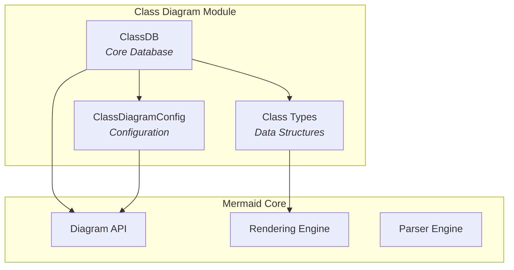
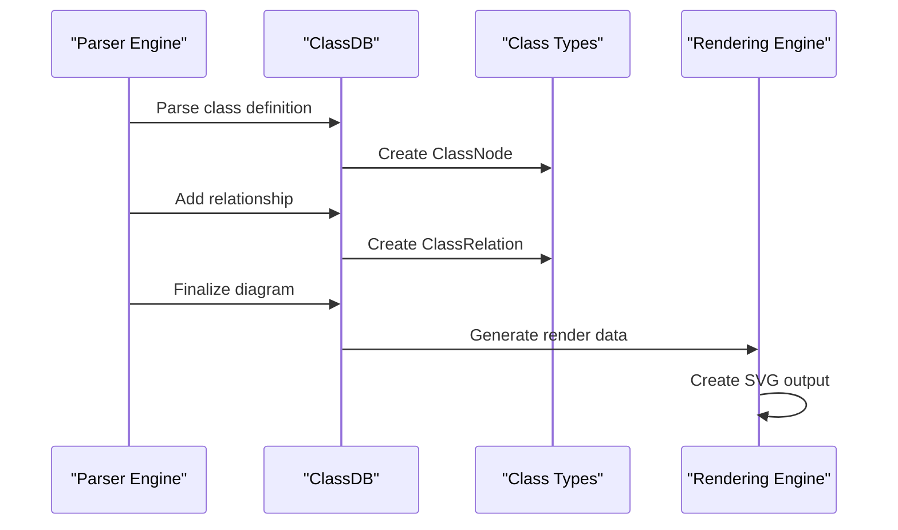
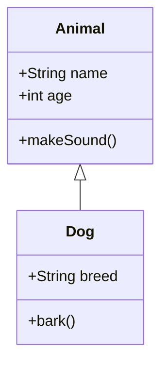

# Class Diagram Module Documentation

## Overview

The `diagram_class` module is a core component of the Mermaid diagramming library that provides functionality for creating and rendering UML (Unified Modeling Language) class diagrams. This module enables users to define classes, their relationships, methods, attributes, and visual styling through a text-based syntax that gets rendered into SVG diagrams.

## Purpose

The class diagram module serves as a specialized diagram type within the Mermaid ecosystem, allowing developers and system architects to:
- Visualize object-oriented system structures
- Document class hierarchies and relationships
- Define class members (methods and attributes)
- Specify inheritance, composition, aggregation, and dependency relationships
- Organize classes into namespaces for better structure

## Architecture Overview

## Core Components

### 1. ClassDB (packages.mermaid.src.diagrams.class.classDb.ClassDB)
The central database component that manages all class diagram data, including classes, relationships, namespaces, and styling information. It implements the `DiagramDB` interface and provides methods for adding classes, defining relationships, managing namespaces, and generating render data.

**Detailed documentation**: [class-database.md](class-database.md)

### 2. Class Types (packages.mermaid.src.diagrams.class.classTypes)
Defines the core data structures used throughout the module:
- `ClassNode`: Represents individual classes with their properties, methods, and styling
- `ClassRelation`: Defines relationships between classes (inheritance, composition, etc.)
- `ClassMember`: Represents class members (methods and attributes) with visibility and type information

**Detailed documentation**: [class-types.md](class-types.md)

### 3. Configuration (packages.mermaid.src.config.type.ClassDiagramConfig)
Provides diagram-specific configuration options including spacing, padding, rendering preferences, and visual styling parameters.

**Detailed documentation**: [class-configuration.md](class-configuration.md)

## Data Flow

## Key Features

### Class Management
- **Class Definition**: Support for defining classes with names, types, and labels
- **Member Management**: Methods and attributes with visibility modifiers (+, -, #, ~)
- **Annotations**: Special markers like <<interface>>, <<abstract>>
- **Styling**: CSS class assignment and custom styling support

### Relationship Types
- **Inheritance/Extension**: Class inheritance relationships
- **Composition**: Strong containment relationships
- **Aggregation**: Weak containment relationships  
- **Dependency**: Usage dependencies between classes
- **Lollipop**: Interface implementation indicators

### Namespace Support
- **Namespace Organization**: Group classes into logical namespaces
- **Hierarchical Structure**: Support for nested namespace organization

### Interactive Features
- **Tooltips**: Hover information for classes and relationships
- **Click Events**: Interactive callbacks for diagram elements
- **Links**: URL linking for classes and members

## Integration with Mermaid Core

The class diagram module integrates with the broader Mermaid ecosystem through:

- **Diagram API**: Implements standard interfaces for parser integration
- **Rendering Engine**: Converts internal data structures to renderable nodes and edges
- **Configuration System**: Inherits and extends base Mermaid configuration
- **Theme System**: Supports Mermaid's theming and styling capabilities

## Related Modules

- [diagram_plugin_api](diagram_plugin_api.md) - Core plugin infrastructure
- [rendering_engine](rendering_engine.md) - SVG rendering capabilities
- [parser_engine](parser_engine.md) - Text parsing and syntax processing
- [mermaid_core_api](mermaid_core_api.md) - Main Mermaid API and configuration

## Usage Examples

The module processes text-based definitions like:

This gets parsed into internal data structures and rendered as a visual class diagram showing the inheritance relationship between Animal and Dog classes.

## Configuration Options

The module supports various configuration options through `ClassDiagramConfig`:
- Spacing and padding controls
- Rendering engine selection (dagre-d3, dagre-wrapper, elk)
- HTML label support
- Arrow marker configurations
- Diagram padding and margins

For detailed configuration options, see the [class-configuration.md](class-configuration.md) documentation.