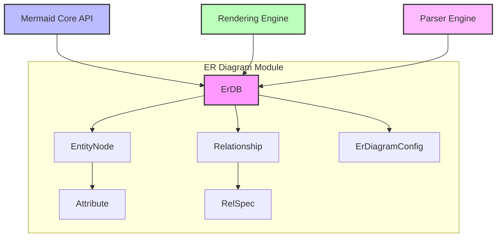
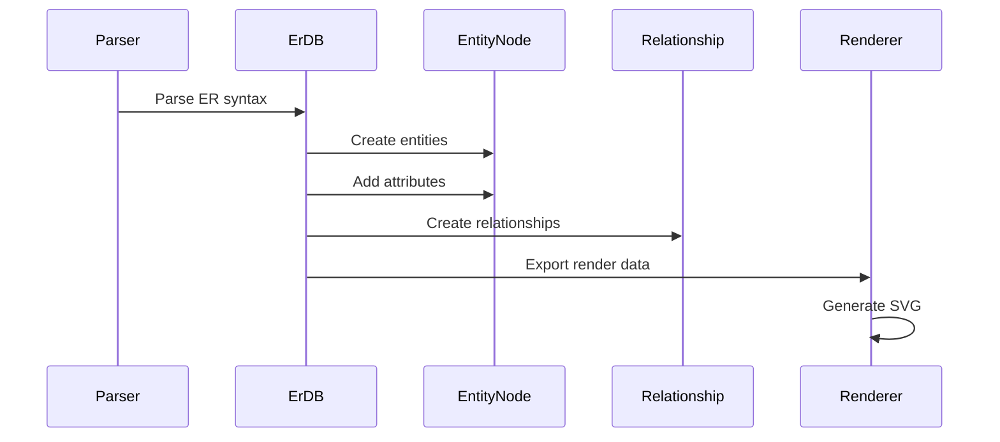

# Entity Relationship (ER) Diagram Module

## Overview

The Entity Relationship (ER) Diagram module is a specialized component of the Mermaid diagramming library that enables the creation of ER diagrams for database design and modeling. ER diagrams are used to visualize the relationships between entities in a database, showing how different data components interact and relate to each other.

## Purpose

This module provides:
- **Database Modeling**: Visual representation of database schemas with entities, attributes, and relationships
- **Relationship Visualization**: Clear depiction of cardinality and relationship types between entities
- **Configuration Management**: Flexible styling and layout options for ER diagrams
- **Integration**: Seamless integration with the Mermaid core rendering engine

## Architecture

The ER diagram module follows a layered architecture pattern with clear separation of concerns:

## Core Components

### 1. ErDB (Entity Relationship Database)
The central database component that manages all ER diagram data. See [ER Database Documentation](er-database.md) for detailed information.
- **Entity Management**: Stores and manages entities with their attributes
- **Relationship Tracking**: Maintains relationships between entities
- **Class Management**: Handles CSS styling and classes for entities
- **Data Export**: Provides structured data for rendering

### 2. EntityNode and Relationship Types
Represents individual entities and their relationships in the ER diagram. See [ER Types Documentation](er-types.md) for detailed information.
- **Entity Properties**: ID, label, attributes, and alias
- **Styling Support**: CSS classes and custom styles
- **Shape Definition**: Visual representation configuration
- **Relationship Management**: Cardinality and relationship type support

### 3. ErDiagramConfig
Configuration management for ER diagrams. See [ER Configuration Documentation](er-configuration.md) for detailed information.
- **Layout Control**: Direction and spacing options
- **Visual Styling**: Colors, fonts, and dimensions
- **Entity Settings**: Minimum sizes and padding

## Data Flow

## Integration with Mermaid Core

The ER diagram module integrates with the broader Mermaid ecosystem:

- **[Mermaid Core API](mermaid_core_api.md)**: Provides the main entry point and configuration
- **[Rendering Engine](rendering_engine.md)**: Handles visual output generation
- **[Parser Engine](parser_engine.md)**: Processes ER diagram syntax
- **[Diagram Plugin API](diagram_plugin_api.md)**: Standardized interface for diagram types

## Key Features

### Entity Management
- Dynamic entity creation with unique identifiers
- Attribute management with key type support (PK, FK, UK)
- Alias support for entity naming flexibility
- CSS class and style application

### Relationship Support
- Multiple cardinality types (ZERO_OR_ONE, ZERO_OR_MORE, ONE_OR_MORE, ONLY_ONE)
- Identifying and non-identifying relationship types
- Bidirectional relationship support
- Custom role definitions

### Configuration Options
- Layout direction control (TB, BT, LR, RL)
- Entity sizing and spacing parameters
- Color and styling customization
- Font and text configuration

## Usage Examples

The ER diagram module processes text-based diagram definitions and converts them into visual representations, supporting various ER notation standards and providing flexible styling options for professional database documentation.

## Related Documentation

- [Mermaid Core API](mermaid_core_api.md) - Main Mermaid library documentation
- [Rendering Engine](rendering_engine.md) - Visual rendering system
- [Parser Engine](parser_engine.md) - Syntax parsing infrastructure
- [Diagram Plugin API](diagram_plugin_api.md) - Plugin architecture