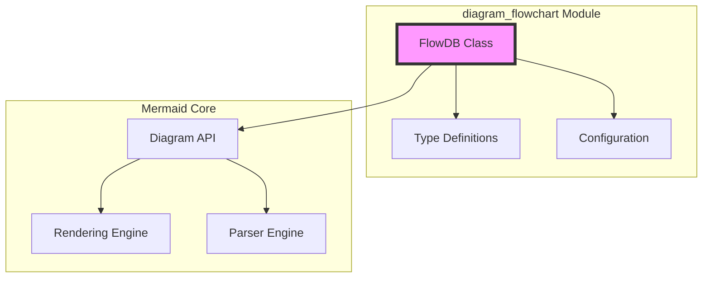
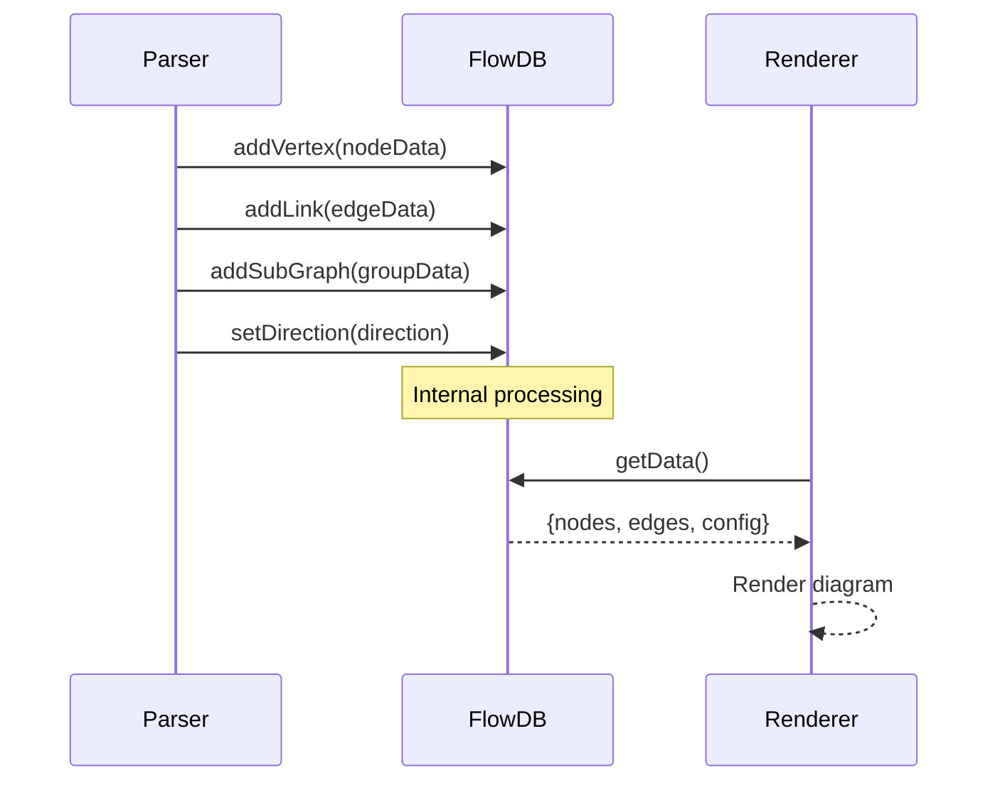
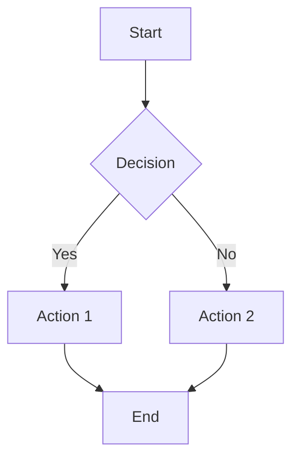

# Mermaid Flowchart Module Documentation

## Overview

The `diagram_flowchart` module is a core component of the Mermaid diagramming library, responsible for parsing, processing, and managing flowchart diagram data. This module provides the foundational data structures and logic required to create interactive flowchart diagrams with nodes, edges, subgraphs, and various styling options.

## Architecture

The flowchart module follows a data-centric architecture where the `FlowDB` class serves as the central data repository and management system. The module integrates with Mermaid's broader ecosystem through well-defined interfaces and type definitions.



## Core Components

### 1. FlowDB (Flow Database)
The `FlowDB` class is the heart of the flowchart module, implementing the `DiagramDB` interface. For detailed documentation, see [flowchart-database.md](flowchart-database.md).

Key responsibilities:
- **Vertex Management**: Storage and manipulation of flowchart nodes/vertices
- **Edge Management**: Handling connections between nodes with various arrow types and styles
- **Subgraph Management**: Support for nested graph structures
- **Class and Style Management**: CSS class definitions and styling
- **Interactive Features**: Click events, tooltips, and hyperlinks
- **Data Export**: Conversion to rendering-friendly formats

### 2. Type Definitions
Comprehensive TypeScript interfaces define the structure of flowchart elements. For detailed type documentation, see [flowchart-types.md](flowchart-types.md).

Core types include:
- **FlowVertex**: Represents individual nodes in the flowchart
- **FlowEdge**: Defines connections between nodes
- **FlowSubGraph**: Manages subgraph/group structures
- **FlowClass**: CSS class definitions for styling

### 3. Configuration Support
Integration with Mermaid's configuration system through `FlowchartDiagramConfig`. For configuration details, see [flowchart-configuration.md](flowchart-configuration.md).

Configuration controls:
- Layout and spacing parameters
- Rendering options
- Style customization
- Animation settings

## Data Flow



## Key Features

### Node Management
- Support for various node shapes (rectangle, circle, diamond, etc.)
- Custom styling and CSS classes
- Icon and image support
- Position constraints and custom positioning
- Interactive elements (click events, tooltips, links)

### Edge Management
- Multiple arrow types (open, point, circle, cross)
- Stroke styles (normal, thick, dotted, invisible)
- Edge interpolation algorithms
- Animation support
- Bidirectional and multi-segment edges

### Subgraph Support
- Nested graph structures
- Subgraph titles and styling
- Direction inheritance
- Node grouping and containment

### Styling System
- CSS class definitions
- Inline styles
- Theme integration
- Shape-specific styling

## Integration Points

The flowchart module integrates with several other Mermaid modules:

- **[mermaid_core_api](mermaid_core_api.md)**: Core API and configuration management
- **[diagram_plugin_api](diagram_plugin_api.md)**: Plugin system and diagram definition interfaces
- **[rendering_engine](rendering_engine.md)**: Visual rendering and layout algorithms
- **[parser_engine](parser_engine.md)**: Text parsing and syntax processing

## Configuration

Flowchart diagrams support extensive configuration through the `FlowchartDiagramConfig` interface:

```typescript
interface FlowchartDiagramConfig {
  nodeSpacing?: number;        // Spacing between nodes
  rankSpacing?: number;        // Spacing between ranks
  curve?: string;              // Edge curve interpolation
  padding?: number;            // Node padding
  defaultRenderer?: string;    // Rendering engine selection
  wrappingWidth?: number;      // Text wrapping width
  inheritDir?: boolean;        // Subgraph direction inheritance
}
```

## Usage Examples

The flowchart module processes diagram definitions like:



This text is parsed into structured data that can be rendered as an interactive SVG diagram.

## Error Handling

The module includes comprehensive error handling for:
- Invalid node references
- Malformed edge definitions
- Configuration conflicts
- Rendering constraints (edge limits, etc.)

## Performance Considerations

- Efficient data structures using Maps for O(1) lookups
- Lazy evaluation of computed properties
- Optimized edge processing for large graphs
- Memory management through proper cleanup methods

## Security Features

- Input sanitization for text content
- Security level enforcement for interactive features
- XSS prevention in tooltip and link handling
- Configuration validation and constraints

This documentation provides a comprehensive overview of the flowchart module's architecture and capabilities. For detailed information about specific sub-modules, refer to the individual documentation files linked above.