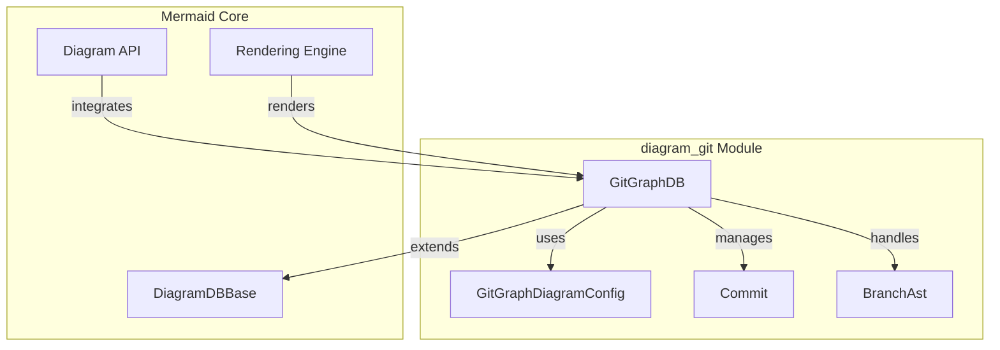
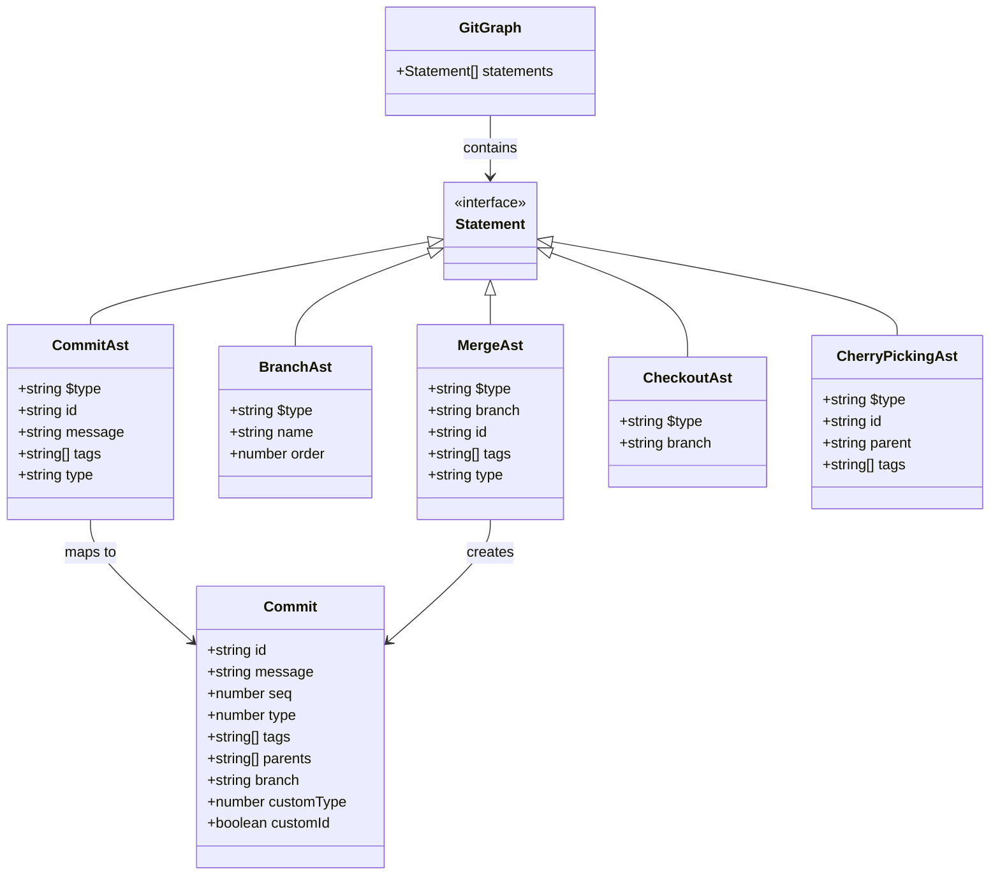
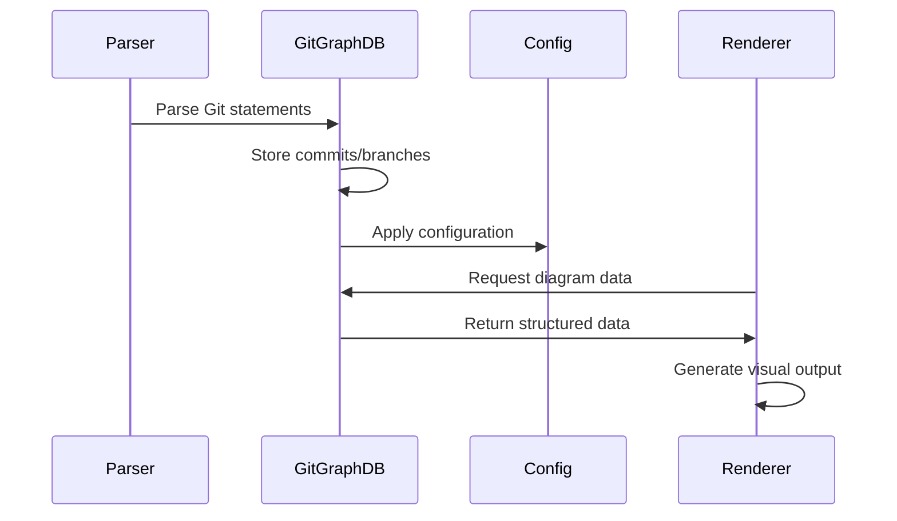
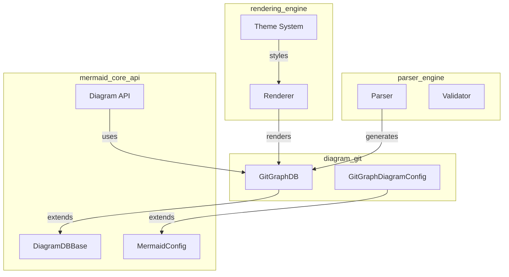
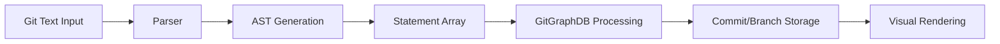
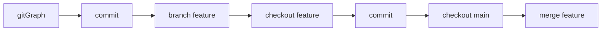

# Git Graph Diagram Module Documentation

## Overview

The `diagram_git` module is a specialized component of the Mermaid.js library that provides functionality for rendering Git repository history and branching structures as visual diagrams. This module enables developers to create comprehensive Git graph visualizations that display commits, branches, merges, and cherry-picks in a clear, hierarchical format.

## Purpose and Core Functionality

The Git Graph diagram module serves as a bridge between Git repository data structures and visual representation, offering:

- **Git Repository Visualization**: Converts Git repository history into visual diagrams showing commit relationships, branch structures, and merge patterns
- **Interactive Branch Management**: Supports branch creation, switching, merging, and cherry-picking operations
- **Commit Tracking**: Visualizes commit history with support for different commit types (normal, reverse, highlight, merge, cherry-pick)
- **Multi-branch Support**: Handles complex branching scenarios with parallel development tracks
- **Configurable Rendering**: Provides extensive customization options for diagram appearance and layout

## Architecture Overview

## Core Components

### GitGraphDB
The central database interface that manages all Git graph data and operations. It extends `DiagramDBBase` and provides methods for:
- Commit management and tracking
- Branch operations (creation, switching, merging)
- Cherry-pick operations
- Direction and option management
- Data retrieval for rendering

### Commit
Represents individual Git commits with properties including:
- Unique identifier and sequence number
- Commit message and type (normal, reverse, highlight, merge, cherry-pick)
- Parent commit relationships
- Branch association and tags
- Custom type and ID flags for special handling

### BranchAst
Defines branch abstract syntax tree elements for parsing and representing branch structures in the Git graph.

### GitGraph
The root interface containing an array of statements that represent the complete Git graph structure.

### CommitAst
Abstract syntax tree representation of commit operations, including optional message, tags, and commit type specifications.

### MergeAst
Abstract syntax tree representation of merge operations, supporting branch merging with optional commit IDs and tags.

### GitGraphDiagramConfig
Configuration interface that extends `BaseDiagramConfig` with Git-specific settings:
- Title and diagram padding
- Node labeling options
- Branch visibility controls
- Commit label display settings
- Main branch configuration
- Layout and orientation options

## Data Structure Architecture

## Data Flow Architecture

## Integration with Mermaid Ecosystem

The Git Graph module integrates seamlessly with the broader Mermaid.js ecosystem:

### Core Dependencies
- **DiagramDBBase**: Extends the base database interface from [mermaid_core_api](mermaid_core_api.md) for consistent diagram data management
- **Parser Integration**: Works with the [parser_engine](parser_engine.md) for syntax parsing and validation of Git-specific statements
- **Rendering Pipeline**: Utilizes the [rendering_engine](rendering_engine.md) for visual output generation and layout calculations
- **Configuration System**: Integrates with Mermaid's centralized configuration through `GitGraphDiagramConfig`

### Cross-Module Relationships

## Abstract Syntax Tree (AST) Structure

The Git Graph module employs a comprehensive AST structure to represent Git operations:

### Statement Types
All Git operations are represented as statements that extend the base `Statement` interface:

- **CommitAst**: Represents commit operations with optional messages, tags, and type specifications
- **BranchAst**: Defines branch creation with name and order properties
- **MergeAst**: Handles branch merging operations with target branch and optional commit details
- **CheckoutAst**: Represents branch switching operations
- **CherryPickingAst**: Handles cherry-pick operations with source and target references

### AST Processing Flow

## Key Features

### Commit Type Support
The module supports various commit types through the `commitType` constant:
- **NORMAL** (0): Standard commits
- **REVERSE** (1): Commits displayed in reverse order
- **HIGHLIGHT** (2): Emphasized commits for attention
- **MERGE** (3): Merge commits with multiple parents
- **CHERRY_PICK** (4): Cherry-picked commits from other branches

### Branch Management
- Dynamic branch creation and switching
- Support for parallel commits on different branches
- Merge operation visualization
- Branch ordering and hierarchy management

### Orientation Support
Supports multiple diagram orientations:
- **LR** (Left-to-Right): Horizontal layout
- **TB** (Top-to-Bottom): Vertical layout
- **BT** (Bottom-to-Top): Reverse vertical layout

## Usage Patterns

The Git Graph module is designed to handle various Git visualization scenarios:

1. **Simple Linear History**: Single branch with sequential commits
2. **Feature Branch Workflow**: Multiple branches with merge operations
3. **Release Management**: Main branch with release branches and hotfixes
4. **Collaborative Development**: Multiple contributors with branch merging
5. **Cherry-pick Scenarios**: Selective commit transfers between branches

## Configuration Options

The module provides extensive configuration through `GitGraphDiagramConfig`:

- **Layout Control**: Diagram padding, title margins, and spacing
- **Visual Customization**: Branch visibility, commit labels, and rotation
- **Behavioral Settings**: Parallel commit handling, main branch configuration
- **Label Management**: Node labeling dimensions and positioning

## Dependencies and Relationships

The Git Graph module depends on several core Mermaid components:

- **Base Diagram Framework**: Inherits from `DiagramDBBase` for core database functionality
- **Configuration System**: Uses `GitGraphDiagramConfig` for type-safe configuration
- **Type Definitions**: Leverages shared type definitions for consistency
- **Rendering Pipeline**: Integrates with the rendering engine for visual output

This modular design ensures that the Git Graph functionality is both powerful and maintainable, while remaining consistent with the overall Mermaid.js architecture.

## Practical Usage Patterns

### Basic Git Graph Syntax

### Configuration Examples
The `GitGraphDiagramConfig` supports various customization options:

- **Layout Control**: `diagramPadding`, `titleTopMargin`
- **Visual Elements**: `showCommitLabel`, `showBranches`, `rotateCommitLabel`
- **Branch Management**: `mainBranchName`, `mainBranchOrder`
- **Node Configuration**: `nodeLabel` dimensions and positioning

### Advanced Features
- **Parallel Commits**: Support for concurrent development on multiple branches
- **Cherry-picking**: Visual representation of selective commit transfers
- **Merge Strategies**: Support for different merge types and visualizations
- **Orientation Options**: LR (left-to-right), TB (top-to-bottom), BT (bottom-to-top) layouts

## Summary

The `diagram_git` module provides a comprehensive solution for visualizing Git repository structures within the Mermaid.js ecosystem. Its well-designed architecture, extensive configuration options, and seamless integration with other Mermaid components make it an essential tool for documentation, educational materials, and development workflows that require clear Git history visualization.