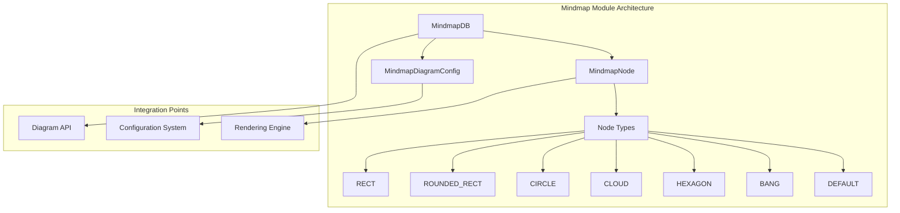
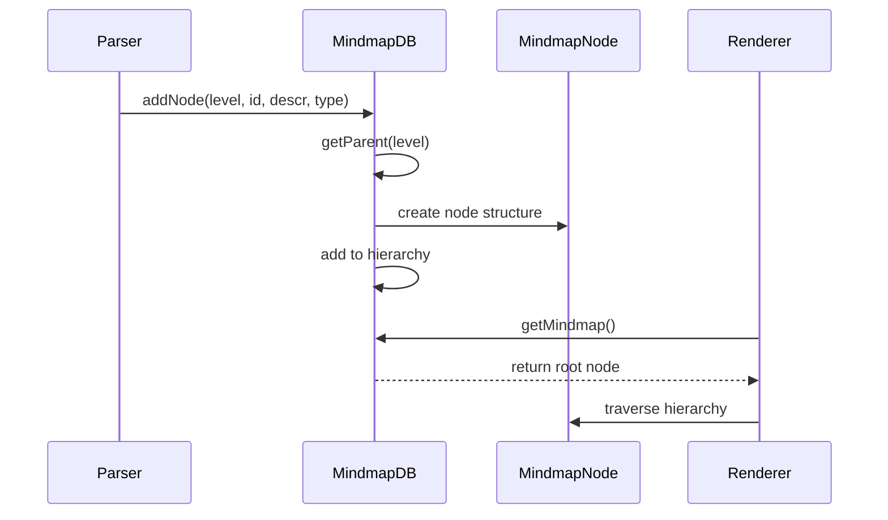
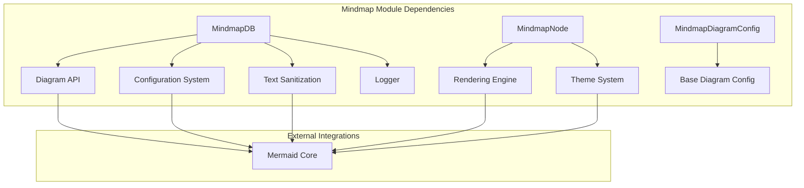
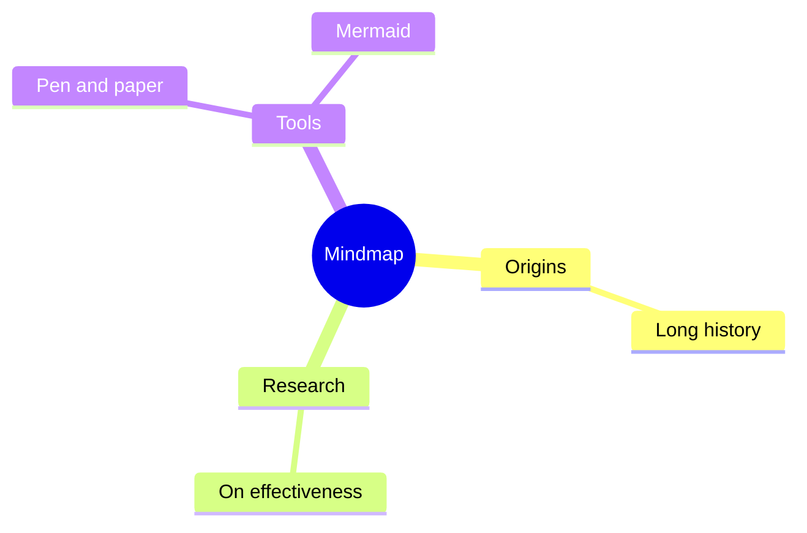
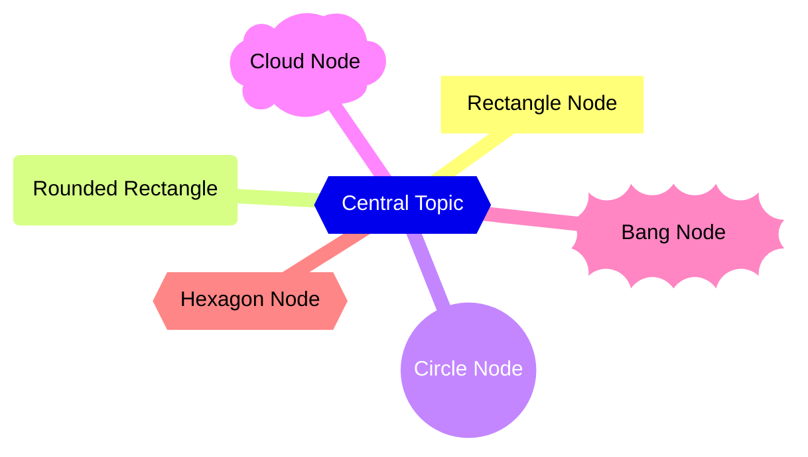
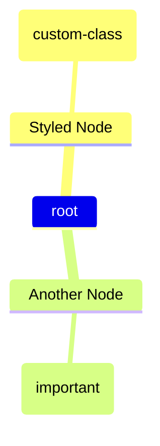

# Mindmap Diagram Module Documentation

## Overview

The `diagram_mindmap` module is a specialized component of the Mermaid diagramming library that provides functionality for creating hierarchical mindmap diagrams. Mindmaps are visual representations of information that radiate from a central topic, making them ideal for brainstorming, note-taking, and organizing complex information in a tree-like structure.

## Purpose and Core Functionality

The mindmap module enables users to:
- Create hierarchical tree structures with a central root node
- Support multiple node types with different visual representations (rectangles, circles, clouds, hexagons, etc.)
- Handle nested relationships between parent and child nodes
- Apply custom styling and decorations to nodes
- Configure layout and spacing parameters

## Architecture Overview



## Core Components

### 1. MindmapDB (Database Layer)
The `MindmapDB` class serves as the central data management component, responsible for:
- Storing and managing the hierarchical node structure
- Maintaining parent-child relationships
- Handling node creation and decoration
- Providing data access methods for the rendering engine

**Key Responsibilities:**
- Node storage and retrieval
- Parent node resolution based on hierarchy levels
- Node type determination from syntax patterns
- Element mapping for D3.js integration
- Text sanitization for security

### 2. MindmapNode (Data Model)
The `MindmapNode` interface defines the structure of individual mindmap nodes:
- Hierarchical positioning (level-based)
- Visual styling properties
- Child node relationships
- Layout dimensions and positioning

### 3. MindmapDiagramConfig (Configuration)
Configuration options specific to mindmap diagrams, extending the base diagram configuration with:
- Node padding settings
- Maximum node width constraints
- Layout and spacing parameters

## Data Flow Architecture



## Node Type System

The module supports multiple node types with distinct visual representations:

| Node Type | Syntax Pattern | Visual Style |
|-----------|---------------|--------------|
| DEFAULT | No brackets | No border |
| RECT | `[text]` | Rectangle |
| ROUNDED_RECT | `(text)` | Rounded rectangle |
| CIRCLE | `((text))` | Circle |
| CLOUD | `)text(` or `(text)` | Cloud shape |
| BANG | `))text((` | Exclamation shape |
| HEXAGON | `{{text}}` | Hexagon shape |

## Integration with Mermaid Core

The mindmap module integrates with the broader Mermaid ecosystem through several key interfaces:

### Diagram API Integration
The module implements the `DiagramDefinition` interface, providing:
- **Database Layer**: `MindmapDB` instance for data management
- **Parser**: Custom parser for mindmap syntax
- **Renderer**: Specialized renderer for mindmap visualization
- **Styles**: CSS styling specific to mindmap diagrams

### Configuration System
Inherits from the base `MermaidConfig` system with mindmap-specific extensions through `MindmapDiagramConfig`:
- Node padding and spacing controls
- Maximum node width constraints
- Layout and positioning parameters
- Integration with global theme settings

### Rendering Engine Integration
Utilizes the rendering infrastructure through:
- **RenderData**: Standardized data format for rendering
- **BaseNode**: Common node properties and behaviors
- **Theme System**: Consistent styling across all diagram types
- **D3.js Integration**: SVG generation and DOM manipulation

### Parser Engine Integration
Integrates with the common parsing infrastructure:
- **ParserDefinition**: Standard parser interface implementation
- **Text Processing**: Sanitization and formatting utilities
- **Syntax Validation**: Error handling and validation
- **AST Generation**: Abstract syntax tree for diagram structure

### Theme System Integration
Supports comprehensive theming through the `Theme` class:
- Color scheme consistency
- Font and typography settings
- Dark mode support
- Customizable node styling
- Border and background color management

## Data Structures and API Reference

### MindmapDB Class

The `MindmapDB` class provides the core data management functionality:

```typescript
class MindmapDB {
  // Node management
  addNode(level: number, id: string, descr: string, type: number): void
  getParent(level: number): MindmapNode | null
  getMindmap(): MindmapNode | null
  
  // Node decoration
  decorateNode(decoration?: { class?: string; icon?: string }): void
  
  // Type management
  getType(startStr: string, endStr: string): number
  type2Str(type: number): string
  
  // Element management
  setElementForId(id: number, element: D3Element): void
  getElementById(id: number): D3Element
  
  // Utility
  clear(): void
  getLogger(): Logger
}
```

### MindmapNode Interface

Defines the structure of mindmap nodes:

```typescript
interface MindmapNode {
  id: number;                    // Unique identifier
  nodeId: string;               // User-defined node ID
  level: number;                // Hierarchy level (0 = root)
  descr: string;                // Node text content
  type: number;                 // Visual type (RECT, CIRCLE, etc.)
  children: MindmapNode[];      // Child nodes array
  width: number;                // Node width for layout
  padding: number;              // Internal padding
  section?: number;             // Optional section grouping
  height?: number;              // Calculated height
  class?: string;               // CSS class name
  icon?: string;                // Icon identifier
  x?: number;                   // X coordinate (rendering)
  y?: number;                   // Y coordinate (rendering)
}
```

### Node Type Constants

```typescript
const nodeType = {
  DEFAULT: 0,        // No border
  NO_BORDER: 0,      // Alias for DEFAULT
  ROUNDED_RECT: 1,   // Rounded rectangle
  RECT: 2,           // Rectangle
  CIRCLE: 3,         // Circle
  CLOUD: 4,          // Cloud shape
  BANG: 5,           // Exclamation mark
  HEXAGON: 6,        // Hexagon
} as const;
```

## Dependencies and Relationships



## Syntax and Usage Examples

### Basic Mindmap Syntax



### Advanced Node Types



### Node Decoration



## Configuration and Customization

The module supports extensive configuration through the `MindmapDiagramConfig` interface:

### Configuration Options

| Option | Type | Default | Description |
|--------|------|---------|-------------|
| `padding` | `number` | `10` | Controls spacing around nodes |
| `maxNodeWidth` | `number` | `200` | Maximum width for text nodes |
| `useMaxWidth` | `boolean` | `true` | Responsive width behavior |
| `useWidth` | `number` | `undefined` | Fixed width constraint |

### Global Configuration Integration

The mindmap module integrates with Mermaid's global configuration system:

```javascript
mermaid.initialize({
  mindmap: {
    padding: 15,
    maxNodeWidth: 250
  },
  theme: 'dark',
  fontFamily: 'Arial, sans-serif'
});
```

## Error Handling and Validation

The mindmap module implements several validation mechanisms:

### Single Root Enforcement
```typescript
// Ensures only one root node exists
if (this.nodes.length === 0) {
  this.nodes.push(node);
} else {
  throw new Error(`There can be only one root. No parent could be found for ("${node.descr}")`);
}
```

### Parent-Child Relationship Validation
- Validates hierarchy levels during node creation
- Ensures proper parent assignment based on indentation levels
- Prevents circular references

### Text Sanitization
- All text content is sanitized using Mermaid's text sanitization utilities
- Prevents XSS attacks and ensures safe rendering
- Respects configuration settings for text processing

### Type Safety
- Full TypeScript support with comprehensive type definitions
- Runtime type checking for node types and configurations
- Compile-time validation of API usage

## Performance Considerations

### Efficient Parent Lookup
The `getParent()` method uses reverse iteration for optimal performance:
```typescript
for (let i = this.nodes.length - 1; i >= 0; i--) {
  if (this.nodes[i].level < level) {
    return this.nodes[i];
  }
}
```

### Memory Management
- Minimal memory footprint for large hierarchies
- Efficient node storage using arrays
- Lazy element binding for D3.js integration
- Automatic cleanup through the `clear()` method

### Node Type Determination
Optimized `getType()` method with switch statement for fast type resolution:
```typescript
switch (startStr) {
  case '[': return this.nodeType.RECT;
  case '(': return endStr === ')' ? this.nodeType.ROUNDED_RECT : this.nodeType.CLOUD;
  // ... additional cases
}
```

## Testing and Quality Assurance

### Unit Testing Strategy
- Comprehensive test coverage for all public methods
- Edge case testing for hierarchy validation
- Performance benchmarking for large mindmaps
- Integration testing with rendering engine

### Validation Scenarios
- Single root node enforcement
- Multi-level hierarchy validation
- Node type recognition accuracy
- Text sanitization effectiveness
- Configuration option handling

## Future Enhancements

### Planned Features
- **Interactive Capabilities**: Collapsible/expandable nodes
- **Advanced Layout Algorithms**: Force-directed layouts, radial layouts
- **Export Functionality**: PNG, PDF, SVG export options
- **Accessibility Improvements**: Screen reader support, keyboard navigation
- **Performance Optimizations**: Virtual scrolling for large mindmaps

### Potential Extensions
- **Rich Content Support**: Images, links, embedded content
- **Collaborative Features**: Real-time editing, comments
- **Animation Support**: Smooth transitions, node animations
- **Mobile Optimization**: Touch-friendly interactions
- **Plugin Architecture**: Custom node types, extensions

## Migration and Compatibility

### Version Compatibility
- Compatible with Mermaid v10.x and above
- Maintains backward compatibility with existing mindmap syntax
- Supports both legacy and modern configuration approaches

### Migration Guide
When upgrading from older versions:
1. Update configuration format to use `MindmapDiagramConfig`
2. Review node type constants for any custom implementations
3. Test custom styling and decorations
4. Validate hierarchy structures for compliance

---

*This documentation covers the comprehensive functionality of the diagram_mindmap module. For integration examples and advanced usage patterns, refer to the [Mermaid Core API Documentation](mermaid_core_api.md) and [Rendering Engine Documentation](rendering_engine.md).*

---

*This documentation covers the core functionality of the diagram_mindmap module. For detailed information about specific sub-components, refer to the individual component documentation files.*