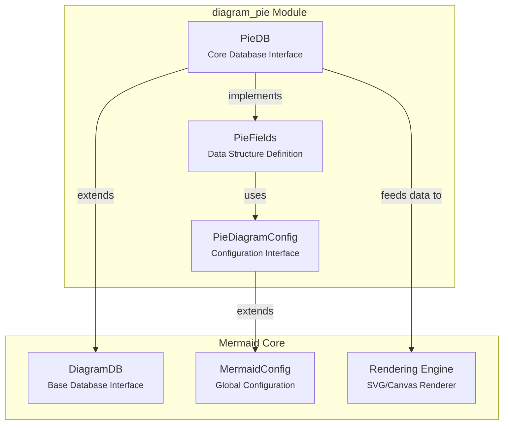
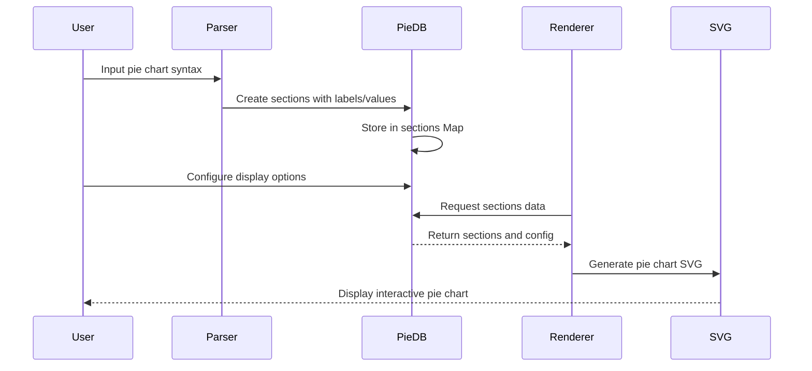
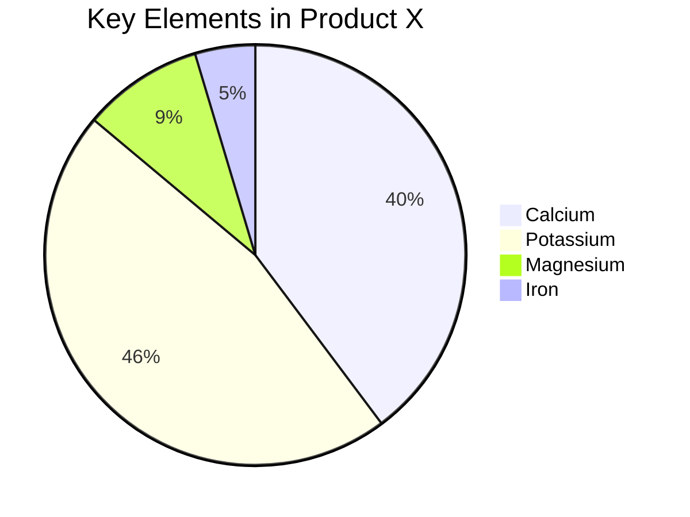
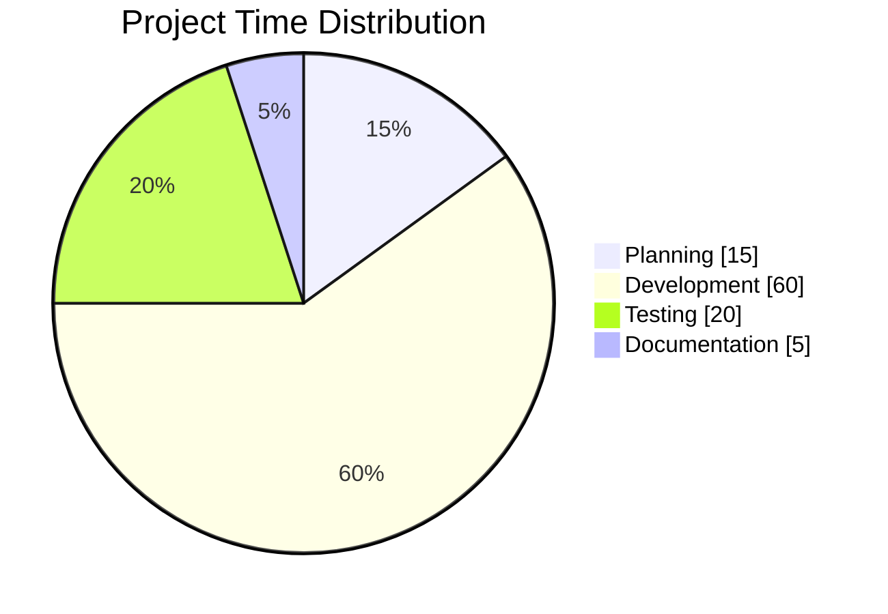

# Pie Diagram Module Documentation

## Overview

The `diagram_pie` module is a specialized component of the Mermaid diagramming library that provides pie chart visualization capabilities. It enables users to create interactive and customizable pie charts using a simple text-based syntax, making data visualization accessible through code.

## Purpose and Functionality

The pie diagram module serves as a dedicated renderer for pie charts within the Mermaid ecosystem. It transforms textual descriptions of data sections into visually appealing circular charts, supporting features like:

- **Data Section Management**: Handles labeled data sections with corresponding values
- **Configurable Display Options**: Supports showing/hiding data values on chart segments
- **Accessibility Features**: Includes title and description support for screen readers
- **Customizable Styling**: Provides extensive theming and styling options
- **Integration**: Seamlessly integrates with Mermaid's core rendering engine

## Architecture Overview

## Core Components

### PieDB Interface
The `PieDB` interface is the central data management component that extends the base `DiagramDB` interface. It provides:

- **Configuration Management**: Access to pie-specific configuration settings
- **Data Storage**: Manages pie sections with labels and values
- **State Management**: Handles diagram title, accessibility title, and description
- **Data Manipulation**: Provides methods for adding sections and controlling data display

### PieFields Interface
The `PieFields` interface defines the core data structure for pie diagrams:

- **Sections Storage**: Uses a Map to store label-value pairs
- **Display Control**: Boolean flag to show/hide data values
- **Configuration Integration**: Links to pie-specific configuration options

### PieDiagramConfig Interface
Extends the base diagram configuration with pie-specific settings:

- **Text Positioning**: Controls the axial position of slice labels (0=center, 1=edge)
- **Base Configuration**: Inherits standard diagram configuration options

## Data Flow

## Integration with Mermaid Ecosystem

The pie diagram module integrates with several other Mermaid components:

- **[diagram_plugin_api](diagram_plugin_api.md)**: Implements the `DiagramDB` interface for plugin compatibility. The `PieDB` extends the base `DiagramDB` interface, inheriting standard database operations like `clear()`, `setDiagramTitle()`, and accessibility methods for screen reader support.
- **[rendering_engine](rendering_engine.md)**: Utilizes the rendering engine for SVG generation. The pie chart data stored in `PieDB` is processed by the rendering engine to generate interactive SVG visualizations.
- **[mermaid_core_api](mermaid_core_api.md)**: Integrates with the main Mermaid API for initialization and configuration. The `PieDiagramConfig` extends `BaseDiagramConfig` which is part of the core configuration system.

## Configuration Options

### PieDiagramConfig
- `textPosition`: Controls label positioning (0-1 range, where 0=center and 1=outer edge)
- Inherits all base configuration options from `BaseDiagramConfig` including `useWidth` and `useMaxWidth` for responsive sizing behavior

### PieStyleOptions
The module supports extensive styling through theme variables:
- Font families and sizes for titles, sections, and legends
- Color schemes for pie segments (12 predefined colors)
- Stroke properties for borders and outlines
- Opacity controls for visual effects

## Usage Examples

### Basic Pie Chart

### With Data Display

## Accessibility Features

The pie diagram module includes comprehensive accessibility support:

- **Screen Reader Support**: Provides alternative text through `accTitle` and `accDescription`
- **Keyboard Navigation**: Integrates with Mermaid's keyboard navigation system
- **High Contrast**: Supports theme-based high contrast modes
- **Semantic Structure**: Uses proper ARIA labels and semantic SVG elements

## Performance Considerations

- **Efficient Data Storage**: Uses Map data structure for O(1) section lookups
- **Minimal DOM Manipulation**: Renders complete SVG in single operation
- **Theme Caching**: Reuses computed styles across diagram instances
- **Lazy Loading**: Defers rendering until viewport intersection

## Error Handling

The module implements robust error handling for:
- Invalid section data (non-numeric values)
- Missing or malformed configuration
- Rendering engine failures
- Theme loading issues

## Future Enhancements

Potential areas for future development include:
- Interactive tooltips on hover
- Animation support for data transitions
- Export capabilities (PNG, PDF)
- Advanced labeling options (percentages, custom formats)
- Multi-series pie charts
- Donut chart variants

## Related Documentation

- [Mermaid Core API](mermaid_core_api.md) - Main API documentation
- [Diagram Plugin API](diagram_plugin_api.md) - Plugin system details
- [Rendering Engine](rendering_engine.md) - SVG rendering capabilities
- [Theme System](rendering_engine.md#theme-system) - Styling and theming options