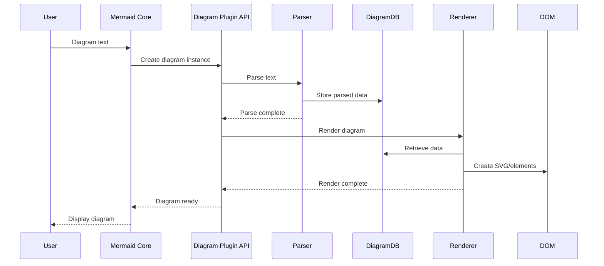
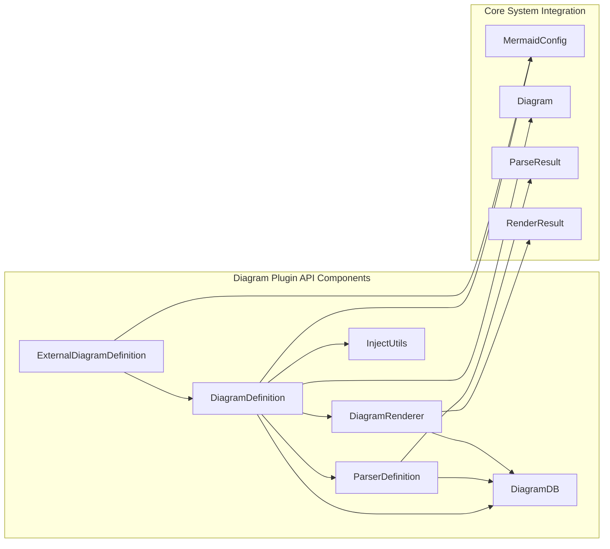
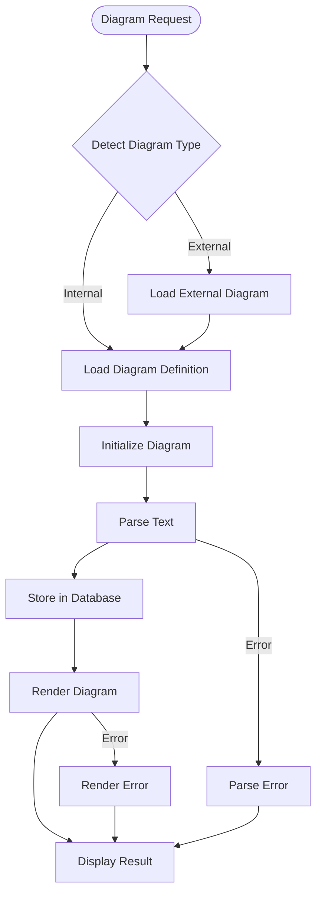

# Diagram Plugin API Module

## Introduction

The Diagram Plugin API module provides the foundational interfaces and type definitions for creating custom diagram types in Mermaid. It defines the contract that all diagram implementations must follow, enabling a standardized approach to diagram parsing, data storage, and rendering across the entire Mermaid ecosystem.

This module serves as the bridge between the core Mermaid engine and individual diagram implementations, ensuring consistency and extensibility in the diagram creation process.

## Architecture Overview

The Diagram Plugin API establishes a plugin-based architecture where each diagram type is implemented as a self-contained module adhering to the interfaces defined in this API. This design enables Mermaid to support a wide variety of diagram types while maintaining a consistent API surface.

```mermaid
graph TB
    subgraph "Mermaid Core API"
        M[Mermaid Core]
        C[Config System]
        D[Diagram Base Class]
    end
    
    subgraph "Diagram Plugin API"
        DD[DiagramDefinition]
        PD[ParserDefinition]
        DB[DiagramDB]
        DR[DiagramRenderer]
        IU[InjectUtils]
    end
    
    subgraph "Diagram Implementations"
        FD[Flowchart Diagram]
        SD[Sequence Diagram]
        CD[Class Diagram]
        StD[State Diagram]
        ED[ER Diagram]
        GD[Git Diagram]
        PD2[Pie Diagram]
        XD[XY Chart]
        RD[Requirement Diagram]
        MD[Mindmap Diagram]
        AD[Architecture Diagram]
        SaD[Sankey Diagram]
        QD[Quadrant Chart]
        TD[Treemap Diagram]
        ZD[ZenUML Integration]
    end
    
    M --> DD
    C --> IU
    D --> DB
    
    DD --> FD
    DD --> SD
    DD --> CD
    DD --> StD
    DD --> ED
    DD --> GD
    DD --> PD2
    DD --> XD
    DD --> RD
    DD --> MD
    DD --> AD
    DD --> SaD
    DD --> QD
    DD --> TD
    DD --> ZD
    
    PD --> FD
    PD --> SD
    PD --> CD
    
    DB --> FD
    DB --> SD
    DB --> CD
    
    DR --> FD
    DR --> SD
    DR --> CD
```

## Core Components

### DiagramDefinition

The `DiagramDefinition` interface is the central contract that every diagram implementation must fulfill. It encapsulates all the necessary components for a complete diagram type:

- **db**: The diagram-specific database for storing parsed data
- **renderer**: Handles the visual rendering of the diagram
- **parser**: Processes the diagram text syntax
- **styles**: Optional styling information
- **init**: Optional initialization function
- **injectUtils**: Utility injection mechanism

### ParserDefinition

The `ParserDefinition` interface defines the contract for diagram parsers:

- **parse**: The main parsing function that processes diagram text
- **parser**: Optional parser object with access to the diagram database

### DiagramDB

The `DiagramDB` interface provides the base contract for diagram databases:

- **Configuration management**: `getConfig()` for retrieving diagram-specific settings
- **Data management**: `clear()` for resetting the database
- **Accessibility support**: Title and description management functions
- **Display mode**: Support for different display configurations
- **Function binding**: `bindFunctions()` for DOM interaction

### DiagramRenderer

The `DiagramRenderer` interface defines the rendering contract:

- **draw**: The main drawing function that creates the visual representation
- **getClasses**: Optional function for retrieving CSS class definitions

### InjectUtils

The `InjectUtils` interface provides utility injection capabilities:

- **Logging**: `_log` and `_setLogLevel` for debugging support
- **Configuration**: `_getConfig` for accessing configuration
- **Text processing**: `_sanitizeText` for safe text handling
- **Graph utilities**: `_setupGraphViewbox` for graph layout
- **Common database**: `_commonDb` for shared data access
- **Directive parsing**: `_parseDirective` for processing directives (deprecated)

## Data Flow Architecture

## Component Interactions

## External Diagram Support

The API supports external diagram definitions through the `ExternalDiagramDefinition` interface, enabling third-party diagram types to be integrated into Mermaid:

- **id**: Unique identifier for the diagram type
- **detector**: Function to identify if text belongs to this diagram type
- **loader**: Function to dynamically load the diagram implementation

## Process Flow

## Integration with Other Modules

### Mermaid Core API Integration
The Diagram Plugin API is tightly integrated with the [mermaid_core_api](mermaid_core_api.md) module:
- Uses `MermaidConfig` for configuration management
- Integrates with the base `Diagram` class
- Supports `RunOptions` for execution configuration

### Rendering Engine Integration
Works with the [rendering_engine](rendering_engine.md) module:
- Utilizes `RenderData` and `LayoutData` for rendering information
- Integrates with `BaseNode` and `Edge` types for graph structures
- Supports `ShapeDefinition` for custom shapes
- Uses `Theme` for consistent styling

### Parser Engine Integration
Coordinates with the [parser_engine](parser_engine.md) module:
- Leverages `AbstractMermaidTokenBuilder` for token processing
- Uses `AbstractMermaidValueConverter` for value conversion
- Integrates with diagram-specific validators

### Layout Engine Integration
Supports layout engines like [layout_engine_elk](layout_engine_elk.md):
- Works with `NodeWithVertex` for node positioning
- Uses `TreeData` for hierarchical layouts

## Type Safety and Extensibility

The API provides strong typing through TypeScript interfaces while maintaining flexibility:

- **Generic types**: `DiagramDBBase<T>` allows diagram-specific configuration types
- **Optional fields**: Many properties are optional to reduce implementation burden
- **Utility types**: Uses `SetOptional` and `SetRequired` for flexible type definitions
- **D3 integration**: Provides typed selections for HTML, SVG, and SVG group elements

## Best Practices for Implementation

1. **Implement all required methods** in `DiagramDBBase` for new diagrams
2. **Use type-safe configuration** by extending `BaseDiagramConfig`
3. **Provide proper accessibility** through title and description methods
4. **Handle errors gracefully** in parser and renderer implementations
5. **Use utility injection** for consistent behavior across diagrams
6. **Support theming** by integrating with the theme system
7. **Implement proper cleanup** in the `clear()` method

## Summary

The Diagram Plugin API module provides a robust foundation for diagram extensibility in Mermaid. By defining clear interfaces and contracts, it enables consistent implementation of diverse diagram types while maintaining system cohesion. The plugin architecture allows for both internal and external diagram types, making Mermaid highly extensible and maintainable.