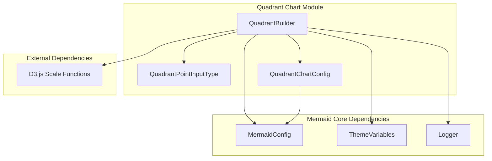
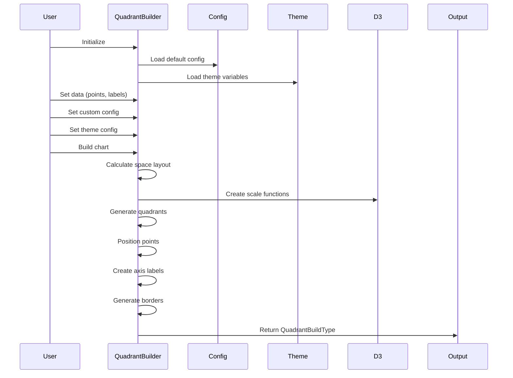

# Quadrant Chart Module Documentation

## Overview

The `diagram_quadrant_chart` module is a specialized diagram type within the Mermaid ecosystem that provides functionality for creating quadrant charts - a type of scatter plot that divides data into four quadrants based on two axes. This module is designed to visualize data points positioned on a two-dimensional plane, with customizable quadrant labels, axis labels, and styling options.

## Purpose and Core Functionality

The quadrant chart module serves as a data visualization tool that:
- Displays data points across four distinct quadrants
- Provides customizable axis labels and quadrant titles
- Supports point-specific styling through CSS classes
- Integrates with Mermaid's theming system
- Offers flexible configuration options for chart dimensions and positioning

## Architecture Overview

## Core Components

### 1. QuadrantBuilder Class
The main builder class responsible for constructing quadrant charts. It handles:
- Data management and validation
- Configuration processing
- Theme application
- Spatial calculations and layout
- Final chart assembly

**Key Responsibilities:**
- Managing chart data (points, labels, titles)
- Calculating spatial layouts for quadrants, axes, and points
- Applying themes and custom styling
- Generating the final chart structure

### 2. QuadrantPointInputType Interface
Defines the structure for data points that can be plotted on the quadrant chart:
- Position coordinates (x, y)
- Text labels
- Optional styling properties (color, radius, stroke)
- CSS class support for custom styling

### 3. QuadrantChartConfig Interface
Configuration interface that extends BaseDiagramConfig with quadrant-specific settings:
- Chart dimensions (width, height)
- Font sizes and padding values
- Axis positioning options
- Border stroke configurations

## Data Flow Architecture

## Integration with Mermaid Ecosystem

The quadrant chart module integrates with the broader Mermaid ecosystem through:

### Configuration System
- Extends [`BaseDiagramConfig`](mermaid_core_api.md#basediagramconfig-interface) for consistent configuration patterns
- Uses [`MermaidConfig`](mermaid_core_api.md#mermaidconfig-interface) for global settings
- Supports theme variable integration

### Theme Integration
- Leverages [`getThemeVariables()`](rendering_engine.md#theme-system) for consistent styling
- Supports custom theme configurations
- Provides fallback to default theme variables

### Logging System
- Uses Mermaid's logging infrastructure for debugging and monitoring
- Provides trace-level logging for configuration changes

### Dependencies
- **D3.js**: Uses D3's scale functions for coordinate transformation
- **Rendering Engine**: Integrates with Mermaid's rendering system for final output
- **Theme System**: Leverages the centralized theme management system

## Key Features

### 1. Flexible Data Input
- Support for custom point styling through CSS classes
- Dynamic point positioning with D3.js scale functions
- Text label customization for each data point

### 2. Customizable Layout
- Configurable chart dimensions
- Flexible axis positioning (top/bottom for x-axis, left/right for y-axis)
- Adjustable padding and spacing values
- Dynamic quadrant text positioning based on data presence

### 3. Theme Support
- Integration with Mermaid's theme system
- Customizable colors for quadrants, points, text, and borders
- Support for both internal and external border styling

### 4. Spatial Intelligence
- Automatic space calculation for axes, titles, and quadrants
- Dynamic text positioning based on content presence
- Responsive layout adjustments

## Configuration Options

The module provides extensive configuration options including:

- **Chart Dimensions**: `chartWidth`, `chartHeight`
- **Typography**: Various font size settings for different elements
- **Spacing**: Padding configurations for all elements
- **Positioning**: Axis position controls
- **Styling**: Border stroke widths and colors

## Usage Patterns

The quadrant chart follows a builder pattern where:
1. A `QuadrantBuilder` instance is created
2. Data is set using `setData()` or `addPoints()`
3. Configuration is applied via `setConfig()` and `setThemeConfig()`
4. CSS classes can be added with `addClass()`
5. The final chart is built using `build()`

## Dependencies

### Internal Dependencies
- **Mermaid Core**: Configuration and theme systems
- **Logger**: Logging functionality
- **Default Config**: Base configuration values

### External Dependencies
- **D3.js**: Scale functions for coordinate transformation
- **TypeScript**: Type definitions and interfaces

## Error Handling and Validation

The module includes:
- Default value fallbacks for all configuration options
- Type safety through TypeScript interfaces
- Logging for debugging and monitoring
- Graceful handling of missing data

## Performance Considerations

- Efficient spatial calculations using mathematical operations
- Minimal DOM manipulation through pre-calculated layouts
- Optimized rendering through D3.js scale functions
- Memory-efficient data structures

This module provides a robust foundation for creating quadrant charts within the Mermaid ecosystem, offering both simplicity for basic use cases and extensive customization for advanced scenarios.

## Relationship to Other Diagram Types

The quadrant chart module shares architectural patterns with other Mermaid diagram types:

### Similarities with [XY Chart Module](diagram_xy_chart.md)
- Both use D3.js scale functions for coordinate transformation
- Similar data point structure and positioning logic
- Shared configuration patterns for chart dimensions and axis labeling

### Differences from Other Diagram Types
- **vs [Flowchart](diagram_flowchart.md)**: Quadrant charts are data-driven rather than node-connection based
- **vs [Sequence Diagrams](diagram_sequence.md)**: No actor or message concepts, purely positional data visualization
- **vs [Pie Charts](diagram_pie.md)**: Continuous coordinate space vs categorical data representation

## Implementation Details

### Coordinate System
The module uses a normalized coordinate system where:
- X and Y values range from 0 to 1
- D3.js linear scales transform normalized coordinates to pixel positions
- Quadrants are automatically determined based on point position relative to center lines

### Rendering Pipeline
1. **Data Validation**: Input data is normalized and validated
2. **Space Calculation**: Available space is calculated based on configuration
3. **Scale Creation**: D3 scales are created for coordinate transformation
4. **Element Generation**: Quadrants, points, labels, and borders are generated
5. **Layout Assembly**: All elements are combined into final chart structure

### Memory Management
- Uses Map for efficient CSS class lookups
- Implements clear() method for resetting state
- Avoids unnecessary object creation in build process

## Extension Points

The module provides several extension points for customization:

### Custom Themes
- Override theme variables through `setThemeConfig()`
- Create custom color schemes for different quadrants
- Modify text styling and border appearance

### CSS Class Integration
- Add custom CSS classes with `addClass()`
- Apply different styling to specific data points
- Support for dynamic styling based on data attributes

### Configuration Overrides
- Modify chart dimensions and spacing
- Adjust font sizes and positioning
- Control axis visibility and placement