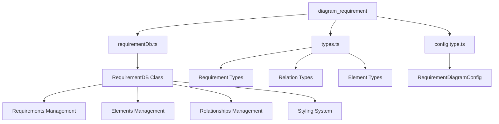
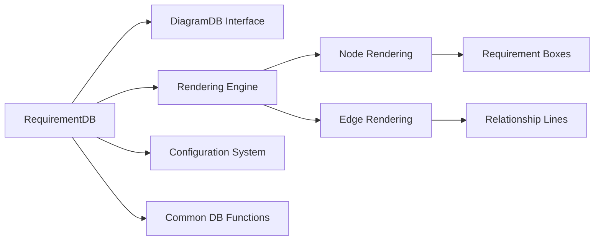
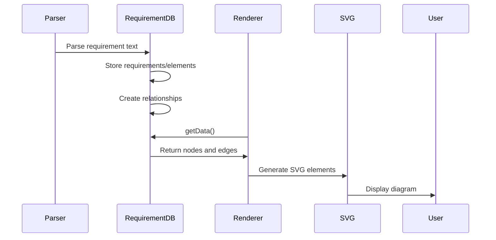

# Requirement Diagram Module Documentation

## Overview

The `diagram_requirement` module provides functionality for creating requirement diagrams in Mermaid. These diagrams are used to visualize system requirements, their relationships, and associated elements in a structured format. The module supports various requirement types, risk levels, verification methods, and relationship types commonly used in systems engineering and requirements management.

## Architecture

### Core Components

The module consists of three main components:

1. **RequirementDB** - The core database class that manages requirements, elements, relationships, and styling
2. **Types** - TypeScript interfaces defining the data structures for requirements, relations, and elements
3. **Configuration** - Diagram-specific configuration options for rendering requirement diagrams

### Module Structure

### Integration with Mermaid Core

The requirement diagram module integrates with the broader Mermaid ecosystem through:

- **DiagramDB Interface**: Implements the standard `DiagramDB` interface for consistency with other diagram types
- **Rendering System**: Uses Mermaid's rendering utilities to convert requirements data to visual elements
- **Configuration System**: Integrates with Mermaid's global configuration system
- **Common Database Functions**: Leverages shared functionality from `commonDb.js`

## Functionality

### Requirements Management

The module supports comprehensive requirements management with the following features:

- **Multiple Requirement Types**: Requirement, Functional Requirement, Interface Requirement, Performance Requirement, Physical Requirement, Design Constraint
- **Risk Assessment**: Low, Medium, High risk levels
- **Verification Methods**: Analysis, Demonstration, Inspection, Test
- **Requirement Properties**: ID, text, name, type, risk level, verification method

### Elements and Relationships

- **Elements**: Generic components that can be associated with requirements
- **Relationships**: Seven types of relationships between requirements and elements:
  - contains
  - copies
  - derives
  - satisfies
  - verifies
  - refines
  - traces

### Styling and Customization

- **CSS Styling**: Support for custom CSS styles on individual requirements and elements
- **Class System**: Define and apply CSS classes with shared styling properties
- **Visual Customization**: Configurable colors, borders, fonts, and layout options

## Data Flow

## Configuration

The module supports extensive configuration through `RequirementDiagramConfig`:

- **Visual Properties**: Rectangle fill colors, text colors, border sizes and colors
- **Layout Options**: Minimum width/height, padding, line height
- **Font Settings**: Font size and family customization

## Usage Examples

The requirement diagram module enables creation of diagrams such as:

- System requirement specifications
- Requirements traceability matrices
- Verification and validation planning
- Risk assessment documentation
- Design constraint documentation

## Related Documentation

For more information about related modules:

- [diagram_plugin_api](diagram_plugin_api.md) - Core diagram plugin infrastructure
- [rendering_engine](rendering_engine.md) - Rendering system used by requirement diagrams
- [mermaid_core_api](mermaid_core_api.md) - Main Mermaid API and configuration

## Sub-modules

The diagram_requirement module is organized into the following sub-modules:

### 1. Requirement Database ([requirementDb.md](requirementDb.md))
The core database component that manages all requirement data, elements, relationships, and styling. This sub-module provides the main `RequirementDB` class that implements the `DiagramDB` interface and handles:
- Requirements storage and management
- Elements and their properties
- Relationship creation and tracking
- CSS styling and class management
- Data export for rendering

### 2. Requirement Types ([types.md](types.md))
TypeScript type definitions for all requirement-related data structures. This sub-module defines:
- `Requirement` interface with all requirement properties
- `Relation` interface for relationships between requirements
- `Element` interface for generic diagram elements
- Enumerated types for requirement types, risk levels, verification methods, and relationship types

### 3. Configuration ([config.type.md](config.type.md))
Diagram-specific configuration options for requirement diagrams. This sub-module provides:
- `RequirementDiagramConfig` interface
- Visual customization options (colors, borders, fonts)
- Layout and sizing parameters
- Integration with Mermaid's global configuration system