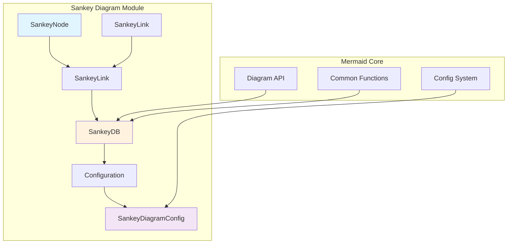
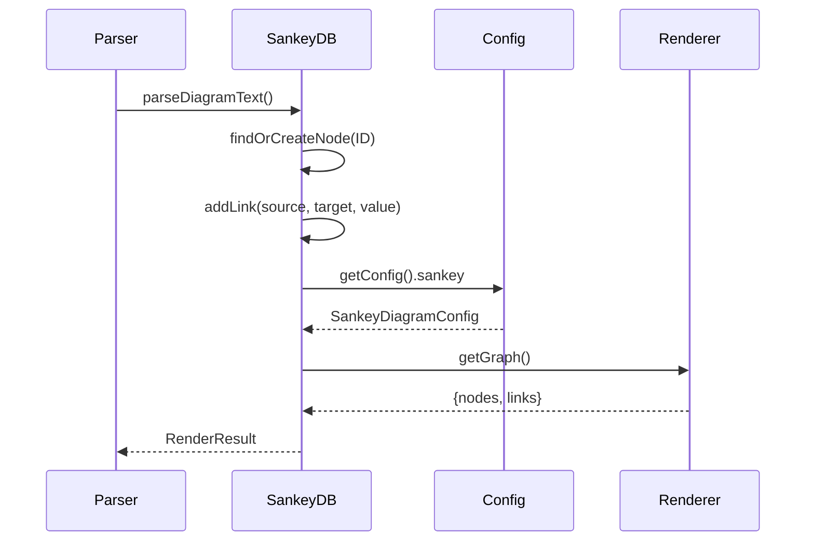
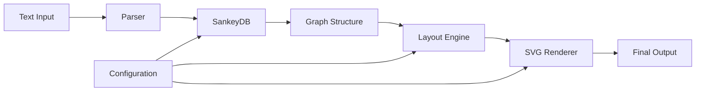

# Sankey Diagram Module Documentation

## Overview

The Sankey diagram module is a specialized visualization component within the Mermaid ecosystem that creates flow diagrams to visualize the flow of quantities between different entities. Sankey diagrams are particularly useful for showing energy, material, or cost transfers between processes, making them ideal for visualizing resource flows, budget allocations, or data transformations.

## Purpose and Core Functionality

The Sankey diagram module provides:
- **Flow Visualization**: Represents quantities flowing between nodes with proportional link widths
- **Node Management**: Handles creation and management of source/target nodes
- **Link Management**: Manages connections between nodes with associated values
- **Configuration Support**: Provides customizable styling and layout options
- **Data Processing**: Converts raw input data into structured graph format

## Architecture Overview



## Core Components

### 1. SankeyNode (`packages.mermaid.src.diagrams.sankey.sankeyDB.SankeyNode`)
Represents individual entities in the Sankey diagram. Each node has a unique identifier and serves as either a source or target for flows.

**Key Features:**
- Unique ID-based identification
- Automatic sanitization of node identifiers
- Integration with common Mermaid database patterns

### 2. SankeyLink (`packages.mermaid.src.diagrams.sankey.sankeyDB.SankeyLink`)
Represents the flow connection between two nodes, carrying a specific value that determines the width of the flow line.

**Key Features:**
- Source and target node references
- Value-based flow quantification
- Bidirectional flow support

### 3. SankeyDB (`packages.mermaid.src.diagrams.sankey.sankeyDB`)
The central database component that manages the entire Sankey diagram state, including nodes, links, and graph structure.

**Key Features:**
- Node and link storage and management
- Graph structure generation
- Integration with Mermaid's common database functions
- Configuration access

### 4. SankeyDiagramConfig (`packages.mermaid.src.config.type.SankeyDiagramConfig`)
Configuration interface that defines styling and layout options specific to Sankey diagrams.

**Key Features:**
- Link color customization (source, target, gradient)
- Node alignment options (left, right, center, justify)
- Value display controls
- Dimension specifications

## Data Flow Architecture



## Integration with Mermaid Ecosystem

The Sankey diagram module integrates with several core Mermaid systems:

### Configuration System
- Inherits from `BaseDiagramConfig` for common diagram settings
- Integrates with Mermaid's global configuration through `getConfig()`
- Supports theme variables and custom styling

### Common Database Functions
- Uses `commonClear()` for state management
- Integrates with accessibility features (`setAccTitle`, `getAccTitle`, etc.)
- Supports diagram title management

### Text Processing
- Utilizes `common.sanitizeText()` for safe text handling
- Integrates with Mermaid's text processing pipeline

### Diagram Definition Integration
The Sankey module follows Mermaid's standard diagram definition pattern:
- Implements `DiagramDB` interface for state management
- Provides `DiagramRenderer` for SVG generation
- Uses `ParserDefinition` for text parsing
- Supports injection of utility functions through `injectUtils`

## Configuration Options

The Sankey diagram supports the following configuration options:

| Option | Type | Description |
|--------|------|-------------|
| `width` | number | Diagram width |
| `height` | number | Diagram height |
| `linkColor` | SankeyLinkColor \| string | Link color mode (source, target, gradient) |
| `nodeAlignment` | SankeyNodeAlignment | Node alignment (left, right, center, justify) |
| `useMaxWidth` | boolean | Use maximum available width |
| `showValues` | boolean | Display values on links |
| `prefix` | string | Prefix for displayed values |
| `suffix` | string | Suffix for displayed values |

## Rendering Process

The Sankey diagram rendering follows Mermaid's standard pipeline:



### Rendering Steps:
1. **Text Parsing**: Input text is parsed to extract node and link information
2. **Database Population**: Nodes and links are stored in SankeyDB
3. **Graph Generation**: Structured graph format is created for layout engine
4. **Layout Calculation**: Node positions and link paths are calculated
5. **SVG Generation**: Final SVG elements are created and styled
6. **Output**: Complete diagram is rendered to DOM

## Usage Patterns

### Basic Flow Representation
```
sankey
A,100,B
B,80,C
B,20,D
```

### Multi-level Flows
```
sankey
Source1,50,Process1
Source2,30,Process1
Process1,70,Target1
Process1,10,Target2
```

### Complex Networks
```
sankey
RawMaterial,100,ProcessA
RawMaterial,50,ProcessB
ProcessA,80,Product1
ProcessA,20,Waste
ProcessB,40,Product2
ProcessB,10,Waste
```

## Error Handling and Validation

The Sankey diagram module implements several validation and error handling mechanisms:

### Input Validation
- **Node ID Sanitization**: All node identifiers are sanitized using `common.sanitizeText()` to prevent XSS attacks
- **Value Validation**: Link values are validated to ensure they are numeric and non-negative
- **Duplicate Node Handling**: The `findOrCreateNode()` function prevents duplicate nodes with the same ID

### State Management
- **Clear Function**: The `clear()` function properly resets all internal state
- **Memory Management**: Uses Map data structure for efficient node lookup and memory usage
- **Error Recovery**: Graceful handling of malformed input through sanitization

### Configuration Validation
- **Type Safety**: Configuration options are validated against defined TypeScript interfaces
- **Default Values**: Fallback values are provided for missing configuration options
- **Range Checking**: Numeric values are validated against reasonable ranges

## Implementation Details

### Data Structures
```typescript
// Node representation
class SankeyNode {
  constructor(public ID: string) {}
}

// Link representation  
class SankeyLink {
  constructor(
    public source: SankeyNode,
    public target: SankeyNode,
    public value = 0
  ) {}
}

// Internal storage
let links: SankeyLink[] = [];
let nodes: SankeyNode[] = [];
let nodesMap = new Map<string, SankeyNode>();
```

### Key Algorithms
- **Node Lookup**: O(1) complexity using Map-based storage
- **Link Creation**: Direct instantiation with source/target references
- **Graph Generation**: Linear transformation to D3-compatible format
- **Memory Efficiency**: Reuse of existing nodes through lookup mechanism

## Testing Considerations

### Unit Testing
- Node creation and lookup functionality
- Link establishment between nodes
- Configuration option handling
- Graph structure generation
- State clearing and reset

### Integration Testing
- Parser integration with text input
- Configuration system integration
- Rendering pipeline integration
- Cross-browser compatibility

### Performance Testing
- Large dataset handling (1000+ nodes/links)
- Memory usage optimization
- Rendering speed benchmarks
- Responsive behavior testing

## Dependencies

The Sankey diagram module depends on:
- **Mermaid Core API**: For diagram registration and configuration
- **Common Functions**: For text processing and state management
- **Configuration System**: For styling and layout options
- **Rendering Engine**: For final SVG generation

### Required Components
- `getConfig()` - Global configuration access
- `common.sanitizeText()` - Text sanitization for security
- `commonClear()` - State management utilities
- Accessibility functions (`setAccTitle`, `getAccTitle`, etc.)
- Diagram title management functions

## Related Modules

- [diagram_plugin_api](diagram_plugin_api.md) - Core diagram plugin infrastructure
- [rendering_engine](rendering_engine.md) - SVG rendering capabilities
- [mermaid_core_api](mermaid_core_api.md) - Main Mermaid API integration

## Performance Considerations

- Node lookup is optimized using Map data structure for O(1) access
- Links are stored in arrays for efficient iteration
- Graph structure is generated on-demand to minimize memory usage
- Sanitization is applied only during node creation to avoid repeated processing

## Future Enhancements

Potential areas for improvement:
- Support for hierarchical node grouping
- Interactive features (hover effects, click handlers)
- Advanced color schemes and gradients
- Export capabilities for data analysis
- Integration with external data sources