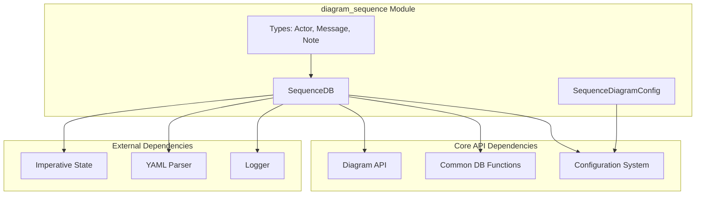
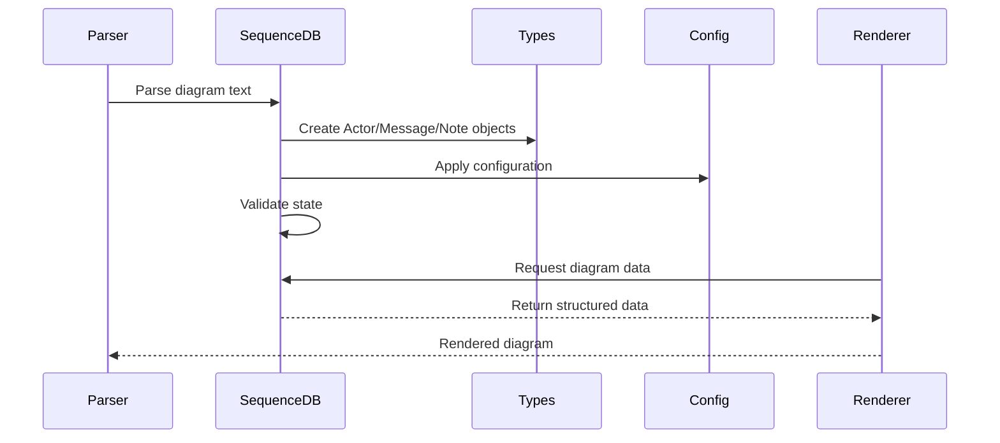
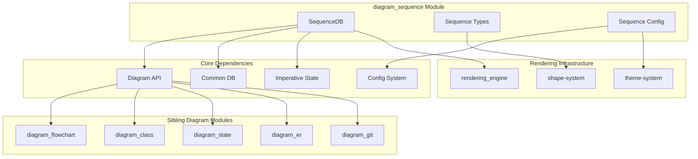
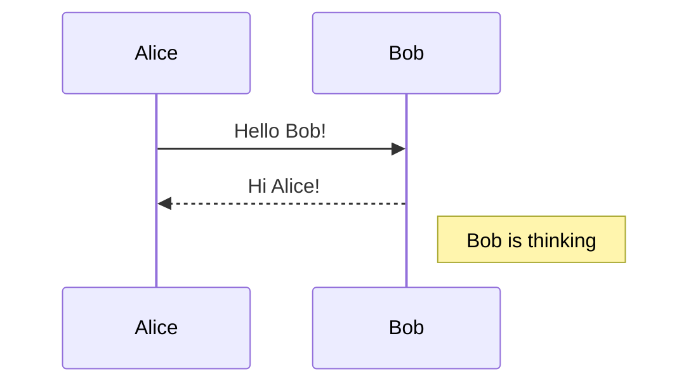

# Sequence Diagram Module Documentation

## Overview

The `diagram_sequence` module is a core component of the Mermaid diagramming library that provides functionality for creating and rendering sequence diagrams. Sequence diagrams are used to visualize the interactions between objects or participants in a system over time, showing the sequence of messages exchanged.

## Purpose

This module enables users to:
- Define actors/participants in a system
- Create messages and interactions between participants
- Add notes and annotations to interactions
- Support various participant types (actors, boundaries, collections, controls, databases, entities, participants, queues)
- Handle complex interaction patterns including loops, alternatives, options, parallels, and critical sections
- Manage participant lifecycle (creation and destruction)
- Configure diagram appearance and behavior

## Architecture

The sequence diagram module follows a layered architecture pattern with clear separation of concerns:



## Core Components

### 1. SequenceDB (`packages.mermaid.src.diagrams.sequence.sequenceDb.SequenceDB`)

The central database class that manages all sequence diagram data and state. It implements the `DiagramDB` interface and provides methods for:

- **Actor Management**: Adding, retrieving, and managing participants/actors
- **Message Handling**: Creating and storing messages between actors
- **Note Management**: Adding notes to actors and interactions
- **Box Organization**: Grouping actors into logical boxes
- **State Management**: Tracking actor creation, destruction, and activation
- **Configuration**: Managing diagram-specific settings like wrapping and sequence numbers

Key features:
- Uses `ImperativeState` for state management
- Supports YAML metadata for actors
- Implements activation counting for nested activations
- Handles message parsing with wrap/nowrap directives
- Manages participant lifecycle validation

### 2. Type Definitions (`packages.mermaid.src.diagrams.sequence.types`)

Defines the core data structures:

- **Actor**: Represents a participant in the sequence diagram with properties like name, description, type, links, and properties
- **Message**: Represents interactions between actors with text, type, placement, and activation information
- **Note**: Represents annotations attached to actors with placement and message content
- **Box**: Represents logical groupings of actors with styling and wrapping options
- **AddMessageParams**: Union type for various diagram operations

### 3. Configuration (`packages.mermaid.src.config.type.SequenceDiagramConfig`)

Extends `BaseDiagramConfig` with sequence-specific settings:

- **Layout**: Margins, dimensions, and spacing controls
- **Typography**: Font settings for actors, messages, and notes
- **Behavior**: Wrapping, sequence numbers, right angles
- **Appearance**: Colors, alignment, and styling options

## Data Flow



## Integration with Mermaid Core

The sequence diagram module integrates with the broader Mermaid ecosystem through:

### 1. Diagram API Integration
Implements the `DiagramDB` interface which provides:
- Configuration management (`getConfig()`)
- Diagram metadata (title, accessibility title/description)
- State management (`clear()`)
- Function binding for interactive elements (`bindFunctions()`)

### 2. Common Database Functions
Leverages shared utilities from `commonDb.ts`:
- `setAccTitle()` / `getAccTitle()`: Accessibility title management
- `setAccDescription()` / `getAccDescription()`: Accessibility description
- `setDiagramTitle()` / `getDiagramTitle()`: Diagram title management
- `clear()`: State cleanup
- Text sanitization through `sanitizeText()`

### 3. Configuration System
Integrates with Mermaid's configuration system:
- Inherits from `BaseDiagramConfig` for common settings
- Extends with sequence-specific configurations
- Uses `getConfig()` to access global settings
- Supports both global and diagram-specific overrides

### 4. State Management
Uses `ImperativeState<S>` for robust state management:
- Encapsulates all diagram state in a single object
- Provides reset functionality for cleanup
- Ensures immutable state updates
- Type-safe state access

### 5. External Dependencies
- **YAML Parser**: Supports YAML metadata for actors via `js-yaml`
- **Logger**: Uses Mermaid's logging system for debugging
- **Text Sanitization**: Leverages common text processing utilities

## Key Features

### Participant Types
Supports multiple participant types with distinct visual representations:
- Actor (default person icon)
- Boundary (boundary representation)
- Collections (collection representation)
- Control (control node)
- Database (database icon)
- Entity (entity representation)
- Participant (generic participant)
- Queue (queue representation)

### Message Types
Handles various message patterns defined by `LINETYPE` constants:

**Basic Message Types:**
- `SOLID` (0): Solid arrow lines
- `DOTTED` (1): Dotted arrow lines
- `NOTE` (2): Note annotations

**Advanced Message Types:**
- `SOLID_CROSS` (3): Solid cross messages
- `DOTTED_CROSS` (4): Dotted cross messages
- `SOLID_OPEN` (5): Solid open arrows
- `DOTTED_OPEN` (6): Dotted open arrows
- `BIDIRECTIONAL_SOLID` (33): Bidirectional solid
- `BIDIRECTIONAL_DOTTED` (34): Bidirectional dotted

**Control Flow Types:**
- `LOOP_START` (10) / `LOOP_END` (11): Loop constructs
- `ALT_START` (12) / `ALT_ELSE` (13) / `ALT_END` (14): Alternative paths
- `OPT_START` (15) / `OPT_END` (16): Optional paths
- `PAR_START` (19) / `PAR_AND` (20) / `PAR_END` (21): Parallel execution
- `CRITICAL_START` (27) / `CRITICAL_OPTION` (28) / `CRITICAL_END` (29): Critical sections
- `BREAK_START` (30) / `BREAK_END` (31): Break statements

**Activation Types:**
- `ACTIVE_START` (17) / `ACTIVE_END` (18): Participant activation
- `RECT_START` (22) / `RECT_END` (23): Rectangle highlighting
- `AUTONUMBER` (26): Sequence numbering

### Arrow Types
Defined by `ARROWTYPE` constants:
- `FILLED` (0): Filled arrowheads
- `OPEN` (1): Open arrowheads

### Note Placement
Defined by `PLACEMENT` constants:
- `LEFTOF` (0): Place note to the left of actor
- `RIGHTOF` (1): Place note to the right of actor
- `OVER` (2): Place note over the actor

### Control Structures
Supports complex interaction patterns:
- Loops (start/end)
- Alternatives (alt/else/end)
- Options (opt/end)
- Parallels (par/and/end)
- Critical sections (critical/option/end)
- Break sections (break/start/end)

### Advanced Features

#### The Apply Method
The `apply()` method is the central processing hub that handles all diagram operations through a unified interface. It processes `AddMessageParams` objects that can represent:

**Participant Operations:**
- `addParticipant`: Add a new participant
- `createParticipant`: Create a participant with validation
- `destroyParticipant`: Mark a participant for destruction

**Message Operations:**
- `addMessage`: Add a message between participants
- `activeStart` / `activeEnd`: Manage participant activation

**Annotation Operations:**
- `addNote`: Add notes to participants
- `addLinks`: Add hyperlinks to participants
- `addALink`: Add a single hyperlink
- `addProperties`: Add properties to participants
- `addDetails`: Add detailed information from DOM elements

**Control Flow Operations:**
- `loopStart` / `loopEnd`: Loop constructs
- `altStart` / `else` / `altEnd`: Alternative paths
- `optStart` / `optEnd`: Optional paths
- `parStart` / `and` / `parEnd`: Parallel execution
- `criticalStart` / `option` / `criticalEnd`: Critical sections
- `breakStart` / `breakEnd`: Break statements

**Box Operations:**
- `boxStart` / `boxEnd`: Group participants in boxes

**Utility Operations:**
- `setAccTitle`: Set accessibility title
- `sequenceIndex`: Manage sequence numbering

#### Message Parsing
The `parseMessage()` method handles text parsing with special directives:
- Extracts `wrap:` or `nowrap:` prefixes
- Returns cleaned text and wrap preference
- Integrates with configuration system for default behavior

#### Box Data Parsing
The `parseBoxData()` method processes box definitions:
- Extracts color information (rgb, rgba, hsl, hsla, or CSS color names)
- Validates color using browser CSS support
- Handles text content and wrapping preferences
- Sanitizes text content for security

## Configuration Options

The module supports extensive configuration through `SequenceDiagramConfig`:

### Layout Configuration
- `diagramMarginX/Y`: Overall diagram margins
- `actorMargin`: Spacing between actors
- `messageMargin`: Space between messages
- `noteMargin`: Margin around notes
- `boxMargin`: Margin around loop boxes

### Typography Configuration
- `actorFont*`: Font settings for actor labels
- `messageFont*`: Font settings for messages
- `noteFont*`: Font settings for notes

### Behavior Configuration
- `wrap`: Enable/disable text wrapping
- `showSequenceNumbers`: Display sequence numbers
- `rightAngles`: Use right angles for curved arrows
- `mirrorActors`: Mirror actors under diagram

## Validation and Error Handling

### Participant Validation
The module implements strict validation rules:

**Actor Creation Validation:**
- Prevents duplicate actor IDs even with destruction in between
- Enforces unique actor names within boxes
- Validates YAML metadata format
- Ensures proper actor type assignment

**Lifecycle Validation:**
- Verifies creation messages follow actor declarations
- Ensures destruction messages are properly linked
- Validates activation/deactivation balance using `activationCount()`
- Prevents operations on destroyed actors

**Box Validation:**
- Ensures actors belong to only one box at a time
- Validates box color format (CSS color support)
- Manages box lifecycle (start/end pairs)

### Error Types and Handling

**Activation Errors:**
```typescript
// Throws error when trying to deactivate inactive participant
if (messageType === this.LINETYPE.ACTIVE_END) {
  const cnt = this.activationCount(idFrom ?? '');
  if (cnt < 1) {
    const error = new Error('Trying to inactivate an inactive participant (' + idFrom + ')');
    error.hash = {
      text: '->>-',
      token: '->>-',
      line: '1',
      loc: { first_line: 1, last_line: 1, first_column: 1, last_column: 1 },
      expected: ["'ACTIVE_PARTICIPANT'"],
    };
    throw error;
  }
}
```

**Creation/Destruction Errors:**
- Throws error when created participant lacks following message
- Validates destruction messages are properly associated
- Ensures proper message flow after lifecycle changes

**Parsing Errors:**
- YAML parsing errors for actor metadata
- JSON parsing errors for links and properties
- Color validation errors for box definitions
- Text sanitization failures

### Exception Handling Strategy
- Uses typed errors with additional context (hash property)
- Provides detailed error messages for debugging
- Maintains diagram state consistency on errors
- Integrates with Mermaid's error reporting system

## Performance Considerations

- Uses `ImperativeState` for efficient state management
- Implements lazy evaluation where possible
- Caches computed values like activation counts
- Minimizes DOM operations during parsing

## Module Relationships

The sequence diagram module interacts with other Mermaid modules in the ecosystem:



### Shared Infrastructure
- **Diagram API**: Common interface for all diagram types
- **Configuration System**: Shared configuration management
- **Rendering Engine**: Common SVG rendering pipeline
- **Theme System**: Consistent styling across diagrams
- **Shape System**: Reusable shape definitions

### Unique Sequence Features
Unlike other diagram types, sequence diagrams:
- Manage temporal relationships and message ordering
- Support complex interaction patterns (loops, alternatives, etc.)
- Handle participant lifecycle (creation/destruction)
- Implement activation/deactivation semantics
- Provide specialized layout algorithms for time-based visualization

## Usage Examples

The sequence diagram module processes text input like:



This gets parsed into structured data and rendered as an interactive SVG diagram.

### Complex Example
```
sequenceDiagram
    box RGB(100, 100, 100) Group
        participant A
        participant B
    end
    
    A->>B: Request
    activate B
    B->>B: Internal processing
    alt Success case
        B-->>A: Success response
    else Error case
        B-->>A: Error response
    end
    deactivate B
```

This demonstrates:
- Box grouping with custom colors
- Participant activation
- Alternative paths (alt/else)
- Self-messages
- Proper activation lifecycle

## Related Documentation

- [Mermaid Core API](mermaid_core_api.md) - Core API and diagram registration
- [Diagram Plugin API](diagram_plugin_api.md) - Plugin system and diagram definitions
- [Rendering Engine](rendering_engine.md) - SVG rendering and layout
- [Configuration System](configuration.md) - Global and diagram-specific configuration