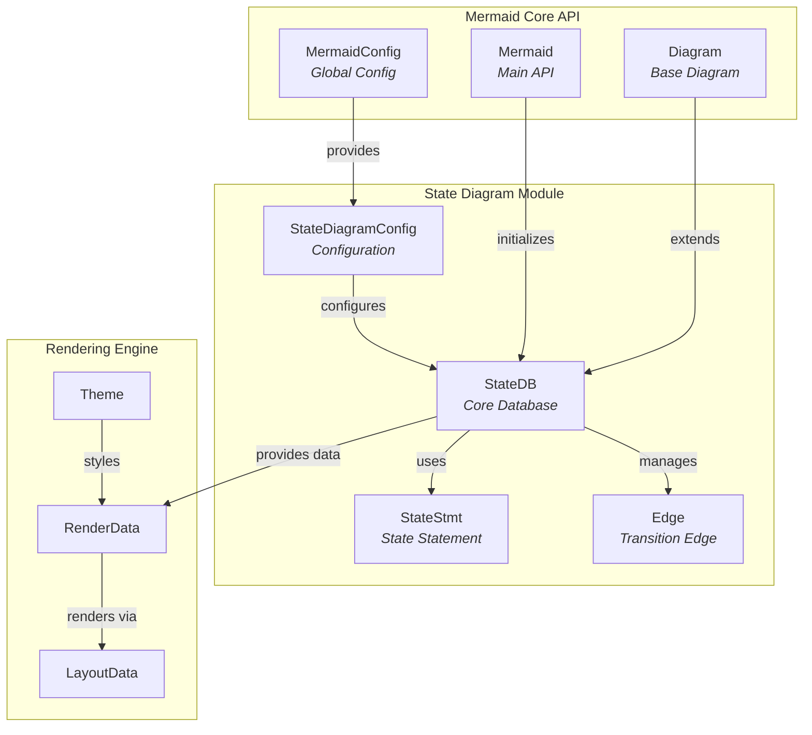
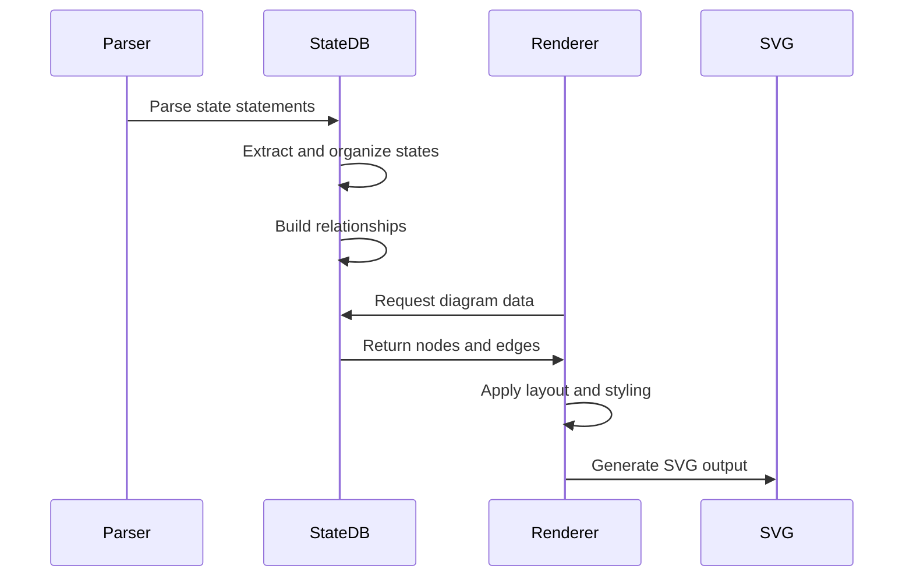
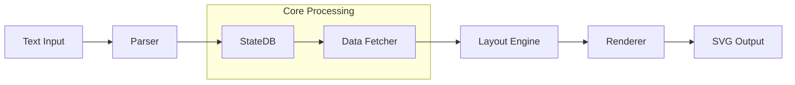
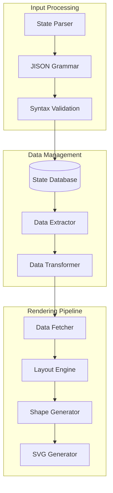

# State Diagram Module Documentation

## Overview

The `diagram_state` module is a core component of the Mermaid diagramming library that provides functionality for creating and rendering state diagrams. State diagrams are used to model the dynamic behavior of systems, showing how objects change states in response to events.

## Purpose and Core Functionality

The state diagram module enables users to:
- Define states and their relationships
- Model state transitions and events
- Create hierarchical state structures with nested states
- Apply styling and visual customization
- Support various state types including start/end states, choice states, fork/join states, and dividers

## Architecture Overview

## Core Components

### StateDB
The central database class that manages all state diagram data, including:
- State definitions and properties
- State relationships and transitions
- Style classes and visual attributes
- Document structure for nested states

*Detailed documentation: [state-database.md](state-database.md)*

### StateStmt
Represents individual state statements with properties such as:
- State type (default, fork, join, choice, divider, start, end)
- State descriptions and documentation
- Nested document structures for hierarchical states
- Style and class associations

*Detailed documentation: [state-database.md](state-database.md)*

### Edge
Defines transitions between states with attributes including:
- Start and end state references
- Transition labels and styling
- Arrow styles and visual properties

*Detailed documentation: [state-database.md](state-database.md)*

### StateDiagramConfig
Configuration interface for state diagram-specific settings:
- Layout and spacing parameters
- Font and styling options
- Rendering behavior controls

*Detailed documentation: [state-configuration.md](state-configuration.md)*

## Data Flow

## Integration with Mermaid Ecosystem

The state diagram module integrates with other Mermaid components:

- **Parser Engine**: Uses the common parsing infrastructure to process state diagram syntax
- **Rendering Engine**: Leverages the shared rendering utilities for SVG generation
- **Theme System**: Inherits theming capabilities from the base theme system
- **Configuration System**: Integrates with the global Mermaid configuration

## Module Architecture

The state diagram module is organized into several sub-modules:

### State Database Module
Manages the core data structures for states, relationships, and styling. Handles state definitions, transitions, and hierarchical document structures.

*Detailed documentation: [state-database.md](state-database.md)*

### State Rendering Module
Handles the conversion of state diagram data into visual representations. Manages node creation, edge rendering, and layout processing.

*Detailed documentation: [state-rendering.md](state-rendering.md)*

### State Parser Module
Processes state diagram syntax and converts text input into structured data. Includes grammar definitions and parsing logic.

*Detailed documentation: [state-parser.md](state-parser.md)*

### State Configuration Module
Defines configuration options specific to state diagrams, including layout parameters, styling options, and rendering behavior.

*Detailed documentation: [state-configuration.md](state-configuration.md)*

## Key Features

### State Types Support
- **Basic States**: Regular states with labels and descriptions
- **Composite States**: States containing nested substates
- **Special States**: Start/end states, choice states, fork/join states
- **Dividers**: Visual separators for organizing states

### Styling and Customization
- CSS class application to states
- Inline style definitions
- Text styling options
- Theme integration

### Advanced Features
- Clickable states with URL links
- State notes and annotations
- Hierarchical state structures
- Direction control for layout

## Configuration Options

The state diagram supports various configuration options through `StateDiagramConfig`:

- Layout direction (TB, BT, RL, LR)
- Spacing and padding controls
- Font size and styling
- Node sizing parameters
- Edge styling options

## Technical Implementation

### State Processing Pipeline

### Document Structure Handling

The state diagram module uses a hierarchical document structure to handle nested states:

1. **Root Document**: Top-level container for all states
2. **State Documents**: Nested documents within composite states
3. **Divider Processing**: Special handling for concurrent state regions
4. **Relationship Mapping**: Cross-document state relationships

### Data Flow Architecture

## Usage Examples

State diagrams can be used to model:
- System lifecycle states
- User interface workflows
- Protocol state machines
- Business process flows
- Game states and transitions

## Related Documentation

For more information about related modules:
- [diagram_plugin_api](diagram_plugin_api.md) - Plugin API for diagram types
- [rendering_engine](rendering_engine.md) - Shared rendering infrastructure
- [mermaid_core_api](mermaid_core_api.md) - Core Mermaid API

## Dependencies

The state diagram module depends on:
- Mermaid core configuration system
- Common diagram utilities
- Rendering engine components
- Theme system for styling