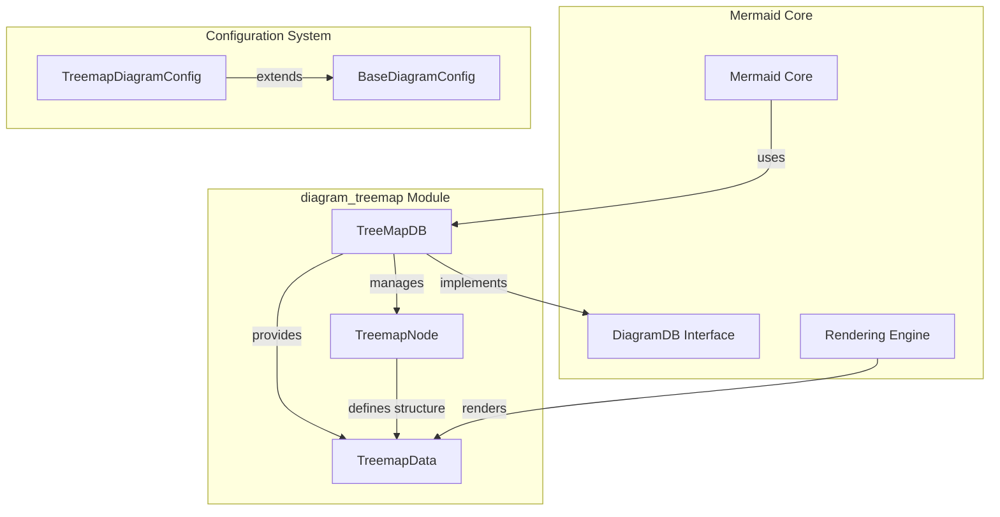
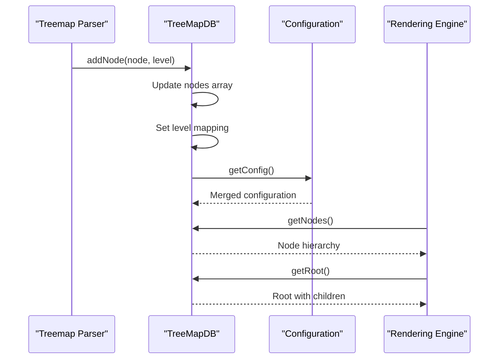
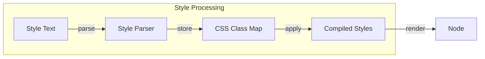

# Mermaid Treemap Diagram Module

## Overview

The `diagram_treemap` module provides hierarchical data visualization capabilities to the Mermaid diagramming library through treemap diagrams. Treemaps display hierarchical (tree-structured) data as a set of nested rectangles, where each branch of the tree is given a colored rectangle that contains smaller rectangles representing sub-branches. The size and color of rectangles can be used to represent different data dimensions.

## Architecture

The treemap module follows Mermaid's standard diagram architecture pattern, integrating with the core rendering engine and plugin system:



## Core Components

### TreeMapDB (`packages.mermaid.src.diagrams.treemap.db.TreeMapDB`)
The central database class that implements the `DiagramDB` interface. It manages:
- Node storage and hierarchical relationships
- Level tracking for nested structures
- CSS class and style management
- Configuration integration
- Common diagram metadata (title, accessibility)

For detailed database management documentation, see [database-management.md](database-management.md).

### TreemapNode (`packages.mermaid.src.diagrams.treemap.types.TreemapNode`)
Defines the structure for individual treemap nodes:
- Hierarchical parent-child relationships
- Optional values for size representation
- CSS styling and class selection
- Compiled style arrays for rendering

### TreemapData (`packages.mermaid.src.diagrams.treemap.types.TreemapData`)
Aggregated data structure containing:
- Complete node collection
- Level mappings for layout calculations
- Root node reference
- Outer nodes for top-level rendering
- CSS class definitions

For comprehensive type system documentation, see [type-system.md](type-system.md).

## Data Flow



## Integration with Mermaid Ecosystem

The treemap module integrates with several other Mermaid modules:

- **[diagram_plugin_api](diagram_plugin_api.md)**: Implements the `DiagramDB` interface for plugin compatibility
- **[rendering_engine](rendering_engine.md)**: Provides data structures for the rendering system
- **[parser_engine](parser_engine.md)**: Integrates with the parsing framework for syntax processing

## Configuration

The module supports extensive configuration through `TreemapDiagramConfig`:

- **Layout**: `padding`, `diagramPadding`, `nodeWidth`, `nodeHeight`
- **Styling**: `borderWidth`, `valueFontSize`, `labelFontSize`
- **Behavior**: `showValues`, `valueFormat`

## Style System

The treemap module implements a comprehensive style system:



## Usage Patterns

### Basic Hierarchical Data
```
treemap
  root
    branch1
      leaf1
      leaf2
    branch2
      leaf3
```

### Value-based Sizing
```
treemap
  root
    category1 100
      item1 30
      item2 70
    category2 200
      item3 150
      item4 50
```

### Styled Nodes
```
treemap
  root
    important[High Priority]:::importantStyle
    normal[Standard Item]
```

## Performance Considerations

- **Node Management**: Efficient storage using arrays and Maps for O(1) lookups
- **Memory Optimization**: Lazy initialization of optional properties
- **Rendering**: Supports incremental updates through the clear() method
- **Style Caching**: CSS classes are compiled once and reused

## Accessibility

The module supports Mermaid's accessibility features:
- Diagram titles and descriptions
- Screen reader compatible structure
- Keyboard navigation support
- High contrast mode compatibility

## Error Handling

- **Validation**: Node hierarchy validation through level tracking
- **Graceful Degradation**: Missing values default to container sizing
- **Style Fallbacks**: Undefined CSS classes fall back to default styling
- **Configuration Safety**: Merges user config with safe defaults