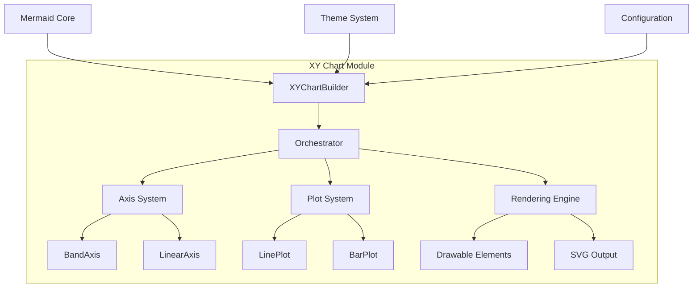
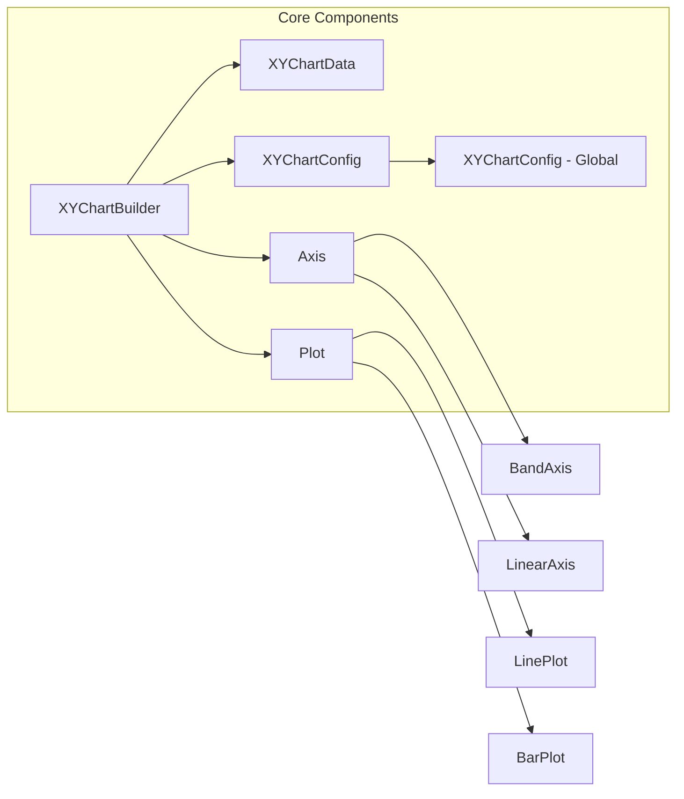
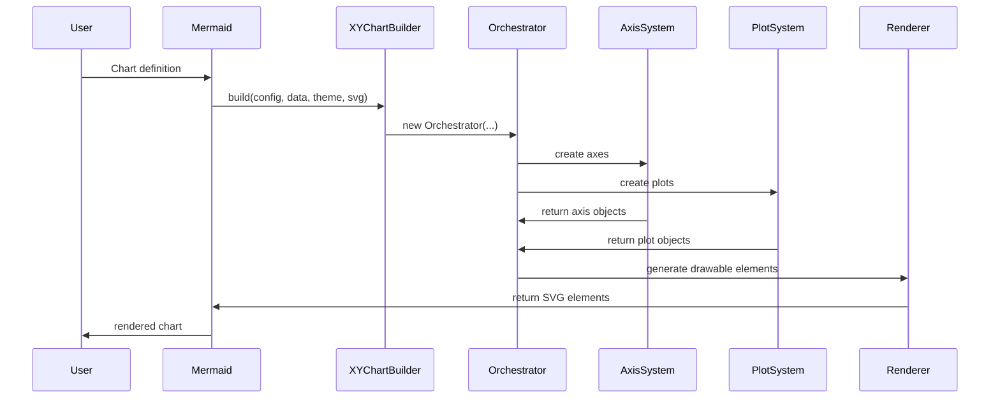
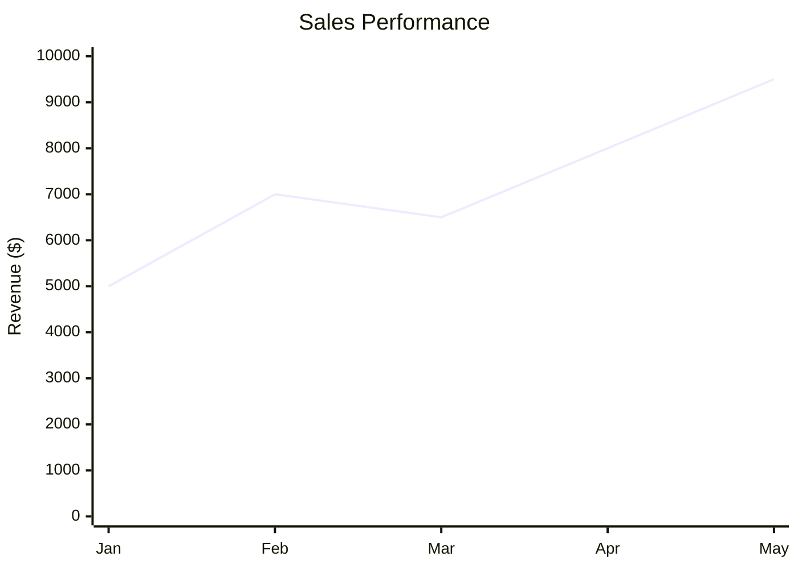
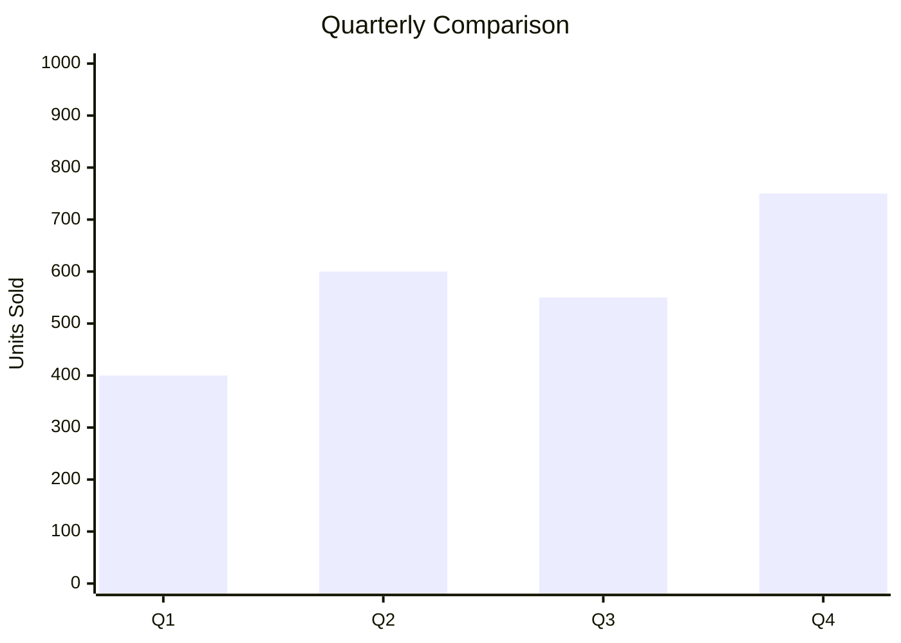

# XY Chart Module Documentation

## Overview

The `diagram_xy_chart` module is a specialized component of the Mermaid diagramming library that provides comprehensive support for creating XY charts (scatter plots, line charts, and bar charts). This module enables users to visualize data relationships through configurable chart types with customizable axes, styling, and rendering options.

## Purpose

The XY Chart module serves as a data visualization tool within the Mermaid ecosystem, offering:
- **Multi-type chart support**: Line plots, bar charts, and scatter plots
- **Flexible axis configuration**: Both band (categorical) and linear (numerical) axes
- **Customizable styling**: Theme-based color schemes and visual properties
- **Responsive design**: Configurable dimensions and spacing
- **Integration capabilities**: Seamless integration with Mermaid's rendering engine

## Architecture

### High-Level Architecture

### Component Relationships

## Core Functionality

### 1. Chart Builder ([XYChartBuilder](packages/mermaid/src/diagrams/xychart/chartBuilder/index.ts))

The main entry point that orchestrates the chart creation process:
- **Static build method**: Primary interface for chart generation
- **Orchestrator integration**: Delegates complex rendering logic
- **Configuration management**: Handles chart, data, and theme configurations
- **SVG group handling**: Manages temporary SVG elements for calculations

### 2. Data Interface ([XYChartData](packages/mermaid/src/diagrams/xychart/chartBuilder/interfaces.ts))

Defines the structure for chart data input:
- **Axis data types**: Support for both band (categorical) and linear (numerical) data
- **Plot data structures**: Line and bar plot configurations
- **Type safety**: Runtime type checking with `isBarPlot`, `isBandAxisData`, and `isLinearAxisData` functions
- **Flexible data format**: Simple plot data as `[string, number][]` tuples

### 3. Configuration System ([XYChartConfig](packages/mermaid/src/diagrams/xychart/chartBuilder/interfaces.ts))

Comprehensive configuration options:
- **Chart dimensions**: Width, height, and spacing controls
- **Axis configuration**: Individual X and Y axis settings
- **Visual properties**: Colors, fonts, and styling options
- **Orientation support**: Vertical and horizontal chart layouts
- **Global integration**: Extends Mermaid's base configuration system

### 4. Axis System ([Axis](packages/mermaid/src/diagrams/xychart/chartBuilder/components/axis/index.ts))

Flexible axis management with two primary types:
- **BandAxis**: Handles categorical data with discrete categories
- **LinearAxis**: Manages continuous numerical data with min/max ranges
- **Position support**: Top, bottom, left, and right axis placement
- **Scaling functions**: Convert data values to chart coordinates
- **Space calculation**: Dynamic space allocation for labels and ticks

### 5. Plot System ([Plot](packages/mermaid/src/diagrams/xychart/chartBuilder/components/plot/index.ts))

Multi-type plot rendering engine:
- **LinePlot**: Smooth line connections between data points
- **BarPlot**: Vertical or horizontal bar representations
- **Axis integration**: Automatic scaling based on axis configurations
- **Orientation support**: Adapts to vertical or horizontal chart layouts
- **Color management**: Theme-based color palette application

## Data Flow

## Integration with Mermaid Ecosystem

### Dependencies
- **Mermaid Core API**: Integration with main rendering pipeline
- **Theme System**: Leverages Mermaid's theme configuration
- **Configuration System**: Extends global Mermaid configuration
- **SVG Rendering**: Uses Mermaid's SVG generation capabilities

### Related Modules
- [diagram_plugin_api](diagram_plugin_api.md): Provides the plugin interface framework
- [rendering_engine](rendering_engine.md): Handles SVG element generation
- [mermaid_core_api](mermaid_core_api.md): Core API integration

## Configuration Options

### Chart-Level Configuration
- `width`/`height`: Chart dimensions
- `titleFontSize`/`titlePadding`: Title styling
- `showTitle`/`showDataLabel`: Visibility controls
- `chartOrientation`: 'vertical' or 'horizontal'
- `plotReservedSpacePercent`: Space allocation for plots

### Axis Configuration
- `showLabel`/`showTitle`/`showTick`: Visibility controls
- `labelFontSize`/`titleFontSize`: Text sizing
- `labelPadding`/`titlePadding`: Spacing controls
- `tickLength`/`tickWidth`: Tick appearance
- `showAxisLine`/`axisLineWidth`: Axis line styling

### Theme Configuration
- Background and text colors
- Axis-specific color schemes
- Plot color palettes
- Comprehensive color theming support

## Usage Examples

### Basic Line Chart

### Bar Chart with Multiple Series

## Sub-modules

The XY Chart module consists of several specialized sub-modules:

### [chart-builder](chart-builder.md)
Core chart construction logic, including the main XYChartBuilder class and data interfaces.

### [axis-system](axis-system.md)
Axis management and rendering, supporting both band and linear axis types.

### [plot-system](plot-system.md)
Plot rendering engine for line and bar chart types with orientation support.

## Best Practices

1. **Data Preparation**: Ensure data consistency between axes and plots
2. **Scaling**: Use appropriate axis ranges to maximize visual clarity
3. **Theming**: Leverage Mermaid's theme system for consistent styling
4. **Performance**: Consider data volume impact on rendering performance
5. **Accessibility**: Use descriptive titles and labels for better accessibility

## Future Enhancements

- Additional plot types (scatter, area charts)
- Interactive features (tooltips, zooming)
- Advanced axis transformations (logarithmic, time-based)
- Animation support for dynamic data updates
- Enhanced color palette management