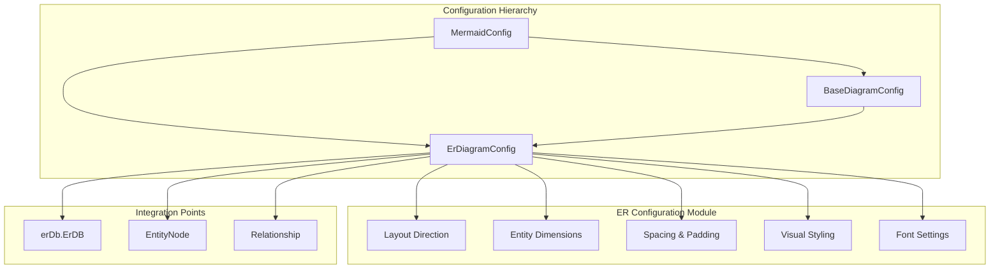
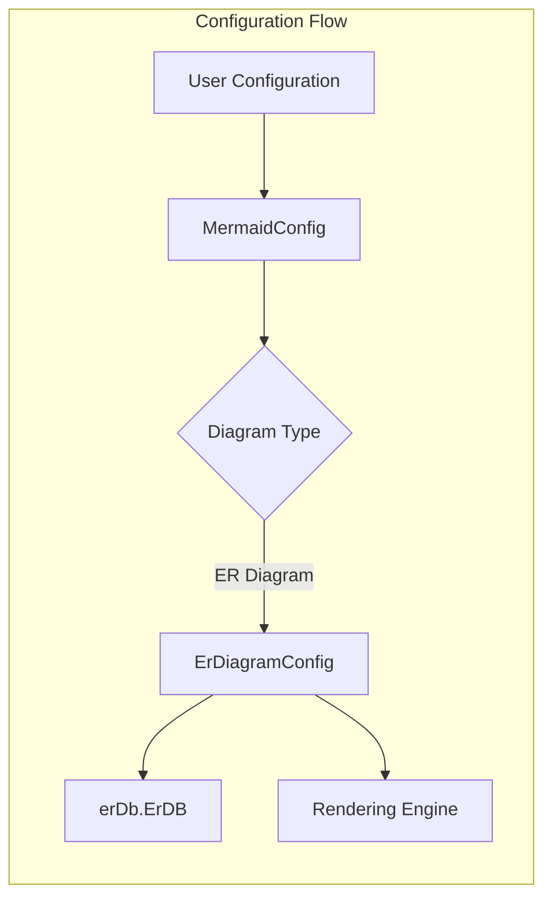
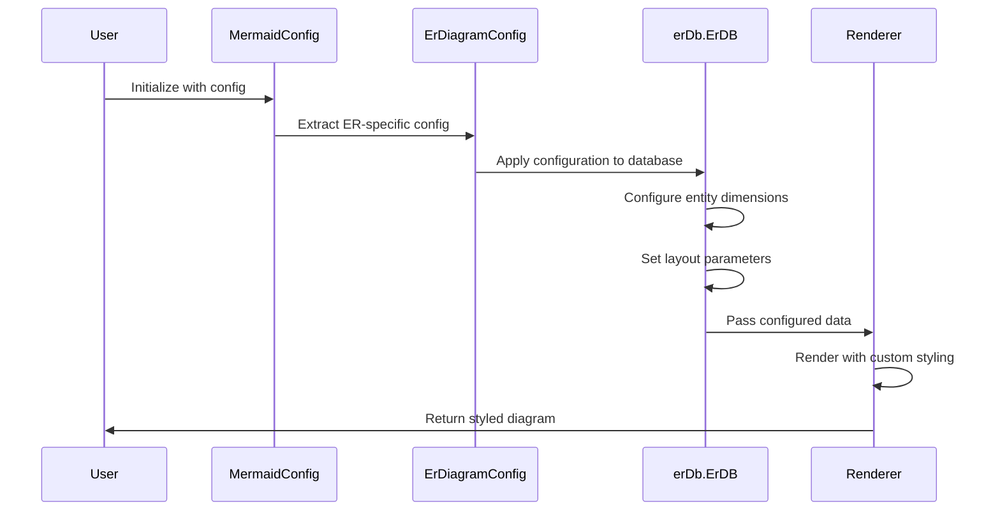

# ER Configuration Module Documentation

## Introduction

The ER (Entity Relationship) Configuration module is a specialized configuration subsystem within the Mermaid diagramming library that handles all configuration options specific to Entity Relationship diagrams. This module provides a comprehensive set of configuration parameters that control the visual appearance, layout, and behavior of ER diagrams, allowing developers to customize how entities, relationships, and their connections are rendered.

The module is part of the larger [diagram_er](diagram_er.md) module ecosystem and works in conjunction with the [er-database](er-database.md) and [er-types](er-types.md) modules to provide a complete ER diagram implementation.

## Architecture Overview

The ER Configuration module follows a hierarchical configuration pattern where diagram-specific configurations extend a base configuration interface. The architecture is designed to provide both global and diagram-specific customization options while maintaining consistency across different diagram types.



## Core Components

### ErDiagramConfig Interface

The `ErDiagramConfig` interface is the primary configuration object for ER diagrams, extending `BaseDiagramConfig` to provide ER-specific customization options. This interface is automatically generated from JSON Schema definitions and provides type-safe configuration options.

**Key Configuration Categories:**

1. **Layout Control**
   - `layoutDirection`: Controls the directional bias for entity layout (TB, BT, LR, RL)
   - `diagramPadding`: Overall padding around the diagram
   - `nodeSpacing` & `rankSpacing`: Control spacing between entities

2. **Entity Dimensions**
   - `minEntityWidth` & `minEntityHeight`: Minimum size constraints for entity boxes
   - `entityPadding`: Internal padding between text and entity borders

3. **Visual Styling**
   - `stroke`: Color for box edges and relationship lines
   - `fill`: Background color for entity boxes
   - `fontSize`: Text size within entities

4. **Title Configuration**
   - `titleTopMargin`: Margin above diagram title

### Configuration Integration

The ER configuration integrates with the broader Mermaid configuration system through the main `MermaidConfig` interface, where ER-specific settings are nested under the `er` property.



## Configuration Options

### Layout Direction
The `layoutDirection` parameter controls the primary layout direction for entities:
- **TB** (Top to Bottom): Entities are arranged vertically
- **BT** (Bottom to Top): Entities are arranged vertically in reverse
- **LR** (Left to Right): Entities are arranged horizontally  
- **RL** (Right to Left): Entities are arranged horizontally in reverse

### Entity Sizing
Entity dimensions are controlled through several parameters:
- `minEntityWidth`: Ensures entities have sufficient width for their content
- `minEntityHeight`: Ensures entities have sufficient height for their content
- `entityPadding`: Provides internal spacing between entity text and borders

### Visual Customization
The module provides extensive visual customization options:
- `stroke`: Controls the color of entity borders and relationship lines
- `fill`: Sets the background color for entity boxes
- `fontSize`: Adjusts text size within entities
- `diagramPadding`: Controls overall diagram margins

## Data Flow



## Integration with ER Module

The ER Configuration module works seamlessly with other components of the ER diagram system:

1. **erDb.ErDB**: The database component uses configuration values to determine entity sizing, spacing, and visual properties
2. **EntityNode**: Entity nodes are rendered according to the dimension and styling configurations
3. **Relationship**: Relationship lines use the stroke color and spacing configurations

## Usage Examples

### Basic Configuration
```javascript
mermaid.initialize({
  er: {
    layoutDirection: 'TB',
    minEntityWidth: 150,
    minEntityHeight: 75,
    entityPadding: 15,
    stroke: '#333333',
    fill: '#ffffff',
    fontSize: 14
  }
});
```

### Advanced Layout Configuration
```javascript
mermaid.initialize({
  er: {
    layoutDirection: 'LR',
    diagramPadding: 20,
    nodeSpacing: 50,
    rankSpacing: 80,
    minEntityWidth: 200,
    minEntityHeight: 100,
    entityPadding: 20,
    stroke: '#0066cc',
    fill: '#f0f8ff',
    fontSize: 16,
    titleTopMargin: 10
  }
});
```

## Dependencies

The ER Configuration module has the following dependencies within the Mermaid ecosystem:

- **BaseDiagramConfig**: Provides foundational configuration properties shared across all diagram types
- **MermaidConfig**: The root configuration interface that contains all diagram-specific configurations
- **erDb.ErDB**: The ER database component that consumes configuration values
- **EntityNode & Relationship**: Type definitions that work with configuration values

## Best Practices

1. **Consistent Sizing**: Use consistent `minEntityWidth` and `minEntityHeight` values across related diagrams
2. **Appropriate Spacing**: Adjust `nodeSpacing` and `rankSpacing` based on diagram complexity
3. **Color Contrast**: Ensure sufficient contrast between `stroke` and `fill` colors for readability
4. **Font Size**: Choose `fontSize` values that balance readability with space efficiency
5. **Layout Direction**: Select `layoutDirection` based on the natural flow of your data relationships

## Configuration Validation

The ER Configuration module benefits from TypeScript's type system, providing compile-time validation of configuration options. The interface definitions ensure that only valid configuration keys and value types are accepted.

## Related Documentation

- [ER Database Module](er-database.md) - For entity and relationship data management
- [ER Types Module](er-types.md) - For type definitions of ER diagram elements
- [Main Configuration](mermaid-core-api.md) - For overall Mermaid configuration system
- [Base Diagram Configuration](base-diagram-config.md) - For shared configuration properties

## Summary

The ER Configuration module provides a comprehensive and flexible configuration system for Entity Relationship diagrams within the Mermaid library. By offering fine-grained control over layout, dimensions, styling, and spacing, it enables developers to create ER diagrams that meet specific visual and functional requirements while maintaining consistency with the broader Mermaid ecosystem.