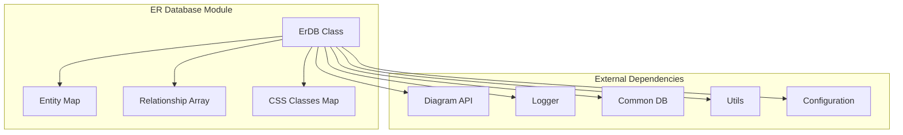
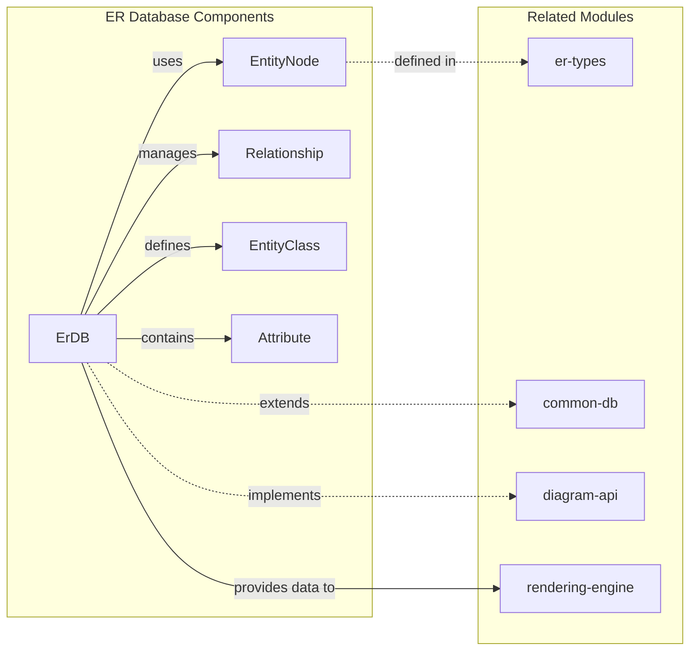
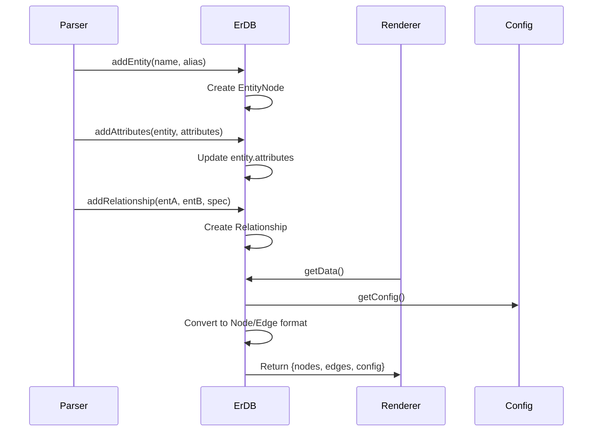
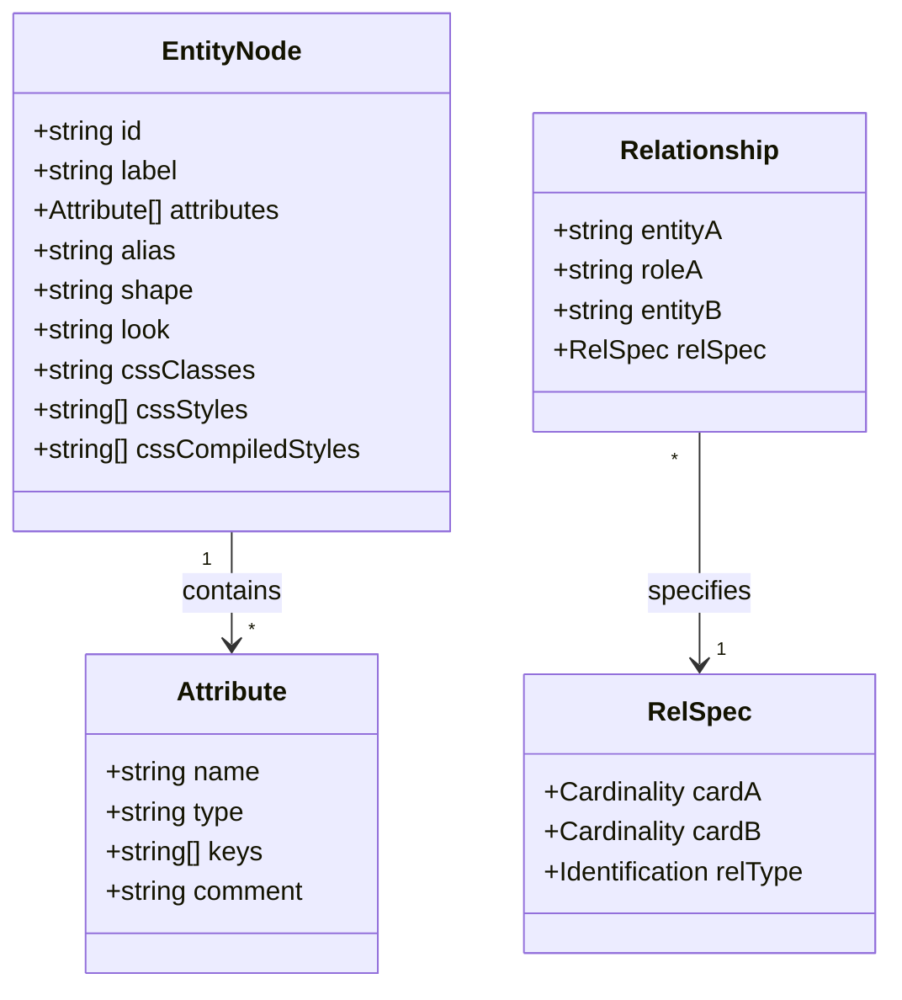
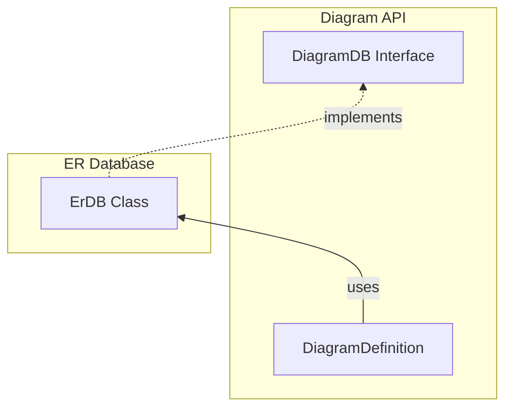
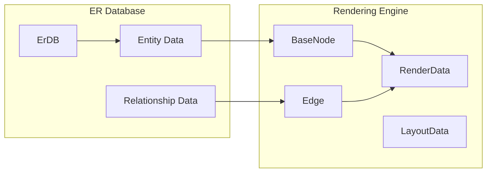
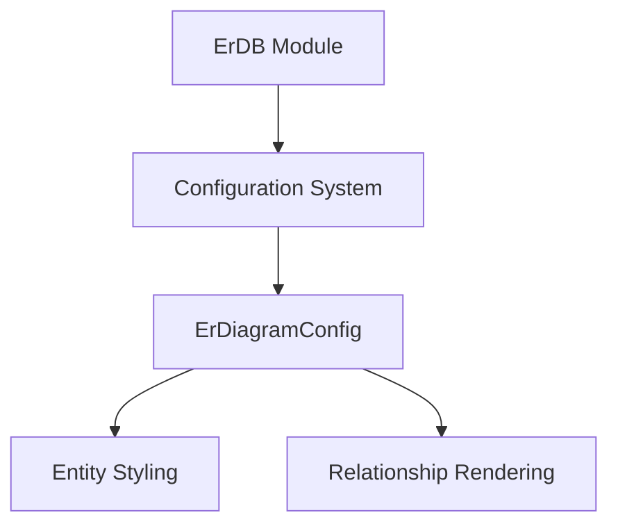
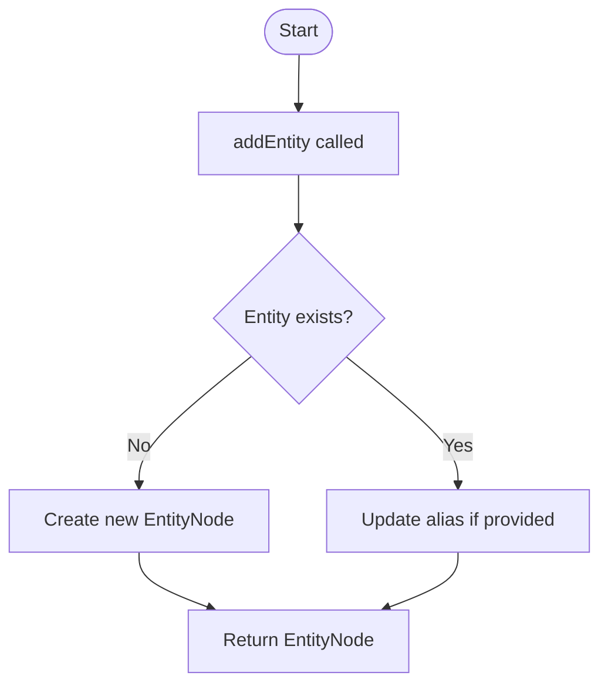
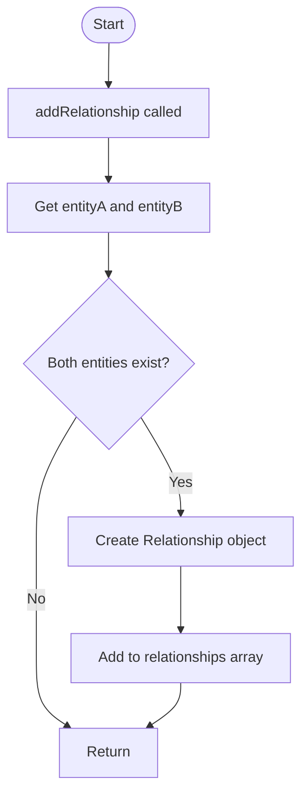
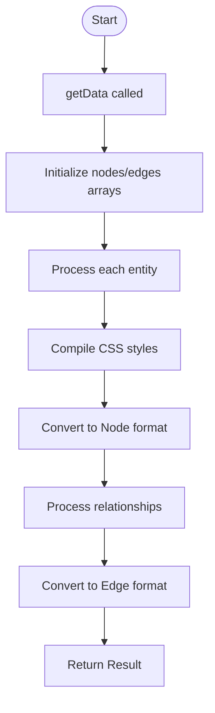

# ER Database Module Documentation

## Introduction

The ER Database module is a core component of the Mermaid diagram library that provides data management and storage capabilities for Entity-Relationship (ER) diagrams. This module implements the `ErDB` class which serves as the central data repository for ER diagram entities, relationships, and configuration settings.

## Module Overview

The ER Database module is responsible for:
- Storing and managing ER diagram entities with their attributes
- Managing relationships between entities with cardinality and identification specifications
- Handling CSS styling and theming for ER diagram elements
- Providing data access interfaces for rendering engines
- Supporting diagram configuration and accessibility features

## Architecture

### Core Architecture



### Component Relationships



## Core Components

### ErDB Class

The `ErDB` class is the main component that implements the `DiagramDB` interface. It provides comprehensive data management for ER diagrams with the following key features:

#### Data Storage
- **Entities**: Map of entity names to `EntityNode` objects
- **Relationships**: Array of relationship specifications
- **Classes**: Map of CSS class definitions for styling

#### Key Methods

**Entity Management:**
- `addEntity(name, alias)`: Creates or updates entities
- `addAttributes(entityName, attribs)`: Adds attributes to entities
- `getEntity(name)`: Retrieves specific entities
- `getEntities()`: Returns all entities

**Relationship Management:**
- `addRelationship(entA, rolA, entB, rSpec)`: Creates relationships between entities
- `getRelationships()`: Returns all relationships

**Styling and Configuration:**
- `addClass(ids, style)`: Defines CSS classes
- `setClass(ids, classNames)`: Applies classes to entities
- `addCssStyles(ids, styles)`: Adds inline styles
- `setDirection(dir)`: Sets diagram direction

**Data Export:**
- `getData()`: Converts internal data to rendering format
- `clear()`: Resets all data

## Data Flow



## Entity-Relationship Model

### Entity Structure



### Cardinality and Identification

The module supports standard ER diagram notations:

**Cardinality Types:**
- `ZERO_OR_ONE`: 0..1
- `ZERO_OR_MORE`: 0..*
- `ONE_OR_MORE`: 1..*
- `ONLY_ONE`: 1
- `MD_PARENT`: Markdown parent relationship

**Identification Types:**
- `NON_IDENTIFYING`: Dashed line relationship
- `IDENTIFYING`: Solid line relationship

## Integration with Other Modules

### Diagram API Integration

The ErDB module integrates with the [diagram-api](diagram_plugin_api.md) module through the `DiagramDB` interface:



### Rendering Engine Integration

The module provides data to the [rendering-engine](rendering_engine.md) through the `getData()` method:



### Configuration Integration

The module accesses configuration through the [mermaid-core-api](mermaid_core_api.md):



## Process Flow

### Entity Addition Process



### Relationship Addition Process



### Data Export Process



## Key Features

### 1. Entity Management
- Dynamic entity creation with unique ID generation
- Support for entity aliases
- Attribute management with type and key specifications
- CSS class and style application

### 2. Relationship Management
- Support for all standard ER cardinality types
- Identifying and non-identifying relationship types
- Role-based relationship labeling
- Automatic edge generation for rendering

### 3. Styling System
- CSS class definition and application
- Inline style support
- Compiled style caching
- Integration with Mermaid theme system

### 4. Accessibility Support
- Title and description management
- Screen reader compatibility
- Semantic HTML generation

## Usage Patterns

### Basic Entity Creation
```typescript
const erDb = new ErDB();
erDb.addEntity('Customer', 'cust');
erDb.addAttributes('Customer', [
  { name: 'id', type: 'int', keys: ['PK'] },
  { name: 'name', type: 'varchar(255)' }
]);
```

### Relationship Definition
```typescript
erDb.addRelationship('Customer', 'places', 'Order', {
  cardA: 'ONLY_ONE',
  cardB: 'ZERO_OR_MORE',
  relType: 'NON_IDENTIFYING'
});
```

### Styling Application
```typescript
erDb.addClass(['Customer'], ['fill:#f9f', 'stroke:#333']);
erDb.setClass(['Customer'], ['highlight']);
```

## Error Handling

The module implements defensive programming practices:
- Entity existence validation before relationship creation
- Graceful handling of missing entities
- Safe attribute processing with default value assignment
- CSS style validation and sanitization

## Performance Considerations

- **Map-based entity storage**: O(1) lookup performance
- **Lazy entity creation**: Entities created on-demand
- **Compiled style caching**: Reduces repeated CSS processing
- **Efficient relationship indexing**: Direct entity reference storage

## Related Documentation

- [ER Types](er-types.md) - Entity and relationship type definitions
- [ER Configuration](er-configuration.md) - Diagram-specific configuration options
- [Diagram API](diagram_plugin_api.md) - General diagram API interface
- [Rendering Engine](rendering_engine.md) - Data rendering and visualization
- [Mermaid Core API](mermaid_core_api.md) - Core configuration and utilities