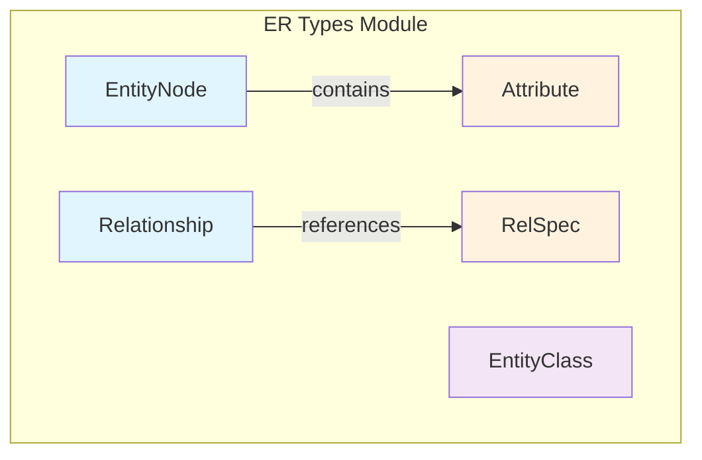
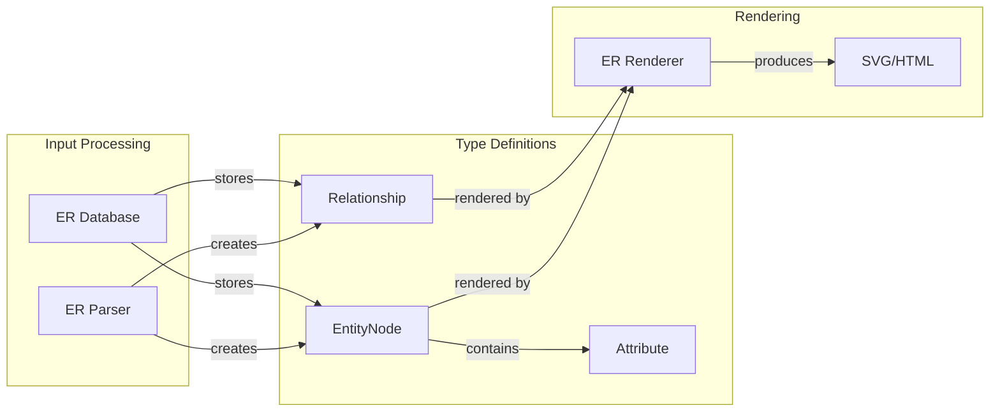
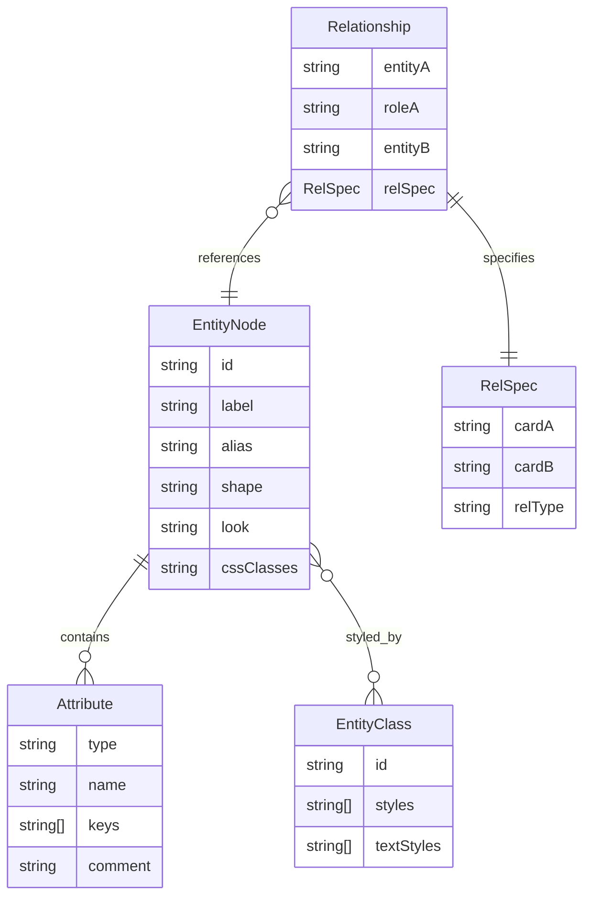
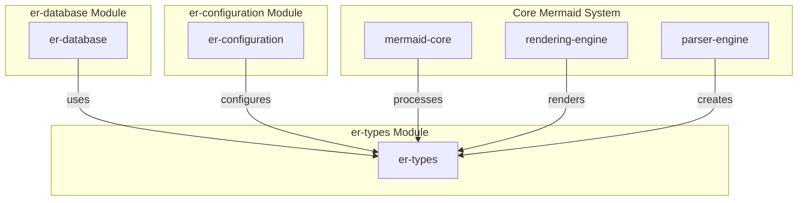
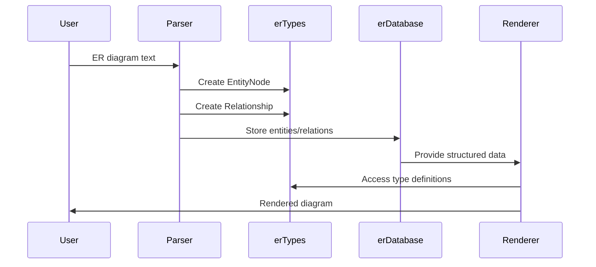

# ER Types Module Documentation

## Introduction

The er-types module defines the core type interfaces for Entity-Relationship (ER) diagrams in Mermaid. These types provide the data structures that represent entities, their attributes, and the relationships between entities in ER diagrams. The module serves as the foundation for modeling database schemas and their relationships within the Mermaid diagramming system.

## Core Components

### EntityNode Interface
The `EntityNode` interface represents an entity in an ER diagram, which typically corresponds to a table in a database. It contains all the necessary information to render and style the entity.

**Key Properties:**
- `id`: Unique identifier for the entity
- `label`: Display name of the entity
- `attributes`: Array of attributes (columns) that belong to this entity
- `alias`: Alternative name/reference for the entity
- `shape`: Visual shape representation (e.g., rectangle, rounded rectangle)
- `look`: Optional visual styling hint
- `cssClasses`: CSS classes for styling
- `cssStyles`: Array of CSS style rules
- `cssCompiledStyles`: Array of compiled CSS styles

### Attribute Interface
The `Attribute` interface defines the structure of entity attributes, representing columns in a database table.

**Key Properties:**
- `type`: Data type of the attribute (e.g., VARCHAR, INT, DATE)
- `name`: Name of the attribute/column
- `keys`: Array of key types - Primary Key (PK), Foreign Key (FK), or Unique Key (UK)
- `comment`: Descriptive comment or note about the attribute

### Relationship Interface
The `Relationship` interface models the connections between entities, representing foreign key relationships in databases.

**Key Properties:**
- `entityA`: Source entity in the relationship
- `roleA`: Role or name of the relationship from entity A's perspective
- `entityB`: Target entity in the relationship
- `relSpec`: Detailed relationship specification

### RelSpec Interface
The `RelSpec` interface provides detailed cardinality and relationship type information.

**Key Properties:**
- `cardA`: Cardinality for entity A (e.g., "1", "0..1", "1..*", "*")
- `cardB`: Cardinality for entity B
- `relType`: Type of relationship (e.g., "identifying", "non-identifying")

### EntityClass Interface
The `EntityClass` interface defines styling classes that can be applied to entities.

**Key Properties:**
- `id`: Unique identifier for the class
- `styles`: Array of CSS style properties
- `textStyles`: Array of text-specific style properties

## Architecture

### Type System Architecture



### Data Flow Architecture



## Component Relationships

### Entity-Relationship Model



## Integration with ER Diagram System

### Module Dependencies

The er-types module is integrated into the broader ER diagram system through several key dependencies:



### Data Processing Flow



## Usage Patterns

### Entity Definition
Entities are defined with their attributes and styling information:

```typescript
const entity: EntityNode = {
  id: 'user',
  label: 'User',
  alias: 'u',
  shape: 'rectangle',
  attributes: [
    {
      type: 'INT',
      name: 'id',
      keys: ['PK'],
      comment: 'Primary key'
    },
    {
      type: 'VARCHAR(255)',
      name: 'email',
      keys: ['UK'],
      comment: 'Unique email address'
    }
  ]
};
```

### Relationship Definition
Relationships specify how entities are connected:

```typescript
const relationship: Relationship = {
  entityA: 'user',
  roleA: 'has',
  entityB: 'order',
  relSpec: {
    cardA: '1',
    cardB: '*',
    relType: 'non-identifying'
  }
};
```

## Styling and Customization

The type system supports extensive styling through CSS classes and inline styles:

- **Entity-level styling**: Applied to entire entities
- **Attribute-level styling**: Applied to specific attributes
- **Relationship styling**: Applied to relationship lines and labels
- **Global theming**: Integration with Mermaid's theme system

## Related Documentation

- [er-database.md](er-database.md) - Database storage and management for ER diagrams
- [er-configuration.md](er-configuration.md) - Configuration options for ER diagrams
- [rendering-engine.md](rendering-engine.md) - Core rendering system
- [diagram_plugin_api.md](diagram_plugin_api.md) - Plugin architecture for diagram types