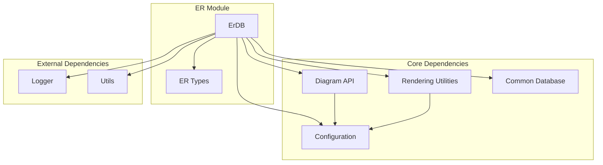
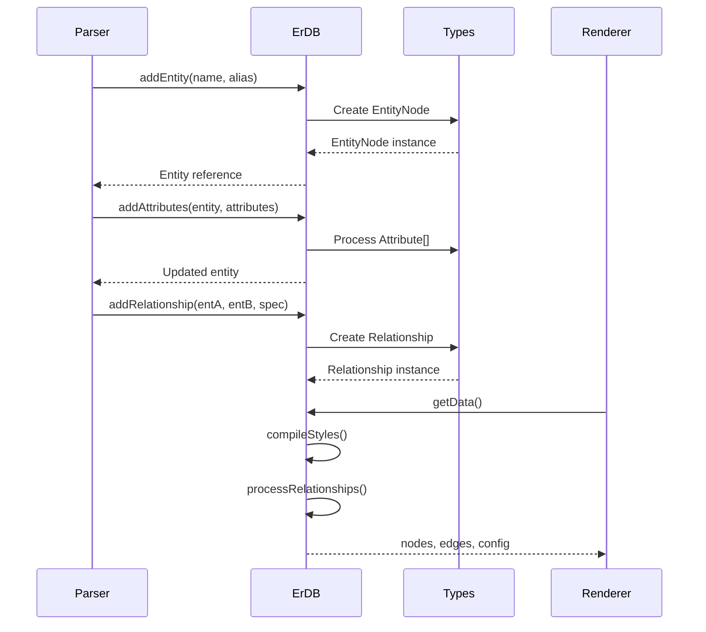

# ER (Entity-Relationship) Module Documentation

## Overview

The ER module is a specialized diagram type within the Mermaid.js library that enables the creation of Entity-Relationship diagrams. These diagrams are fundamental tools for database design and data modeling, allowing users to visualize entities, their attributes, and the relationships between them in a clear, standardized format.

## Purpose

The ER module provides:
- **Entity Management**: Creation and manipulation of entities with customizable attributes
- **Relationship Definition**: Support for various cardinality types and relationship patterns
- **Visual Customization**: Flexible styling options for entities and relationships
- **Database Design Support**: Comprehensive modeling capabilities for database schema design

## Architecture



## Core Components

### 1. ErDB (`erDb.ts`)
The main database class that manages all ER diagram data, entities, relationships, and styling information. It implements the `DiagramDB` interface and provides comprehensive CRUD operations for diagram elements.

**Key Responsibilities:**
- Entity lifecycle management (creation, retrieval, modification)
- Relationship establishment and maintenance
- CSS styling and class management
- Data compilation for rendering
- Configuration integration

For detailed documentation, see [erDb module documentation](erDb.md).

### 2. ER Types (`erTypes.ts`)
Defines the core data structures and interfaces used throughout the ER module, ensuring type safety and consistency.

**Key Interfaces:**
- `EntityNode`: Represents diagram entities with attributes and styling
- `Attribute`: Defines entity properties with keys and comments
- `Relationship`: Manages connections between entities
- `RelSpec`: Specifies relationship cardinality and type
- `EntityClass`: Handles CSS class definitions

For detailed documentation, see [erTypes module documentation](erTypes.md).

## Data Flow



## Relationship Types

The ER module supports various relationship patterns:

### Cardinality Types
- **ZERO_OR_ONE**: Optional single relationship (0..1)
- **ZERO_OR_MORE**: Optional multiple relationship (0..*)
- **ONE_OR_MORE**: Mandatory multiple relationship (1..*)
- **ONLY_ONE**: Mandatory single relationship (1..1)
- **MD_PARENT**: Parent relationship in materialized path

### Relationship Identification
- **IDENTIFYING**: Relationships that form part of the entity's identity
- **NON_IDENTIFYING**: Relationships that don't affect entity identity

## Integration with Mermaid Ecosystem

The ER module integrates seamlessly with the broader Mermaid architecture:

- **Configuration System**: Inherits from [config module](config.md) for diagram-specific settings
- **Rendering Pipeline**: Utilizes [rendering-util module](rendering-util.md) for visual output
- **Diagram API**: Implements standard interfaces from [diagram-api module](diagram-api.md)
- **Common Utilities**: Shares functionality with [common-types module](common-types.md)

## Usage Patterns

### Basic Entity Creation
```
erDiagram
    CUSTOMER {
        string name
        string email PK
    }
```

### Complex Relationships
```
erDiagram
    CUSTOMIST ||--o{ ORDER : places
    ORDER ||--|{ ORDER_ITEM : contains
    PRODUCT ||--o{ ORDER_ITEM : "ordered in"
```

### Styling and Customization
The module supports CSS class application, custom styling, and theme integration through the configuration system.

## Performance Considerations

- **Efficient Lookups**: Uses Map data structures for O(1) entity retrieval
- **Lazy Compilation**: Styles are compiled only when rendering data is requested
- **Memory Management**: Proper cleanup through clear() method prevents memory leaks

## Error Handling

The module implements robust error handling:
- Validates entity existence before relationship creation
- Graceful handling of missing attributes
- Comprehensive logging for debugging

## Future Enhancements

Potential areas for expansion:
- Enhanced cardinality notation support
- Integration with database schema generation
- Advanced layout algorithms for complex diagrams
- Support for inheritance relationships