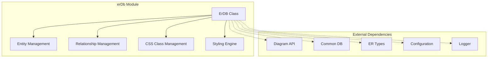
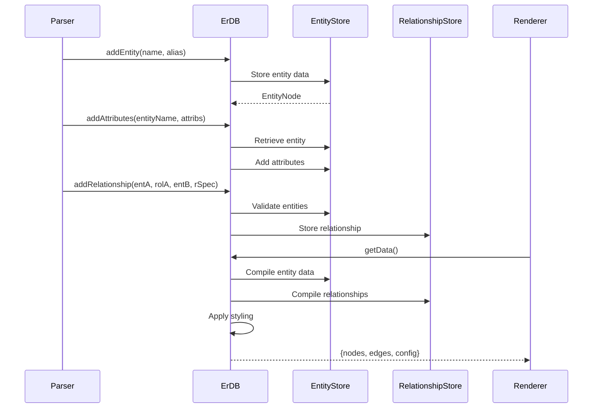
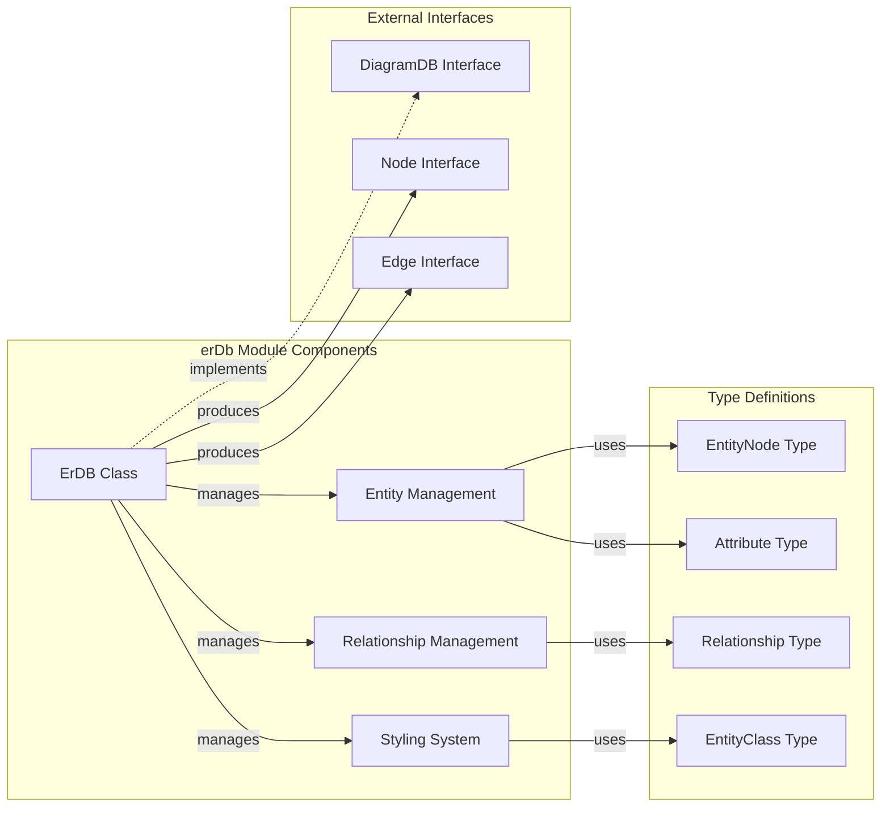
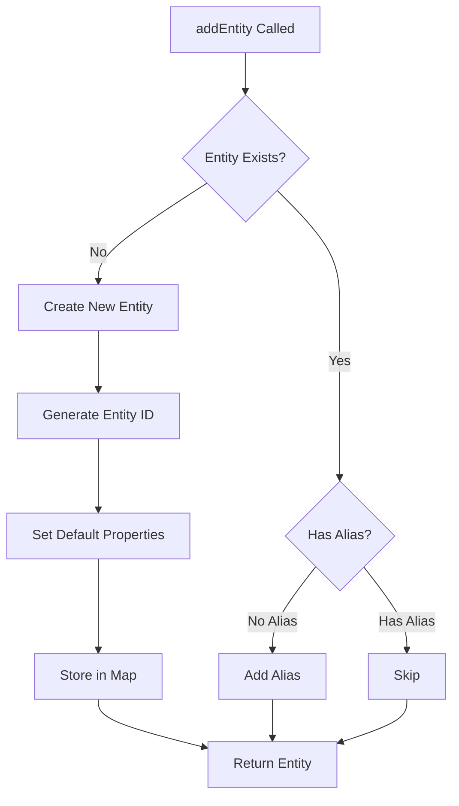
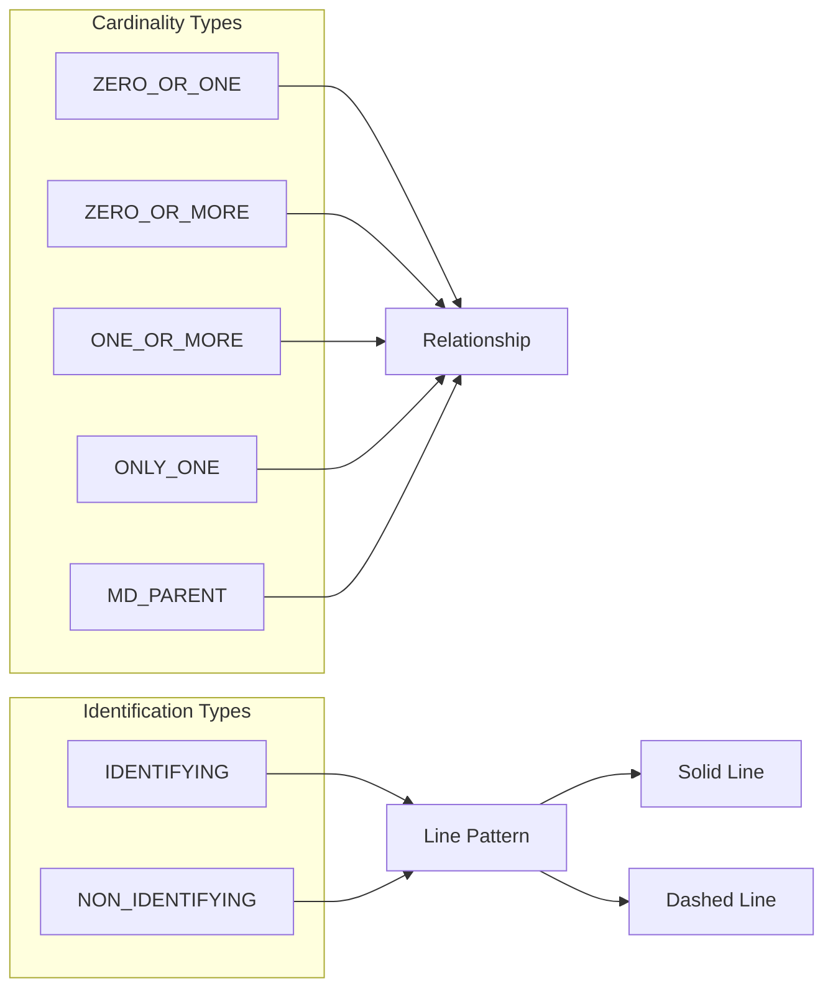
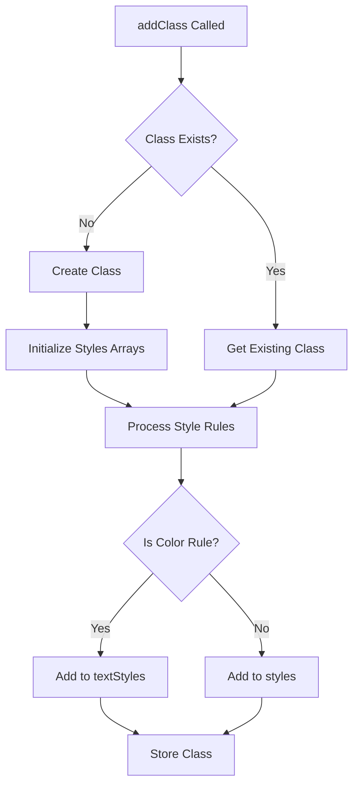
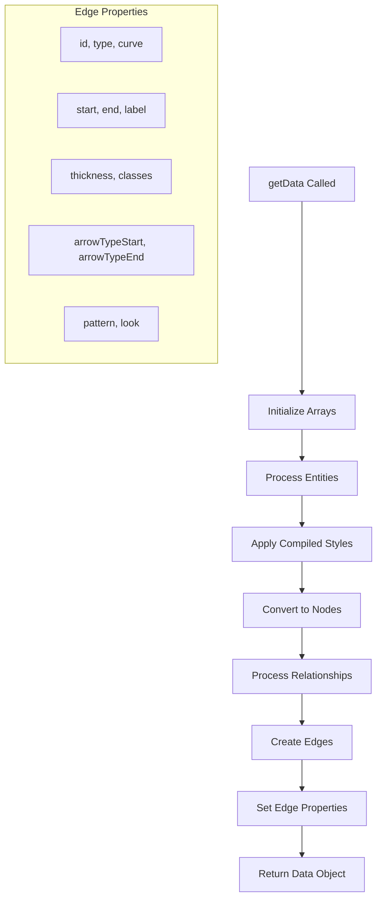
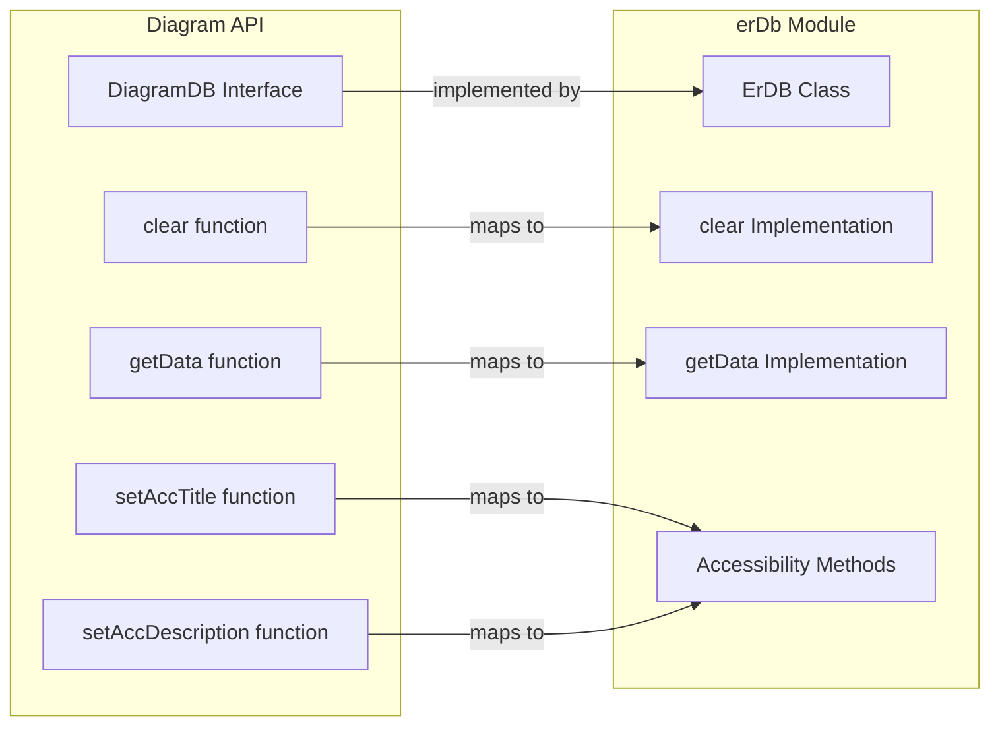

# erDb Module Documentation

## Introduction

The erDb module is a core component of the Mermaid.js library that provides Entity-Relationship (ER) diagram functionality. It implements the database layer for ER diagrams, managing entities, attributes, relationships, and styling information. This module serves as the central data repository and processing engine for ER diagram rendering within the Mermaid ecosystem.

## Architecture Overview

The erDb module follows a clean architecture pattern with clear separation of concerns:



## Core Components

### ErDB Class

The `ErDB` class is the main implementation of the `DiagramDB` interface, serving as the central data manager for ER diagrams. It provides comprehensive functionality for entity management, relationship handling, and styling operations.

#### Key Responsibilities:
- Entity lifecycle management (creation, storage, retrieval)
- Attribute management and association with entities
- Relationship definition and validation
- CSS class and styling management
- Data compilation for rendering

#### Core Properties:
```typescript
private entities = new Map<string, EntityNode>()
private relationships: Relationship[] = []
private classes = new Map<string, EntityClass>()
private direction = 'TB'
```

## Data Flow Architecture



## Component Relationships



## Entity Management System

### Entity Creation and Storage

The entity management system provides robust functionality for creating and managing ER diagram entities:



### Entity Properties

Each entity maintains the following properties:
- **id**: Unique identifier for rendering
- **label**: Display name
- **attributes**: Array of associated attributes
- **alias**: Optional alias for referencing
- **shape**: Visual representation type
- **look**: Visual styling theme
- **cssClasses**: CSS class assignments
- **cssStyles**: Inline style definitions
- **cssCompiledStyles**: Computed final styles

## Relationship Management

### Relationship Types and Cardinality

The module supports comprehensive relationship modeling with various cardinality types:



### Relationship Processing

Relationships are processed with the following validation and storage logic:

1. **Entity Validation**: Both entities must exist in the system
2. **Relationship Creation**: Build relationship object with roles and specifications
3. **Storage**: Add to relationships array for rendering
4. **Edge Generation**: Convert to rendering edges with appropriate styling

## Styling and CSS Management

### CSS Class System

The styling system provides flexible CSS class management:



### Style Compilation

The `getCompiledStyles` method processes CSS classes to create final styling:

1. **Class Resolution**: Look up each CSS class by name
2. **Style Aggregation**: Combine all style rules
3. **Text Style Processing**: Handle color-specific rules
4. **Trimming**: Clean up whitespace from style definitions

## Data Compilation for Rendering

### Node and Edge Generation

The `getData()` method transforms internal data structures into rendering-ready format:



### Edge Configuration

Edges are configured with the following properties:
- **Visual**: curve, thickness, pattern (solid/dashed)
- **Semantic**: arrow types based on cardinality
- **Styling**: CSS classes and themes
- **Labeling**: relationship roles and positioning

## Integration with Mermaid Ecosystem

### Interface Implementation

The ErDB class implements the `DiagramDB` interface, ensuring compatibility with the broader Mermaid system:



### Configuration Integration

The module integrates with Mermaid's configuration system:
- **Global Config**: Access through `getConfig()`
- **Diagram-Specific**: ER-specific configuration via `getConfig().er`
- **Runtime Styling**: Dynamic theme and look application

## Error Handling and Logging

### Logging Strategy

The module implements comprehensive logging using Mermaid's logger:
- **Entity Operations**: Log entity creation and updates
- **Attribute Addition**: Track attribute associations
- **Relationship Creation**: Monitor relationship establishment
- **Debug Information**: Detailed operation tracking

### Error Prevention

Built-in validation prevents common errors:
- **Entity Existence**: Check before relationship creation
- **Null Safety**: Handle undefined entities gracefully
- **Style Validation**: Process CSS rules safely

## Performance Considerations

### Data Structure Optimization

- **Map-based Storage**: O(1) entity lookup by name
- **Array Relationships**: Efficient iteration for rendering
- **Lazy Compilation**: Styles compiled only when needed

### Memory Management

- **Clear Method**: Complete cleanup of all data structures
- **Binding Optimization**: Method binding in constructor
- **Reference Management**: Proper object lifecycle handling

## Usage Patterns

### Basic Entity Creation

```typescript
const erDb = new ErDB()
erDb.addEntity('User', 'U')
erDb.addAttributes('User', [
  { name: 'id', type: 'number', keys: ['PK'] },
  { name: 'email', type: 'string' }
])
```

### Relationship Definition

```typescript
erDb.addRelationship(
  'User',
  'has',
  'Order',
  {
    cardA: 'ONLY_ONE',
    cardB: 'ZERO_OR_MORE',
    relType: 'IDENTIFYING'
  }
)
```

### Styling Application

```typescript
erDb.addClass(['entity1'], ['fill:#f9f', 'stroke:#333'])
erDb.setClass(['entity1'], ['highlighted'])
```

## Dependencies

### Internal Dependencies

- **[commonDb](commonDb.md)**: Shared database functionality
- **[erTypes](erTypes.md)**: Type definitions for ER diagrams
- **[diagramAPI](diagramAPI.md)**: Core diagram API integration
- **[rendering-util](rendering-util.md)**: Rendering data structures

### External Dependencies

- **Configuration System**: Global Mermaid configuration
- **Logger**: Centralized logging infrastructure
- **Utils**: Utility functions for ID generation

## Extension Points

### Custom Cardinality Types

The module can be extended with additional cardinality types by modifying the internal `Cardinality` enum.

### Styling Extensions

CSS class management can be enhanced with:
- Additional style rule processors
- Theme-specific styling
- Dynamic style generation

### Relationship Validation

Custom relationship validation rules can be added to ensure data model integrity.

## Testing Considerations

### Unit Testing Focus Areas

- Entity creation and management
- Attribute association logic
- Relationship validation
- Style compilation
- Data export functionality

### Integration Testing

- Parser integration
- Renderer compatibility
- Configuration system integration
- Accessibility features

This comprehensive documentation provides a complete understanding of the erDb module's architecture, functionality, and integration within the Mermaid.js ecosystem.