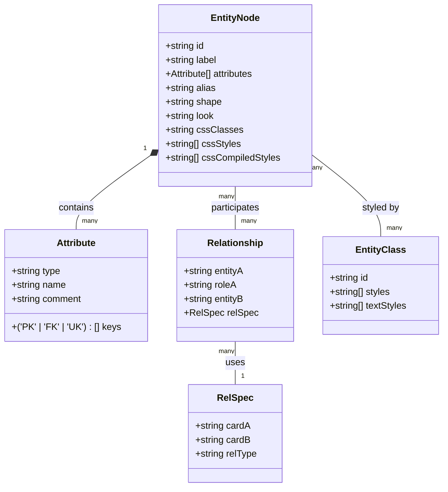
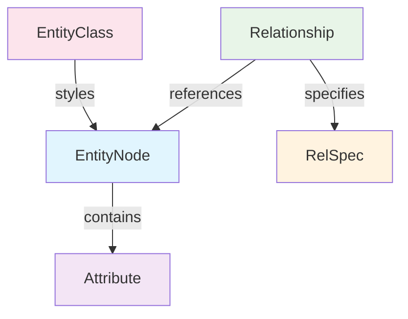
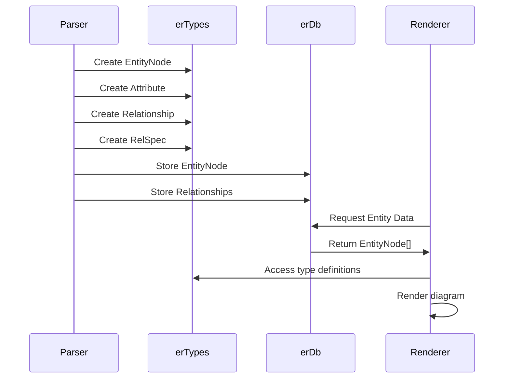
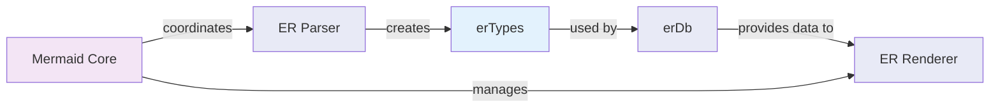

# erTypes Module Documentation

## Introduction

The `erTypes` module defines the core type interfaces for Entity-Relationship (ER) diagrams in Mermaid. These types provide the structural foundation for representing entities, their attributes, and the relationships between them in database modeling diagrams. The module serves as the type contract between the ER diagram parser, database layer, and rendering system.

## Module Architecture

### Core Components Overview

The erTypes module consists of five primary interfaces that work together to model ER diagram structures:



### Component Relationships



## Detailed Component Documentation

### EntityNode Interface

The `EntityNode` interface represents a complete entity in an ER diagram, serving as the primary container for entity data.

**Properties:**
- `id`: Unique identifier for the entity
- `label`: Display name of the entity
- `attributes`: Array of Attribute objects defining the entity's properties
- `alias`: Alternative name/reference for the entity
- `shape`: Visual representation shape (e.g., rectangle, ellipse)
- `look`: Optional visual styling identifier
- `cssClasses`: Optional CSS class names for styling
- `cssStyles`: Optional array of raw CSS style rules
- `cssCompiledStyles`: Optional array of processed CSS styles

**Usage Context:**
EntityNode instances are created by the ER diagram parser and stored in the [erDb](erDb.md) database layer. They serve as the primary data structure passed to the rendering engine for visual representation.

### Attribute Interface

The `Attribute` interface defines the properties of an entity's attributes, including data types and constraints.

**Properties:**
- `type`: Data type of the attribute (e.g., VARCHAR, INT, DATE)
- `name`: Name of the attribute/column
- `keys`: Array of key constraints (Primary Key, Foreign Key, Unique Key)
- `comment`: Optional description or documentation

**Key Constraints:**
The `keys` property uses a union type to ensure only valid database constraint types are specified:
- `'PK'`: Primary Key
- `'FK'`: Foreign Key  
- `'UK'`: Unique Key

### Relationship Interface

The `Relationship` interface models the connections between entities in the database schema.

**Properties:**
- `entityA`: ID of the first entity in the relationship
- `roleA`: Role or name of the relationship from entityA's perspective
- `entityB`: ID of the second entity in the relationship
- `relSpec`: Detailed relationship specification

**Relationship Modeling:**
Relationships are directional and include role names that describe the nature of the connection from each entity's perspective.

### RelSpec Interface

The `RelSpec` interface provides detailed cardinality and relationship type information.

**Properties:**
- `cardA`: Cardinality for entityA (e.g., "1", "N", "0..1", "1..N")
- `cardB`: Cardinality for entityB
- `relType`: Type of relationship (e.g., "identifying", "non-identifying")

**Cardinality Examples:**
- `"1"`: Exactly one
- `"N"`: Many
- `"0..1"`: Zero or one
- `"1..N"`: One to many

### EntityClass Interface

The `EntityClass` interface defines styling classes that can be applied to entities for consistent visual theming.

**Properties:**
- `id`: Unique identifier for the style class
- `styles`: Array of CSS style properties
- `textStyles`: Array of text-specific styling properties

## Data Flow Architecture



## Integration with Mermaid System

### Module Dependencies



### Related Modules

- **[erDb](erDb.md)**: Database layer that stores and manages EntityNode and Relationship instances
- **[config](config.md)**: Configuration system that may reference ErDiagramConfig for diagram-specific settings
- **[diagram-api](diagram-api.md)**: Core diagram API that coordinates ER diagram processing
- **[rendering-util](rendering-util.md)**: Rendering utilities that consume EntityNode data for visualization

## Usage Examples

### Entity with Attributes

```typescript
const entity: EntityNode = {
  id: "user",
  label: "User",
  alias: "u",
  shape: "rectangle",
  attributes: [
    {
      type: "INT",
      name: "id",
      keys: ["PK"],
      comment: "Primary identifier"
    },
    {
      type: "VARCHAR(255)",
      name: "email",
      keys: ["UK"],
      comment: "User email address"
    }
  ]
};
```

### Relationship Definition

```typescript
const relationship: Relationship = {
  entityA: "user",
  roleA: "has",
  entityB: "order",
  relSpec: {
    cardA: "1",
    cardB: "N",
    relType: "non-identifying"
  }
};
```

## Type Safety and Validation

The erTypes module provides strong typing for ER diagram structures:

- **Compile-time validation**: TypeScript ensures correct property types and required fields
- **Constraint validation**: Key constraints are limited to valid database constraint types
- **Relationship integrity**: Entity references in relationships must exist in the diagram

## Extension Points

The interface design allows for future enhancements:

- Additional key constraint types can be added to the union type
- New relationship types can be defined in `relType`
- Styling properties can be extended in `EntityNode` and `EntityClass`

## Best Practices

1. **Entity Naming**: Use consistent, descriptive IDs and labels
2. **Attribute Design**: Include appropriate key constraints and data types
3. **Relationship Modeling**: Define clear cardinality and role names
4. **Styling**: Use EntityClass for consistent theming across multiple entities
5. **Documentation**: Leverage the comment field in attributes for schema documentation