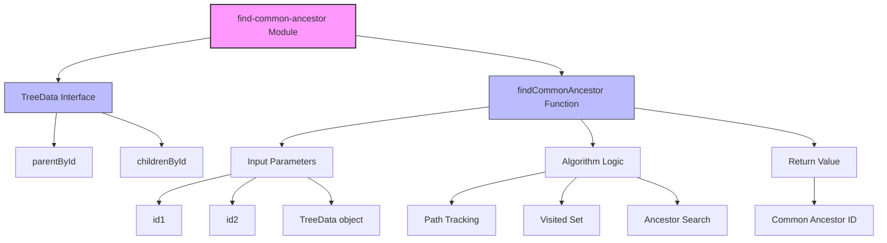
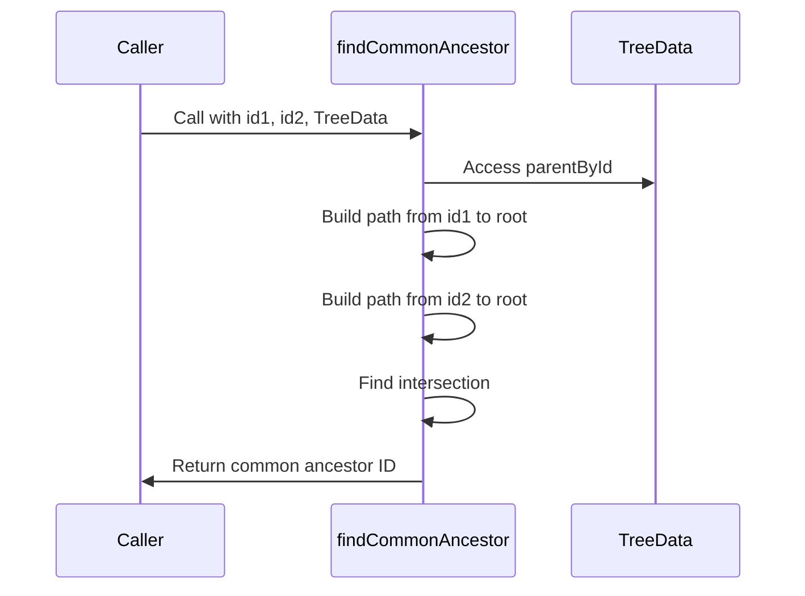
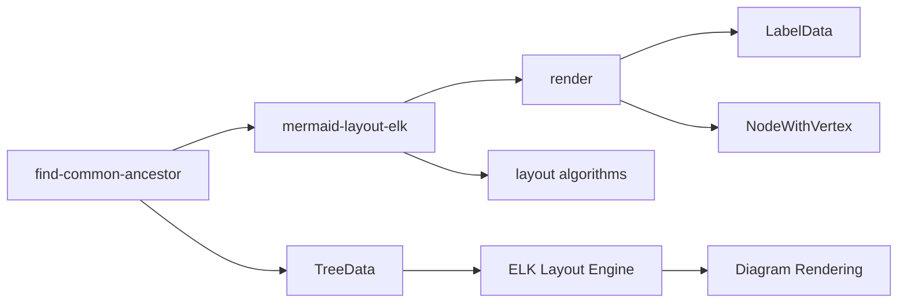

# find-common-ancestor Module Documentation

## Overview

The `find-common-ancestor` module is a specialized utility within the mermaid-layout-elk package that provides tree traversal algorithms for finding common ancestor nodes in hierarchical graph structures. This module is essential for layout calculations in complex diagram rendering, particularly when dealing with nested or clustered node relationships.

## Purpose and Core Functionality

The module implements a fundamental graph algorithm that finds the lowest common ancestor (LCA) between two nodes in a tree structure. This functionality is critical for:

- **Layout Optimization**: Determining optimal positioning of nodes and edges in complex diagrams
- **Hierarchy Resolution**: Understanding parent-child relationships in nested graph structures
- **Edge Routing**: Calculating efficient paths for connections between nodes
- **Cluster Management**: Managing grouped or clustered nodes in architectural diagrams

## Architecture

### Component Structure



### Data Flow



## Core Components

### TreeData Interface

The `TreeData` interface defines the structure for representing hierarchical relationships:

```typescript
interface TreeData {
  parentById: Record<string, string>;     // Maps node ID to parent ID
  childrenById: Record<string, string[]>; // Maps node ID to children IDs
}
```

**Properties:**
- `parentById`: A dictionary mapping each node to its immediate parent
- `childrenById`: A dictionary mapping each node to its children (bidirectional relationship)

### findCommonAncestor Function

The core algorithm that implements the LCA (Lowest Common Ancestor) search:

```typescript
findCommonAncestor(id1: string, id2: string, TreeData): string
```

**Parameters:**
- `id1`: The first node identifier
- `id2`: The second node identifier
- `TreeData`: The hierarchical structure containing parent-child relationships

**Returns:**
- The ID of the lowest common ancestor node, or 'root' if no common ancestor exists

**Algorithm Logic:**
1. **Edge Case Handling**: If both nodes are the same, return their parent
2. **Path Building**: Trace the path from `id1` to the root, marking visited nodes
3. **Intersection Search**: Trace the path from `id2` to the root, finding the first intersection
4. **Fallback**: Return 'root' if no common ancestor is found

## Integration with mermaid-layout-elk

### Module Dependencies



The `find-common-ancestor` module is specifically designed to work with the ELK (Eclipse Layout Kernel) layout engine integration in Mermaid. It provides the necessary algorithms for:

- **Hierarchical Layout**: Managing nested node structures in architectural diagrams
- **Edge Routing**: Calculating optimal paths for connections
- **Cluster Positioning**: Determining relative positions of node groups

### Usage Context

The module is typically used in scenarios where:

1. **Complex Diagrams**: Multi-level hierarchical structures need layout optimization
2. **Edge Management**: Connection lines between distant nodes require routing calculations
3. **Cluster Visualization**: Grouped nodes need proper positioning and spacing
4. **Interactive Features**: User interactions require dynamic layout adjustments

## Performance Considerations

### Time Complexity
- **Best Case**: O(h) where h is the height of the tree
- **Worst Case**: O(h₁ + h₂) where h₁ and h₂ are the heights of the paths from id1 and id2 to root

### Space Complexity
- **O(h)** for the visited set, where h is the maximum path length

### Optimization Strategies
- The algorithm uses a Set for O(1) lookup time when checking visited nodes
- Early termination when the common ancestor is found
- Minimal memory footprint with only essential data structures

## Error Handling and Edge Cases

### Self-Reference Handling
When `id1 === id2`, the function returns the parent of the node rather than the node itself, which is useful for certain layout calculations.

### Missing Parent Handling
If a node doesn't have a parent in the `parentById` mapping, the algorithm gracefully handles this by treating it as a root node.

### Root Node Fallback
When no common ancestor is found, the function returns 'root' as a safe fallback value.

## Relationship to Other Modules

### Direct Dependencies
- **[mermaid-layout-elk](mermaid-layout-elk.md)**: Parent module that provides ELK layout integration
- **[render](mermaid-layout-elk.md)**: Sibling module that handles rendering operations

### Indirect Dependencies
- **[core-mermaid](core-mermaid.md)**: Core Mermaid functionality that utilizes layout algorithms
- **[rendering-util](rendering-util.md)**: Shared rendering utilities that may use ancestor calculations
- **[diagram-api](diagram-api.md)**: API layer that orchestrates diagram processing

## Example Usage

```typescript
import { findCommonAncestor, TreeData } from './find-common-ancestor';

const treeData: TreeData = {
  parentById: {
    'A': 'root',
    'B': 'A',
    'C': 'A',
    'D': 'B',
    'E': 'B'
  },
  childrenById: {
    'root': ['A'],
    'A': ['B', 'C'],
    'B': ['D', 'E'],
    'C': [],
    'D': [],
    'E': []
  }
};

const commonAncestor = findCommonAncestor('D', 'E', treeData);
// Returns: 'B' (the common parent of D and E)

const commonAncestor2 = findCommonAncestor('D', 'C', treeData);
// Returns: 'A' (the common grandparent)
```

## Future Enhancements

Potential improvements to the module could include:

1. **Multiple Node Support**: Extending the algorithm to find common ancestors for more than two nodes
2. **Distance Calculation**: Returning the distance from each node to the common ancestor
3. **Path Information**: Providing the actual paths from each node to the common ancestor
4. **Performance Optimization**: Implementing more efficient algorithms for specific tree structures

## Conclusion

The `find-common-ancestor` module provides a crucial algorithmic foundation for hierarchical layout management in the Mermaid diagramming system. Its efficient implementation and clean interface make it an essential component for complex diagram rendering, particularly when integrated with the ELK layout engine for sophisticated architectural and structural visualizations.