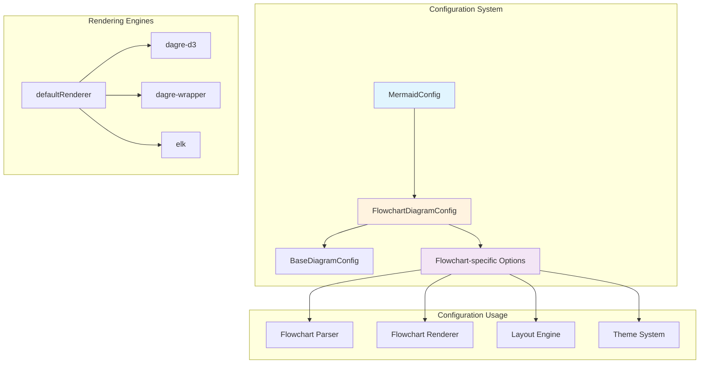
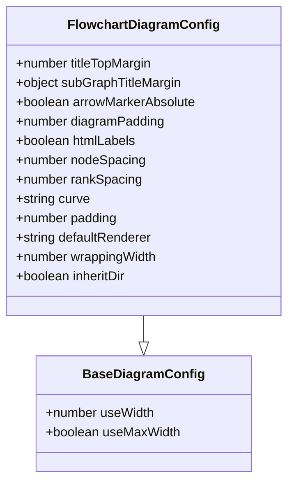
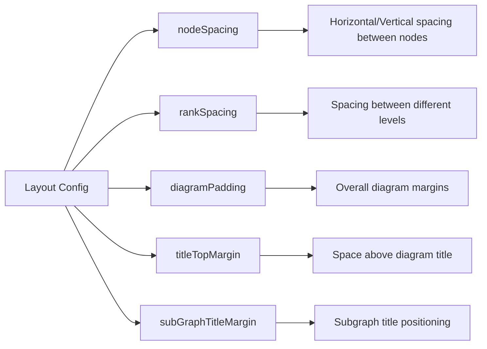
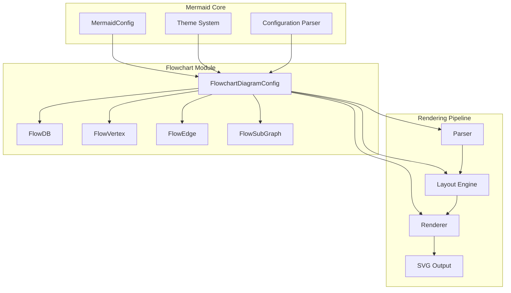
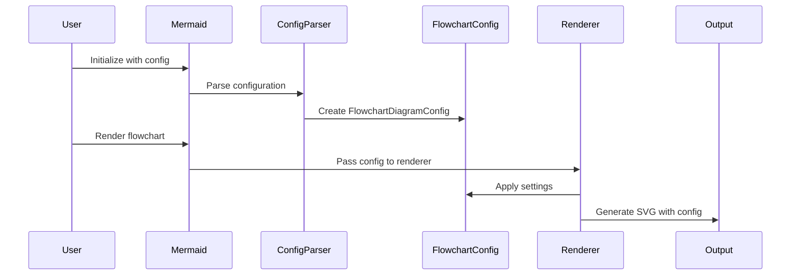
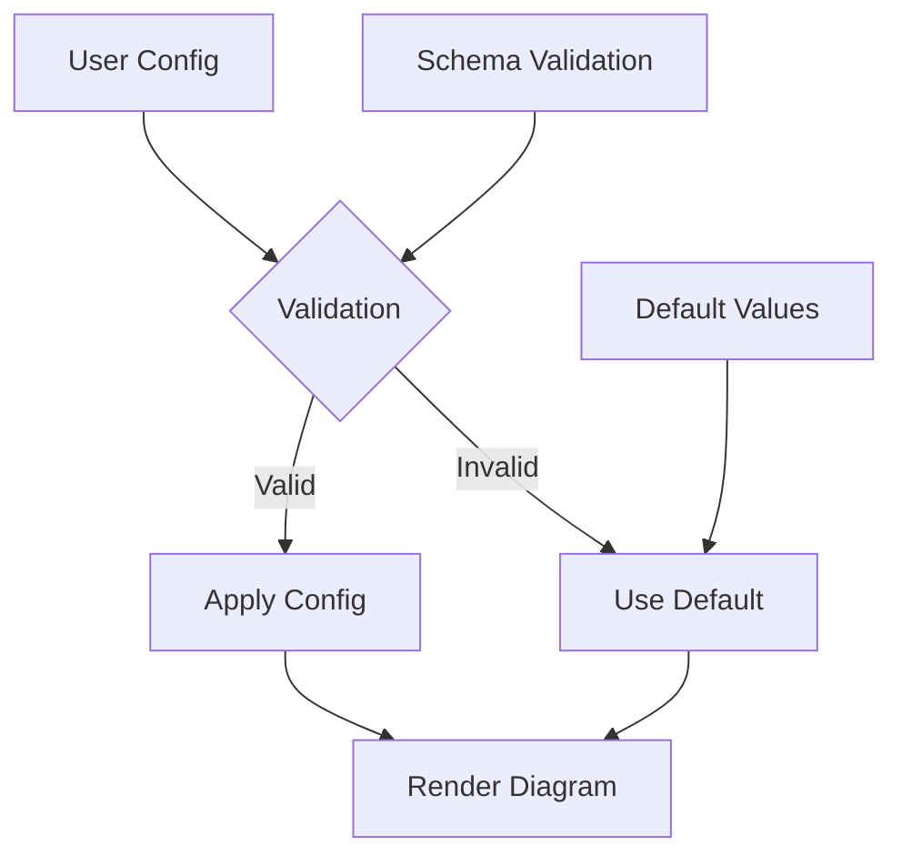

# Flowchart Configuration Module

## Introduction

The flowchart-configuration module defines the configuration interface for flowchart diagrams in Mermaid. It provides a comprehensive set of options that control the appearance, layout, and rendering behavior of flowchart diagrams, from node spacing and curve styles to rendering engine selection and label formatting.

## Architecture Overview

The flowchart configuration system is built around the `FlowchartDiagramConfig` interface, which extends the base diagram configuration and provides flowchart-specific settings. This configuration is integrated into the main Mermaid configuration system and used by the flowchart rendering engine to control diagram appearance and behavior.



## Core Components

### FlowchartDiagramConfig Interface

The `FlowchartDiagramConfig` interface is the central configuration object for flowchart diagrams. It extends `BaseDiagramConfig` and provides flowchart-specific configuration options.

**Key Properties:**

- **Layout Control**: `nodeSpacing`, `rankSpacing`, `diagramPadding`
- **Rendering Control**: `defaultRenderer`, `curve`, `htmlLabels`
- **Text Formatting**: `wrappingWidth`, `padding`, `titleTopMargin`
- **Subgraph Management**: `subGraphTitleMargin`, `inheritDir`



## Configuration Categories

### 1. Layout and Spacing Configuration

Controls the spatial arrangement of flowchart elements:



### 2. Rendering Engine Configuration

Determines which rendering engine is used:

- **`defaultRenderer`**: Selects between 'dagre-d3', 'dagre-wrapper', or 'elk'
- **`curve`**: Controls curve interpolation for connections
- **`htmlLabels`**: Enables/disables HTML label rendering

### 3. Text and Label Configuration

Manages text rendering and formatting:

- **`wrappingWidth`**: Maximum width for text before wrapping
- **`padding`**: Space between labels and shapes
- **`htmlLabels`**: HTML vs plain text rendering

### 4. Subgraph Configuration

Controls subgraph (cluster) behavior:

- **`subGraphTitleMargin`**: Top/bottom margins for subgraph titles
- **`inheritDir`**: Whether subgraphs inherit global direction

## Integration with Mermaid System

The flowchart configuration integrates with the broader Mermaid ecosystem:



## Configuration Flow

The configuration flows through the system as follows:



## Related Modules

The flowchart configuration module interacts with several other modules:

- **[diagram-flowchart](diagram-flowchart.md)**: Main flowchart diagram implementation
- **[mermaid-core-api](mermaid-core-api.md)**: Core configuration system
- **[rendering-engine](rendering-engine.md)**: Rendering infrastructure
- **[theme-system](theme-system.md)**: Theme and styling system

## Usage Examples

### Basic Configuration

```javascript
mermaid.initialize({
  flowchart: {
    nodeSpacing: 50,
    rankSpacing: 80,
    curve: 'basis',
    defaultRenderer: 'dagre-wrapper'
  }
});
```

### Advanced Configuration

```javascript
mermaid.initialize({
  flowchart: {
    titleTopMargin: 25,
    subGraphTitleMargin: { top: 10, bottom: 5 },
    diagramPadding: 20,
    htmlLabels: true,
    nodeSpacing: 60,
    rankSpacing: 100,
    curve: 'cardinal',
    padding: 15,
    defaultRenderer: 'elk',
    wrappingWidth: 200,
    inheritDir: true
  }
});
```

## Configuration Validation

The configuration system validates settings and provides defaults:



## Performance Considerations

Different configuration options can impact rendering performance:

- **`defaultRenderer`**: 'elk' may be slower for large diagrams but produces better layouts
- **`curve`**: Complex curves (catmullRom, cardinal) require more computation
- **`htmlLabels`**: HTML rendering is slower than plain text
- **`nodeSpacing`/`rankSpacing`**: Larger values increase diagram size and rendering time

## Best Practices

1. **Choose appropriate renderer**: Use 'dagre-wrapper' for most cases, 'elk' for complex layouts
2. **Optimize spacing**: Balance between readability and diagram size
3. **Use consistent curves**: Stick to one curve type for visual consistency
4. **Consider HTML labels**: Enable only when formatting is needed
5. **Test with inheritDir**: Useful for maintaining consistent subgraph directions

## Migration and Compatibility

The configuration system maintains backward compatibility while allowing for new features:

- Legacy configurations are automatically converted
- New options have sensible defaults
- Deprecation warnings guide users to new options
- Version-specific configuration validation ensures compatibility