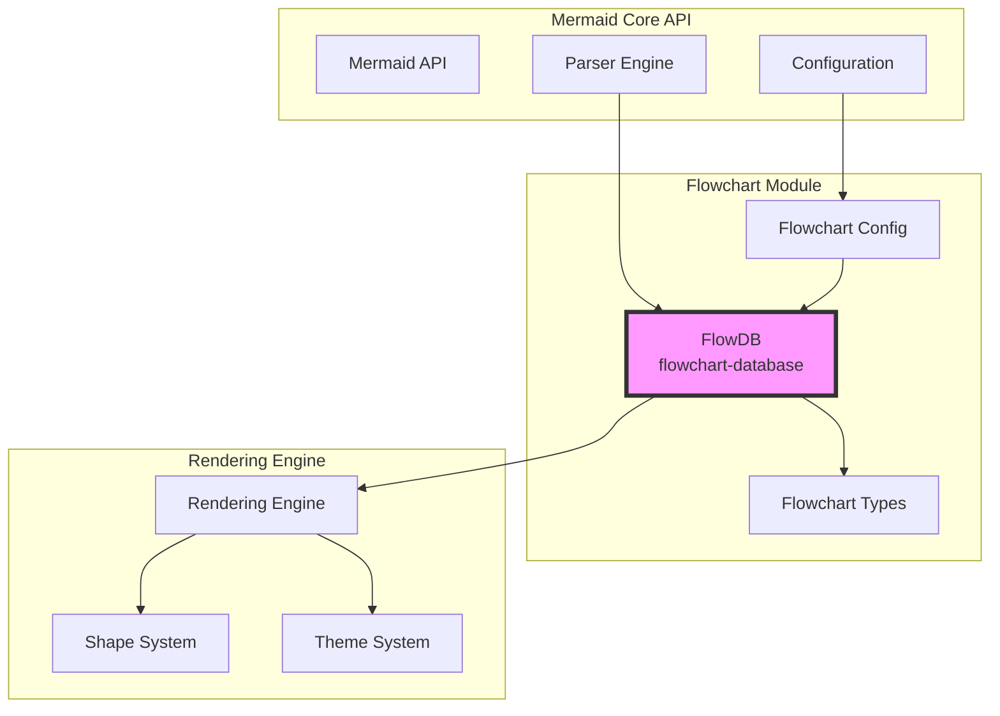
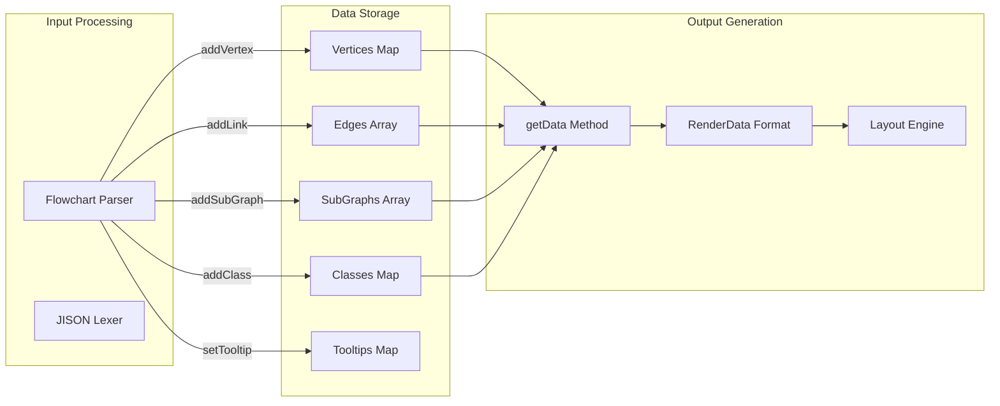
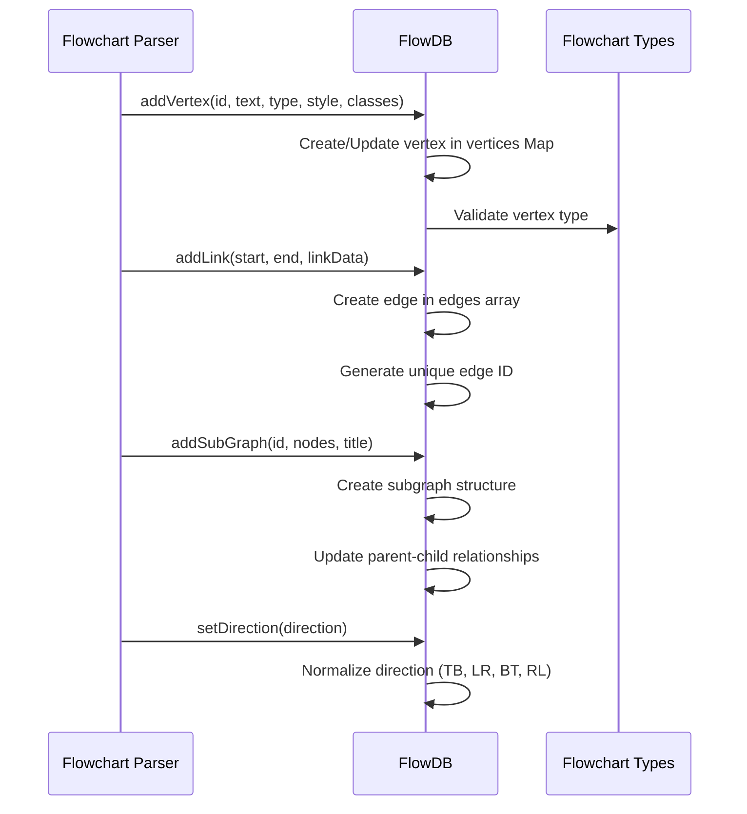
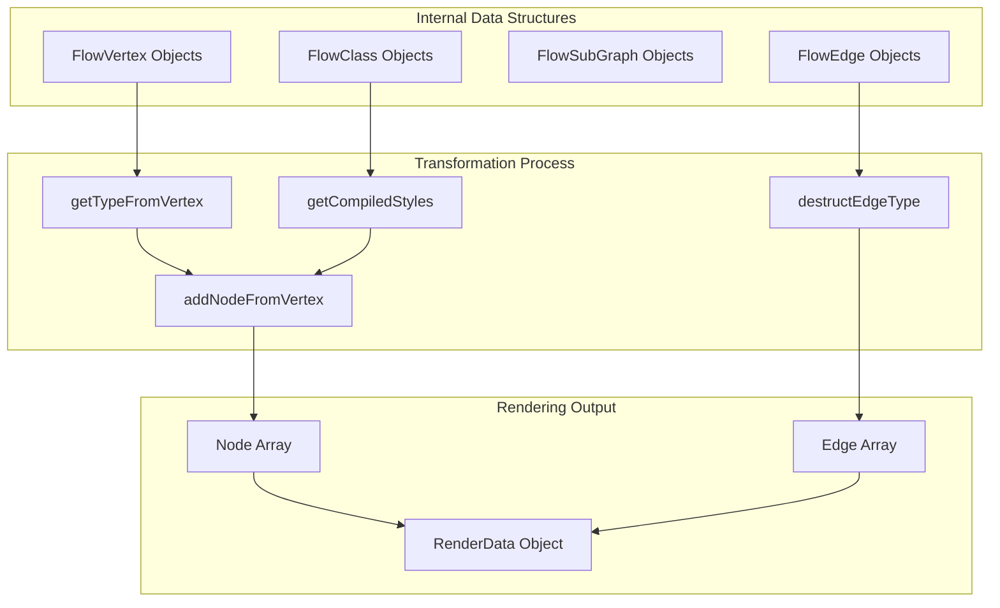
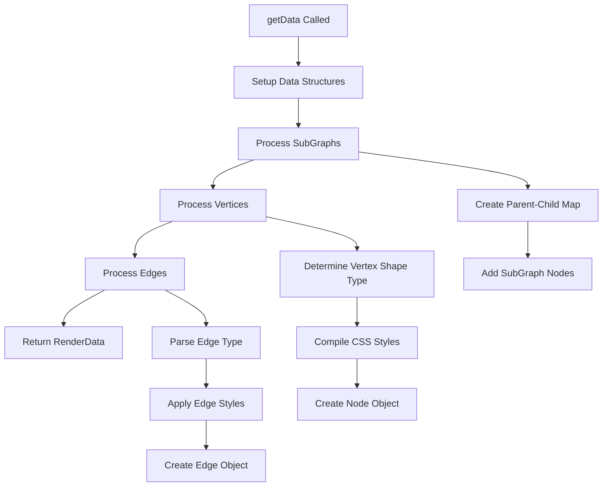

# Flowchart Database Module Documentation

## Introduction

The flowchart-database module is a core component of the Mermaid diagramming library that provides data management and storage capabilities for flowchart diagrams. It implements the `FlowDB` class, which serves as the central database for managing flowchart elements including vertices (nodes), edges (connections), subgraphs, and styling information.

This module acts as the bridge between the flowchart parser and the rendering engine, maintaining the complete state of a flowchart diagram throughout its lifecycle from parsing to rendering.

## Architecture Overview

The flowchart-database module is positioned within the Mermaid architecture as follows:



## Core Components

### FlowDB Class

The `FlowDB` class is the primary component of this module, implementing the `DiagramDB` interface. It provides comprehensive data management for flowchart diagrams with the following key responsibilities:

- **Vertex Management**: Store and manage flowchart nodes with their properties, styles, and metadata
- **Edge Management**: Handle connections between nodes with various arrow types and styles
- **Subgraph Management**: Support hierarchical diagram structures with nested subgraphs
- **Class Management**: Manage CSS-like styling classes for diagram elements
- **Tooltip and Interaction**: Handle tooltips, click events, and user interactions
- **Data Transformation**: Convert internal representation to rendering-ready format

## Data Flow Architecture



## Component Interactions

### Parser Integration

The FlowDB module integrates with the parser through several key methods:



### Rendering Integration

The module transforms internal data structures into rendering-compatible format:



## Key Features and Capabilities

### 1. Vertex Management

The module supports various vertex types and properties:

- **Shape Types**: square, round, ellipse, and custom shapes
- **Styling**: CSS-like styles and classes
- **Metadata**: Support for YAML-based metadata including icons, images, and positioning
- **Interactions**: Links, click events, and tooltips
- **Text Processing**: Sanitization and quote handling

### 2. Edge Management

Comprehensive edge handling with:

- **Arrow Types**: Multiple arrow styles (open, point, cross, circle)
- **Stroke Styles**: Normal, thick, dotted, invisible
- **Edge Metadata**: Animation, curve interpolation, custom styling
- **Multi-edges**: Support for multiple edges between nodes
- **Edge Limits**: Configurable maximum edge count for performance

### 3. Subgraph Support

Hierarchical diagram support through:

- **Nested Structures**: Support for subgraphs within subgraphs
- **Direction Inheritance**: Subgraphs can inherit parent direction
- **Node Management**: Automatic node uniqueness across subgraphs
- **Title and Styling**: Subgraph titles and custom styling

### 4. Class System

CSS-like class management:

- **Style Inheritance**: Classes can define styles and text styles
- **Dynamic Application**: Classes can be applied to vertices, edges, and subgraphs
- **Style Compilation**: Runtime compilation of class styles

### 5. Interaction Support

Rich interaction capabilities:

- **Tooltips**: Hover tooltips with HTML support
- **Click Events**: JavaScript function binding
- **Links**: URL linking with target support
- **Security**: Security level enforcement for interactions

## Configuration and Dependencies

### Configuration Integration

The module integrates with Mermaid's configuration system:

```typescript
// Configuration dependencies
- getConfig(): Global Mermaid configuration
- defaultConfig.flowchart: Default flowchart settings
- flowchart.padding: Node padding settings
- flowchart.curve: Default curve interpolation
- flowchart.inheritDir: Direction inheritance
- maxEdges: Maximum edge limit
```

### External Dependencies

```typescript
// External libraries
- d3: DOM manipulation and tooltips
- js-yaml: YAML metadata parsing
- logger: Logging utilities
- utils: Utility functions and ID generation
```

### Internal Dependencies

```typescript
// Internal modules
- diagram-api/types: DiagramDB interface
- rendering-util/types: Node and Edge types
- rendering-util/rendering-elements/shapes: Shape validation
- types: EdgeMetaData and NodeMetaData
- common/common: Text sanitization
- common/commonDb: Accessibility and title functions
```

## Data Transformation Process

The `getData` method transforms internal representation to rendering format:



## Error Handling and Validation

The module includes comprehensive error handling:

### Shape Validation
```typescript
if (!isValidShape(doc.shape)) {
  throw new Error(`No such shape: ${doc.shape}.`);
}
```

### Edge Limit Enforcement
```typescript
if (this.edges.length < (this.config.maxEdges ?? 500)) {
  this.edges.push(edge);
} else {
  throw new Error(`Edge limit exceeded...`);
}
```

### Index Bounds Checking
```typescript
if (typeof pos === 'number' && pos >= this.edges.length) {
  throw new Error(`The index ${pos} for linkStyle is out of bounds...`);
}
```

## Performance Considerations

### Memory Management
- Uses Maps for efficient vertex and class lookups
- Implements edge limits to prevent memory exhaustion
- Provides clear() method for memory cleanup

### Processing Optimization
- Caches compiled styles to avoid recomputation
- Uses efficient data structures for subgraph indexing
- Implements depth-first search for subgraph traversal

### Security Features
- Enforces security levels for JavaScript execution
- Sanitizes text input to prevent XSS attacks
- Validates shape names to prevent injection

## Integration with Other Modules

### Related Documentation

- [diagram_plugin_api.md](diagram_plugin_api.md) - Core diagram plugin interface
- [rendering_engine.md](rendering_engine.md) - Rendering system integration
- [flowchart-types.md](flowchart-types.md) - Type definitions used by FlowDB
- [flowchart-configuration.md](flowchart-configuration.md) - Configuration options

### Usage Examples

The FlowDB module is typically used through the Mermaid API:

```javascript
// Parser creates and populates FlowDB
const flowDB = new FlowDB();
flowDB.addVertex('A', {text: 'Start'}, 'square');
flowDB.addLink(['A'], ['B'], {type: 'arrow'});

// Renderer uses FlowDB data
const renderData = flowDB.getData();
```

## Conclusion

The flowchart-database module serves as the central nervous system for flowchart diagrams in Mermaid. It provides a robust, feature-rich data management layer that bridges the gap between diagram parsing and rendering. With its comprehensive support for vertices, edges, subgraphs, styling, and interactions, it enables the creation of complex, interactive flowchart diagrams while maintaining performance and security standards.

The module's architecture demonstrates excellent separation of concerns, with clear interfaces for parser integration, rendering output, and configuration management. Its extensive feature set makes it suitable for a wide range of flowchart diagramming needs, from simple process flows to complex hierarchical structures with rich styling and interactivity.