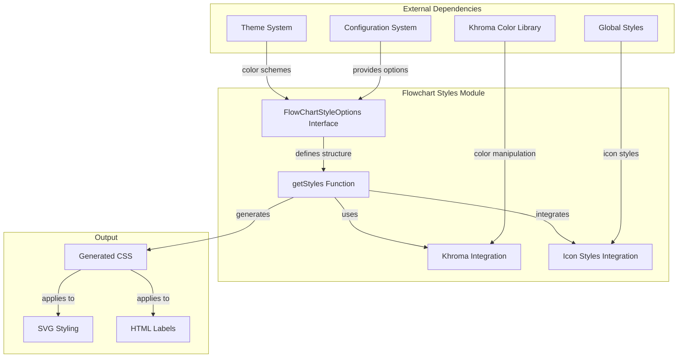
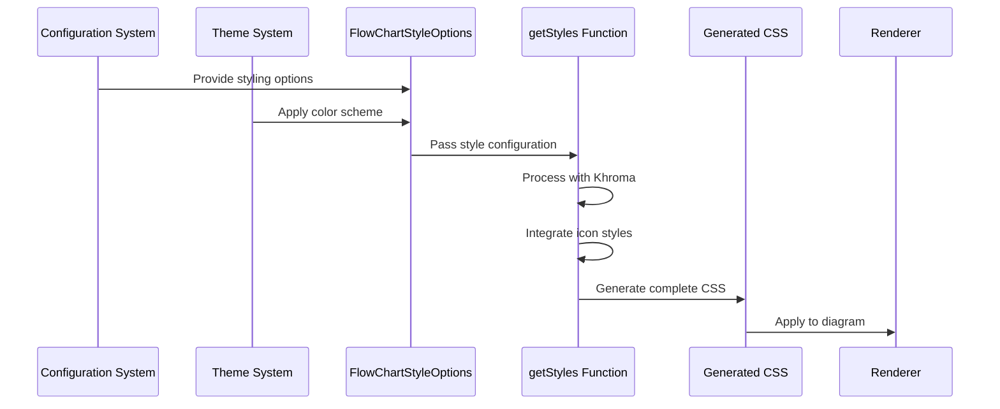
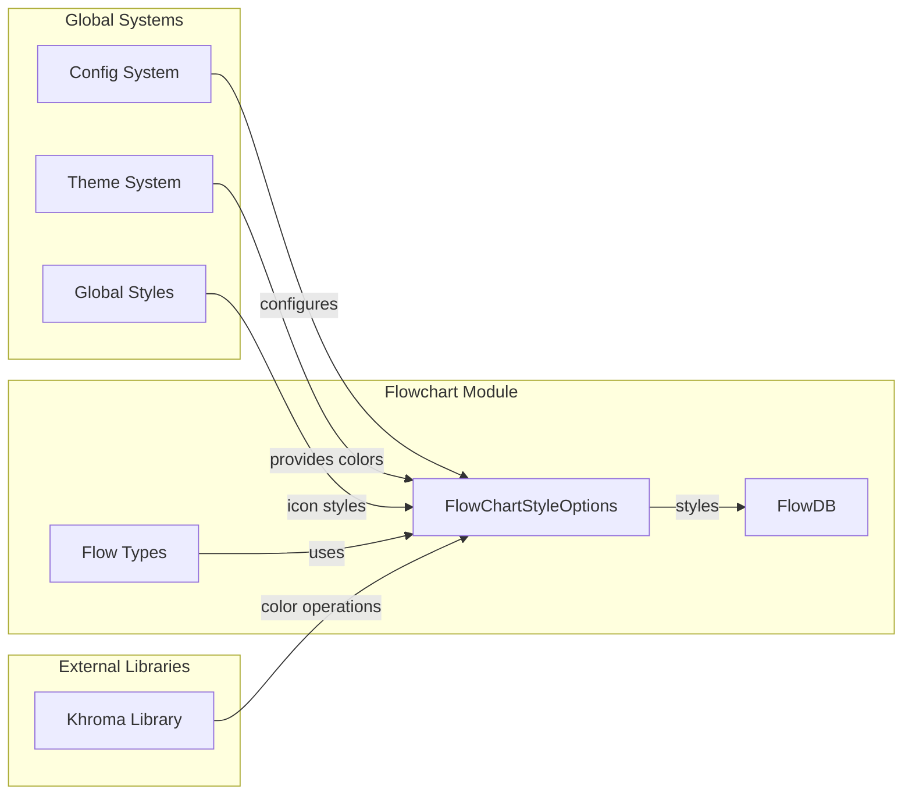
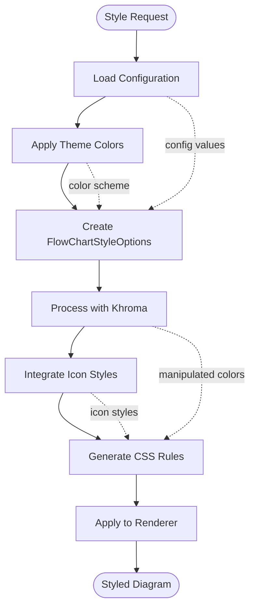

# Flowchart Styles Module Documentation

## Introduction

The flowchart-styles module is a specialized styling subsystem within the Mermaid diagram library that handles the visual appearance and theming of flowchart diagrams. It provides a comprehensive styling interface that defines how flowchart elements (nodes, edges, clusters, labels) are rendered, including colors, fonts, borders, and interactive states.

This module serves as the bridge between Mermaid's theme system and the actual CSS styling applied to flowchart diagrams, ensuring consistent visual representation across different diagram types while maintaining flexibility for customization.

## Architecture Overview



## Core Components

### FlowChartStyleOptions Interface

The `FlowChartStyleOptions` interface defines the complete styling contract for flowchart diagrams. It encapsulates all visual properties that can be customized:

```typescript
interface FlowChartStyleOptions {
  arrowheadColor: string;        // Color of arrowheads on edges
  border2: string;               // Secondary border color
  clusterBkg: string;            // Background color for clusters
  clusterBorder: string;         // Border color for clusters
  edgeLabelBackground: string;   // Background for edge labels
  fontFamily: string;            // Font family for text elements
  lineColor: string;             // Color of connection lines
  mainBkg: string;               // Primary background color
  nodeBorder: string;            // Node border color
  nodeTextColor: string;         // Text color inside nodes
  tertiaryColor: string;         // Tertiary/utility color
  textColor: string;             // General text color
  titleColor: string;            // Color for titles and headings
}
```

### getStyles Function

The `getStyles` function is the core styling engine that transforms `FlowChartStyleOptions` into comprehensive CSS rules. It generates CSS that covers:

- **Node Styling**: Background colors, borders, shapes (rect, circle, ellipse, polygon, path)
- **Edge Styling**: Line colors, arrowheads, connection paths
- **Label Styling**: Font properties, text colors, background colors
- **Cluster Styling**: Group background and border colors
- **Interactive Elements**: Hover states, clickable cursors, tooltips
- **Icon Integration**: Special handling for icon and image shapes

### Color Manipulation

The module integrates with the Khroma color library to provide advanced color operations:

```typescript
const fade = (color: string, opacity: number) => {
  // Extract RGB channels using Khroma
  const r = khroma.channel(color, 'r');
  const g = khroma.channel(color, 'g');
  const b = khroma.channel(color, 'b');
  
  // Return RGBA with specified opacity
  return khroma.rgba(r, g, b, opacity);
};
```

This enables features like semi-transparent backgrounds for edge labels and hover effects.

## Data Flow



## Component Relationships



## Styling Categories

### Node Styling
- **Background**: Controlled by `mainBkg` property
- **Borders**: Defined by `nodeBorder` property
- **Text**: Uses `nodeTextColor` with fallback to `textColor`
- **Shapes**: Supports rect, circle, ellipse, polygon, and custom paths
- **Interactive**: Clickable nodes receive cursor pointer

### Edge Styling
- **Lines**: Color controlled by `lineColor`
- **Arrowheads**: Color defined by `arrowheadColor`
- **Labels**: Background color from `edgeLabelBackground`
- **Thickness**: Fixed 2px stroke width for visibility

### Cluster Styling
- **Background**: Set via `clusterBkg` property
- **Borders**: Controlled by `clusterBorder`
- **Titles**: Use `titleColor` for text color
- **Hierarchy**: Clusters can contain other clusters

### Label Styling
- **Fonts**: Family specified by `fontFamily`
- **Colors**: Node text uses `nodeTextColor`, general text uses `textColor`
- **Backgrounds**: Edge labels support semi-transparent backgrounds
- **Alignment**: Center-aligned for optimal readability

## Integration Points

### Theme System Integration
The flowchart-styles module integrates with Mermaid's theme system through the `FlowChartStyleOptions` interface. Themes provide the color values that populate the styling options, ensuring visual consistency across different diagram types.

### Configuration System Integration
Configuration values flow from the main Mermaid configuration into `FlowChartStyleOptions`, allowing users to customize flowchart appearance through the standard Mermaid configuration API.

### Global Styles Integration
The module imports and incorporates global icon styles through `getIconStyles()`, ensuring that icon elements within flowcharts maintain consistency with the overall Mermaid styling system.

## Process Flow



## Usage Patterns

### Basic Styling
The module automatically applies styling based on the active theme and configuration, requiring no manual intervention for standard use cases.

### Custom Styling
Advanced users can customize flowchart appearance by:
1. Modifying the Mermaid configuration
2. Creating custom themes
3. Overriding specific style properties

### Programmatic Access
The `getStyles` function can be called directly with custom `FlowChartStyleOptions` for specialized rendering scenarios.

## Dependencies

### Internal Dependencies
- **Global Styles**: Imports icon styling functions
- **Configuration System**: Receives styling options
- **Theme System**: Provides color schemes

### External Dependencies
- **Khroma**: Color manipulation and conversion library
- **CSS Parser**: Processes generated styles for application

## Extension Points

### Custom Themes
New themes can be created by implementing the color scheme interface and providing appropriate values for all `FlowChartStyleOptions` properties.

### Style Plugins
The modular architecture allows for style plugins that can extend or modify the generated CSS before application.

### Color Libraries
While Khroma is the default color library, the architecture supports alternative color manipulation libraries through the `fade` function interface.

## Performance Considerations

### CSS Generation
The `getStyles` function generates CSS efficiently by:
- Using template literals for string interpolation
- Minimizing color calculations through Khroma
- Caching icon styles from global imports

### Style Application
Generated CSS is applied once per diagram render, with styles cached for subsequent updates to improve performance.

## Error Handling

### Color Validation
The Khroma integration provides color validation, ensuring that invalid color values don't break the styling system.

### Fallback Values
The module implements fallback mechanisms for critical style properties, ensuring diagrams remain readable even with incomplete styling data.

## Related Documentation

- [Configuration System](config.md) - For understanding how styling options are configured
- [Theme System](themes.md) - For theming and color scheme management
- [Flowchart Diagrams](flowchart.md) - For the main flowchart functionality
- [Global Styles](global-styles.md) - For icon and global styling integration
- [Rendering System](rendering-util.md) - For how styles are applied during rendering