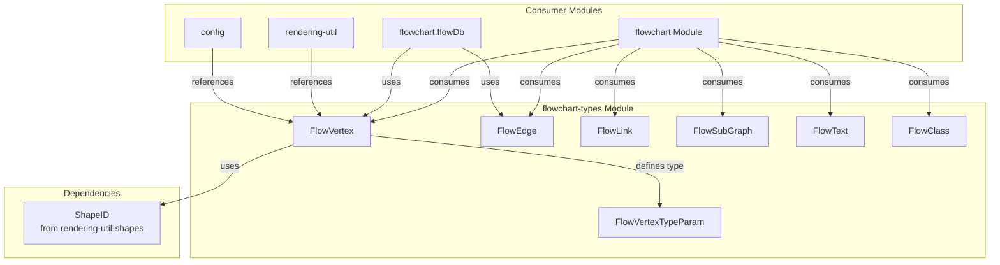
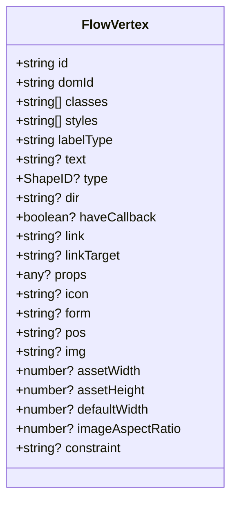
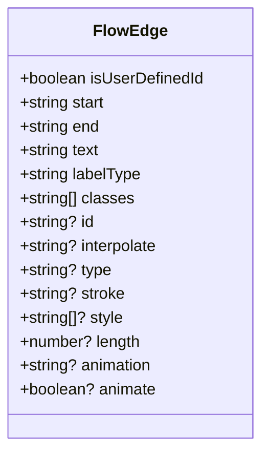
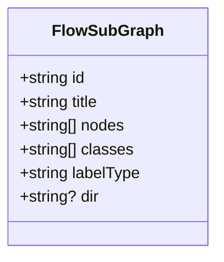
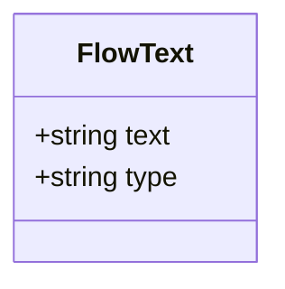
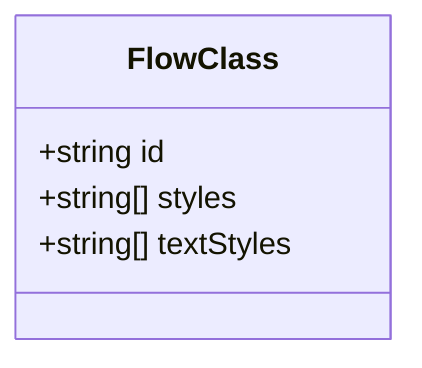
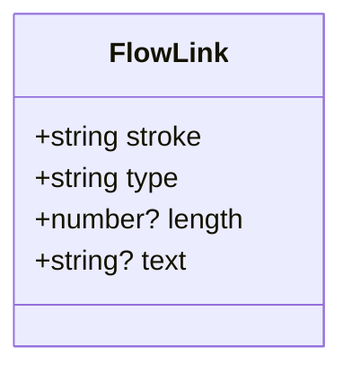
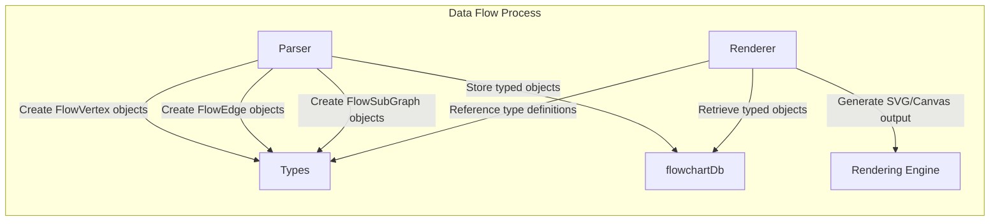
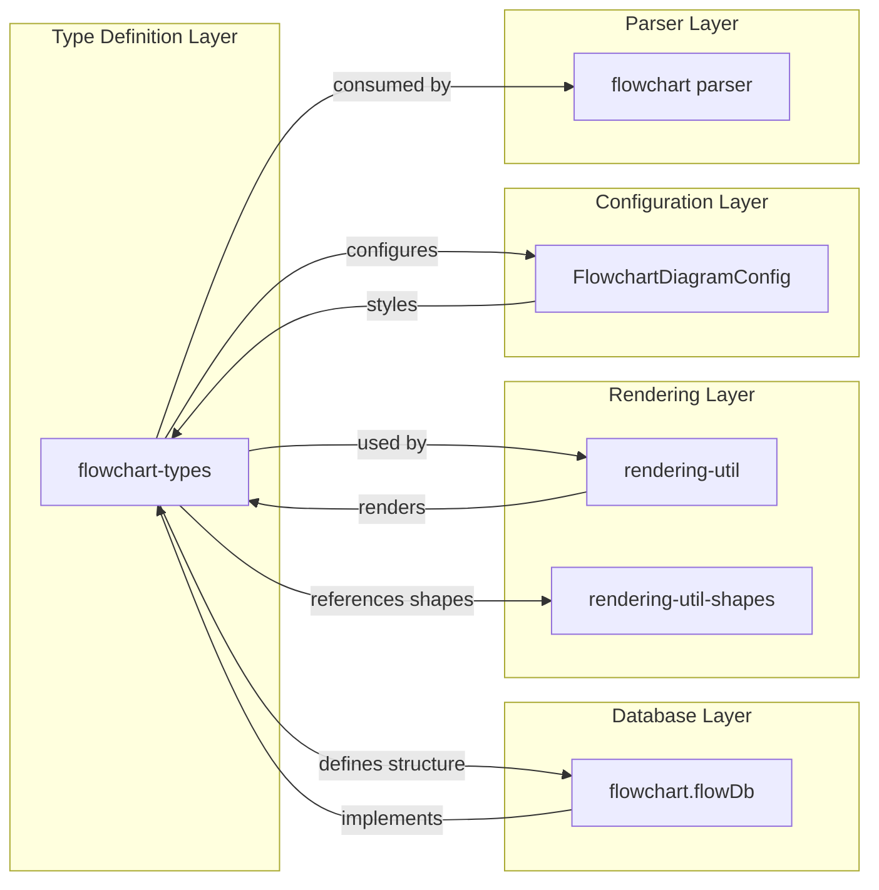

# Flowchart Types Module Documentation

## Introduction

The `flowchart-types` module defines the core type definitions for flowchart diagrams in the Mermaid.js library. This module provides the fundamental data structures and interfaces that represent flowchart elements such as vertices (nodes), edges (connections), subgraphs, and styling classes. These types form the foundation for parsing, rendering, and interacting with flowchart diagrams throughout the Mermaid ecosystem.

## Architecture Overview

The flowchart-types module serves as the type foundation for the flowchart diagram implementation, providing TypeScript interfaces that define the structure of flowchart components and their relationships.



## Core Components

### FlowVertex

The `FlowVertex` interface represents a node or vertex in a flowchart diagram. It defines all the properties that a flowchart node can have, including its visual appearance, behavior, and metadata.



**Key Properties:**
- `id`: Unique identifier for the vertex
- `domId`: DOM element identifier for rendering
- `classes`: CSS classes applied to the vertex
- `styles`: Inline styles for the vertex
- `type`: Shape type (references [rendering-util-shapes](rendering-util-shapes.md))
- `text`: Display text content
- `link`: Hyperlink URL
- `icon`: Icon identifier
- `img`: Image URL for custom node images

### FlowEdge

The `FlowEdge` interface defines the structure of connections between vertices in a flowchart.



**Key Properties:**
- `start`: ID of the source vertex
- `end`: ID of the target vertex
- `text`: Label text for the edge
- `stroke`: Line style ('normal', 'thick', 'invisible', 'dotted')
- `animation`: Animation speed ('fast', 'slow')
- `animate`: Whether to enable animation

### FlowSubGraph

Represents a container or grouping of vertices within a flowchart.



**Key Properties:**
- `id`: Unique identifier for the subgraph
- `title`: Display title of the subgraph
- `nodes`: Array of vertex IDs contained in this subgraph
- `classes`: CSS classes for styling

### FlowText

Simple text container used for labels and text content within flowcharts.



### FlowClass

Defines CSS class styling information for flowchart elements.



### FlowLink

Represents a link or connection with basic properties.



## Data Flow

The flowchart types participate in the following data flow within the Mermaid system:



## Component Relationships

The flowchart-types module integrates with the broader Mermaid ecosystem through well-defined relationships:



## Integration with Other Modules

### Flowchart Module Integration

The flowchart-types module is consumed by the main [flowchart](flowchart.md) module, which provides the implementation for parsing and rendering flowchart diagrams.

### Configuration Integration

Flowchart types work with the [config](config.md) module's `FlowchartDiagramConfig` to apply styling and behavior configurations to flowchart elements.

### Rendering Integration

The types integrate with [rendering-util](rendering-util.md) and [rendering-util-shapes](rendering-util-shapes.md) modules to enable proper visual representation of flowchart elements.

## Usage Examples

### Vertex Creation

```typescript
const vertex: FlowVertex = {
  id: 'node1',
  domId: 'flowchart-node1',
  classes: ['default', 'important'],
  styles: ['fill:#f9f', 'stroke:#333'],
  labelType: 'text',
  text: 'Start Process',
  type: 'round',
  link: '/process/start',
  constraint: 'on'
};
```

### Edge Creation

```typescript
const edge: FlowEdge = {
  isUserDefinedId: false,
  start: 'node1',
  end: 'node2',
  text: 'Process Data',
  labelType: 'text',
  classes: ['flow-link'],
  stroke: 'normal',
  animate: true,
  animation: 'slow'
};
```

### SubGraph Creation

```typescript
const subGraph: FlowSubGraph = {
  id: 'cluster_1',
  title: 'Processing Stage',
  nodes: ['node1', 'node2', 'node3'],
  classes: ['subgraph'],
  labelType: 'text'
};
```

## Type Safety and Extensibility

The flowchart-types module provides strong TypeScript typing throughout the flowchart implementation, ensuring:

- **Type Safety**: All flowchart elements have well-defined structures
- **IntelliSense**: IDE support for property names and types
- **Compile-time Validation**: Catch type errors during development
- **Extensibility**: Easy to extend with new properties while maintaining backward compatibility

## Summary

The flowchart-types module is a foundational component that defines the data structures for flowchart diagrams in Mermaid.js. It provides the type definitions that enable consistent parsing, storage, and rendering of flowchart elements across the entire Mermaid ecosystem. By maintaining clear separation between type definitions and implementation, this module ensures type safety and promotes code maintainability throughout the flowchart diagram implementation.