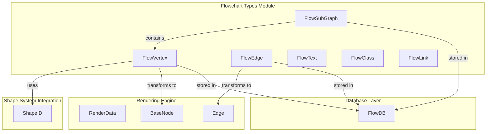
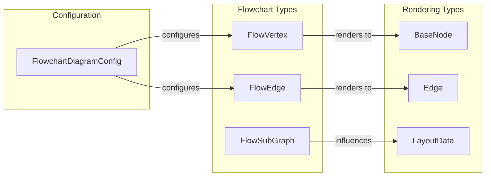
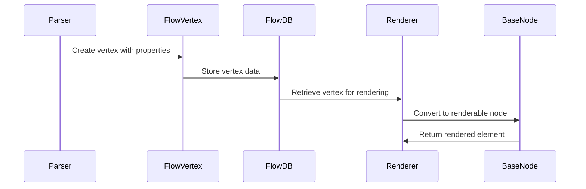
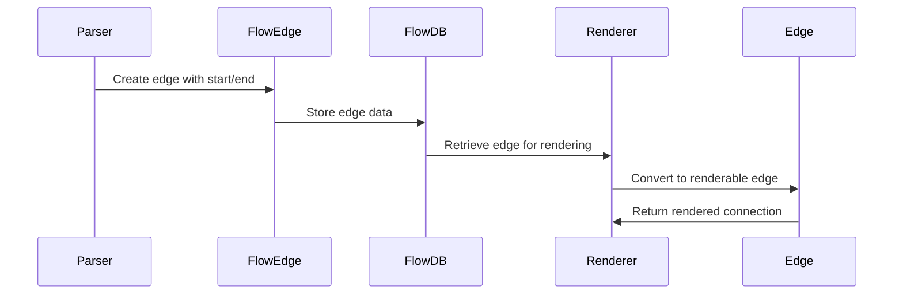

# Flowchart Types Module Documentation

## Introduction

The flowchart-types module defines the core type system for flowchart diagrams in Mermaid. It provides the fundamental data structures that represent flowchart elements including vertices (nodes), edges (connections), and subgraphs (grouped elements). These types serve as the foundation for parsing, rendering, and manipulating flowchart diagrams throughout the Mermaid ecosystem.

## Core Components

### FlowVertex

The `FlowVertex` interface represents individual nodes in a flowchart diagram. Each vertex contains properties that define its appearance, behavior, and relationships within the diagram.

**Key Properties:**
- `id`: Unique identifier for the vertex
- `text`: Display text/content of the node
- `type`: Shape type (circle, rectangle, diamond, etc.)
- `classes`: CSS classes for styling
- `styles`: Inline styles array
- `domId`: DOM element identifier
- `link`: Optional hyperlink
- `icon`: Optional icon identifier
- `constraint`: Layout constraint ('on' or 'off')

### FlowEdge

The `FlowEdge` interface represents connections between vertices in a flowchart. Edges define the relationships and flow direction between nodes.

**Key Properties:**
- `start`: Source vertex ID
- `end`: Target vertex ID
- `text`: Label text for the edge
- `stroke`: Line style (normal, thick, dotted, invisible)
- `style`: Array of style definitions
- `animation`: Animation speed (fast/slow)
- `animate`: Boolean animation flag
- `length`: Optional edge length specification

### FlowSubGraph

The `FlowSubGraph` interface represents grouped collections of vertices that form logical units within a flowchart.

**Key Properties:**
- `id`: Unique subgraph identifier
- `title`: Display title for the subgraph
- `nodes`: Array of vertex IDs contained in the subgraph
- `classes`: CSS classes for styling
- `dir`: Optional direction specification

## Architecture

### Type System Architecture


```mermaid
graph TB
    subgraph "Flowchart Types Module"
        FV[FlowVertex]
        FE[FlowEdge]
        FS[FlowSubGraph]
        FT[FlowText]
        FC[FlowClass]
        FL[FlowLink]
    end
    
    subgraph "Shape System Integration"
        SID[ShapeID]
    end
    
    subgraph "Rendering Engine"
        RD[RenderData]
        BN[BaseNode]
        ED[Edge]
    end
    
    subgraph "Database Layer"
        FDB[FlowDB]
    end
    
    FV -->|uses| SID
    FV -->|transforms to| BN
    FE -->|transforms to| ED
    FS -->|contains| FV
    FV -->|stored in| FDB
    FE -->|stored in| FDB
    FS -->|stored in| FDB
```

### Component Relationships


```mermaid
graph LR
    subgraph "Flowchart Types"
        Vertex[FlowVertex]
        Edge[FlowEdge]
        SubGraph[FlowSubGraph]
    end
    
    subgraph "Rendering Types"
        RVertex[BaseNode]
        REdge[Edge]
        RLayout[LayoutData]
    end
    
    subgraph "Configuration"
        Config[FlowchartDiagramConfig]
    end
    
    Vertex -->|renders to| RVertex
    Edge -->|renders to| REdge
    SubGraph -->|influences| RLayout
    Config -->|configures| Vertex
    Config -->|configures| Edge
```

## Data Flow

### Vertex Processing Flow


```mermaid
sequenceDiagram
    participant Parser
    participant FlowVertex
    participant FlowDB
    participant Renderer
    participant BaseNode
    
    Parser->>FlowVertex: Create vertex with properties
    FlowVertex->>FlowDB: Store vertex data
    FlowDB->>Renderer: Retrieve vertex for rendering
    Renderer->>BaseNode: Convert to renderable node
    BaseNode->>Renderer: Return rendered element
```

### Edge Processing Flow


```mermaid
sequenceDiagram
    participant Parser
    participant FlowEdge
    participant FlowDB
    participant Renderer
    participant Edge
    
    Parser->>FlowEdge: Create edge with start/end
    FlowEdge->>FlowDB: Store edge data
    FlowDB->>Renderer: Retrieve edge for rendering
    Renderer->>Edge: Convert to renderable edge
    Edge->>Renderer: Return rendered connection
```

## Integration Points

### Database Integration

The flowchart types integrate with the [flowchart-database](flowchart-database.md) module through the `FlowDB` class, which manages collections of vertices, edges, and subgraphs.

### Rendering Integration

Types are transformed into renderable elements through the [rendering-types](rendering-types.md) module:
- `FlowVertex` → `BaseNode`
- `FlowEdge` → `Edge`
- `FlowSubGraph` influences `LayoutData`

### Configuration Integration

The [flowchart-configuration](flowchart-configuration.md) module provides `FlowchartDiagramConfig` which influences the behavior and appearance of flowchart elements.

## Type Definitions

### FlowVertexTypeParam

Defines valid shape types for vertices:
- Basic shapes: `square`, `circle`, `ellipse`, `rect`
- Advanced shapes: `diamond`, `hexagon`, `stadium`, `cylinder`
- Directional shapes: `lean_right`, `lean_left`, `trapezoid`, `inv_trapezoid`
- Special shapes: `doublecircle`, `subroutine`, `odd`

### Shape Integration

The `type` property in `FlowVertex` accepts both `ShapeID` from the shape system and `FlowVertexTypeParam` for backward compatibility.

## Usage Patterns

### Creating Vertices

```typescript
const vertex: FlowVertex = {
  id: 'node1',
  text: 'Start Process',
  type: 'round',
  classes: ['start-node'],
  styles: ['fill:#e1f5fe'],
  domId: 'flowchart-node-1'
};
```

### Creating Edges

```typescript
const edge: FlowEdge = {
  start: 'node1',
  end: 'node2',
  text: 'Process Data',
  stroke: 'normal',
  style: ['stroke-width:2px'],
  isUserDefinedId: true
};
```

### Creating SubGraphs

```typescript
const subGraph: FlowSubGraph = {
  id: 'cluster1',
  title: 'Processing Section',
  nodes: ['node2', 'node3', 'node4'],
  classes: ['process-group'],
  labelType: 'text'
};
```

## Dependencies

### Internal Dependencies

- **Shape System**: Uses `ShapeID` for vertex shape definitions
- **Rendering Engine**: Transforms types into renderable elements
- **Database Layer**: Stores and manages type instances

### External Dependencies

- **Parser**: Creates type instances from diagram syntax
- **Renderer**: Consumes types for visual representation
- **Configuration**: Influences type behavior and appearance

## Extension Points

### Custom Vertex Types

Developers can extend the `FlowVertex` interface to add custom properties:

```typescript
interface CustomFlowVertex extends FlowVertex {
  customProperty?: string;
  metadata?: Record<string, any>;
}
```

### Custom Edge Styles

The `style` array in `FlowEdge` allows for custom CSS styling:

```typescript
const customEdge: FlowEdge = {
  // ... standard properties
  style: ['stroke: #ff0000', 'stroke-dasharray: 5,5']
};
```

## Best Practices

### Type Safety

Always use the defined interfaces to ensure type safety and compatibility with the Mermaid ecosystem.

### Performance

- Minimize the number of custom styles per element
- Use classes instead of inline styles when possible
- Leverage the constraint property for layout optimization

### Maintainability

- Use meaningful IDs for vertices and subgraphs
- Document custom properties and extensions
- Follow naming conventions established in the codebase

## Related Documentation

- [Flowchart Database](flowchart-database.md) - Data management for flowchart elements
- [Rendering Types](rendering-types.md) - Type transformations for rendering
- [Flowchart Configuration](flowchart-configuration.md) - Configuration options for flowcharts
- [Shape System](shape-system.md) - Shape definitions and management
- [Theme System](theme-system.md) - Styling and theming capabilities