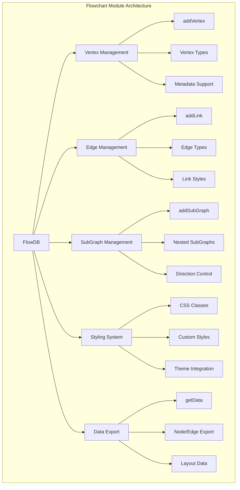
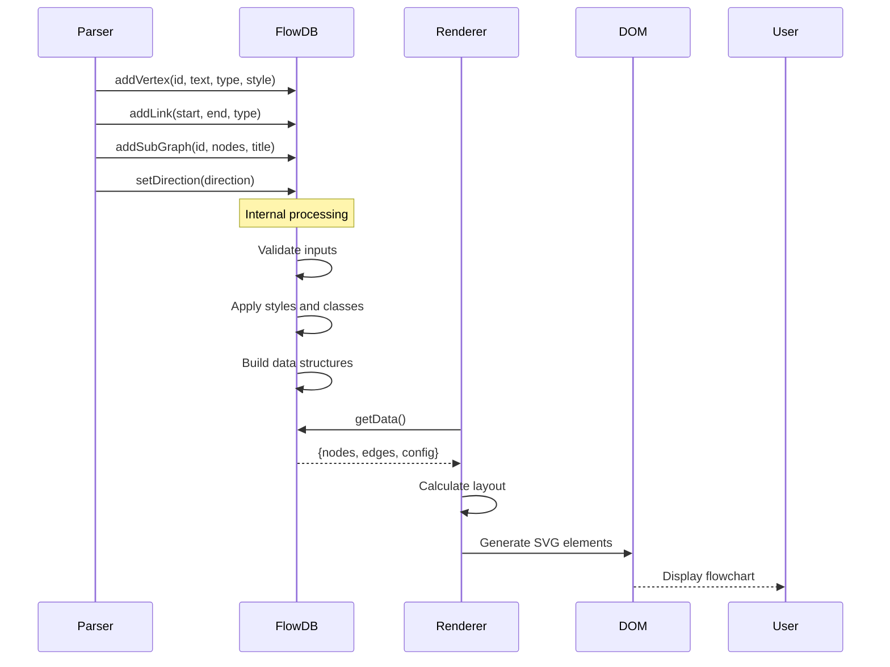

# Flowchart Module Documentation

## Overview

The flowchart module is a core component of the Mermaid.js library that enables the creation and rendering of flowchart diagrams. It provides a comprehensive system for defining nodes, edges, subgraphs, and their visual styling, making it one of the most versatile diagram types in the Mermaid ecosystem.

## Purpose

The flowchart module serves as the foundation for creating flow-based diagrams that visualize processes, workflows, system architectures, and decision trees. It supports various node shapes, edge types, styling options, and interactive features like clickable elements and tooltips.

## Architecture

## Core Components

### 1. FlowDB (Database Layer)
The central database that manages all flowchart data including vertices, edges, subgraphs, and styling information. It implements the DiagramDB interface and provides methods for adding, updating, and retrieving diagram elements.

**Key Responsibilities:**
- Vertex management with support for various shapes and types
- Edge/link management with different arrow types and styles
- Subgraph creation and nesting
- CSS class and style management
- Data export for rendering

### 2. Type Definitions
Comprehensive type system defining the structure of flowchart elements:

- **FlowVertex**: Represents nodes in the flowchart
- **FlowEdge**: Defines connections between nodes
- **FlowSubGraph**: Manages grouped nodes
- **FlowText**: Handles text content and formatting
- **FlowClass**: Manages CSS class definitions

### 3. Styling System
Provides theming and styling capabilities through:

- **FlowChartStyleOptions**: Configuration interface for visual styling
- **CSS Generation**: Dynamic stylesheet creation based on theme settings
- **Class Management**: Support for custom CSS classes on elements

## Data Flow

## Key Features

### Node Types and Shapes
The flowchart module supports a wide variety of node shapes:
- Basic shapes: square, circle, ellipse, diamond
- Advanced shapes: hexagon, trapezoid, stadium, cylinder
- Special types: icons, images, custom shapes

### Edge Types and Styles
Flexible edge system with multiple configurations:
- Arrow types: open, point, cross, circle
- Stroke styles: normal, thick, dotted, invisible
- Bidirectional arrows and custom styling

### Subgraph Support
Hierarchical organization through subgraphs:
- Nested subgraph creation
- Direction inheritance
- Title and styling support

### Interactive Features
- Clickable nodes with custom functions
- Tooltip support
- Link integration
- Animation capabilities

## Integration with Mermaid Ecosystem

The flowchart module integrates with several other Mermaid components:

- **[diagram-api](diagram-api.md)**: Implements DiagramDB interface for standard diagram operations
- **[rendering-util](rendering-util.md)**: Uses rendering utilities for node and edge visualization
- **[config](config.md)**: Leverages configuration system for styling and behavior
- **[themes](themes.md)**: Integrates with theming system for consistent visual appearance

## Configuration

The module supports extensive configuration through:
- Global Mermaid configuration
- Diagram-specific settings
- Custom CSS classes
- Theme integration

For detailed configuration options, see the [config module documentation](config.md).

## Usage Examples

The flowchart module processes text-based diagram definitions and converts them into interactive SVG diagrams. It supports various syntax patterns for creating complex flowcharts with minimal code.

## Performance Considerations

- Edge limit enforcement (configurable, default 500)
- Efficient data structures for large diagrams
- Optimized rendering pipeline
- Memory management through proper cleanup

## Error Handling

The module includes comprehensive error handling for:
- Invalid shape definitions
- Edge limit exceeded
- Malformed syntax
- Security considerations (click events, links)

## Sub-modules Documentation

For detailed information about specific components, see:
- [flowchart-types](flowchart-types.md) - Type definitions and interfaces
- [flowchart-styles](flowchart-styles.md) - Styling and theming system

## Related Modules

- [core-mermaid](core-mermaid.md) - Core Mermaid functionality and main API
- [diagram-api](diagram-api.md) - Diagram definition and metadata management
- [rendering-util](rendering-util.md) - Rendering utilities and layout algorithms
- [config](config.md) - Configuration management system
- [themes](themes.md) - Theming and visual styling system