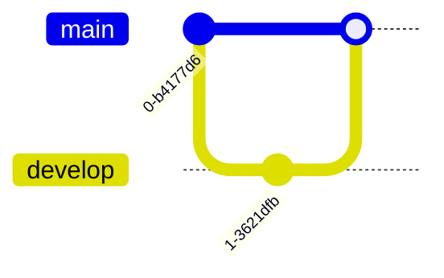
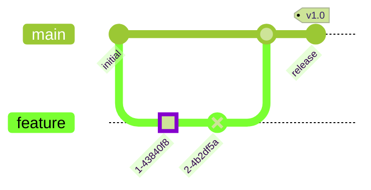

# Git Module Documentation

## Overview

The Git module is a specialized diagram type within the Mermaid.js library that provides functionality for creating Git graph diagrams. These diagrams visualize Git repository history, including branches, commits, merges, and cherry-pick operations. The module offers a comprehensive set of tools for parsing Git graph syntax, managing diagram state, and rendering interactive visualizations.

## Purpose

The Git module serves as a complete implementation for generating Git repository visualizations that help developers understand:
- Repository structure and branching strategies
- Commit history and relationships
- Merge patterns and cherry-pick operations
- Branch evolution over time

## Architecture

The Git module follows a layered architecture pattern with clear separation of concerns:

### Core Components

The module consists of three main sub-modules:

1. **[gitGraphAst](gitGraphAst.md)** - Abstract Syntax Tree management and state handling
   - Manages Git repository state and commit history
   - Handles branch operations (create, checkout, merge)
   - Implements cherry-pick functionality
   - Provides state persistence and reset capabilities

2. **[gitGraphTypes](gitGraphTypes.md)** - Type definitions and interfaces
   - Defines core data structures (Commit, Branch, Merge, CherryPick)
   - Specifies AST node types for parsing
   - Provides database interfaces for parsing and rendering
   - Establishes type safety across the module

3. **[gitGraphRenderer](gitGraphRenderer.md)** - SVG rendering and visualization
   - Calculates commit and branch positioning
   - Renders commit bullets with different visual styles
   - Draws connection arrows between commits
   - Handles multiple layout orientations (LR, TB, BT)

## Key Features

### Diagram Types Supported
- **Commit Visualization**: Normal, reverse, and highlighted commits
- **Branch Operations**: Branch creation, checkout, and management
- **Merge Operations**: Standard merges with visual indicators
- **Cherry-pick Operations**: Selective commit transfers between branches
- **Multiple Orientations**: Left-to-right (LR), top-to-bottom (TB), and bottom-to-top (BT) layouts

### Configuration Options
- Customizable commit labels and tags
- Branch ordering and positioning
- Parallel commit rendering
- Theme-based styling
- Rotated commit labels for space optimization

## Integration with Mermaid Ecosystem

The Git module integrates seamlessly with the broader Mermaid.js architecture:

### Dependencies
- **Config System**: Provides diagram-specific configuration management
- **Theme System**: Handles visual styling and color schemes
- **Rendering Utils**: Offers common rendering utilities and helpers
- **Common Types**: Shared type definitions across diagram types

## Usage Examples

### Basic Git Graph

### Advanced Features

## Data Flow

## Performance Considerations

The Git module is optimized for:
- **Large Repositories**: Efficient commit positioning algorithms
- **Parallel Rendering**: Support for parallel commit layouts
- **Memory Management**: Proper cleanup and state reset capabilities
- **Responsive Design**: Automatic viewbox calculation and scaling

## Error Handling

The module implements comprehensive error handling for:
- Invalid branch operations (self-merging, non-existent branches)
- Duplicate commit IDs
- Invalid cherry-pick operations
- Missing parent commits
- Syntax parsing errors

## Testing

The module includes extensive unit tests covering:
- Commit positioning algorithms
- Branch layout calculations
- Arrow routing logic
- Edge case handling
- Integration with Mermaid core

## Future Enhancements

Potential areas for expansion include:
- Support for additional Git operations (rebase, stash)
- Enhanced interactive features
- Performance optimizations for very large repositories
- Additional layout algorithms
- Integration with actual Git repositories