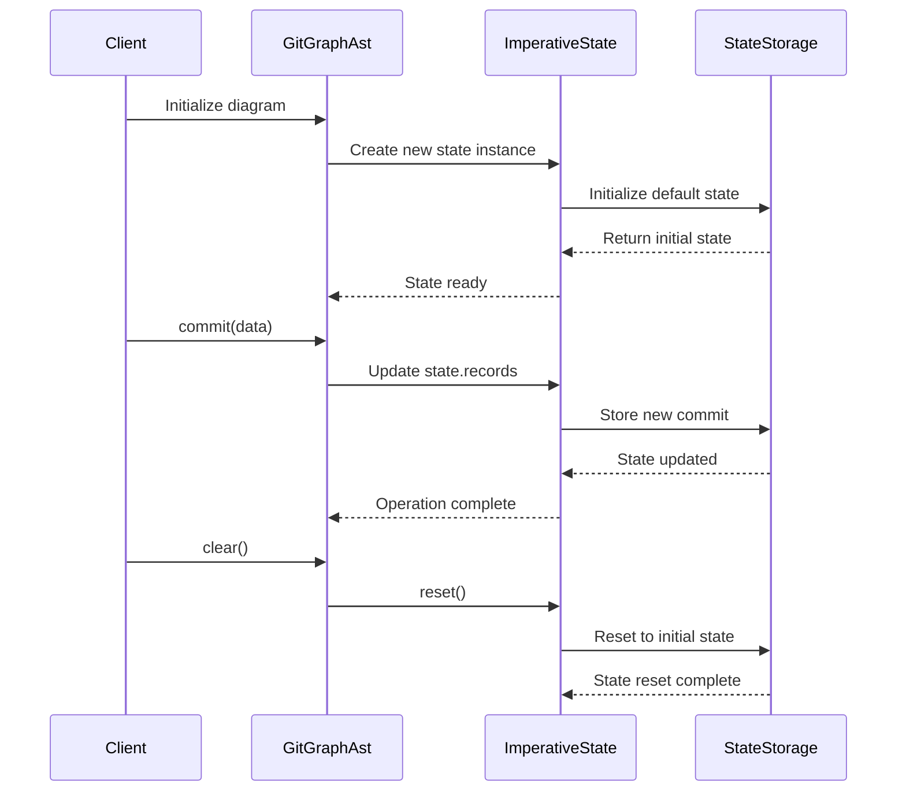
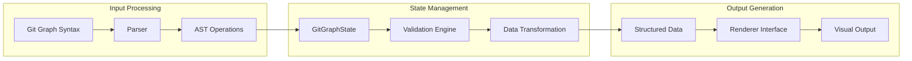
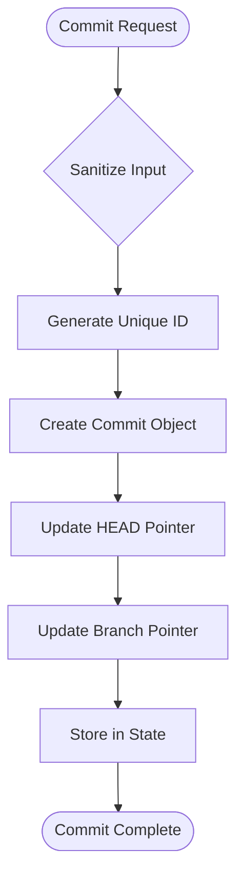
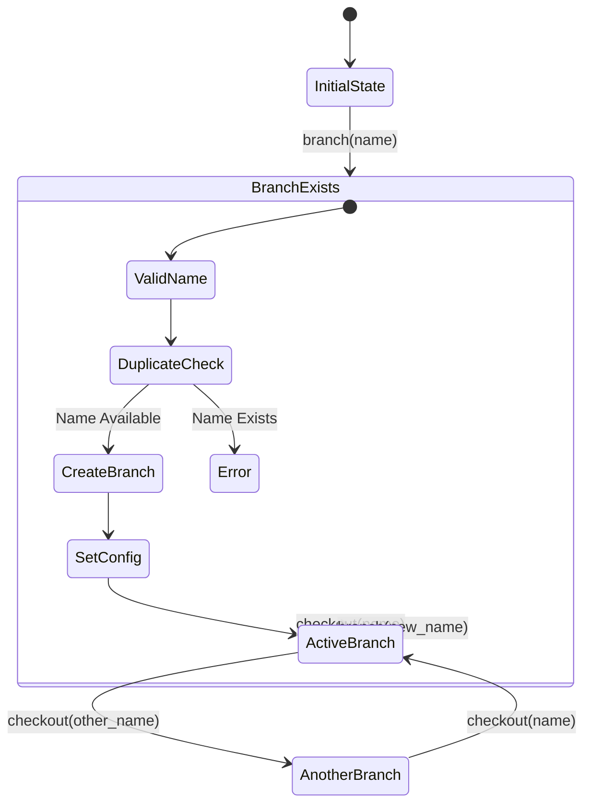
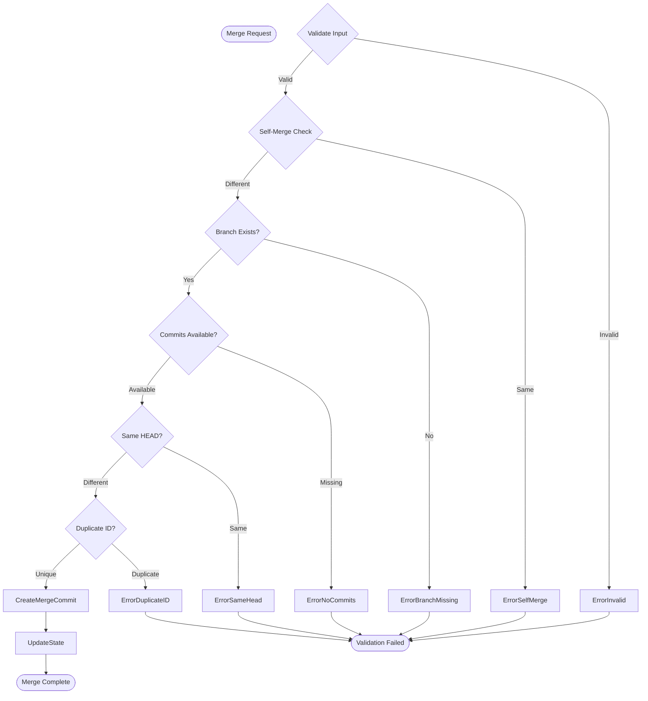
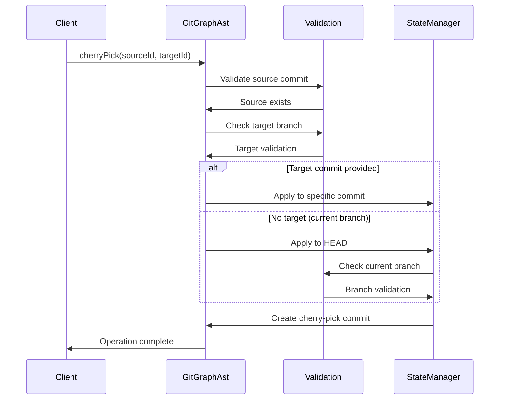
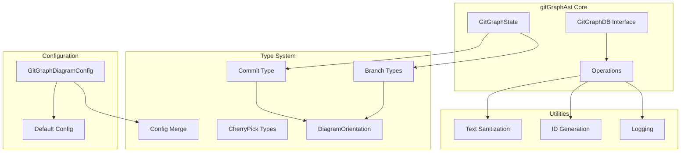
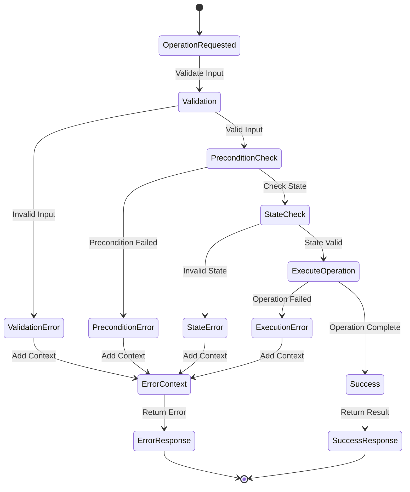
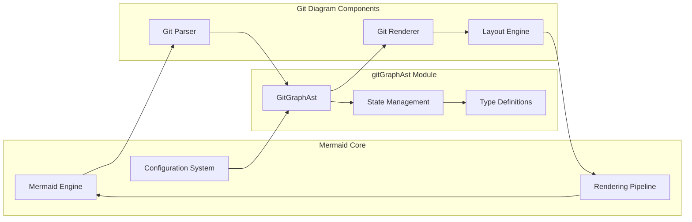

# gitGraphAst Module Documentation

## Introduction

The `gitGraphAst` module is the core Abstract Syntax Tree (AST) state management system for Git Graph diagrams in Mermaid. It provides a comprehensive API for managing Git repository visualization data, including commits, branches, merges, and cherry-pick operations. This module serves as the central data layer that transforms Git Graph diagram syntax into structured data that can be rendered visually.

## Architecture Overview

The gitGraphAst module implements a stateful architecture that maintains the complete Git repository structure in memory, providing operations to manipulate branches, commits, and relationships between them.

```mermaid
graph TB
    subgraph "gitGraphAst Module"
        GGAS[GitGraphState<br/>Core State Container]
        IDG[ImperativeState<br/>State Management]
        CF[Configuration<br/>System]
        
        GGAS --> IDG
        GGAS --> CF
    end
    
    subgraph "External Dependencies"
        LOG[Logger<br/>packages.mermaid.src.logger]
        UTIL[Utils<br/>packages.mermaid.src.utils]
        CONF[Config<br/>packages.mermaid.src.config]
        COMDB[CommonDB<br/>packages.mermaid.src.diagrams.common]
        GGTT[GitGraphTypes<br/>packages.mermaid.src.diagrams.git]
    end
    
    GGAS --> LOG
    GGAS --> UTIL
    GGAS --> CONF
    GGAS --> COMDB
    GGAS --> GGTT
    
    subgraph "Git Operations"
        COMMIT[commit]
        BRANCH[branch]
        MERGE[merge]
        CHERRY[cherryPick]
        CHECKOUT[checkout]
    end
    
    GGAS --> COMMIT
    GGAS --> BRANCH
    GGAS --> MERGE
    GGAS --> CHERRY
    GGAS --> CHECKOUT
```



## Core Components

### GitGraphState Interface

The `GitGraphState` interface defines the complete state structure for Git Graph diagrams:

```typescript
interface GitGraphState {
  commits: Map<string, Commit>;           // All commits indexed by ID
  head: Commit | null;                    // Current HEAD commit
  branchConfig: Map<string, { name: string; order: number | undefined }>; // Branch metadata
  branches: Map<string, string | null>;   // Branch names to commit ID mapping
  currBranch: string;                     // Currently active branch
  direction: DiagramOrientation;          // Layout direction (LR, TB, BT)
  seq: number;                            // Sequence counter for commits
  options: any;                           // Custom diagram options
}
```

### State Management

The module uses `ImperativeState` for robust state management with automatic reset capabilities:



## Data Flow Architecture



## Core Operations

### Commit Management

The commit operation creates new commits and manages the Git history:



### Branch Operations

Branch operations include creation, checkout, and management:



### Merge Operations

Merge operations handle complex Git merge scenarios with comprehensive validation:



### Cherry-Pick Operations

Cherry-pick operations allow selective commit application:



## Component Relationships



## Error Handling

The module implements comprehensive error handling with detailed error contexts:



## Integration with Mermaid System

The gitGraphAst module integrates with the broader Mermaid ecosystem:



## Configuration System

The module supports extensive configuration through the Mermaid configuration system:

- **Main Branch Configuration**: Configurable main branch name and order
- **Layout Direction**: Support for Left-to-Right (LR), Top-to-Bottom (TB), and Bottom-to-Top (BT) orientations
- **Custom Options**: JSON-based custom options for diagram-specific settings
- **Text Sanitization**: Configurable text processing for security and consistency

## API Reference

### Primary Operations

- `commit(commitDB: CommitDB)`: Create a new commit
- `branch(branchDB: BranchDB)`: Create a new branch
- `merge(mergeDB: MergeDB)`: Merge branches
- `cherryPick(cherryPickDB: CherryPickDB)`: Cherry-pick commits
- `checkout(branch: string)`: Switch branches

### State Management

- `clear()`: Reset all state
- `setDirection(dir: DiagramOrientation)`: Set layout direction
- `setOptions(rawOptString: string)`: Set custom options
- `getOptions()`: Retrieve current options

### Data Access

- `getBranches()`: Get all branches
- `getCommits()`: Get all commits
- `getCommitsArray()`: Get commits as sorted array
- `getCurrentBranch()`: Get current branch name
- `getHead()`: Get HEAD commit
- `getDirection()`: Get layout direction

## Dependencies

- **[config](config.md)**: Configuration management system
- **[common](common.md)**: Common utilities and text processing
- **[logger](logger.md)**: Logging infrastructure
- **[utils](utils.md)**: Utility functions including ID generation
- **[gitGraphTypes](gitGraphTypes.md)**: Type definitions for Git Graph components

## Usage Patterns

The gitGraphAst module is typically used as part of the Git Graph diagram parsing and rendering pipeline. It maintains the complete state of the Git repository being visualized and provides the structured data needed for rendering the final diagram.

The module's stateful design allows for incremental building of complex Git histories while maintaining data consistency and providing comprehensive validation for Git operations.