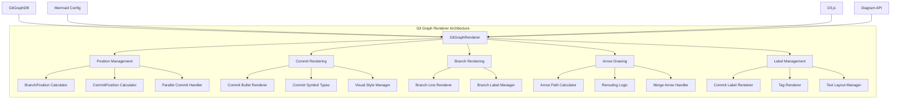
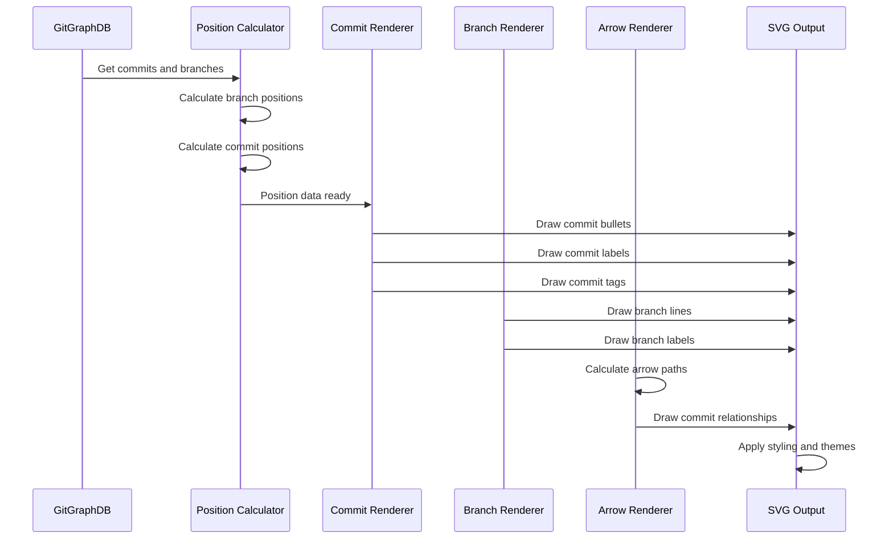
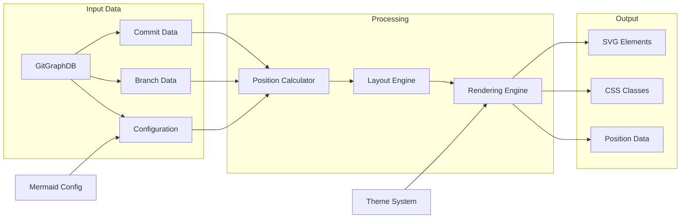
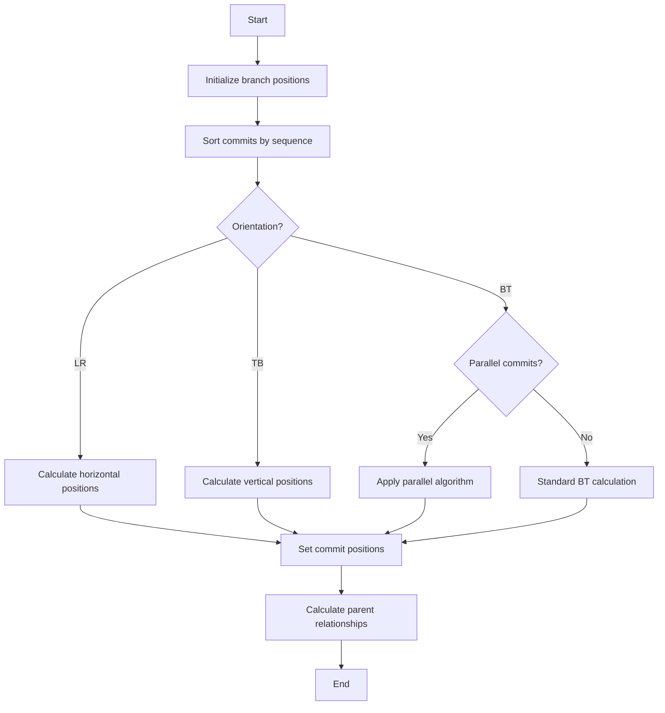

# Git Graph Renderer Module Documentation

## Introduction

The `gitGraphRenderer` module is a core component of the Mermaid diagram library responsible for rendering Git graph diagrams. It transforms parsed Git repository data into visual representations, displaying commit history, branches, merges, and various Git operations in a structured, easy-to-understand format.

This module handles the complex task of positioning commits, drawing branch lines, rendering commit symbols with different visual styles, and creating arrows that represent the relationships between commits. It supports multiple layout orientations (Left-to-Right, Top-to-Bottom, Bottom-to-Top) and provides extensive customization options for visual appearance.

## Architecture Overview



## Core Components

### Position Management System

The position management system is the foundation of the Git graph renderer, responsible for calculating and maintaining the spatial relationships between all elements in the diagram.

#### BranchPosition Interface
```typescript
interface BranchPosition {
  pos: number;    // Absolute position on the axis
  index: number;  // Branch index for color theming
}
```

The `BranchPosition` interface stores the calculated position of each branch along with its thematic index. This information is used to determine where branch lines should be drawn and which color scheme to apply based on the branch's position in the overall layout.

#### CommitPosition Interface
```typescript
interface CommitPosition {
  x: number;  // X-coordinate in the SVG space
  y: number;  // Y-coordinate in the SVG space
}
```

The `CommitPosition` interface represents the exact coordinates where a commit should be rendered in the SVG canvas. These positions are calculated based on the branch position, commit sequence, and layout direction.

#### CommitPositionOffset Interface
```typescript
interface CommitPositionOffset extends CommitPosition {
  posWithOffset: number;  // Position with layout offset applied
}
```

This extended interface adds the `posWithOffset` property, which accounts for layout spacing and padding. This is crucial for maintaining proper spacing between commits and ensuring labels don't overlap.

### Rendering Pipeline



## Key Features

### 1. Multi-Orientation Support

The renderer supports three layout orientations:
- **Left-to-Right (LR)**: Branches are arranged vertically, commits flow horizontally
- **Top-to-Bottom (TB)**: Branches are arranged horizontally, commits flow vertically
- **Bottom-to-Top (BT)**: Reverse vertical flow with parallel commit optimization

### 2. Commit Type Visualization

Different commit types are rendered with distinct visual styles:
- **Normal Commits**: Standard circular bullets
- **Merge Commits**: Double circles with special arrow routing
- **Cherry-Pick Commits**: Circles with cherry symbols
- **Highlight Commits**: Square bullets with highlighting
- **Reverse Commits**: Circles with cross symbols

### 3. Parallel Commit Optimization

For Bottom-to-Top orientation, the renderer implements a sophisticated parallel commit algorithm that:
- Groups related commits together
- Minimizes crossing arrows
- Optimizes vertical space usage
- Maintains clear parent-child relationships

### 4. Smart Arrow Routing

The arrow routing system includes:
- **Collision Detection**: Identifies when arrows would cross through commits
- **Path Rerouting**: Calculates curved paths to avoid obstacles
- **Color Management**: Uses appropriate branch colors for different arrow segments
- **Merge Handling**: Special routing for merge commit arrows

## Data Flow



## Configuration Integration

The renderer integrates with Mermaid's configuration system through several key parameters:

```typescript
interface GitGraphConfig {
  showCommitLabel?: boolean;      // Display commit IDs
  rotateCommitLabel?: boolean;     // Rotate labels for better fit
  showBranches?: boolean;          // Display branch lines
  parallelCommits?: boolean;       // Enable parallel commit optimization
  titleTopMargin?: number;         // Spacing above title
  diagramPadding?: number;         // Padding around diagram
  useMaxWidth?: boolean;           // Responsive width behavior
}
```

## Dependencies

The `gitGraphRenderer` module has several key dependencies:

### Internal Dependencies
- **[gitGraphTypes](gitGraphTypes.md)**: Provides type definitions for Git graph data structures
- **[diagramAPI](diagramAPI.md)**: Core diagram rendering infrastructure
- **[utils](utils.md)**: Utility functions for text rendering and DOM manipulation
- **[logger](logger.md)**: Logging and debugging capabilities

### External Dependencies
- **D3.js**: SVG manipulation and data-driven document rendering
- **Browser APIs**: DOM manipulation and SVG element creation

## Rendering Algorithms

### Position Calculation Algorithm



### Arrow Path Calculation

The arrow routing algorithm follows these steps:

1. **Obstacle Detection**: Check if a straight line would intersect any commits
2. **Path Planning**: If rerouting is needed, calculate intermediate waypoints
3. **Curve Generation**: Create smooth curves using SVG arc commands
4. **Color Assignment**: Determine appropriate colors based on branch relationships
5. **Path Construction**: Build the final SVG path string

## Error Handling

The renderer implements comprehensive error handling for:
- Missing commit data
- Invalid branch references
- Corrupted position calculations
- SVG rendering failures
- Configuration errors

Each error scenario includes appropriate logging and fallback behaviors to ensure the diagram remains functional even with partial data corruption.

## Performance Optimizations

### Memory Management
- Efficient Map usage for position lookups
- Cleanup of temporary DOM elements
- Batch SVG operations to minimize reflows

### Rendering Optimizations
- Two-pass rendering (layout then draw)
- Cached position calculations
- Minimal DOM manipulation during drawing
- Efficient arrow path calculations

### Layout Optimizations
- Parallel commit detection and handling
- Smart branch ordering to minimize crossings
- Optimized label positioning algorithms

## Testing Strategy

The module includes comprehensive unit tests covering:
- Position calculation algorithms
- Commit type classification
- Arrow path generation
- Branch layout logic
- Edge case handling
- Configuration integration

## Integration Points

### With GitGraphDB
The renderer consumes data from the GitGraphDB interface, which provides:
- Commit sequences and relationships
- Branch metadata
- Configuration settings
- Parse results

### With Theme System
Integration with Mermaid's theme system provides:
- Color schemes for different branches
- Consistent styling across diagram types
- Customizable visual properties
- Responsive design support

### With Configuration System
The renderer responds to configuration changes for:
- Layout preferences
- Visual styling options
- Performance settings
- Accessibility features

## Future Enhancements

Potential areas for future development include:
- Additional layout algorithms (circular, force-directed)
- Enhanced animation support
- Interactive features (hover, click handlers)
- Performance optimizations for large repositories
- Advanced filtering and search capabilities
- Export format extensions

## Conclusion

The `gitGraphRenderer` module represents a sophisticated approach to visualizing Git repository history. Its flexible architecture, comprehensive feature set, and robust error handling make it a reliable component for generating clear, informative Git graphs. The module's design allows for easy extension and customization while maintaining high performance and visual quality across different use cases and repository sizes.