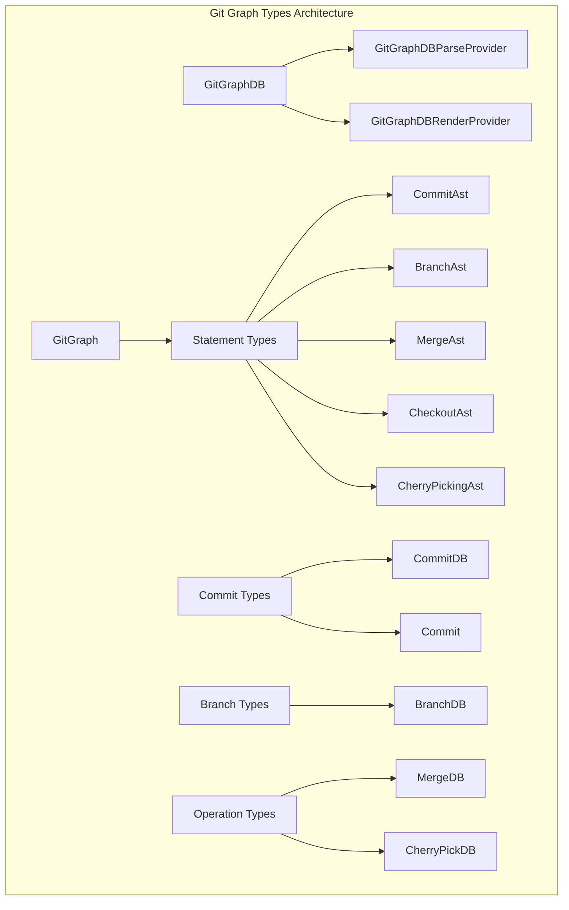
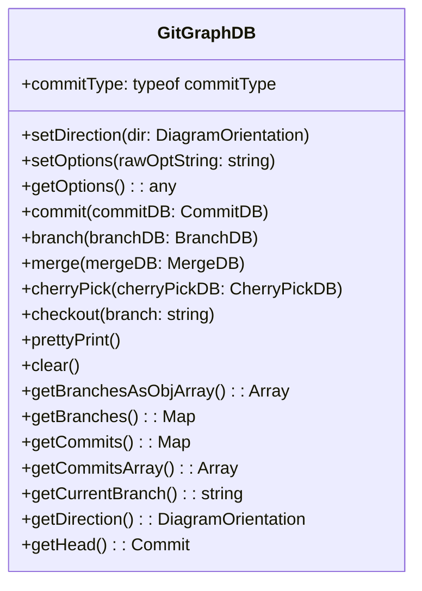
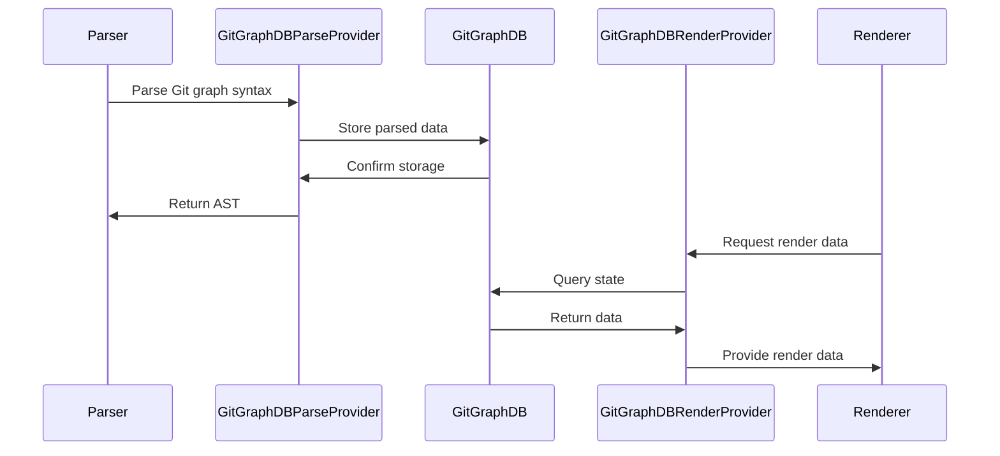
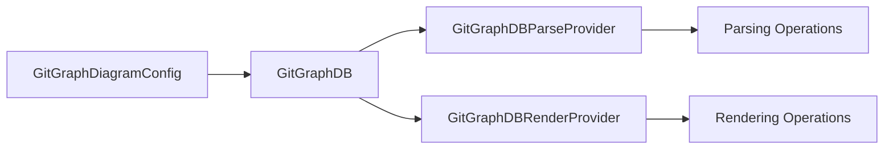

# Git Graph Types Module Documentation

## Introduction

The `gitGraphTypes` module provides the core type definitions and interfaces for Git graph diagrams in Mermaid. This module defines the data structures, database interfaces, and AST (Abstract Syntax Tree) types that enable the creation, parsing, and rendering of Git repository visualization diagrams. It serves as the foundation for representing Git operations like commits, branches, merges, and cherry-picks in a structured, type-safe manner.

## Architecture Overview

The module is organized around three main architectural layers:

1. **Data Layer**: Database interfaces and storage structures
2. **AST Layer**: Abstract syntax tree definitions for parsing
3. **Type Definitions**: Core enums and interfaces for Git operations



## Core Components

### Commit Type System

The module defines a comprehensive commit type system that categorizes different types of Git commits:

```typescript
export const commitType = {
  NORMAL: 0,      // Standard commits
  REVERSE: 1,     // Reversed/reverted commits
  HIGHLIGHT: 2,   // Emphasized commits
  MERGE: 3,       // Merge commits
  CHERRY_PICK: 4, // Cherry-picked commits
} as const;
```

### Database Interfaces

#### GitGraphDB
The main database interface that extends `DiagramDBBase` and provides comprehensive Git graph operations:



#### Specialized Database Providers

The module implements a separation of concerns pattern with specialized provider interfaces:

- **GitGraphDBParseProvider**: Handles parsing operations (commit, branch, merge, cherry-pick, checkout)
- **GitGraphDBRenderProvider**: Manages rendering operations (data retrieval, state queries)

### Data Structures

#### Commit Types

**CommitDB**: Database representation of commits
```typescript
interface CommitDB {
  msg: string;        // Commit message
  id: string;         // Unique identifier
  type: number;       // Commit type (from commitType enum)
  tags?: string[];    // Optional tags
}
```

**Commit**: Runtime representation with additional metadata
```typescript
interface Commit {
  id: string;
  message: string;
  seq: number;              // Sequence number
  type: number;             // Commit type
  tags: string[];           // Tags array
  parents: string[];        // Parent commit IDs
  branch: string;           // Branch name
  customType?: number;      // Custom type override
  customId?: boolean;       // Custom ID flag
}
```

#### Branch Management

**BranchDB**: Branch database representation
```typescript
interface BranchDB {
  name: string;     // Branch name
  order: number;    // Display order
}
```

#### Operation Types

**MergeDB**: Merge operation data
```typescript
interface MergeDB {
  branch: string;     // Target branch
  id: string;         // Merge commit ID
  type?: number;      // Optional merge type
  tags?: string[];    // Optional tags
}
```

**CherryPickDB**: Cherry-pick operation data
```typescript
interface CherryPickDB {
  id: string;         // Cherry-pick commit ID
  targetId: string;   // Target commit ID
  parent: string;     // Parent commit
  tags?: string[];    // Optional tags
}
```

### AST (Abstract Syntax Tree) Definitions

The module provides comprehensive AST types for parsing Git graph syntax:

```mermaid
graph TD
    A[Statement] --> B[CommitAst]
    A --> C[BranchAst]
    A --> D[MergeAst]
    A --> E[CheckoutAst]
    A --> F[CherryPickingAst]
    
    B --> B1[type: Commit]
    B --> B2[id: string]
    B --> B3[message: string]
    B --> B4[tags: string array]
    B --> B5[type: NORMAL/REVERSE/HIGHLIGHT]
    
    C --> C1[type: Branch]
    C --> C2[name: string]
    C --> C3[order: number]
    
    D --> D1[type: Merge]
    D --> D2[branch: string]
    D --> D3[id: string]
    D --> D4[tags: string array]
    D --> D5[type: NORMAL/REVERSE/HIGHLIGHT]
    
    E --> E1[type: Checkout]
    E --> E2[branch: string]
    
    F --> F1[type: CherryPicking]
    F --> F2[id: string]
    F --> F3[parent: string]
    F --> F4[tags: string array]
```



### Main Container Types

**GitGraph**: Top-level container for all statements
```typescript
interface GitGraph {
  statements: Statement[];  // Array of Git operations
}
```

**Statement**: Union type for all possible Git operations
```typescript
type Statement = CommitAst | BranchAst | MergeAst | CheckoutAst | CherryPickingAst;
```

## Data Flow Architecture



## Integration with Mermaid Ecosystem

The `gitGraphTypes` module integrates with several other Mermaid modules:

### Dependencies

- **config.type**: Uses `GitGraphDiagramConfig` for configuration management
- **diagram-api/types**: Extends `DiagramDBBase` for database functionality
- **gitGraphAst**: Works with `GitGraphState` for AST management
- **gitGraphRenderer**: Provides data to rendering components

### Configuration Integration



## Usage Patterns

### Parsing Flow

1. **Input**: Git graph syntax text
2. **AST Generation**: Convert syntax to AST nodes (CommitAst, BranchAst, etc.)
3. **Database Storage**: Store parsed data in GitGraphDB via GitGraphDBParseProvider
4. **State Management**: Maintain branch and commit state

### Rendering Flow

1. **Data Query**: Renderer requests data via GitGraphDBRenderProvider
2. **State Retrieval**: Access current branch, commits, and relationships
3. **Layout Calculation**: Determine commit positions and branch layouts
4. **Visual Generation**: Create SVG elements based on retrieved data

## Type Safety and Extensibility

The module provides strong type safety through:

- **Const assertions** for commit types (`as const`)
- **Discriminated unions** for AST nodes (`$type` property)
- **Optional properties** for flexible data modeling
- **Interface segregation** with specialized providers

## Orientation Support

The module supports multiple diagram orientations:

```typescript
export type DiagramOrientation = 'LR' | 'TB' | 'BT';
```

- **LR**: Left-to-right (horizontal)
- **TB**: Top-to-bottom (vertical)
- **BT**: Bottom-to-top (reverse vertical)

## Related Documentation

- [gitGraphAst](gitGraphAst.md) - AST state management
- [gitGraphRenderer](gitGraphRenderer.md) - Rendering implementation
- [config.type](config.type.md) - Configuration types
- [diagram-api/types](diagram-api-types.md) - Base diagram interfaces

## Summary

The `gitGraphTypes` module serves as the foundational type system for Git graph diagrams in Mermaid. It provides a comprehensive set of interfaces and types that enable:

- Type-safe representation of Git operations
- Separation of parsing and rendering concerns
- Flexible AST-based parsing
- Extensible data modeling
- Strong integration with the Mermaid ecosystem

The module's architecture supports the full lifecycle of Git graph diagram creation, from initial parsing through final rendering, while maintaining clean separation of concerns and type safety throughout the process.