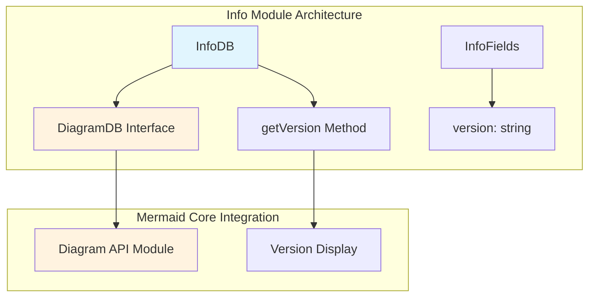
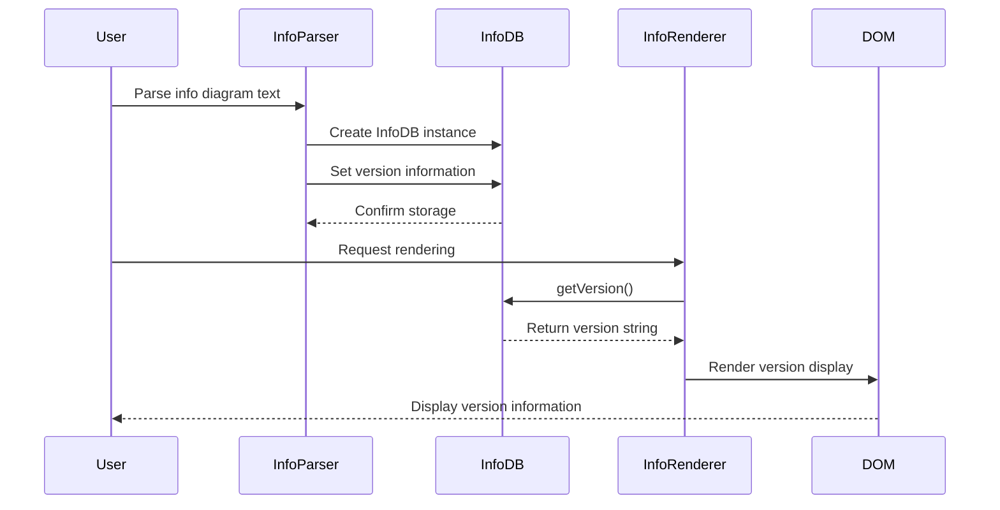
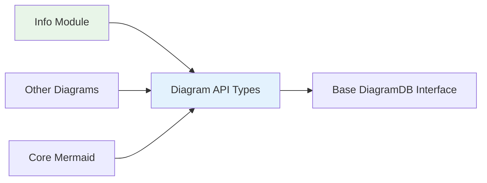
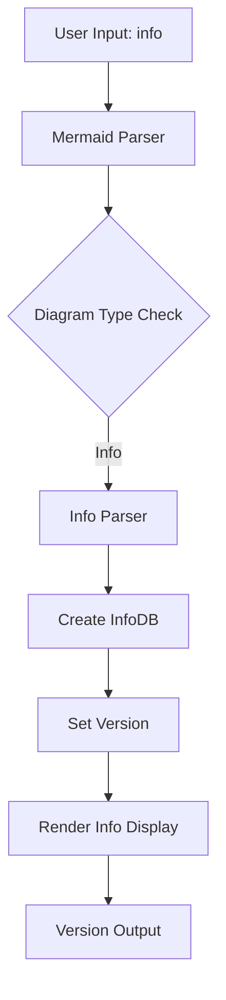

# Info Module Documentation

## Introduction

The Info module is a specialized diagram type within the Mermaid ecosystem that provides version information display functionality. It serves as a simple yet essential component for showing version details about the Mermaid library itself, making it useful for debugging, documentation, and system information purposes.

## Architecture Overview

The Info module follows Mermaid's standard diagram architecture pattern, implementing the core `DiagramDB` interface while maintaining minimal complexity focused specifically on version information management.



## Core Components

### InfoDB Interface

The `InfoDB` interface extends the base `DiagramDB` interface from the [diagram-api module](diagram-api.md) and adds version-specific functionality:

```typescript
interface InfoDB extends DiagramDB {
  getVersion: () => string;
}
```

**Key Characteristics:**
- Inherits all standard diagram database operations from `DiagramDB`
- Adds version retrieval capability through `getVersion()` method
- Provides a clean abstraction for version information management

### InfoFields Interface

The `InfoFields` interface defines the structure for version data storage:

```typescript
interface InfoFields {
  version: string;
}
```

**Purpose:**
- Encapsulates version information in a type-safe manner
- Provides a consistent data structure for version storage
- Enables easy extension for additional metadata if needed

## Data Flow



## Integration with Mermaid System

### Dependencies

The Info module has minimal dependencies, making it a lightweight component:



**Dependencies:**
- `DiagramDB` interface from [diagram-api module](diagram-api.md)
- No direct dependencies on other diagram types
- Minimal coupling with the broader Mermaid ecosystem

### Relationship to Other Modules

The Info module serves as a specialized implementation within the Mermaid diagram family:

- **Similar to other diagrams**: Implements the standard `DiagramDB` interface
- **Different from other diagrams**: Focused solely on version information rather than complex data visualization
- **Integration point**: Works seamlessly with Mermaid's parsing and rendering pipeline

## Usage Patterns

### Typical Use Cases

1. **System Information Display**: Showing Mermaid version in documentation
2. **Debugging Support**: Providing version context for troubleshooting
3. **Feature Compatibility**: Displaying version for feature availability checks

### Implementation Example



## Extensibility

The Info module's simple architecture allows for potential extensions:

- **Additional Metadata**: The `InfoFields` interface could be extended with more system information
- **Enhanced Display**: The rendering could be customized for different output formats
- **Version Comparison**: Future versions might include version comparison utilities

## Technical Specifications

### Type Safety

- Full TypeScript implementation with strict type checking
- Interface-based design ensures contract compliance
- Minimal runtime overhead due to simple data structure

### Performance Characteristics

- **Memory Usage**: Minimal - only stores version string
- **Processing Time**: Fast - simple data retrieval operation
- **Rendering Speed**: Quick - basic text display

## Error Handling

The Info module follows Mermaid's standard error handling patterns:

- Version information validation during parsing
- Graceful fallback for missing version data
- Consistent error reporting through the diagram API

## Testing Considerations

Due to its simplicity, the Info module requires focused testing on:

- Version string accuracy
- Interface compliance with `DiagramDB`
- Integration with the broader parsing pipeline
- Rendering output correctness

## Future Considerations

The Info module's architecture supports potential enhancements:

- Multi-version support for different Mermaid components
- Extended metadata beyond version information
- Integration with update checking mechanisms
- Customizable display formats for different contexts

---

*This documentation is part of the Mermaid diagram system. For information about other diagram types, see the [diagram modules documentation](diagram-types.md). For core system architecture, see [core-mermaid](core-mermaid.md).*