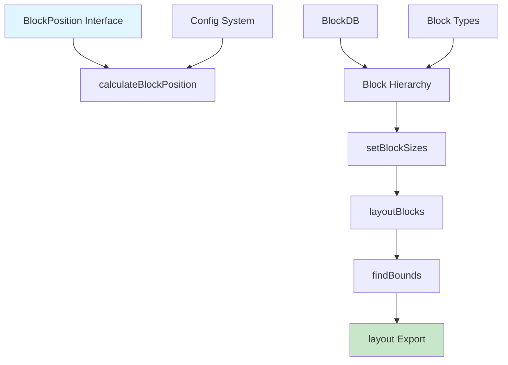
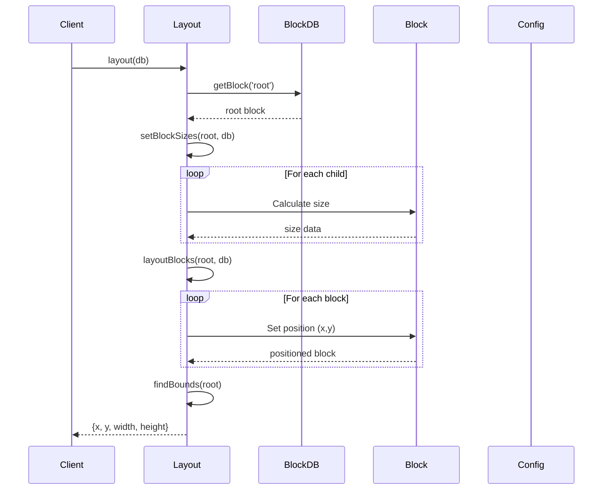
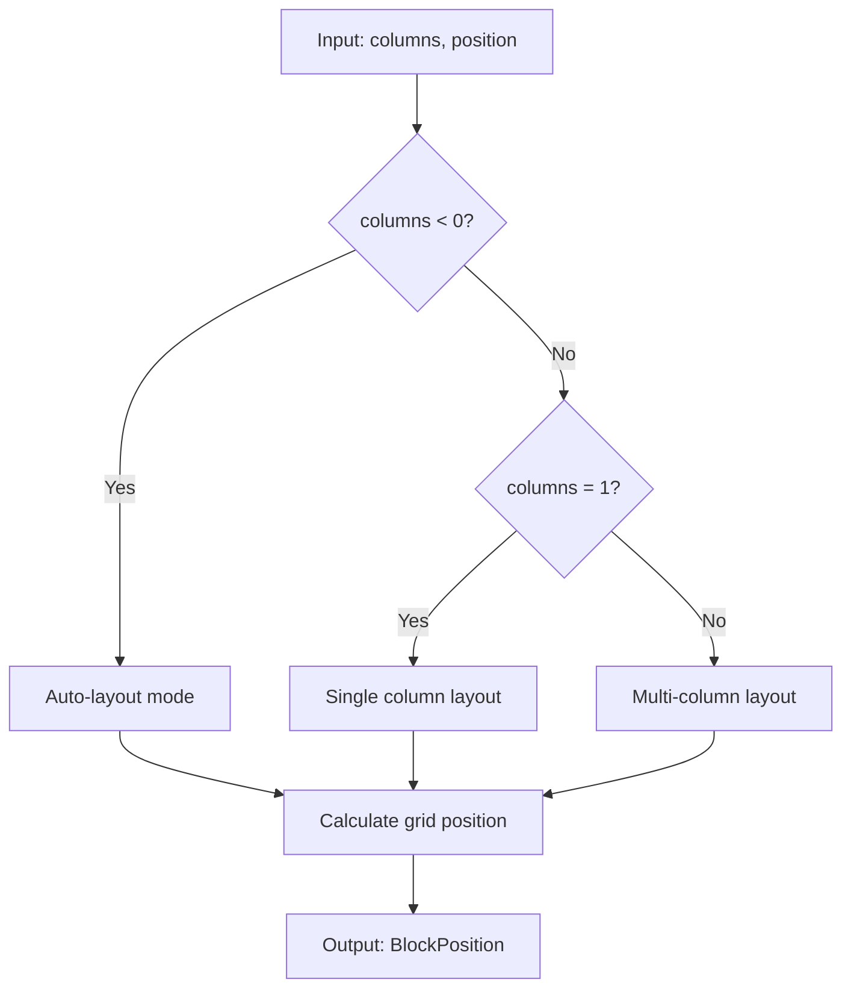
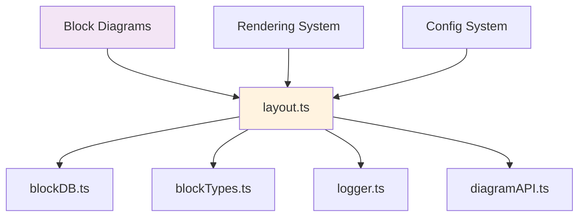

# Layout Module Documentation

## Introduction

The layout module is a core component of Mermaid's block diagram system, responsible for calculating and positioning blocks within a hierarchical structure. It provides the geometric layout engine that determines where each block should be placed on the canvas, handling complex scenarios like multi-column layouts, nested blocks, and dynamic sizing based on content.

## Core Functionality

The layout module serves as the spatial intelligence behind block diagrams, transforming abstract block hierarchies into concrete pixel coordinates. It handles:

- **Block positioning**: Calculating x,y coordinates for each block
- **Size management**: Determining optimal dimensions based on content and constraints
- **Layout algorithms**: Supporting both automatic and fixed-column layouts
- **Hierarchical nesting**: Managing parent-child relationships and relative positioning
- **Boundary detection**: Computing the total bounds of the entire diagram

## Architecture

### Component Structure



### Key Components

#### BlockPosition Interface
The fundamental data structure representing a block's position in the layout grid:

```typescript
interface BlockPosition {
  px: number;  // Position X in grid coordinates
  py: number;  // Position Y in grid coordinates
}
```

#### Layout Functions

1. **calculateBlockPosition**: Converts linear position to 2D grid coordinates
2. **setBlockSizes**: Recursively calculates optimal sizes for all blocks
3. **layoutBlocks**: Positions blocks based on calculated sizes and grid layout
4. **findBounds**: Determines the total bounding box of the entire diagram
5. **layout**: Main export function that orchestrates the entire layout process

## Data Flow



## Layout Algorithm

### Column-Based Layout System

The layout module implements a sophisticated column-based positioning system:



### Size Calculation Strategy

The sizing algorithm follows a bottom-up approach:

1. **Child Analysis**: Examine all children to find maximum dimensions
2. **Grid Calculation**: Determine optimal grid size based on column constraints
3. **Size Distribution**: Allocate space proportionally among children
4. **Parent Adjustment**: Resize parent to accommodate children with padding

### Positioning Logic

Positioning uses a top-down approach with these key principles:

- **Grid-based**: Uses calculated grid positions (px, py) for initial placement
- **Center-aligned**: Blocks are centered within their allocated grid cells
- **Parent-relative**: Child positions are relative to parent center
- **Padding-aware**: Includes configurable padding between blocks

## Integration with Mermaid System

### Dependencies



The layout module integrates with:

- **[blockDB](blockDB.md)**: Provides block hierarchy and data access
- **[blockTypes](blockTypes.md)**: Defines block structure and properties
- **[config](config.md)**: Supplies layout configuration parameters
- **[rendering-util](rendering-util.md)**: Feeds position data to rendering engine

### Configuration

Layout behavior is controlled through the Mermaid configuration system:

```typescript
const padding = getConfig()?.block?.padding ?? 8;
```

Key configuration options:
- `block.padding`: Space between blocks (default: 8px)
- `block.columns`: Number of columns for layout (-1 for auto)

## Usage Patterns

### Basic Layout

```typescript
import { layout } from './layout';

// Perform layout calculation
const bounds = layout(blockDB);
// Returns: { x, y, width, height } of entire diagram
```

### Layout with Custom Configuration

The layout automatically respects Mermaid's configuration system, allowing users to customize:

- Padding between blocks
- Column constraints
- Auto-layout behavior

## Error Handling

The layout module implements robust validation:

- **Column Validation**: Ensures columns is a non-zero integer
- **Position Validation**: Validates position as non-negative integer
- **Size Validation**: Handles missing or invalid size data gracefully

## Performance Considerations

### Optimization Strategies

1. **Lazy Calculation**: Only calculates sizes when necessary
2. **Caching**: Reuses calculated dimensions where possible
3. **Early Termination**: Stops processing for space blocks
4. **Efficient Algorithms**: Uses mathematical operations for grid calculations

### Complexity Analysis

- **Time Complexity**: O(n) where n is the total number of blocks
- **Space Complexity**: O(h) where h is the height of the block hierarchy
- **Grid Calculation**: O(1) per block using modulo arithmetic

## Extension Points

The layout module is designed for extensibility:

- **Custom Layout Algorithms**: New positioning strategies can be implemented
- **Additional Constraints**: New layout constraints can be added
- **Enhanced Sizing**: Custom size calculation logic can be integrated

## Related Documentation

- [Block Types](blockTypes.md) - Block data structures and properties
- [Block Database](blockDB.md) - Block hierarchy management
- [Rendering Utilities](rendering-util.md) - Visual rendering system
- [Configuration System](config.md) - Layout configuration options
- [Core Mermaid](core-mermaid.md) - Main Mermaid engine integration