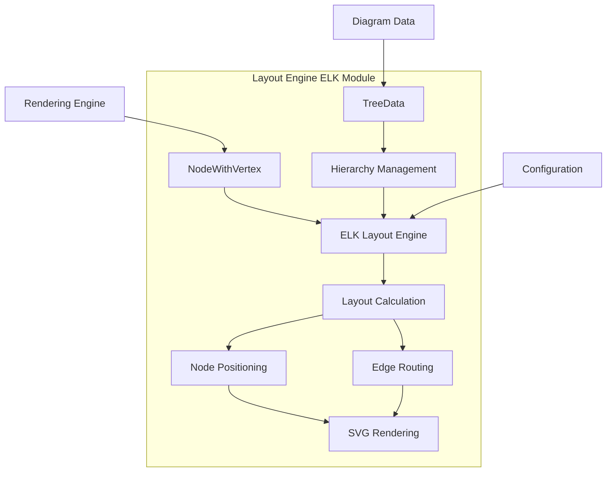
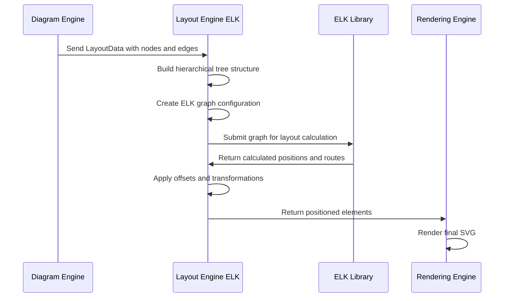
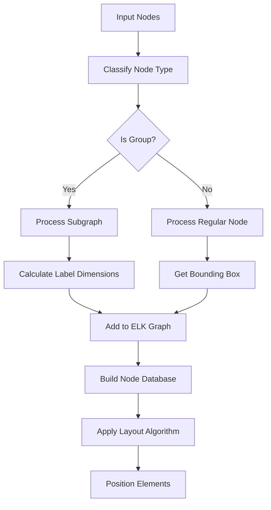
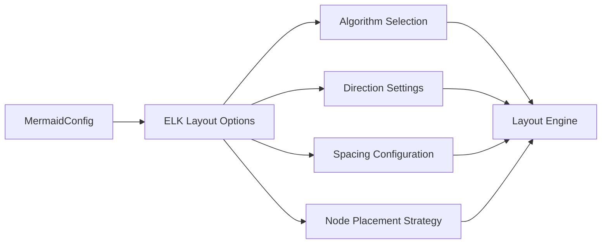

# Layout Engine ELK Module

## Introduction

The layout_engine_elk module provides advanced graph layout capabilities for Mermaid diagrams using the Eclipse Layout Kernel (ELK) library. This module is responsible for automatically positioning nodes and routing edges in complex diagrams, particularly flowcharts and hierarchical graphs, to create visually appealing and readable layouts.

## Purpose and Core Functionality

The primary purpose of this module is to:
- **Automated Layout**: Automatically position diagram elements (nodes, edges, subgraphs) using sophisticated layout algorithms
- **Hierarchical Layout**: Handle nested subgraphs and complex hierarchical structures
- **Edge Routing**: Calculate optimal paths for edges to avoid overlaps and crossings
- **Cross-platform Compatibility**: Provide consistent layout results across different platforms and browsers

## Architecture Overview

### Core Components

The module consists of two main components:

1. **NodeWithVertex** (`packages.mermaid-layout-elk.src.render.NodeWithVertex`): Enhanced node representation that includes layout-specific properties
2. **TreeData** (`packages.mermaid-layout-elk.src.find-common-ancestor.TreeData`): Data structure for managing hierarchical relationships between diagram elements

### System Architecture



## Component Details

### NodeWithVertex

The `NodeWithVertex` interface extends the basic node structure with layout-specific properties:

```typescript
interface NodeWithVertex extends Omit<Node, 'domId'> {
  children?: unknown[];
  labelData?: LabelData;
  domId?: Node['domId'] | SVGGroup | d3.Selection<SVGAElement, unknown, Element | null, unknown>;
}
```

**Key Features:**
- **Enhanced DOM Integration**: Supports multiple DOM element types for flexible rendering
- **Label Management**: Handles label dimensions and positioning data
- **Hierarchical Support**: Manages child nodes for subgraph structures
- **Layout Properties**: Stores calculated layout dimensions and positions

### TreeData

The `TreeData` interface provides hierarchical relationship management:

```typescript
interface TreeData {
  parentById: Record<string, string>;
  childrenById: Record<string, string[]>;
}
```

**Key Features:**
- **Parent-Child Relationships**: Tracks hierarchical connections between nodes
- **Common Ancestor Detection**: Efficiently finds shared ancestors in the hierarchy
- **Subgraph Management**: Enables proper handling of nested diagram structures

## Data Flow and Process Flow

### Layout Process Flow



### Node Processing Pipeline



## Integration with Mermaid System

### Dependencies

The layout_engine_elk module integrates with several other Mermaid components:

- **[Rendering Engine](rendering_engine.md)**: Provides base rendering utilities and data types
- **[Diagram Plugin API](diagram_plugin_api.md)**: Supplies diagram definitions and configuration
- **[Mermaid Core API](mermaid_core_api.md)**: Offers main API interfaces and configuration management

### Configuration Integration



## Key Algorithms and Features

### Layout Algorithms

The module supports multiple ELK layout algorithms:

1. **Layered Algorithm**: Optimized for hierarchical diagrams
2. **Force-based Layout**: Suitable for general graphs
3. **Tree Layout**: Specialized for tree structures
4. **Circular Layout**: For circular arrangement of nodes

### Edge Routing Features

- **Automatic Path Calculation**: Finds optimal routes avoiding node overlaps
- **Intersection Handling**: Properly handles edge-node intersections
- **Diamond Shape Support**: Special handling for diamond-shaped nodes
- **Label Placement**: Strategic positioning of edge labels

### Subgraph Management

- **Hierarchical Handling**: Proper layout of nested subgraphs
- **Common Ancestor Detection**: Efficient subgraph relationship management
- **Offset Calculation**: Accurate positioning within parent containers
- **Boundary Respect**: Edges properly respect subgraph boundaries

## Usage Patterns

### Basic Integration

The layout engine is typically used as part of the diagram rendering pipeline:

1. **Data Preparation**: Convert diagram data to layout-compatible format
2. **Layout Calculation**: Submit to ELK for automatic positioning
3. **Result Processing**: Apply calculated positions to DOM elements
4. **Rendering**: Finalize visual representation

### Advanced Configuration

The module supports extensive configuration through the Mermaid config system:

- **Algorithm Selection**: Choose appropriate layout algorithm
- **Direction Control**: Set graph flow direction (LR, RL, TB, BT)
- **Spacing Tuning**: Adjust node and edge spacing
- **Node Placement**: Configure node positioning strategies

## Performance Considerations

### Optimization Strategies

- **Lazy DOM Creation**: Nodes created only when needed for size calculation
- **Efficient Tree Traversal**: Optimized algorithms for hierarchy processing
- **Batch Operations**: Grouped DOM updates for better performance
- **Memory Management**: Proper cleanup of temporary data structures

### Scalability

- **Large Graph Support**: Handles diagrams with hundreds of nodes
- **Hierarchical Efficiency**: Optimized for deeply nested structures
- **Incremental Updates**: Supports partial layout recalculation

## Error Handling and Edge Cases

### Common Issues Addressed

- **Circular Dependencies**: Detection and handling of circular references
- **Invalid Hierarchies**: Graceful handling of malformed subgraph structures
- **Missing Nodes**: Proper handling of edges to non-existent nodes
- **Dimension Conflicts**: Resolution of conflicting size requirements

### Robustness Features

- **Fallback Mechanisms**: Alternative approaches when primary methods fail
- **Validation Checks**: Comprehensive input validation
- **Graceful Degradation**: Continued operation with reduced functionality
- **Detailed Logging**: Comprehensive logging for debugging

## Future Enhancements

### Planned Improvements

- **Performance Optimization**: Further speed improvements for large diagrams
- **Additional Algorithms**: Support for more specialized layout algorithms
- **Interactive Features**: Support for user-driven layout adjustments
- **Export Capabilities**: Enhanced support for different output formats

### Extension Points

- **Custom Algorithms**: Plugin system for custom layout algorithms
- **Constraint System**: Support for user-defined layout constraints
- **Animation Support**: Smooth transitions during layout changes
- **Accessibility**: Enhanced support for screen readers and assistive technologies