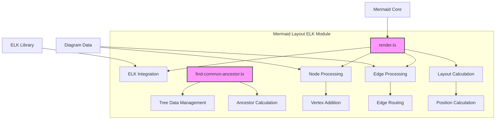
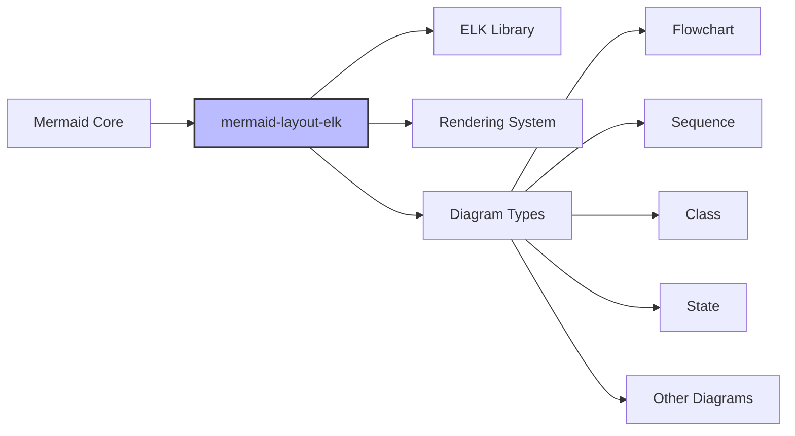

# Mermaid Layout ELK Module Documentation

## Overview

The `mermaid-layout-elk` module is a specialized layout engine for Mermaid diagrams that integrates the Eclipse Layout Kernel (ELK) to provide advanced automatic layout capabilities. This module serves as a bridge between Mermaid's diagram definitions and ELK's sophisticated layout algorithms, enabling high-quality diagram layouts with minimal manual configuration.

## Purpose

The primary purpose of this module is to:
- Provide automatic layout capabilities for complex diagrams using ELK algorithms
- Handle hierarchical and nested diagram structures efficiently
- Optimize edge routing and node positioning for improved readability
- Support various layout directions and strategies
- Manage subgraph relationships and edge intersections

## Architecture



## Core Components

### 1. Render Engine ([render.md](render.md))

The render engine is the main component responsible for orchestrating the layout process. It:
- Initializes ELK with appropriate configuration
- Processes diagram nodes and edges
- Manages hierarchical subgraph structures
- Calculates final positions and routes
- Handles edge intersections and shape-specific routing

**Key Interfaces:**
- `LabelData`: Contains dimensions and styling information for node labels
- `NodeWithVertex`: Extended node interface with ELK-specific properties

### 2. Tree Data Management ([find-common-ancestor.md](find-common-ancestor.md))

This utility component manages the hierarchical relationships between diagram elements:
- Maintains parent-child relationships
- Provides common ancestor calculation for edge routing
- Supports hierarchical layout decisions

**Key Interface:**
- `TreeData`: Structure for managing parent-child relationships in diagrams

## Integration with Mermaid Ecosystem



The module integrates with various Mermaid diagram types through the standard rendering pipeline, providing layout services when the ELK algorithm is specified.

## Key Features

### 1. Automatic Layout Algorithms
- Hierarchical layout with multiple strategies
- Edge routing optimization
- Node placement with collision avoidance
- Support for different layout directions (LR, RL, TB, BT)

### 2. Subgraph Support
- Nested diagram structures
- Hierarchical edge routing
- Parent-child relationship management
- Subgraph-specific layout options

### 3. Edge Processing
- Smart edge routing around nodes
- Intersection calculation for different shapes
- Support for various arrow types and styles
- Label positioning along edges

### 4. Shape-Specific Handling
- Custom intersection logic for diamonds
- Rectangle boundary calculations
- Support for complex node shapes
- Padding and margin considerations

## Configuration Options

The module supports various ELK-specific configuration options:

```typescript
{
  elk: {
    algorithm: 'layered',
    nodePlacementStrategy: 'BRANDES_KOEPF',
    mergeEdges: true,
    forceNodeModelOrder: true,
    considerModelOrder: 'NODES_AND_EDGES',
    cycleBreakingStrategy: 'GREEDY'
  }
}
```

## Usage

The module is typically used internally by Mermaid when ELK layout is requested. Diagram authors can enable ELK layout by specifying the algorithm in their diagram configuration.

## Dependencies

- **ELK Library**: Core layout algorithms
- **Mermaid Core**: Integration with diagram parsing and rendering
- **D3.js**: SVG manipulation and curve calculations

## Performance Considerations

- Layout calculation is performed asynchronously
- Large diagrams may require additional processing time
- Subgraph hierarchies are processed recursively
- Edge routing complexity increases with diagram density

## Future Enhancements

Potential areas for improvement include:
- Additional ELK algorithm support
- Performance optimizations for large diagrams
- Enhanced shape-specific routing
- Better handling of edge-label collisions

---

For detailed information about sub-modules, see:
- [render.md](render.md) - Main rendering engine
- [find-common-ancestor.md](find-common-ancestor.md) - Tree data management utilities