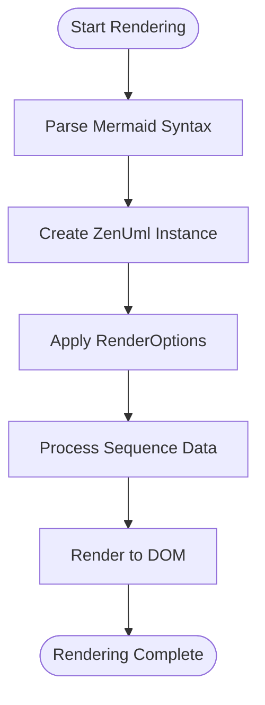

# Mermaid-ZenUML Module Documentation

## Introduction

The Mermaid-ZenUML module is a specialized integration component that bridges the Mermaid diagramming library with ZenUML, a powerful tool for creating sequence diagrams. This module enables Mermaid users to leverage ZenUML's advanced sequence diagram capabilities while maintaining the familiar Mermaid syntax and integration patterns.

## Module Purpose and Core Functionality

The primary purpose of the mermaid-zenuml module is to provide a seamless integration between Mermaid's diagram rendering infrastructure and ZenUML's specialized sequence diagram engine. This integration allows users to create sophisticated sequence diagrams with enhanced features and styling options that go beyond Mermaid's native sequence diagram capabilities.

### Key Features

- **ZenUML Integration**: Provides a TypeScript interface to the ZenUML core library
- **Theme Support**: Supports custom theming options for sequence diagrams
- **Rendering Options**: Configurable rendering modes and styling
- **Promise-based API**: Asynchronous rendering for better performance
- **DOM Integration**: Direct DOM element manipulation for diagram rendering

## Architecture Overview

### Component Structure


### Integration Architecture


## Core Components

### ZenUml Class

The `ZenUml` class is the primary interface between Mermaid and the ZenUML core library. It provides a simplified API for rendering sequence diagrams while handling the complexity of the underlying ZenUML implementation.

**Key Responsibilities:**
- Initialize ZenUML with a DOM container
- Process sequence diagram text
- Apply rendering options and themes
- Manage the rendering lifecycle

**Constructor:**
```typescript
constructor(container: Element)
```

**Main Method:**
```typescript
render(text: string, options?: RenderOptions): Promise<void>
```

### RenderOptions Interface

The `RenderOptions` interface defines the configuration options available for customizing the appearance and behavior of rendered sequence diagrams.

**Properties:**
- `theme?: string` - Specifies the visual theme for the diagram
- `mode?: string` - Defines the rendering mode

## Data Flow

### Rendering Process Flow



### Configuration Flow


## Integration with Mermaid Core

### Diagram Definition Integration

The mermaid-zenuml module integrates with Mermaid's diagram definition system through the [diagram-api module](diagram-api.md). This integration follows the standard pattern for external diagram types:

1. **Diagram Registration**: ZenUML diagrams are registered as a valid diagram type
2. **Parser Integration**: Sequence diagram text is parsed and validated
3. **Renderer Registration**: The ZenUml renderer is registered with the diagram API
4. **Style Integration**: Theme and styling options are coordinated with Mermaid's theme system

### Configuration Management

The module leverages Mermaid's configuration system through the [config module](config.md), specifically:

- **BaseDiagramConfig**: Inherits common diagram configuration options
- **Theme Integration**: Coordinates with Mermaid's theme system for consistent styling
- **Font Configuration**: Utilizes Mermaid's font configuration for text rendering

## Dependencies and Relationships

### Internal Dependencies


### External Dependencies

- **@zenuml/core**: The core ZenUML library that provides sequence diagram rendering capabilities
- **DOM API**: Standard browser DOM manipulation for rendering

## Usage Patterns

### Basic Usage

```typescript
// Initialize ZenUML with a DOM container
const zenuml = new ZenUml(containerElement);

// Render a sequence diagram
await zenuml.render(`
  @Alice->Bob: Hello
  Bob-->Alice: Hi!
`, {
  theme: 'default',
  mode: 'svg'
});
```

### Integration with Mermaid

The module is typically used internally by Mermaid when processing sequence diagrams with ZenUML syntax:

```typescript
// Mermaid processes the diagram text
const diagramText = `
  sequenceDiagram
    ZenUML syntax here
`;

// Mermaid determines it's a ZenUML diagram
// Creates ZenUml instance and renders
```

## Extension Points

### Custom Themes

Developers can extend the module by:

1. **Custom Theme Development**: Creating new themes that work with both Mermaid and ZenUML
2. **Render Mode Extensions**: Adding new rendering modes for specific use cases
3. **Plugin Integration**: Extending the ZenUml class with additional functionality

### Configuration Extensions

The module can be extended through:

- **RenderOptions Expansion**: Adding new configuration options
- **Theme System Integration**: Creating theme-specific configurations
- **Performance Optimization**: Adding caching and optimization options

## Performance Considerations

### Rendering Optimization

- **Asynchronous Rendering**: Uses Promise-based API to avoid blocking
- **DOM Efficiency**: Direct DOM manipulation for optimal performance
- **Memory Management**: Proper cleanup of ZenUML instances

### Best Practices

1. **Instance Reuse**: Reuse ZenUml instances when possible
2. **Option Caching**: Cache render options for repeated renders
3. **Error Handling**: Implement proper error handling for failed renders

## Error Handling

### Common Error Scenarios

- **Invalid DOM Element**: Ensure container element exists before initialization
- **Parse Errors**: Handle invalid sequence diagram syntax gracefully
- **Render Failures**: Implement fallback rendering options
- **Theme Loading**: Handle missing or invalid theme configurations

### Error Recovery

The module should implement proper error recovery mechanisms:

1. **Graceful Degradation**: Fall back to basic rendering on errors
2. **User Feedback**: Provide meaningful error messages
3. **Logging**: Log errors for debugging purposes

## Future Enhancements

### Planned Features

- **Enhanced Theme Support**: More comprehensive theme integration
- **Performance Optimization**: Better caching and rendering optimization
- **Extended Syntax Support**: Additional sequence diagram features
- **Mobile Optimization**: Improved rendering for mobile devices

### Integration Improvements

- **Better Mermaid Integration**: Closer integration with Mermaid's core features
- **Plugin Architecture**: Support for custom plugins and extensions
- **Configuration API**: More comprehensive configuration options

## Related Documentation

- [Core Mermaid Module](core-mermaid.md) - Core Mermaid functionality and architecture
- [Diagram API Module](diagram-api.md) - Diagram definition and registration system
- [Config Module](config.md) - Configuration management and theme system
- [Themes Module](themes.md) - Theme system and styling options
- [Sequence Diagram Module](sequence.md) - Native Mermaid sequence diagrams

## Conclusion

The mermaid-zenuml module represents a strategic integration that enhances Mermaid's sequence diagram capabilities by leveraging ZenUML's specialized rendering engine. This module demonstrates Mermaid's extensibility and commitment to providing users with the best possible diagramming experience through strategic partnerships and integrations.

The modular architecture ensures that ZenUML integration remains maintainable and extensible while providing users with powerful sequence diagram capabilities that complement Mermaid's native features.