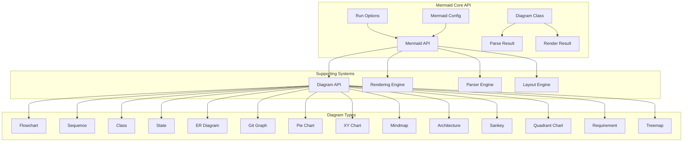
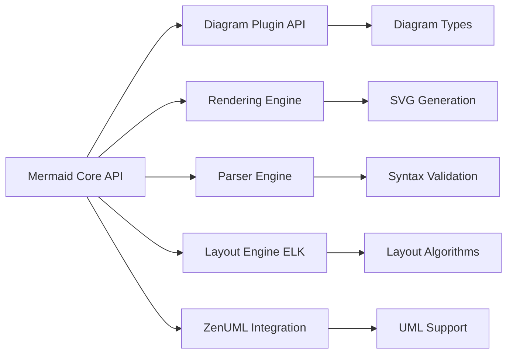

# Mermaid Core API Documentation

## Overview

The Mermaid Core API module is the central integration point for the Mermaid diagramming framework. It provides the primary interface for rendering diagrams, managing configurations, and orchestrating the various subsystems that make up the Mermaid ecosystem. This module serves as the main entry point for web page integration and handles the complete diagram lifecycle from parsing to rendering.

## Purpose and Core Functionality

The Mermaid Core API module is responsible for:

- **Web Page Integration**: Automatically detecting and rendering Mermaid diagrams in HTML documents
- **Configuration Management**: Handling global and diagram-specific configuration options
- **Diagram Lifecycle Management**: Orchestrating the parsing, validation, and rendering pipeline
- **Error Handling**: Providing comprehensive error reporting and recovery mechanisms
- **Plugin Architecture**: Supporting external diagram types and custom renderers
- **Performance Optimization**: Managing rendering queues and lazy loading of diagram types

## Architecture Overview



## Core Components

### Mermaid API (`packages.mermaid.src.mermaid.Mermaid`)

The main API object that provides the primary interface for Mermaid functionality. It includes:

- **Primary Methods**:
  - `run()`: Automatically finds and renders diagrams in the document
  - `render()`: Renders a specific diagram definition to SVG
  - `parse()`: Validates diagram syntax without rendering
  - `initialize()`: Sets up global configuration
  - `registerExternalDiagrams()`: Adds support for custom diagram types

- **Configuration Management**:
  - Global configuration handling via `MermaidConfig`
  - Runtime configuration updates
  - Theme and styling management

- **Error Handling**:
  - Comprehensive error reporting through `parseError` callback
  - Graceful degradation with `suppressErrors` option
  - Detailed error objects with context information

### Run Options (`packages.mermaid.src.mermaid.RunOptions`)

Configuration object for the `run()` method that controls:

- **Element Selection**: Query selectors or direct node references
- **Rendering Callbacks**: Post-render hooks for custom processing
- **Error Handling**: Suppression and custom error handling
- **Processing Control**: Selective diagram processing

### Diagram Class (`packages.mermaid.src.Diagram.Diagram`)

The core abstraction for diagram instances that provides:

- **Diagram Lifecycle**: Creation from text, parsing, and rendering
- **Type Detection**: Automatic diagram type identification
- **Component Integration**: Coordination with parsers, databases, and renderers
- **Lazy Loading**: On-demand loading of diagram-specific components

### Configuration System (`packages.mermaid.src.config.type.MermaidConfig`)

Comprehensive configuration system featuring:

- **Global Settings**: Themes, security, performance options
- **Diagram-Specific Configs**: Individual settings for each diagram type
- **Font Management**: Typography controls with calculator functions
- **Layout Options**: Rendering engine selection and layout parameters
- **Security Settings**: Content security and sanitization controls

### Result Types

- **ParseResult** (`packages.mermaid.src.types.ParseResult`): Validation results with diagram type and configuration
- **RenderResult** (`packages.mermaid.src.types.RenderResult`): Rendering output with SVG and binding functions

## Key Features

### 1. Automatic Document Processing

The module automatically scans documents for Mermaid diagrams and processes them with intelligent caching and error handling.

### 2. Extensible Architecture

Supports plugin-based extensions for custom diagram types and rendering engines through a well-defined API.

### 3. Performance Optimization

Implements rendering queues, lazy loading, and caching mechanisms to handle multiple diagrams efficiently.

### 4. Comprehensive Error Handling

Provides detailed error reporting with context information and multiple error recovery strategies.

### 5. Security Features

Includes content sanitization, secure configuration management, and protection against malicious diagram definitions.

## Integration with Sub-modules

The Mermaid Core API orchestrates several specialized sub-modules:

- **[Diagram Plugin API](diagram_plugin_api.md)**: Manages diagram type definitions and registration
- **[Rendering Engine](rendering_engine.md)**: Handles SVG generation and DOM manipulation
- **[Parser Engine](parser_engine.md)**: Provides parsing infrastructure for diagram syntax
- **[Layout Engine (ELK)](layout_engine_elk.md)**: Advanced layout algorithms for complex diagrams
- **[ZenUML Integration](zenuml_integration.md)**: Specialized support for UML diagrams

### Sub-module Architecture



## Diagram Type Support

The core API supports numerous diagram types, each with specialized configuration:

- **Flowcharts**: Process flow and decision trees
- **Sequence Diagrams**: Object interaction timelines
- **Class Diagrams**: Object-oriented structure modeling
- **State Diagrams**: State machine representation
- **ER Diagrams**: Entity-relationship modeling
- **Git Graphs**: Version control visualization
- **Charts**: Pie, XY, Quadrant, and Treemap charts
- **Specialized**: Mindmap, Architecture, Sankey, and Requirement diagrams

## Usage Patterns

### Basic Usage
```javascript
// Initialize and run
mermaid.initialize({ theme: 'dark' });
await mermaid.run();
```

### Advanced Usage
```javascript
// Custom rendering with error handling
const { svg, bindFunctions } = await mermaid.render('diagram-id', diagramText);
element.innerHTML = svg;
bindFunctions?.(element);
```

### Configuration Management
```javascript
// Global configuration
mermaid.initialize({
  theme: 'forest',
  flowchart: { curve: 'basis' },
  securityLevel: 'strict'
});
```

## Error Handling and Debugging

The module provides comprehensive error handling with:

- **Parse Error Callbacks**: Custom error handling functions
- **Detailed Error Objects**: Context-rich error information
- **Graceful Degradation**: Optional error suppression for production
- **Logging Integration**: Configurable logging levels and outputs

## Performance Considerations

- **Rendering Queues**: Serial processing to prevent resource conflicts
- **Lazy Loading**: On-demand loading of diagram components
- **Caching**: Intelligent caching of parsed diagrams and configurations
- **Memory Management**: Proper cleanup and garbage collection

## Security Considerations

- **Content Sanitization**: DOMPurify integration for XSS prevention
- **Configuration Security**: Secure configuration key management
- **Script Injection Prevention**: Protection against malicious diagram content
- **Sandbox Mode**: Optional sandboxing for untrusted content

This documentation provides a comprehensive overview of the Mermaid Core API module. For detailed information about specific sub-modules, refer to their individual documentation files.