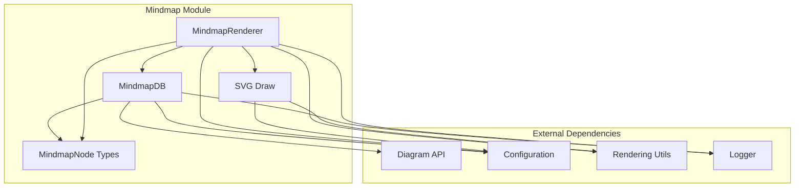
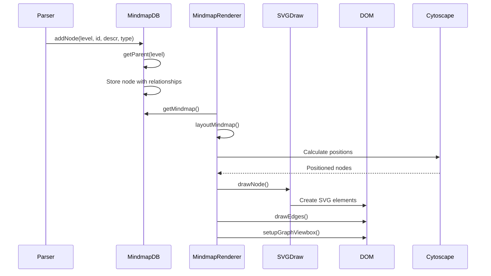
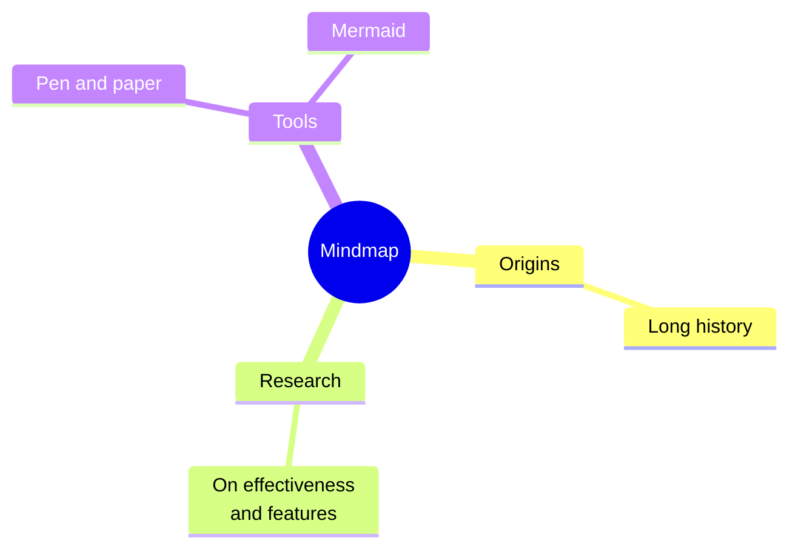

# Mindmap Module Documentation

## Overview

The mindmap module is a specialized diagram type within the Mermaid.js library that enables the creation of hierarchical mind map visualizations. It provides functionality to parse mind map syntax, manage node data structures, and render interactive mind map diagrams with various node shapes and styles.

## Purpose

The mindmap module serves as a complete implementation for creating mind map diagrams, which are visual representations of hierarchical information organized around a central concept. It handles:

- Parsing of mind map syntax and node definitions
- Management of hierarchical node relationships
- Layout calculation and positioning of nodes
- Rendering of nodes with different shapes and styles
- Edge drawing between parent and child nodes

## Architecture

## Core Components

### 1. MindmapDB ([`mindmapDb.ts`](mindmapDb.md))
The database component responsible for managing mind map node data and hierarchical relationships. It provides methods for adding nodes, managing parent-child relationships, and storing node metadata.

**Key Responsibilities:**
- Node storage and management
- Hierarchical relationship tracking
- Node type determination based on syntax
- Element reference management for rendering

### 2. MindmapNode Types ([`mindmapTypes.ts`](mindmapTypes.md))
Defines the data structures used to represent mind map nodes and their properties.

**Key Types:**
- `MindmapNode`: Core interface for mind map nodes
- `FilledMindMapNode`: Deep-required version of MindmapNode

### 3. MindmapRenderer ([`mindmapRenderer.ts`](mindmapRenderer.md))
Handles the rendering process including layout calculation, node positioning, and edge drawing. Uses Cytoscape.js for automatic layout algorithms.

**Key Responsibilities:**
- Node layout calculation using Cytoscape
- SVG element creation and positioning
- Edge drawing between nodes
- View box setup and sizing

## Data Flow

## Node Types

The mindmap module supports various node shapes determined by syntax:

| Syntax | Node Type | Description |
|--------|-----------|-------------|
| `[]` | Rectangle | Standard rectangular node |
| `()` | Rounded Rectangle | Rectangle with rounded corners |
| `(())` | Circle | Circular node |
| `))` | Bang | Exclamation mark style |
| `{{` | Hexagon | Hexagonal node |
| `)` | Cloud | Cloud-shaped node |
| Default | No Border | Minimal border style |

## Integration with Mermaid

The mindmap module integrates with the broader Mermaid ecosystem through:

- **Configuration System**: Uses Mermaid's configuration for styling and behavior
- **Rendering Pipeline**: Follows standard Mermaid rendering flow
- **Theme Support**: Inherits theme configurations from the main library
- **API Consistency**: Implements standard diagram API interfaces

## Dependencies

- **Core Mermaid**: Base configuration and utilities
- **Diagram API**: Standard diagram interfaces and types
- **Rendering Utils**: Common rendering functions and helpers
- **Cytoscape.js**: Layout calculation engine
- **D3.js**: DOM manipulation and SVG creation

## Usage

The mindmap module is typically used through Mermaid's main API:

## Related Documentation

- [Core Mermaid API](core-mermaid.md)
- [Configuration System](config.md)
- [Rendering Utilities](rendering-util.md)
- [Diagram API](diagram-api.md)