# MindmapDB Module Documentation

## Introduction

The MindmapDB module is a core component of the Mermaid.js library that provides data management and storage capabilities for mindmap diagrams. It serves as the central database for mindmap nodes, handling node creation, hierarchical relationships, and node decorations. This module implements the `DiagramDB` interface and works in conjunction with the mindmap parser and renderer to create interactive hierarchical mindmap visualizations.

## Architecture Overview

The MindmapDB module follows a hierarchical data structure pattern where nodes are organized in a tree-like structure with parent-child relationships. Each node can have multiple children but only one parent, forming a directed acyclic graph that represents the mindmap structure.

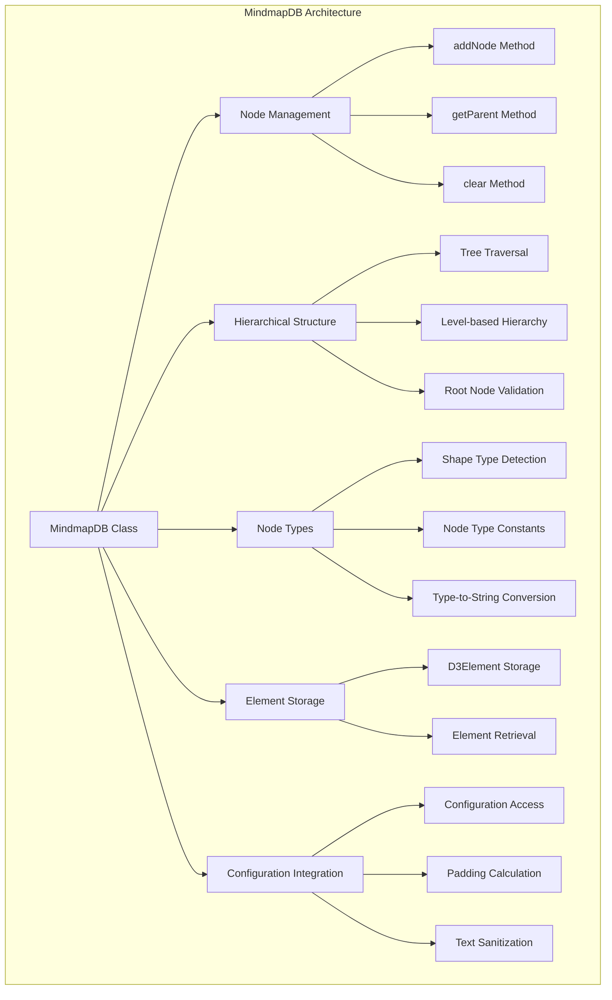

## Core Components

### MindmapDB Class

The `MindmapDB` class is the primary component that implements the database functionality for mindmap diagrams. It manages the complete lifecycle of mindmap nodes and provides methods for node manipulation and retrieval.

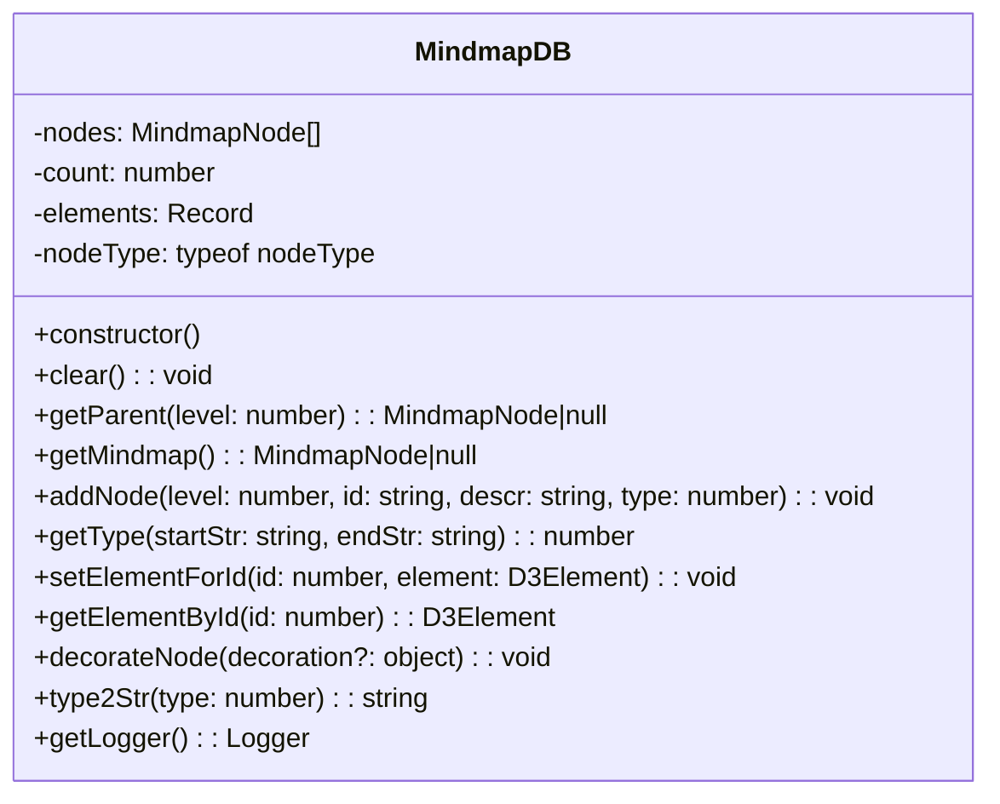

## Data Flow

The following diagram illustrates the data flow within the MindmapDB module:

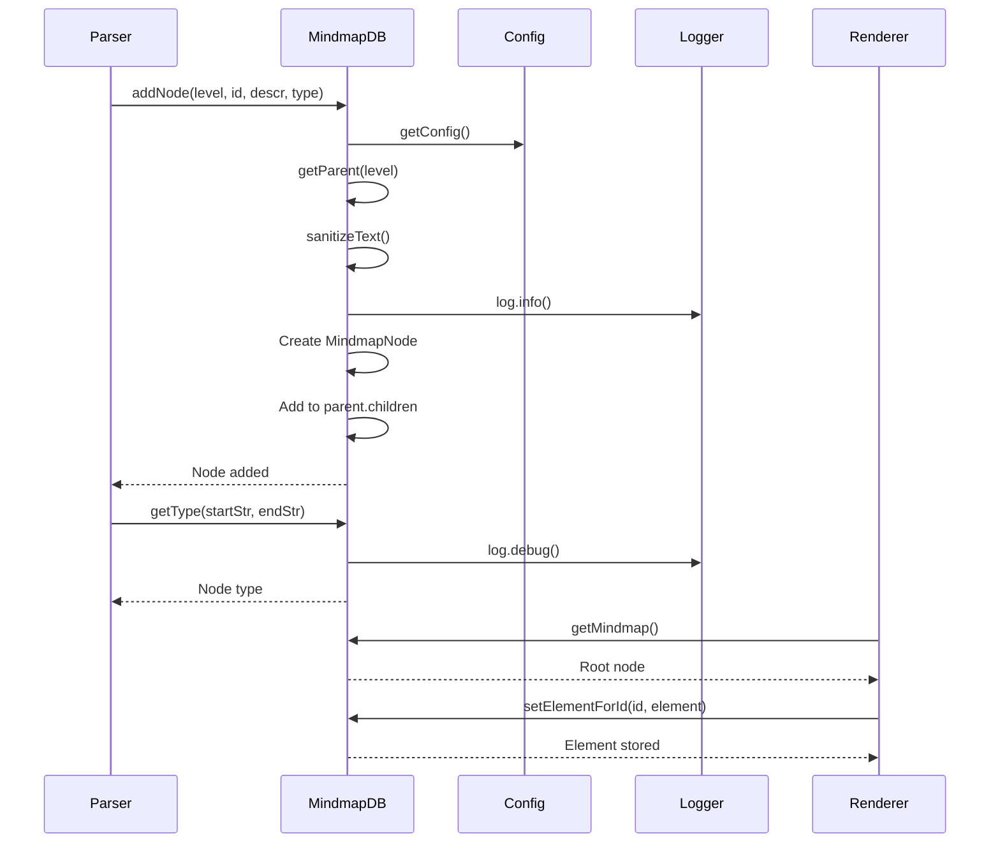

## Node Types and Shapes

The MindmapDB module supports various node shapes that are determined by parsing the syntax tokens:

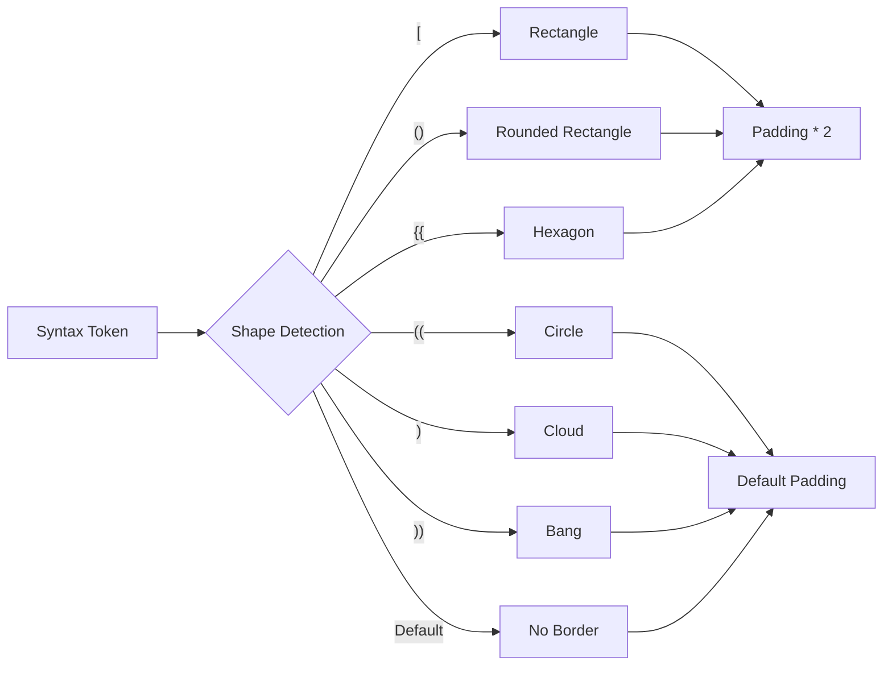

## Hierarchical Structure Management

The module implements a level-based hierarchical system where each node's position in the tree is determined by its level:

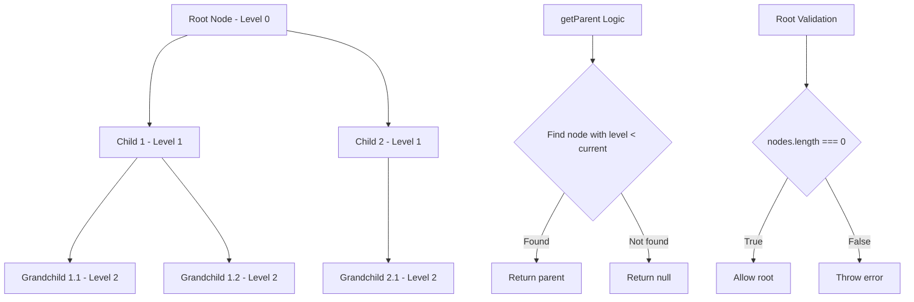

## Integration with Other Modules

The MindmapDB module integrates with several other modules in the Mermaid ecosystem:

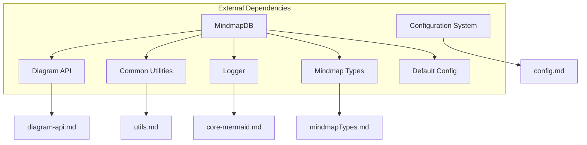

## Configuration Integration

The module integrates with Mermaid's configuration system to apply styling and layout options:

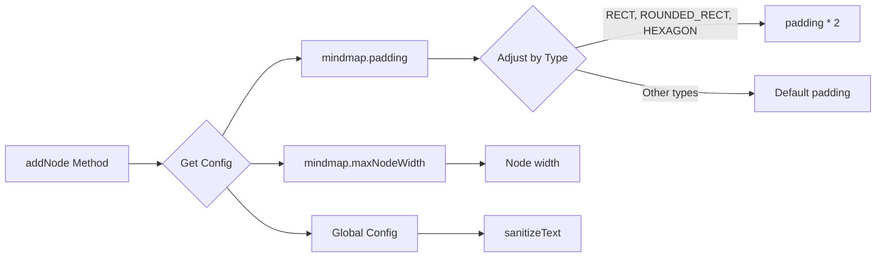

## Error Handling

The module implements specific error handling for mindmap structure validation:

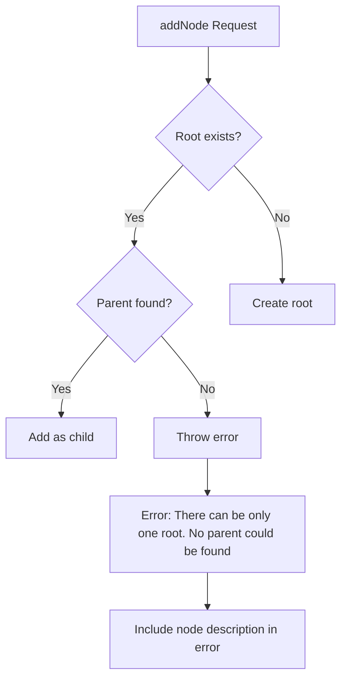

## Node Decoration System

The module supports node decoration through CSS classes and icons:

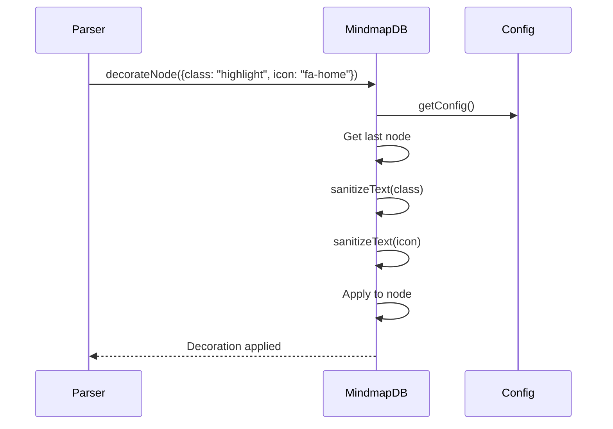

## Element Storage and Retrieval

The module provides a mechanism for storing and retrieving D3 elements associated with nodes:

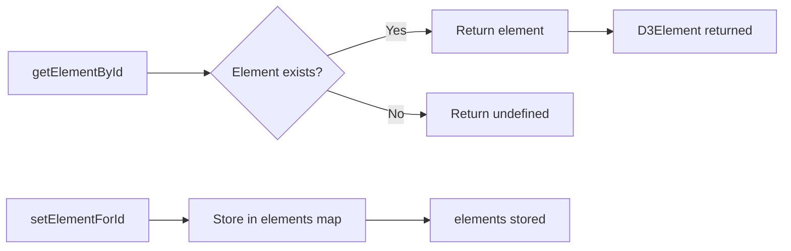

## Type Conversion and String Representation

The module provides methods for converting between numeric types and string representations:

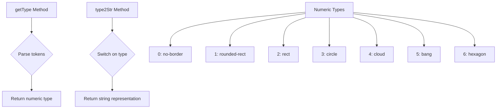

## Performance Considerations

The MindmapDB module is designed with performance in mind:

1. **Efficient Parent Lookup**: The `getParent` method iterates backwards through the nodes array, ensuring the most recently added nodes are checked first.

2. **Memory Management**: The `clear` method resets all internal data structures, preventing memory leaks in long-running applications.

3. **Lazy Initialization**: Node decorations are only applied when explicitly requested, reducing unnecessary processing.

4. **Type Safety**: The use of TypeScript ensures type safety and reduces runtime errors.

## Usage Examples

The MindmapDB module is typically used in conjunction with the mindmap parser and renderer:

```typescript
// Example usage pattern (not actual implementation)
const mindmapDB = new MindmapDB();

// Add nodes
mindmapDB.addNode(0, "root", "Root Node", mindmapDB.nodeType.DEFAULT);
mindmapDB.addNode(1, "child1", "Child 1", mindmapDB.nodeType.RECT);
mindmapDB.addNode(1, "child2", "Child 2", mindmapDB.nodeType.CIRCLE);

// Get the mindmap structure
const root = mindmapDB.getMindmap();

// Decorate nodes
mindmapDB.decorateNode({ class: "highlight", icon: "fa-star" });
```

## Related Documentation

- [mindmapTypes.md](mindmapTypes.md) - Mindmap node type definitions
- [mindmapRenderer.md](mindmapRenderer.md) - Mindmap rendering components
- [diagram-api.md](diagram-api.md) - General diagram API documentation
- [config.md](config.md) - Configuration system documentation
- [core-mermaid.md](core-mermaid.md) - Core Mermaid functionality

## Summary

The MindmapDB module serves as the central data management system for mindmap diagrams in Mermaid.js. It provides a robust, hierarchical data structure that supports various node shapes, decorations, and configuration options. The module's design ensures efficient node management while maintaining integration with the broader Mermaid ecosystem through configuration, logging, and utility systems.