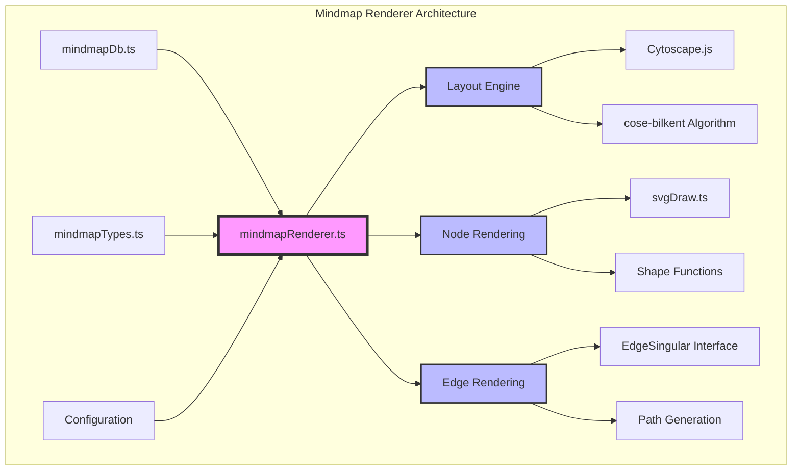
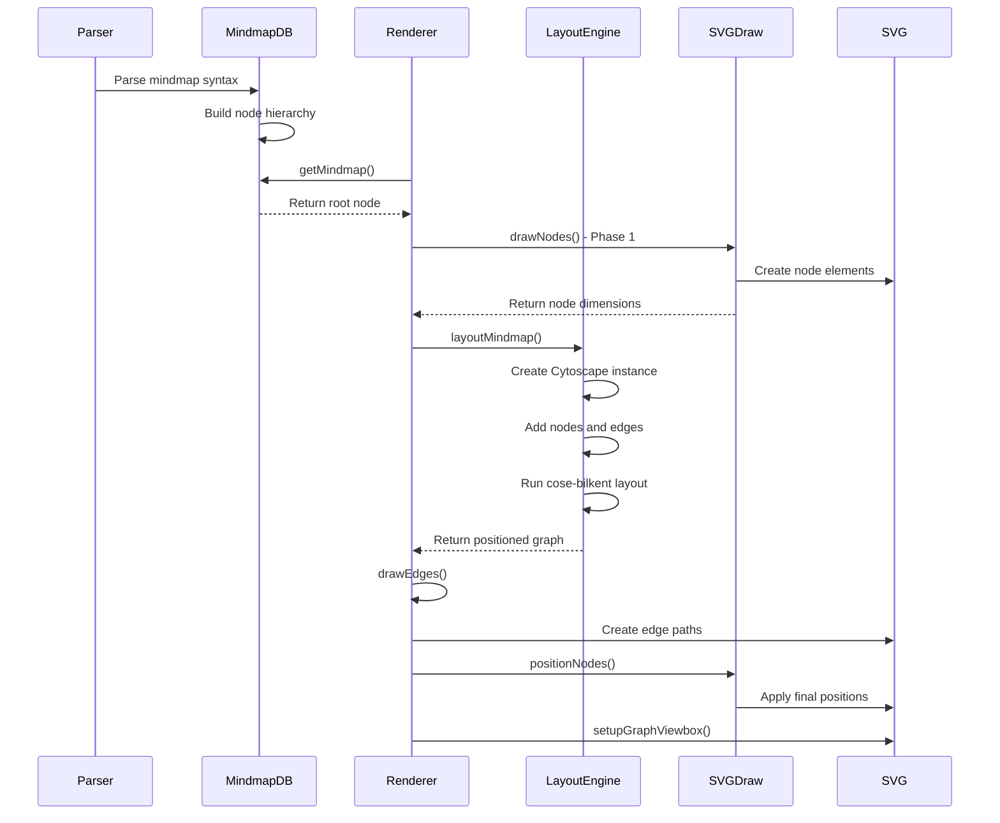
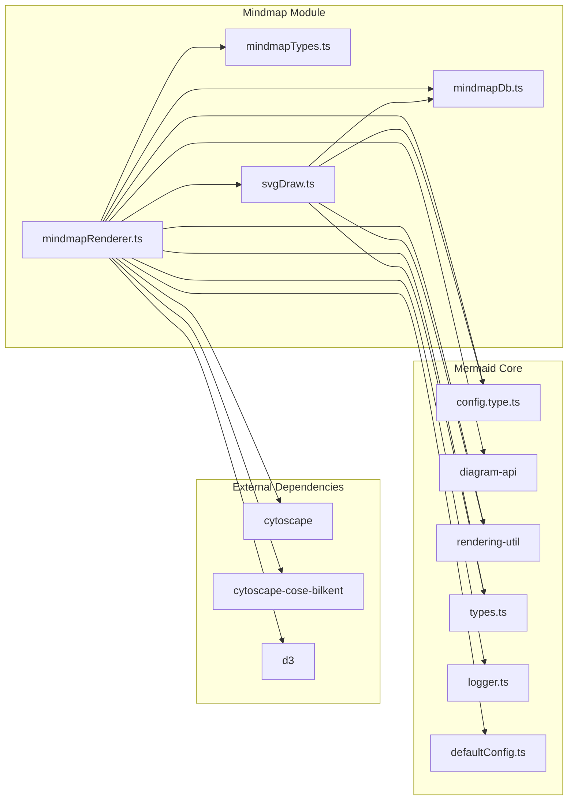
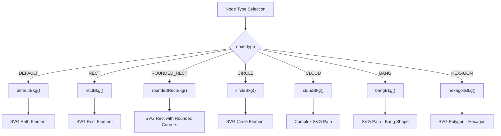

# Mindmap Renderer Module Documentation

## Introduction

The mindmapRenderer module is a specialized rendering engine within the Mermaid diagram library that handles the visualization of mindmap diagrams. Mindmaps are hierarchical diagrams used to visually organize information, showing relationships among pieces of the whole through a branching structure. This module transforms parsed mindmap data into interactive SVG visualizations using advanced layout algorithms and customizable styling.

The renderer leverages the Cytoscape.js library with the cose-bilkent layout algorithm to automatically position nodes optimally, ensuring minimal edge crossings and aesthetically pleasing arrangements. It supports multiple node shapes, customizable styling, and various visual enhancements including icons and custom CSS classes.

## Architecture Overview

The mindmapRenderer module follows a layered architecture that separates concerns between data management, layout calculation, and visual rendering. The architecture is designed to be modular and extensible, allowing for easy integration with the broader Mermaid ecosystem.



## Core Components

### 1. EdgeSingular Interface Extension

The module extends the Cytoscape.js EdgeSingular interface to provide access to edge positioning data required for custom edge rendering. This extension enables the renderer to access the calculated edge coordinates from the layout algorithm.

```typescript
declare module 'cytoscape' {
  interface EdgeSingular {
    _private: {
      bodyBounds: unknown;
      rscratch: {
        startX: number;
        startY: number;
        midX: number;
        midY: number;
        endX: number;
        endY: number;
      };
    };
  }
}
```

### 2. Main Rendering Function

The core `draw` function orchestrates the entire rendering process, implementing the DrawDefinition interface from the diagram API. This function serves as the entry point for mindmap visualization and coordinates all rendering phases.

**Key Responsibilities:**
- Initialize SVG container and configuration
- Draw nodes without positions to calculate dimensions
- Perform automatic layout using Cytoscape.js
- Render edges based on calculated positions
- Position nodes according to layout results
- Configure viewbox and final dimensions

### 3. Layout Engine Integration

The `layoutMindmap` function creates a temporary Cytoscape instance to calculate optimal node positioning using the cose-bilkent force-directed layout algorithm. This approach ensures professional-quality mindmap layouts with minimal manual configuration.

**Layout Process:**
1. Create temporary DOM container for layout calculation
2. Initialize Cytoscape instance with node and edge data
3. Configure layout dimensions for each node
4. Execute cose-bilkent layout algorithm
5. Extract calculated positions
6. Clean up temporary elements

### 4. Node Drawing System

The `drawNodes` recursive function handles the creation of visual node representations, delegating to specialized shape functions based on node types. Each node type has dedicated rendering logic for optimal visual presentation.

**Supported Node Types:**
- **Default**: Rounded rectangle with subtle styling
- **Rectangle**: Sharp-edged rectangular nodes
- **Circle**: Perfect circular nodes
- **Cloud**: Organic cloud-shaped nodes
- **Bang**: Exclamation mark style nodes
- **Hexagon**: Six-sided polygonal nodes
- **Rounded Rectangle**: Rectangles with rounded corners

### 5. Edge Rendering

The `drawEdges` function creates SVG path elements for each edge in the mindmap, using the calculated coordinates from the layout algorithm. Edges are styled with CSS classes that support theming and hierarchical visualization.

## Data Flow Architecture



## Component Dependencies



## Configuration System

The mindmap renderer integrates with Mermaid's configuration system to support customizable rendering options. Configuration is accessed through the `getConfig()` function and merged with default values.

**Configuration Options:**
- **padding**: Spacing around nodes
- **maxNodeWidth**: Maximum width for text wrapping
- **useMaxWidth**: Whether to use maximum available width
- **htmlLabels**: Whether to render HTML content in labels

## Node Shape Rendering

The svgDraw module implements specialized shape functions for each node type, providing distinct visual representations that enhance the semantic meaning of different mindmap elements.



## Layout Algorithm Details

The cose-bilkent layout algorithm is a force-directed layout specifically designed for compound graphs. It provides several advantages for mindmap visualization:

**Algorithm Features:**
- **Quality**: Proof-quality layout with minimal edge crossings
- **Compound Support**: Handles nested node structures naturally
- **Performance**: Efficient calculation for medium-sized graphs
- **Aesthetics**: Produces visually pleasing, balanced layouts

**Layout Configuration:**
```javascript
{
  name: 'cose-bilkent',
  quality: 'proof',
  styleEnabled: false,
  animate: false
}
```

## Integration with Mermaid Ecosystem

The mindmapRenderer module integrates seamlessly with the broader Mermaid architecture through well-defined interfaces and shared utilities.

**Integration Points:**
- **Diagram API**: Implements DrawDefinition interface
- **Configuration System**: Uses MermaidConfig for settings
- **Database Layer**: Works with MindmapDB for data access
- **Rendering Utilities**: Leverages shared rendering helpers
- **Theme System**: Supports CSS-based theming

## Error Handling and Edge Cases

The renderer implements robust error handling to manage various edge cases and ensure stable operation:

**Error Scenarios:**
- **Empty Mindmaps**: Gracefully handles cases with no nodes
- **Invalid Node Types**: Falls back to default rendering
- **Layout Failures**: Provides fallback positioning
- **Missing Configuration**: Uses sensible defaults

## Performance Considerations

The mindmap renderer is designed with performance in mind, implementing several optimizations:

**Performance Features:**
- **Async Rendering**: Non-blocking drawing operations
- **Efficient Layout**: Single-pass layout calculation
- **Memory Management**: Cleanup of temporary elements
- **Optimized DOM**: Minimal DOM manipulation

## Extension Points

The modular architecture provides several extension points for customization:

**Customization Options:**
- **Custom Node Shapes**: Add new shape functions
- **Layout Algorithms**: Replace cose-bilkent with alternatives
- **Styling**: CSS-based theme customization
- **Node Types**: Extend node type system

## Related Documentation

- [mindmapTypes](mindmapTypes.md) - Data structures and type definitions
- [mindmapDb](mindmapDb.md) - Database layer and data management
- [svgDraw](svgDraw.md) - Node rendering and shape functions
- [config](config.md) - Configuration system and options
- [diagram-api](diagram-api.md) - Core diagram API interfaces
- [rendering-util](rendering-util.md) - Shared rendering utilities

## Usage Examples

The mindmap renderer is typically used through the Mermaid API rather than directly. However, understanding its internal operation helps with debugging and customization:

```javascript
// The renderer is invoked automatically when processing mindmap diagrams
mermaid.render('mindmap-diagram', `
mindmap
  root((Mindmap))
    Origins
      Long history
      ::icon(fa fa-book)
    Research
      On effectiveness<br/>and features
    Tools
      Pen and paper
      Mermaid
`);
```

The renderer processes this input through the complete pipeline: parsing → database storage → layout calculation → visual rendering → final SVG output.