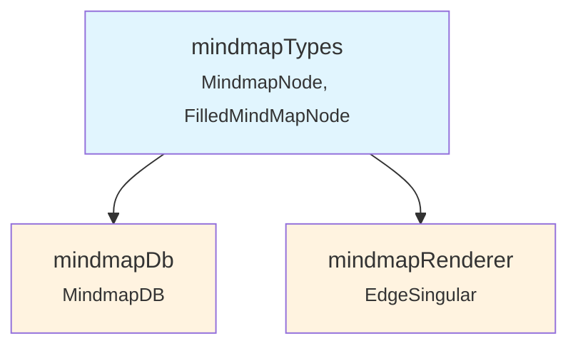
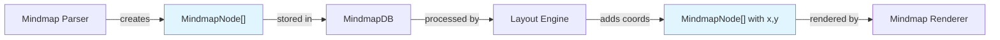
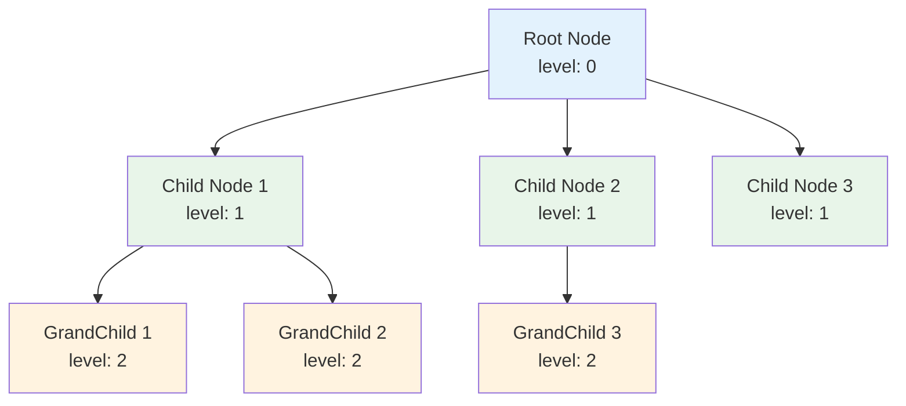
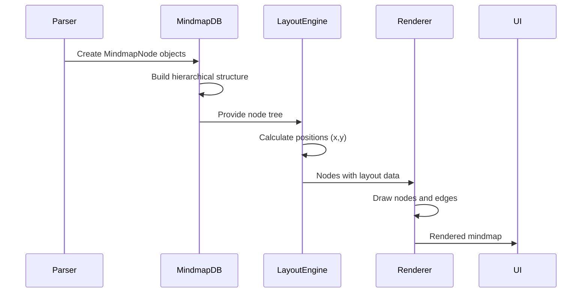
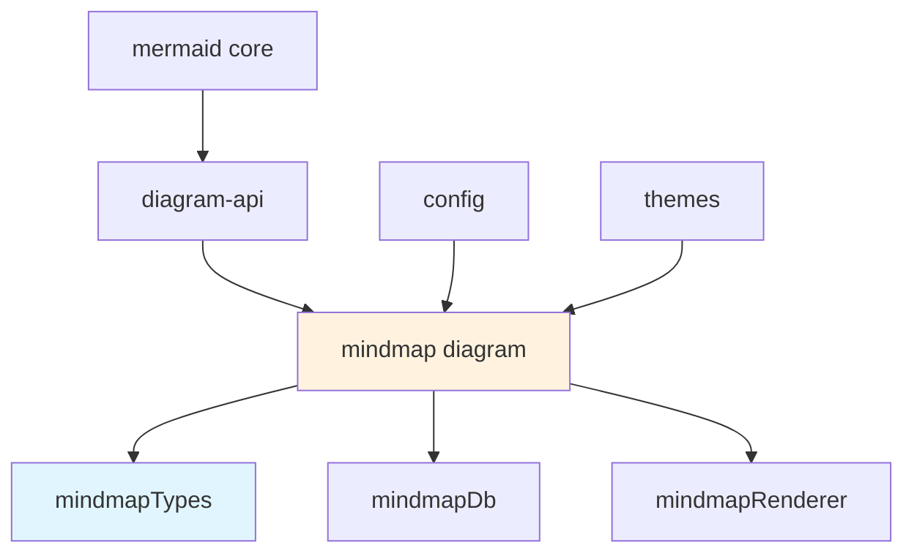
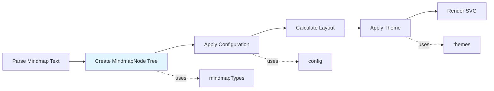

# mindmapTypes Module Documentation

## Overview

The `mindmapTypes` module defines the core type system for mindmap diagrams in Mermaid. It provides the fundamental data structures that represent mindmap nodes and their hierarchical relationships, forming the foundation for mindmap diagram parsing, rendering, and interaction.

## Purpose and Core Functionality

This module serves as the type definition layer for the mindmap diagram type, offering:

- **Node Representation**: Defines the structure of individual mindmap nodes
- **Hierarchical Relationships**: Establishes parent-child relationships between nodes
- **Layout Properties**: Specifies positioning and sizing information for rendering
- **Visual Attributes**: Includes styling and icon support for enhanced visualization
- **Type Safety**: Provides TypeScript interfaces for compile-time type checking

## Core Components

### MindmapNode Interface

The primary interface that defines the structure of a mindmap node:

```typescript
interface MindmapNode {
  id: number;                    // Unique numeric identifier
  nodeId: string;               // String identifier for the node
  level: number;                // Depth level in the hierarchy (0 = root)
  descr: string;                // Node description/text content
  type: number;                 // Node type identifier
  children: MindmapNode[];      // Array of child nodes
  width: number;                // Node width for layout
  padding: number;              // Internal padding
  section?: number;             // Optional section identifier
  height?: number;              // Optional node height
  class?: string;               // Optional CSS class for styling
  icon?: string;                // Optional icon identifier
  x?: number;                   // Optional x-coordinate for positioning
  y?: number;                   // Optional y-coordinate for positioning
}
```

### FilledMindMapNode Type

A utility type that makes all properties of MindmapNode required:

```typescript
type FilledMindMapNode = RequiredDeep<MindmapNode>;
```

## Architecture and Component Relationships

### Module Dependencies



### Data Flow Architecture



## Component Interactions

### Node Hierarchy Structure



### Rendering Process Flow



## Integration with Mermaid System

### Position in Module Hierarchy



### Configuration Integration

The `MindmapNode` interface works with the [config](config.md) module through:

- `MindmapDiagramConfig` for diagram-level settings
- `class` property for applying custom styles
- `icon` property for visual enhancements

### Rendering Pipeline Integration



## Usage Patterns

### Node Creation

```typescript
// Typical node structure
const rootNode: MindmapNode = {
  id: 0,
  nodeId: 'root',
  level: 0,
  descr: 'Main Topic',
  type: 0,
  children: [],
  width: 100,
  padding: 10
};
```

### Hierarchical Building

```typescript
// Building parent-child relationships
parentNode.children.push(childNode);
childNode.level = parentNode.level + 1;
```

### Layout Processing

```typescript
// Adding positioning data
node.x = calculatedX;
node.y = calculatedY;
node.width = calculatedWidth;
node.height = calculatedHeight;
```

## Related Modules

- **[mindmapDb](mindmapDb.md)**: Database layer that stores and manages MindmapNode instances
- **[mindmapRenderer](mindmapRenderer.md)**: Rendering engine that converts MindmapNode data to visual representation
- **[config](config.md)**: Configuration system including MindmapDiagramConfig
- **[rendering-util](rendering-util.md)**: Utility functions for layout calculations and rendering

## Type Safety and Extensibility

The module leverages TypeScript's type system to ensure:

- **Compile-time validation**: All required properties must be present
- **IDE support**: Autocomplete and type checking during development
- **Refactoring safety**: Type-safe changes across the codebase
- **Documentation**: Self-documenting interface definitions

The `RequiredDeep` utility from `type-fest` ensures that the `FilledMindMapNode` type has all properties marked as required, providing additional type safety for scenarios where complete node data is required.