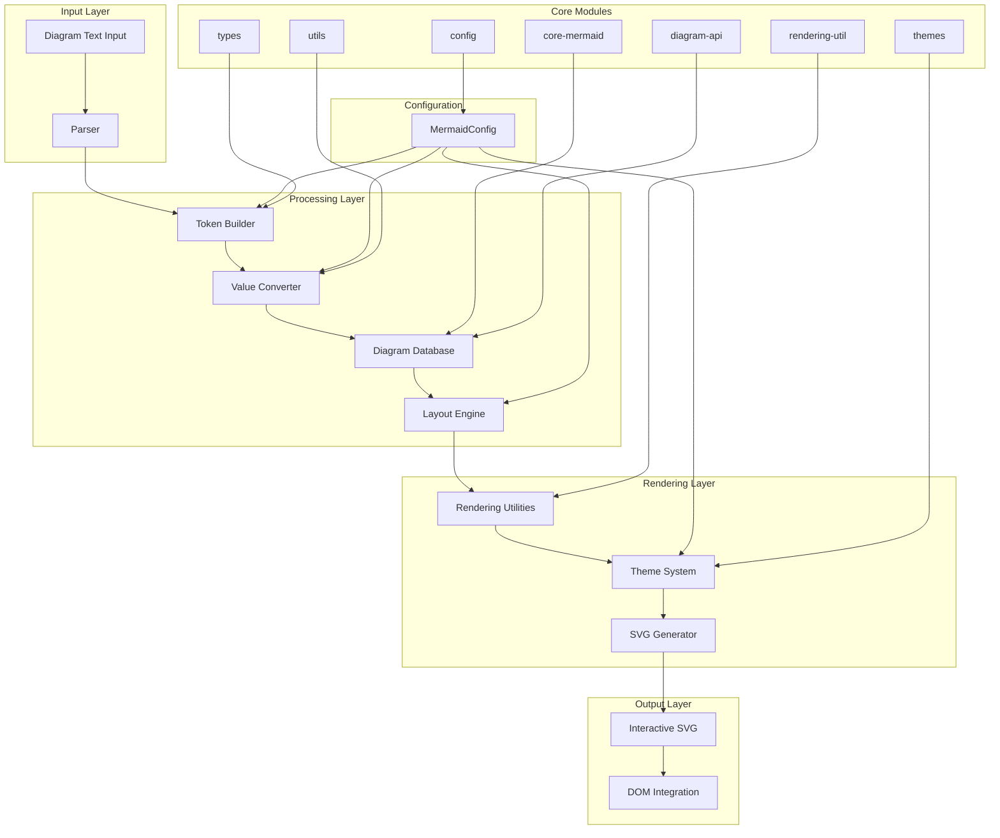
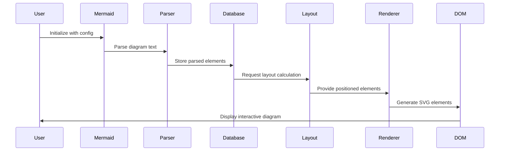

# Mermaid.js Repository Overview

## Purpose

The `mermaid-js--mermaid` repository is the core implementation of the Mermaid diagramming library—a JavaScript-based tool that converts text-based diagram definitions into interactive SVG visualizations. Mermaid enables developers to create flowcharts, sequence diagrams, class diagrams, state diagrams, and many other diagram types using a simple, markdown-like syntax that can be embedded directly in documentation, wikis, and web applications.

## End-to-End Architecture

### Data Flow Architecture

## Core Module Documentation

### [core-mermaid](core-mermaid.md)
The main entry point and orchestration layer that coordinates diagram processing, manages the execution queue, handles error propagation, and provides the primary API surface for users.

### [config](config.md)
Centralized configuration management system providing type-safe interfaces for global settings, diagram-specific configurations, theme integration, and runtime validation.

### [diagram-api](diagram-api.md)
Standardized interface layer for diagram registration, lifecycle management, and integration between the core engine and individual diagram types.

### [rendering-util](rendering-util.md)
Comprehensive rendering infrastructure providing shape libraries, layout algorithms, icon management, and SVG generation utilities shared across diagram types.

### [themes](themes.md)
Visual styling system managing color palettes, typography, and appearance customization with support for multiple built-in themes and custom overrides.

### [types](types.md)
Foundational type definitions establishing consistent data structures for parsing results, rendering outputs, and common geometric operations.

### [utils](utils.md)
Shared utility functions for text processing, mathematical calculations, DOM manipulation, security validation, and ID generation.

## Supported Diagram Types

The repository implements 20+ diagram types, each with specialized parsers and renderers:

- **Flow-based**: Flowchart, Sequence, State, Git Graph
- **Structural**: Class, ER, Architecture, Block, C4
- **Data Visualization**: Pie, Radar, Sankey, Timeline, Treemap, XYChart
- **Analytical**: Mindmap, Quadrant Chart, Requirement, Packet, Info

## Key Features

- **Type Safety**: Full TypeScript implementation with comprehensive interfaces
- **Extensibility**: Plugin architecture supporting custom diagram types
- **Performance**: Optimized rendering with lazy loading and caching
- **Accessibility**: Built-in screen reader support and keyboard navigation
- **Security**: XSS protection through content sanitization
- **Theming**: Multiple built-in themes with custom theme support
- **Integration**: Works with React, Vue, Angular, and vanilla JavaScript

## Integration Points

The repository integrates with external libraries:
- **D3.js**: For advanced SVG manipulation and data visualization
- **Cytoscape.js**: For graph layout algorithms
- **ELK (Eclipse Layout Kernel)**: For sophisticated automatic layout
- **ZenUML**: For enhanced sequence diagram capabilities

This architecture enables Mermaid to serve as a comprehensive diagramming solution that balances ease of use with powerful customization options, making it suitable for everything from simple documentation to complex system visualization.