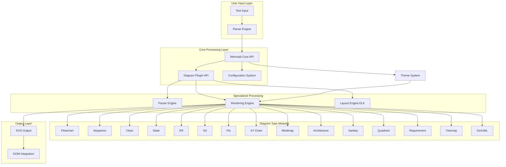
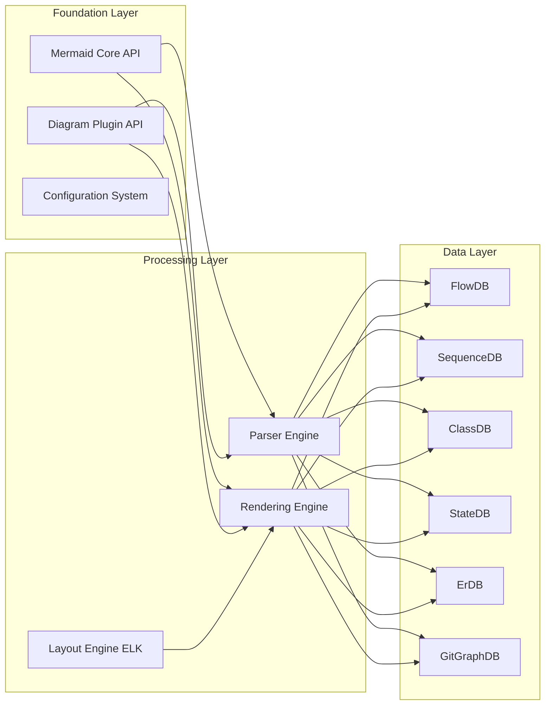
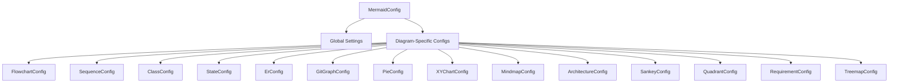

# Mermaid-js--mermaid Repository Overview

## Purpose

The `mermaid-js--mermaid` repository is the official implementation of the Mermaid diagramming library, a JavaScript-based tool that enables users to create diagrams and visualizations using a simple, text-based syntax. Mermaid transforms markdown-like text descriptions into interactive SVG diagrams, making it ideal for documentation, presentations, and web applications.

## End-to-End Architecture

```mermaid
graph TB
    subgraph "User Input Layer"
        A[Text Input] --> B[Parser Engine]
    end
    
    subgraph "Core Processing Layer"
        B --> C[Mermaid Core API]
        C --> D[Diagram Plugin API]
        C --> E[Configuration System]
    end
    
    subgraph "Specialized Processing"
        D --> F[Parser Engine]
        D --> G[Rendering Engine]
        D --> H[Layout Engine ELK]
    end
    
    subgraph "Diagram Type Modules"
        G --> I[Flowchart]
        G --> J[Sequence]
        G --> K[Class]
        G --> L[State]
        G --> M[ER]
        G --> N[Git]
        G --> O[Pie]
        G --> P[XY Chart]
        G --> Q[Mindmap]
        G --> R[Architecture]
        G --> S[Sankey]
        G --> T[Quadrant]
        G --> U[Requirement]
        G --> V[Treemap]
        G --> W[ZenUML]
    end
    
    subgraph "Output Layer"
        G --> X[SVG Output]
        X --> Y[DOM Integration]
    end
    
    C --> Z[Theme System]
    Z --> G
```

## Core Module Architecture

```mermaid
graph LR
    subgraph "Foundation Layer"
        A[Mermaid Core API]
        B[Diagram Plugin API]
        C[Configuration System]
    end
    
    subgraph "Processing Layer"
        D[Parser Engine]
        E[Rendering Engine]
        F[Layout Engine ELK]
    end
    
    subgraph "Data Layer"
        G[FlowDB]
        H[SequenceDB]
        I[ClassDB]
        J[StateDB]
        K[ErDB]
        L[GitGraphDB]
    end
    
    A --> D
    A --> E
    B --> D
    B --> E
    D --> G
    D --> H
    D --> I
    D --> J
    D --> K
    D --> L
    E --> G
    E --> H
    E --> I
    E --> J
    E --> K
    E --> L
    F --> E
```

## Repository Structure

The repository is organized into several key modules:

### Core Modules

1. **[Mermaid Core API](mermaid_core_api.md)** - Central integration point providing the main API, configuration management, and diagram lifecycle orchestration
2. **[Diagram Plugin API](diagram_plugin_api.md)** - Plugin architecture enabling extensible diagram type definitions with standardized interfaces
3. **[Rendering Engine](rendering_engine.md)** - SVG generation system handling shapes, themes, text processing, and visual styling
4. **[Parser Engine](parser_engine.md)** - Text parsing infrastructure built on Langium framework for syntax validation and AST generation
5. **[Layout Engine ELK](layout_engine_elk.md)** - Advanced graph layout algorithms using Eclipse Layout Kernel for complex diagram positioning

### Diagram Type Modules

The repository supports 14 distinct diagram types, each with specialized functionality:

- **[Flowchart](diagram_flowchart.md)** - Process flow and decision tree visualization
- **[Sequence](diagram_sequence.md)** - Object interaction timelines with temporal relationships
- **[Class](diagram_class.md)** - UML class structure modeling with inheritance and relationships
- **[State](diagram_state.md)** - State machine representation with hierarchical states
- **[ER](diagram_er.md)** - Entity-relationship database modeling
- **[Git](diagram_git.md)** - Version control history and branching visualization
- **[Pie](diagram_pie.md)** - Proportional data representation
- **[XY Chart](diagram_xy_chart.md)** - Multi-type charting (line, bar, scatter) with configurable axes
- **[Mindmap](diagram_mindmap.md)** - Hierarchical brainstorming and organization diagrams
- **[Architecture](diagram_architecture.md)** - System component relationship visualization
- **[Sankey](diagram_sankey.md)** - Flow quantity visualization between entities
- **[Quadrant](diagram_quadrant_chart.md)** - Two-dimensional data positioning in four quadrants
- **[Requirement](diagram_requirement.md)** - Systems engineering requirement documentation
- **[Treemap](diagram_treemap.md)** - Hierarchical data visualization through nested rectangles

### Integration Module

- **[ZenUML Integration](zenuml_integration.md)** - Specialized UML sequence diagram support through external library integration

## Key Features

- **Text-Based Syntax**: Simple markdown-like syntax for diagram creation
- **Extensible Architecture**: Plugin system supporting custom diagram types
- **Theme System**: Comprehensive theming with 12-color scales and dark mode support
- **Interactive Elements**: Click events, tooltips, and hyperlinks
- **Accessibility**: Screen reader support and keyboard navigation
- **Performance Optimization**: Lazy loading, caching, and efficient rendering pipelines
- **Security**: Content sanitization and XSS prevention
- **Cross-Platform**: Consistent rendering across browsers and platforms

## Configuration System

The repository provides extensive configuration options through a hierarchical system:

```mermaid
graph TD
    A[MermaidConfig] --> B[Global Settings]
    A --> C[Diagram-Specific Configs]
    
    C --> D[FlowchartConfig]
    C --> E[SequenceConfig]
    C --> F[ClassConfig]
    C --> G[StateConfig]
    C --> H[ErConfig]
    C --> I[GitGraphConfig]
    C --> J[PieConfig]
    C --> K[XYChartConfig]
    C --> L[MindmapConfig]
    C --> M[ArchitectureConfig]
    C --> N[SankeyConfig]
    C --> O[QuadrantConfig]
    C --> P[RequirementConfig]
    C --> Q[TreemapConfig]
```

## Development and Extension

The modular architecture enables:

- **Custom Diagram Types**: Implement `DiagramDefinition` interface for new diagram types
- **Theme Customization**: Override theme variables for visual styling
- **Plugin Development**: Extend functionality through the plugin API
- **Parser Extensions**: Add new syntax support through the parser engine
- **Layout Algorithms**: Integrate custom layout engines for specialized positioning

This architecture provides a robust foundation for creating, customizing, and extending diagram visualization capabilities within the Mermaid ecosystem.