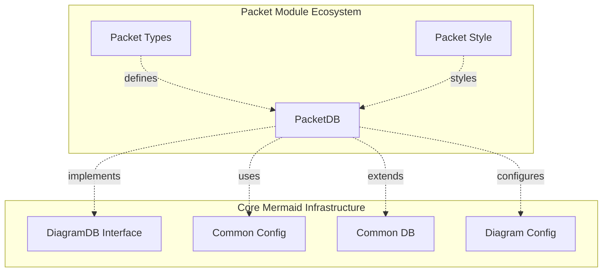
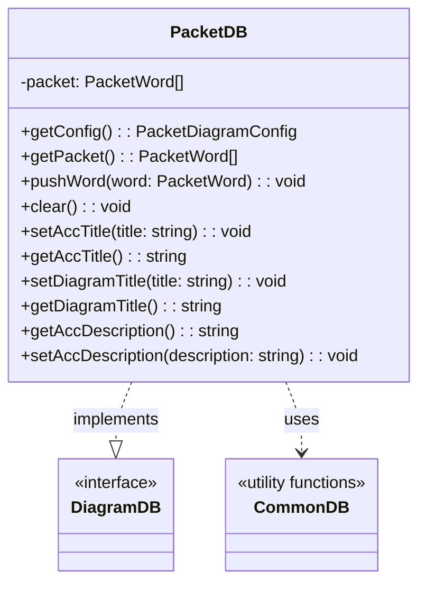
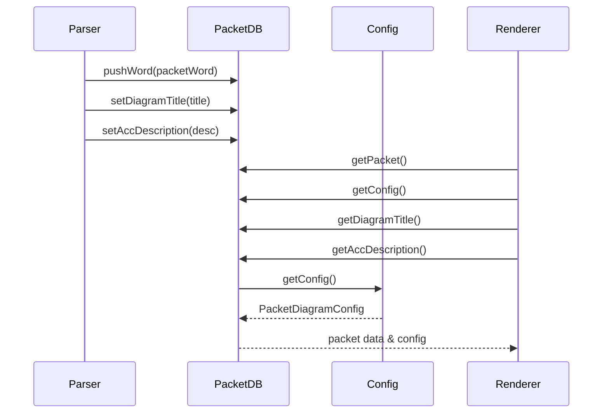
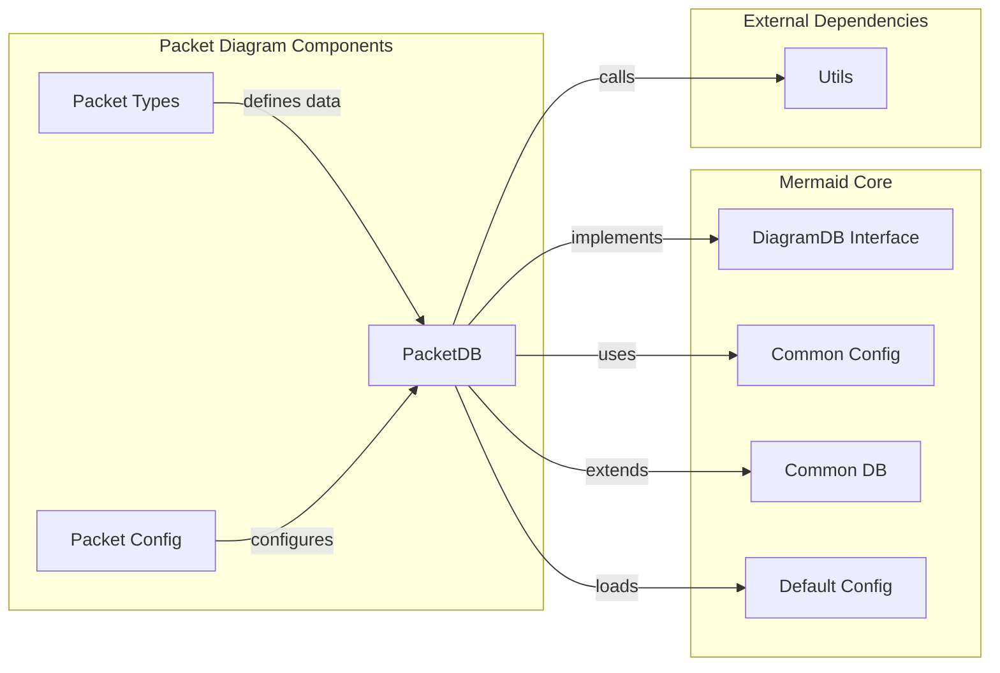
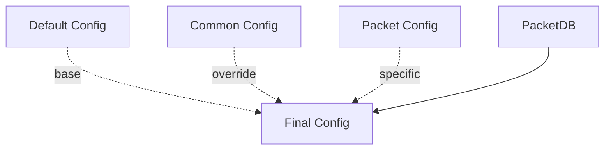
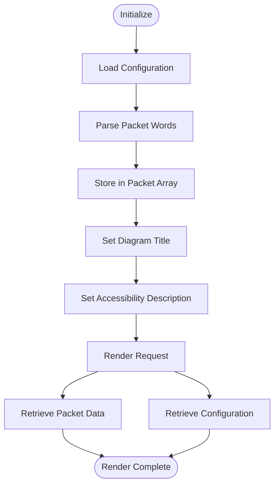

# Packet Database Module Documentation

## Introduction

The packet-db module is a core component of the Mermaid diagramming library that provides database functionality for packet diagrams. Packet diagrams are specialized visualizations used to represent data packet structures, bit fields, and protocol specifications in networking and communication systems.

This module implements the `PacketDB` class which serves as the central data store and configuration manager for packet diagram rendering, following Mermaid's standard diagram database pattern.

## Architecture Overview

The packet-db module is part of the larger packet diagram ecosystem within Mermaid. It implements the `DiagramDB` interface and integrates with the common diagram database utilities while providing packet-specific data management capabilities.



## Core Components

### PacketDB Class

The `PacketDB` class is the primary component of this module, implementing the `DiagramDB` interface to provide packet diagram-specific functionality.



## Data Flow Architecture

The packet database follows a standard data flow pattern within the Mermaid ecosystem:



## Component Relationships

The packet-db module integrates with several other Mermaid components:



## Configuration Management

The PacketDB module manages configuration through a hierarchical system:



The configuration system:
1. Starts with `DEFAULT_CONFIG.packet` as the base configuration
2. Merges with common configuration from `commonGetConfig().packet`
3. Applies packet-specific adjustments (e.g., padding for bit display)
4. Returns the final merged configuration

## Data Management

### Packet Word Storage

The PacketDB maintains an array of `PacketWord` objects, which represent individual data segments within a packet structure. Each word contains information about bit fields, labels, and formatting.

### Common Database Integration

The module integrates with Mermaid's common database utilities for:
- Diagram title management
- Accessibility title and description handling
- Standard cleanup operations

## Process Flow



## Integration Points

### With Parser
The parser calls `pushWord()` to add parsed packet segments to the database.

### With Renderer
The renderer calls `getPacket()` to retrieve the complete packet structure and `getConfig()` for rendering configuration.

### With Configuration System
Integrates with Mermaid's configuration system to provide diagram-specific settings while inheriting common configuration options.

## Key Features

1. **Type Safety**: Implements the `DiagramDB` interface ensuring consistency across diagram types
2. **Configuration Management**: Hierarchical configuration system with defaults and overrides
3. **Data Validation**: Filters out empty packet words during storage
4. **Accessibility Support**: Full support for accessibility titles and descriptions
5. **Standard Compliance**: Follows Mermaid's common database patterns and utilities

## Dependencies

- **Internal**: `config.js`, `defaultConfig.js`, `diagram-api/types.js`, `utils.js`, `common/commonDb.js`
- **External**: TypeScript type definitions for configuration and data structures

## Related Documentation

- [packet-types.md](packet-types.md) - Packet data type definitions
- [config.md](config.md) - Configuration system documentation
- [diagram-api.md](diagram-api.md) - Diagram API interface specifications
- [common-db.md](common-db.md) - Common database utilities

## Usage Example

```typescript
import { PacketDB } from './packet/db.js';

const packetDB = new PacketDB();

// Add packet words
packetDB.pushWord({ text: 'Header', bits: 8 });
packetDB.pushWord({ text: 'Data', bits: 16 });

// Set metadata
packetDB.setDiagramTitle('Network Packet Structure');
packetDB.setAccDescription('Ethernet packet with header and data fields');

// Get configuration
const config = packetDB.getConfig();

// Retrieve data for rendering
const packetData = packetDB.getPacket();
```