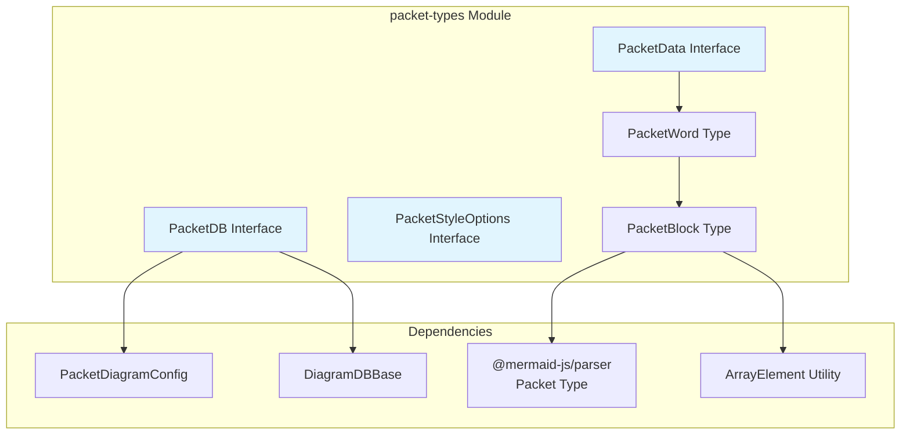
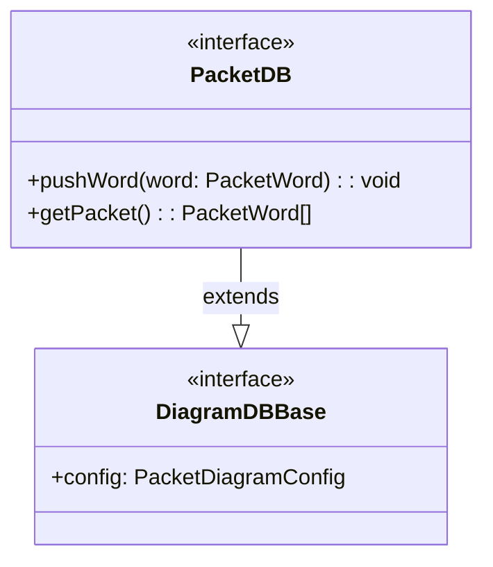
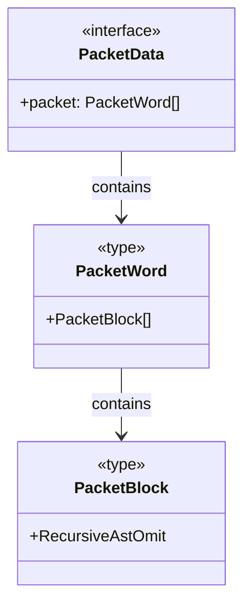
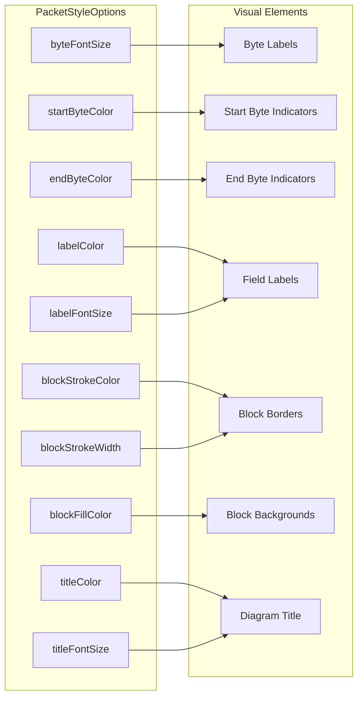
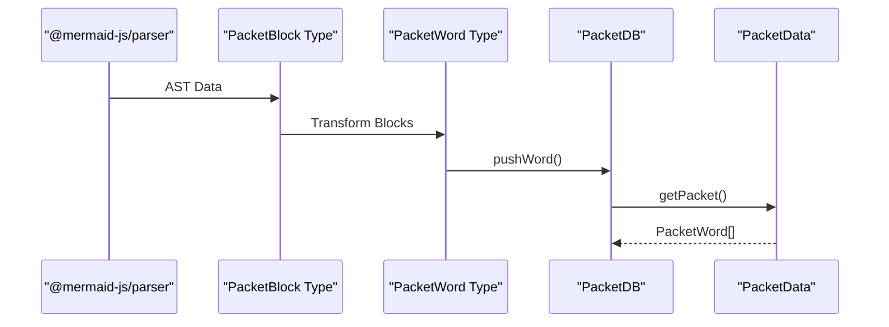
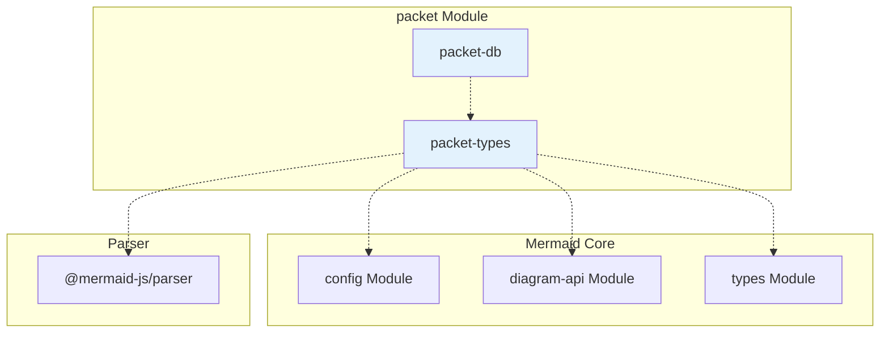
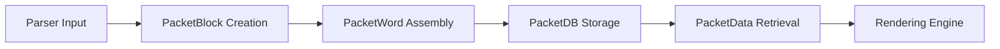
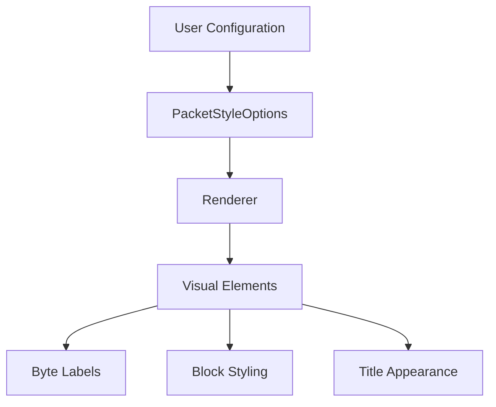

# Packet Types Module Documentation

## Introduction

The packet-types module defines the core type definitions and interfaces for packet diagrams in Mermaid. Packet diagrams are specialized visualizations used to represent network packet structures, byte layouts, and protocol data units. This module provides the foundational data structures and styling options that enable the creation of detailed packet structure diagrams commonly used in network engineering, protocol analysis, and system documentation.

## Architecture Overview

The packet-types module serves as the type foundation for the packet diagram implementation, providing interfaces for data management, styling configuration, and packet structure representation.



## Core Components

### PacketDB Interface

The `PacketDB` interface extends the base diagram database functionality to provide packet-specific data management capabilities.



**Key Features:**
- Manages packet word data through `pushWord` method
- Retrieves packet structure via `getPacket` method
- Inherits configuration management from `DiagramDBBase`
- Type-safe integration with Mermaid's diagram system

### PacketData Interface

The `PacketData` interface defines the structure for packet diagram data storage and transmission.



### PacketStyleOptions Interface

Comprehensive styling configuration for packet diagrams, providing fine-grained control over visual appearance.



**Style Properties:**
- **Byte Styling**: `byteFontSize`, `startByteColor`, `endByteColor`
- **Label Styling**: `labelColor`, `labelFontSize`
- **Block Styling**: `blockStrokeColor`, `blockStrokeWidth`, `blockFillColor`
- **Title Styling**: `titleColor`, `titleFontSize`

## Data Flow Architecture



## Type Definitions

### PacketBlock
```typescript
export type PacketBlock = RecursiveAstOmit<ArrayElement<Packet['blocks']>>;
```

A type alias that transforms parser AST data into a simplified block representation, removing recursive structures while preserving essential packet field information.

### PacketWord
```typescript
export type PacketWord = Required<PacketBlock>[];
```

Represents a complete packet word as an array of required packet blocks, ensuring all block properties are defined for consistent rendering.

## Integration with Mermaid Ecosystem



## Module Dependencies

### Internal Dependencies
- **config Module**: Provides `PacketDiagramConfig` for diagram-specific configuration
- **diagram-api Module**: Supplies `DiagramDBBase` interface for database operations
- **types Module**: Offers `ArrayElement` utility type for array manipulation

### External Dependencies
- **@mermaid-js/parser**: Supplies the `Packet` AST type and `RecursiveAstOmit` utility for AST transformation

## Usage Patterns

### Data Management Flow


### Styling Configuration Flow


## Related Documentation

- [packet-db.md](packet-db.md) - Database implementation for packet diagrams
- [config.md](config.md) - Configuration system overview
- [diagram-api.md](diagram-api.md) - Diagram API specifications
- [types.md](types.md) - Core type definitions

## Summary

The packet-types module provides the essential type infrastructure for packet diagram functionality in Mermaid. Through its well-defined interfaces and type aliases, it enables type-safe manipulation of packet data structures while maintaining flexibility for various network protocol representations. The comprehensive styling options allow for detailed customization of packet diagram appearance, making it suitable for both technical documentation and educational purposes.