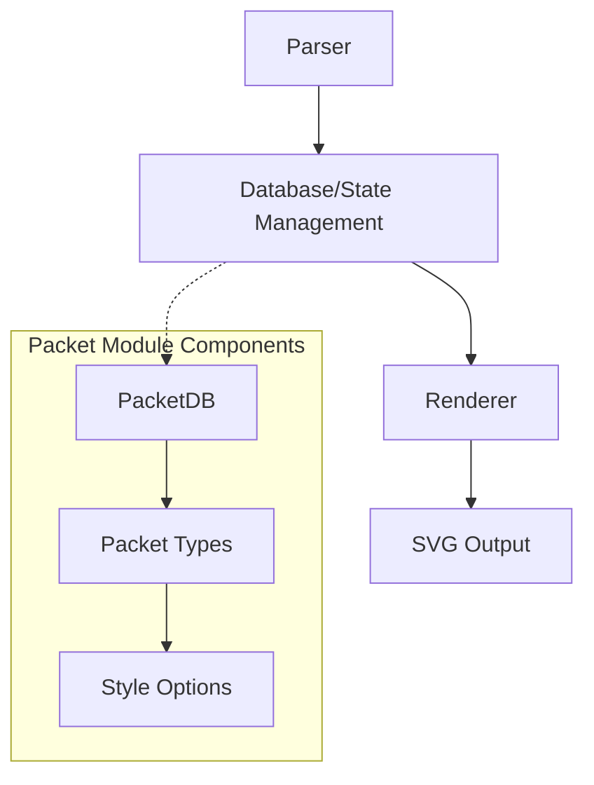
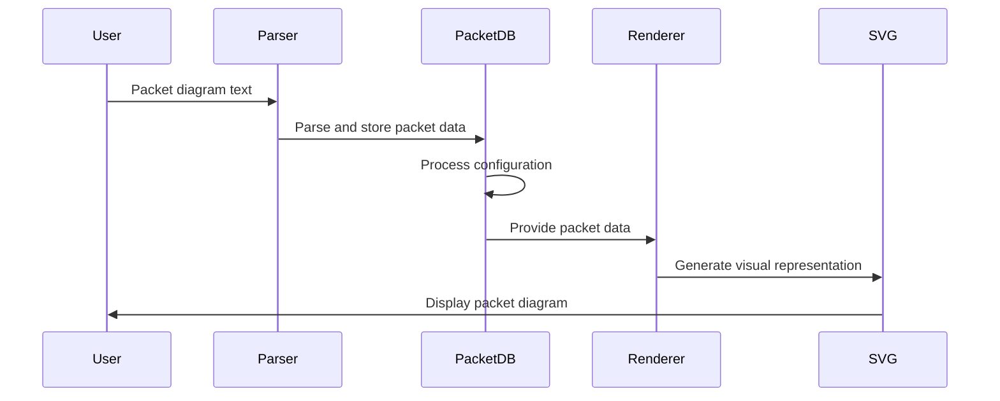

# Packet Module Documentation

## Overview

The packet module is a specialized diagram type within the Mermaid.js library that provides functionality for creating packet diagrams. Packet diagrams are used to visualize network packet structures, data transmission formats, and protocol specifications. This module enables users to represent binary data structures, byte sequences, and protocol headers in a clear, visual format.

## Purpose

The packet module serves as a dedicated diagram type for:
- Visualizing network protocol structures
- Representing binary data formats
- Documenting packet headers and payloads
- Illustrating byte-level data organization
- Creating protocol specification documentation

## Architecture

The packet module follows Mermaid's standard diagram architecture pattern, consisting of three main components:

### Core Components

1. **PacketDB** (`packet-db.md`): The database component that manages packet data state and provides configuration management
2. **Packet Types** (`packet-types.md`): Type definitions for packet structures, data formats, and style options
3. **Integration Layer**: Connects with Mermaid's core rendering and configuration systems

## Data Flow

## Key Features

### Packet Structure Representation
- Binary data visualization
- Byte-level granularity
- Protocol header documentation
- Payload structure mapping

### Styling and Customization
- Configurable byte colors
- Font size customization
- Stroke and fill options
- Title and label formatting

### Configuration Integration
- Inherits from Mermaid's base configuration
- Diagram-specific settings
- Theme integration support
- Accessibility features

## Integration with Mermaid Ecosystem

The packet module integrates seamlessly with Mermaid's broader architecture:

- **Configuration System**: Leverages Mermaid's centralized configuration management
- **Rendering Pipeline**: Uses standard rendering utilities and SVG generation
- **Theme Support**: Inherits theme capabilities from the themes module
- **Parser Integration**: Works with Mermaid's parser infrastructure

## Usage Context

Packet diagrams are particularly useful for:
- Network protocol documentation
- API specification visualization
- Binary format documentation
- Data structure teaching materials
- Technical specifications

## Related Modules

- [config](config.md): Configuration management and diagram-specific settings
- [diagram-api](diagram-api.md): Core diagram interface and type definitions
- [rendering-util](rendering-util.md): Shared rendering utilities and components
- [themes](themes.md): Visual styling and theme support

## Sub-modules Documentation

For detailed information about specific components, see:
- [Packet Database](packet-db.md) - Data management and state handling
- [Packet Types](packet-types.md) - Type definitions and interfaces