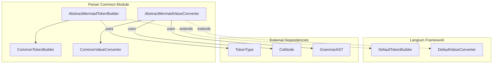
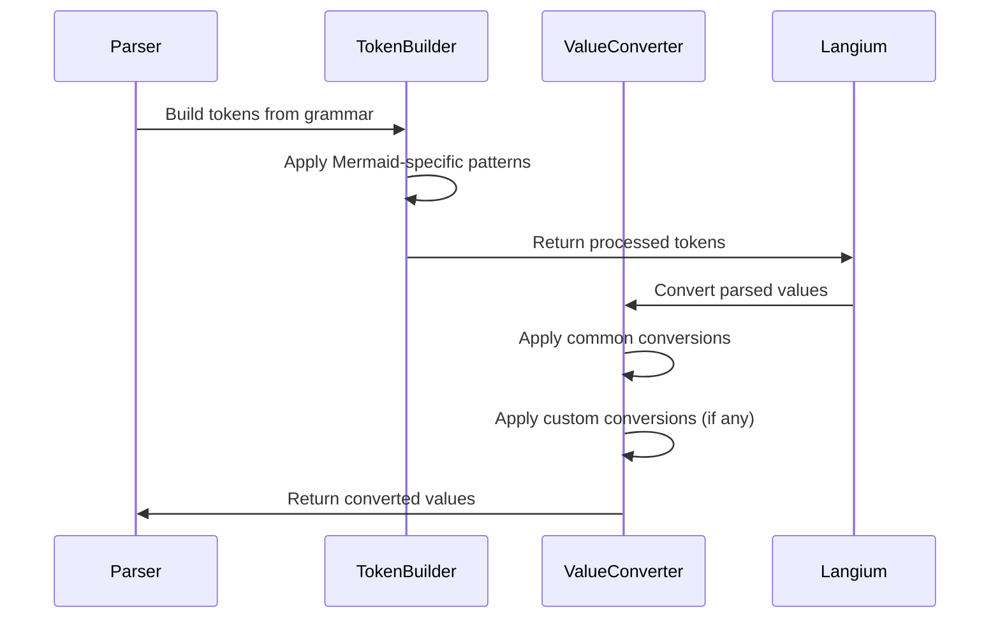
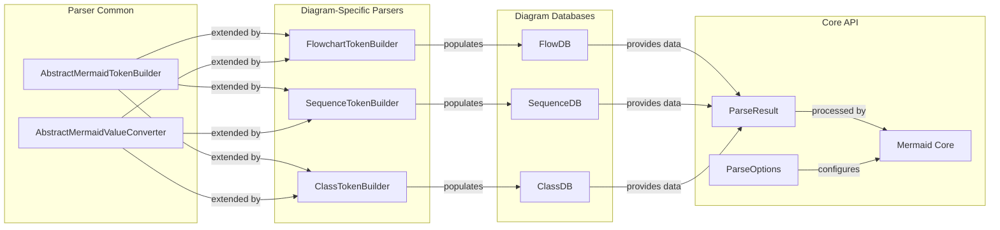
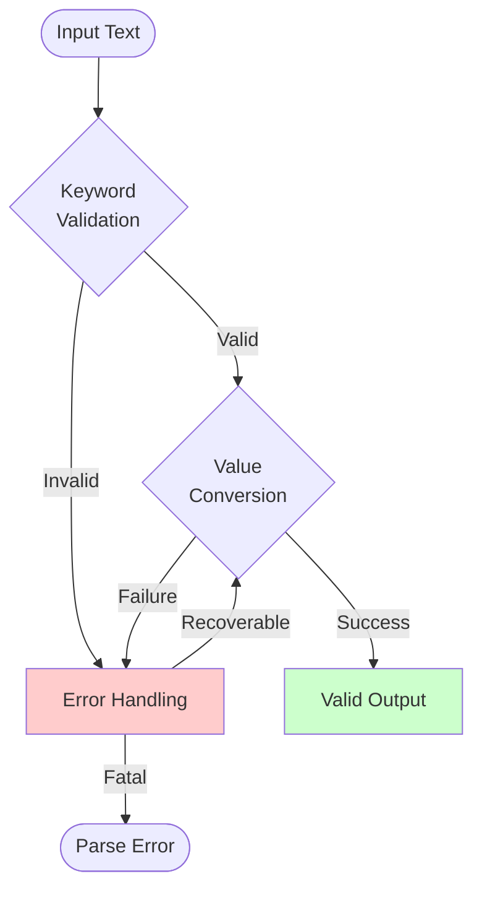

# Parser Common Module Documentation

## Overview

The `parser-common` module provides foundational parsing infrastructure for the Mermaid diagramming library. It implements common tokenization and value conversion functionality that is shared across different diagram types, ensuring consistent parsing behavior and extensibility for specialized diagram parsers.

## Purpose

This module serves as the base layer for Mermaid's parsing system, offering:

- **Tokenization**: Custom token builders that handle Mermaid-specific keyword recognition and validation
- **Value Conversion**: Standardized value conversion logic for common diagram elements like titles and accessibility descriptions
- **Extensibility**: Abstract base classes that allow diagram-specific parsers to extend and customize behavior

## Architecture



## Core Components

### Token Builder Components

#### AbstractMermaidTokenBuilder
- **Purpose**: Abstract base class for Mermaid-specific token building
- **Key Features**:
  - Keyword validation and restriction
  - Custom pattern matching for Mermaid syntax
  - Integration with Langium's tokenization framework
- **Location**: `packages.parser.src.language.common.tokenBuilder.AbstractMermaidTokenBuilder`

#### CommonTokenBuilder
- **Purpose**: Concrete implementation of the abstract token builder
- **Key Features**:
  - Provides standard tokenization behavior
  - Ready-to-use implementation for common parsing scenarios
- **Location**: `packages.parser.src.language.common.tokenBuilder.CommonTokenBuilder`

### Value Converter Components

#### AbstractMermaidValueConverter
- **Purpose**: Abstract base class for value conversion logic
- **Key Features**:
  - Handles common Mermaid value conversions (titles, accessibility descriptions)
  - Provides extension points for diagram-specific conversions
  - Multi-line text processing capabilities
- **Location**: `packages.parser.src.language.common.valueConverter.AbstractMermaidValueConverter`

#### CommonValueConverter
- **Purpose**: Standard implementation of value conversion
- **Key Features**:
  - Implements basic conversion without custom logic
  - Serves as default converter for simple parsing scenarios
- **Location**: `packages.parser.src.language.common.valueConverter.CommonValueConverter`

## Data Flow



## Integration with Mermaid System

The parser-common module integrates with the broader Mermaid ecosystem:

### Diagram Type Integration
Each diagram type (flowchart, sequence, class, etc.) can extend the base classes provided by parser-common:

- **Flowchart Diagrams**: Uses extended token builders for flowchart-specific keywords like `graph`, `subgraph`, `end`
- **Sequence Diagrams**: Extends value converters to handle actor definitions and message syntax
- **Class Diagrams**: Customizes tokenization for class relationships and member syntax

### Configuration Integration
Works with the [config module](config.md) to handle diagram-specific settings:
- Parses configuration directives embedded in diagram text
- Validates configuration options against defined schemas
- Converts configuration values to appropriate data types

### Rendering Pipeline Integration
Provides parsed data structures that feed into the [rendering-util module](rendering-util.md):
- Converts parsed tokens into renderable data structures
- Handles text dimension calculations for layout
- Manages node and edge metadata for rendering

### Core API Integration
Supports the main [mermaid core module](core-mermaid.md) parsing pipeline:
- Integrates with `ParseResult` and `ParseOptions` interfaces
- Provides standardized error handling through the parsing process
- Ensures consistent parsing behavior across all diagram types

### Database Integration
Diagram-specific databases like [FlowDB](flowchart.md) extend parsing capabilities:
- Store parsed diagram elements in structured formats
- Provide query interfaces for rendered elements
- Manage diagram state and relationships



## Usage Patterns

### Extending Token Builder
```typescript
class CustomDiagramTokenBuilder extends AbstractMermaidTokenBuilder {
  constructor() {
    super(['customKeyword1', 'customKeyword2']);
  }
}
```

### Extending Value Converter
```typescript
class CustomDiagramValueConverter extends AbstractMermaidValueConverter {
  protected runCustomConverter(rule, input, cstNode) {
    // Custom conversion logic
    return undefined; // or converted value
  }
}
```

## Error Handling and Validation

The parser-common module implements several validation mechanisms to ensure robust parsing:

### Keyword Validation
- **Pattern Enforcement**: Keywords must not have non-whitespace characters following them
- **Boundary Detection**: Uses lookahead patterns to ensure proper keyword boundaries
- **Custom Keyword Sets**: Each diagram type can define its own set of valid keywords

### Value Conversion Validation
- **Regex Matching**: Validates input against predefined patterns before conversion
- **Type Safety**: Ensures converted values match expected types
- **Fallback Handling**: Falls back to default Langium conversion when custom conversion fails

### Error Recovery
- **Graceful Degradation**: Continues parsing even when individual conversions fail
- **Error Propagation**: Errors are properly propagated to the calling parser
- **Validation Feedback**: Provides meaningful error messages for debugging



## Dependencies

- **Langium**: Core language server framework providing base tokenization and conversion classes
- **Chevrotain**: Tokenization library used for pattern matching
- **Matcher Module**: Internal regex patterns for title and accessibility description parsing

### Matcher Patterns

The value converter uses predefined regex patterns to extract specific content from diagram text:

- **Title Extraction**: Captures single-line titles from diagram definitions
- **Accessibility Title Extraction**: Handles accessibility title annotations
- **Accessibility Description Extraction**: Supports both single-line and multi-line accessibility descriptions

These patterns are defined in the matcher module and applied during the value conversion process to ensure consistent parsing of metadata across all diagram types.

## Related Documentation

- [Core Mermaid Module](core-mermaid.md) - Main Mermaid API and diagram processing
- [Config Module](config.md) - Configuration management for diagrams
- [Diagram API Module](diagram-api.md) - Diagram definition and metadata handling
- [Rendering Utilities](rendering-util.md) - Rendering support and data structures