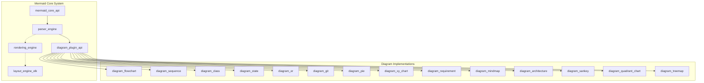
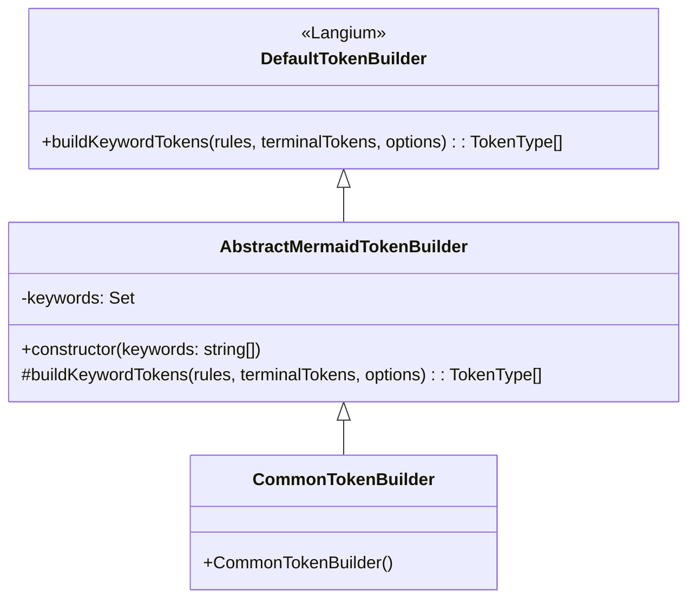
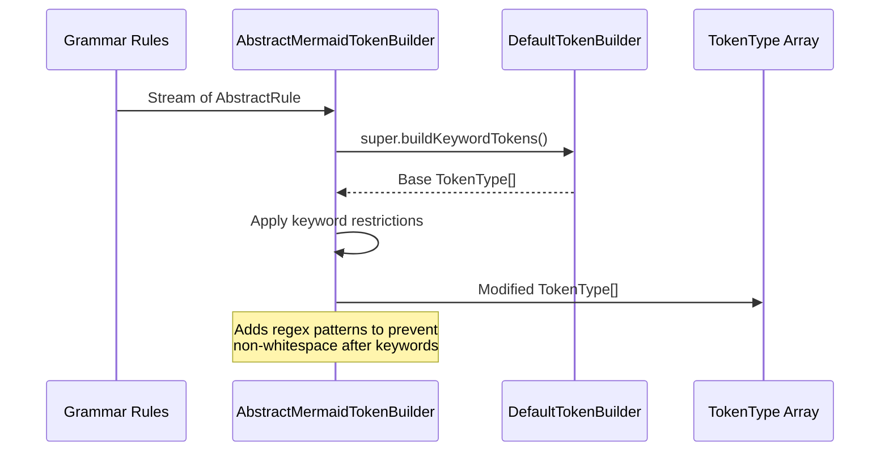
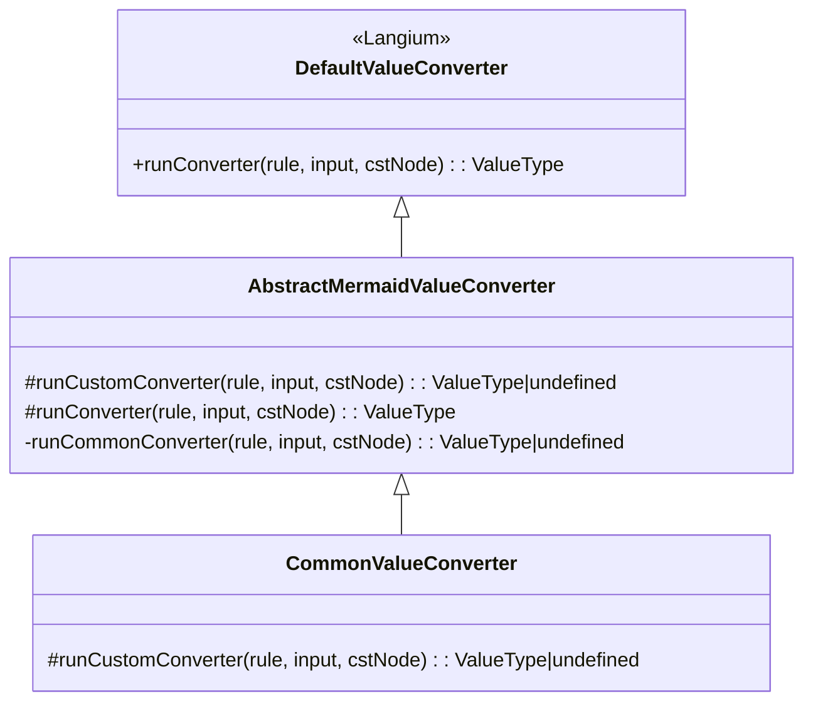
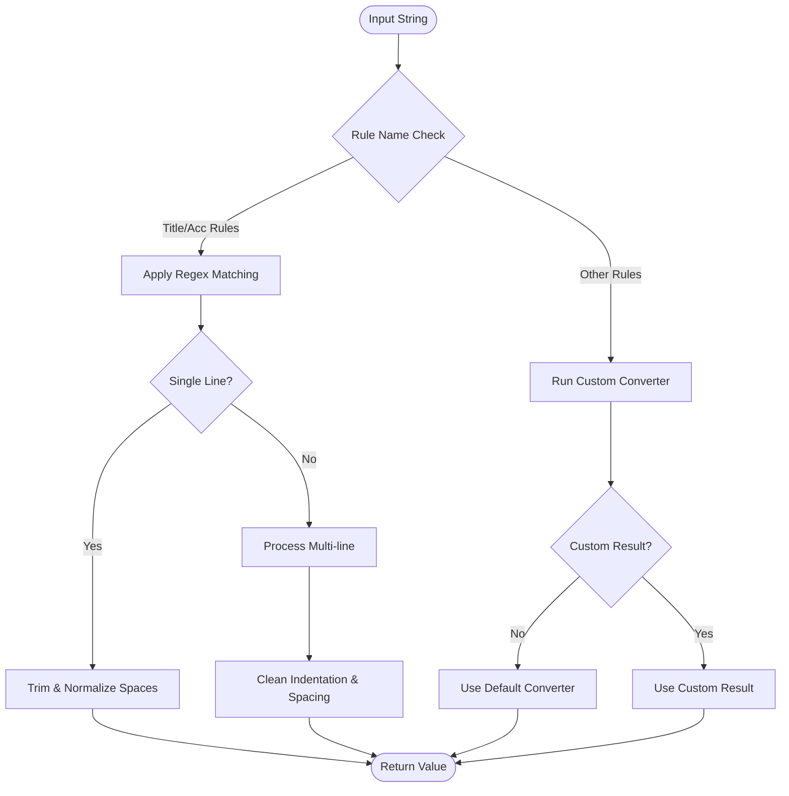
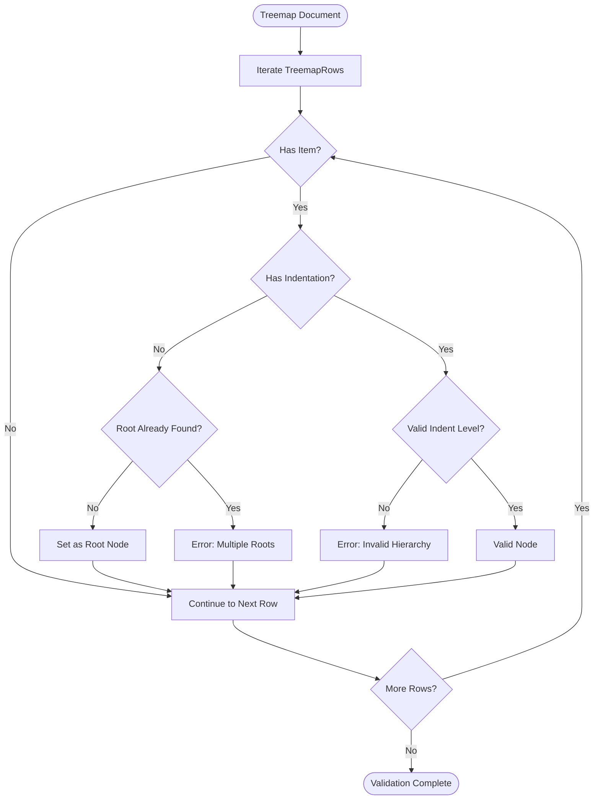
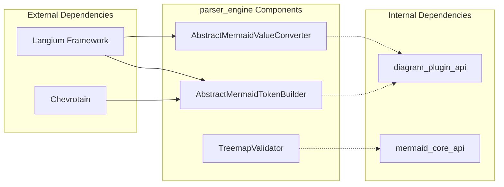
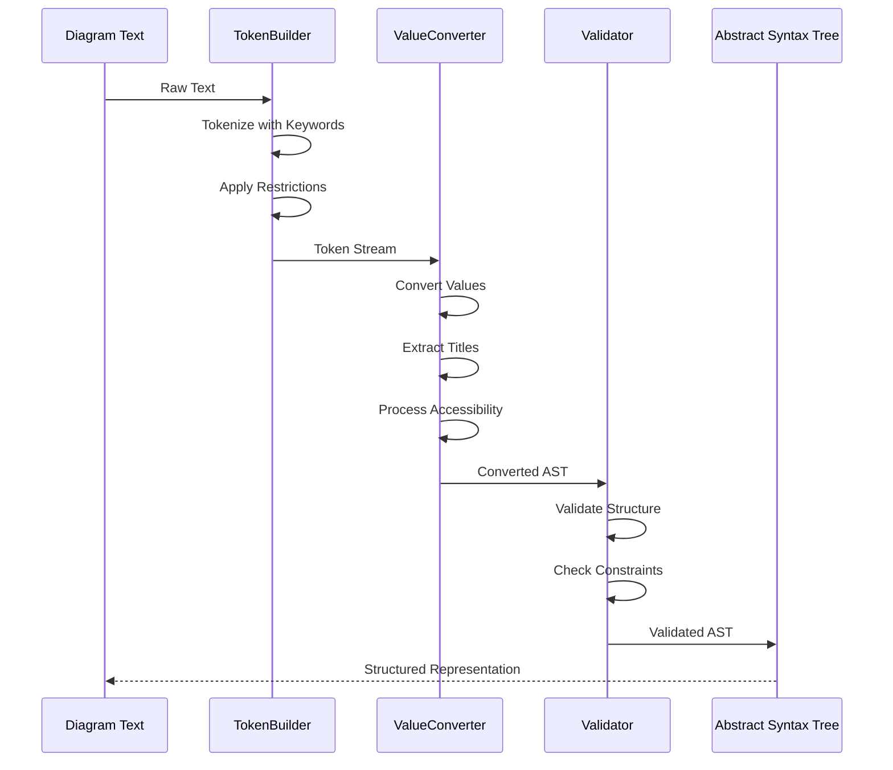
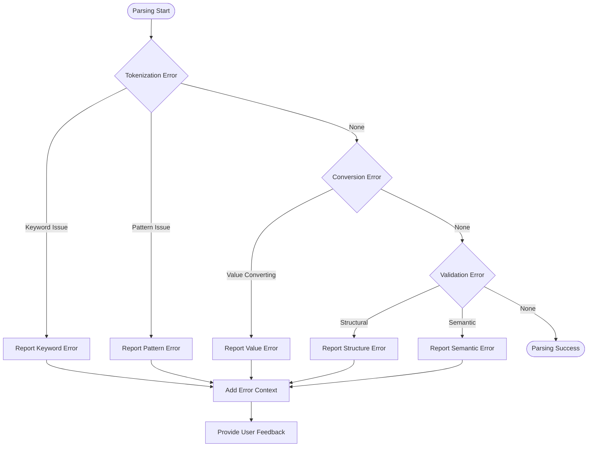

# Parser Engine Module Documentation

## Introduction

The parser_engine module is a critical component of the Mermaid diagramming system that handles the parsing and validation of diagram syntax. Built on top of the Langium framework, it provides the foundation for converting textual diagram definitions into structured Abstract Syntax Trees (AST) that can be processed by other parts of the system. The module specializes in tokenization, value conversion, and diagram-specific validation rules.

## Architecture Overview

The parser_engine module serves as the linguistic foundation of the Mermaid system, positioned between the core API and individual diagram implementations. It provides abstract base classes and validation mechanisms that diagram-specific parsers extend and customize.



## Core Components

### AbstractMermaidTokenBuilder

**Location**: `packages.parser.src.language.common.tokenBuilder.AbstractMermaidTokenBuilder`

The AbstractMermaidTokenBuilder extends Langium's DefaultTokenBuilder to provide Mermaid-specific tokenization logic. It handles the creation of token types from grammar rules with special handling for keywords to ensure proper parsing constraints.

**Key Features:**
- Keyword restriction enforcement
- Custom regex pattern modification
- Integration with Langium's tokenization system

**Architecture:**


**Process Flow:**


### AbstractMermaidValueConverter

**Location**: `packages.parser.src.language.common.valueConverter.AbstractMermaidValueConverter`

The AbstractMermaidValueConverter extends Langium's DefaultValueConverter to provide Mermaid-specific value conversion logic. It handles the conversion of parsed text values into appropriate JavaScript types, with special handling for titles and accessibility features.

**Key Features:**
- Title extraction and formatting
- Accessibility description handling
- Multi-line text processing
- Custom converter extensibility

**Architecture:**


**Value Conversion Process:**


### TreemapValidator

**Location**: `packages.parser.src.language.treemap.treemap-validator.TreemapValidator`

The TreemapValidator provides diagram-specific validation for treemap diagrams, ensuring structural correctness. It validates that treemap diagrams contain only one root node, which is essential for proper hierarchical rendering.

**Key Features:**
- Single root node validation
- Indentation-based hierarchy checking
- Error reporting with precise location information

**Validation Process:**


## Module Dependencies

The parser_engine module has specific dependencies and relationships with other system components:



## Integration with Diagram Types

The parser_engine provides the foundation for all diagram-specific parsers. Each diagram type extends the abstract base classes to implement custom parsing logic:

```mermaid
graph TD
    subgraph "Parser Engine Foundation"
        ATB[AbstractMermaidTokenBuilder]
        AVC[AbstractMermaidValueConverter]
    end
    
    subgraph "Diagram-Specific Extensions"
        FBP[Flowchart Parser]
        SP[Sequence Parser]
        CP[Class Parser]
        STP[State Parser]
        EPP[ER Parser]
        GGP[Git Parser]
        PPP[Pie Parser]
        XYP[XYChart Parser]
        RP[Requirement Parser]
        MP[Mindmap Parser]
        AP[Architecture Parser]
        SAP[Sankey Parser]
        QCP[Quadrant Parser]
        TMP[Treemap Parser]
    end
    
    ATB -.-> FBP
    ATB -.-> SP
    ATB -.-> CP
    ATB -.-> STP
    ATB -.-> EPP
    ATB -.-> GGP
    ATB -.-> PPP
    ATB -.-> XYP
    ATB -.-> RP
    ATB -.-> MP
    ATB -.-> AP
    ATB -.-> SAP
    ATB -.-> QCP
    ATB -.-> TMP
    
    AVC -.-> FBP
    AVC -.-> SP
    AVC -.-> CP
    AVC -.-> STP
    AVC -.-> EPP
    AVC -.-> GGP
    AVC -.-> PPP
    AVC -.-> XYP
    AVC -.-> RP
    AVC -.-> MP
    AVC -.-> AP
    AVC -.-> SAP
    AVC -.-> QCP
    AVC -.-> TMP
```



## Data Flow

The parser_engine module processes diagram text through a structured pipeline:



## Configuration and Extensibility

The parser_engine module is designed for extensibility, allowing diagram types to customize parsing behavior:

### Token Builder Extension
```typescript
class CustomDiagramTokenBuilder extends AbstractMermaidTokenBuilder {
  constructor() {
    super(['customKeyword1', 'customKeyword2']);
  }
}
```

### Value Converter Extension
```typescript
class CustomDiagramValueConverter extends AbstractMermaidValueConverter {
  protected runCustomConverter(
    rule: GrammarAST.AbstractRule,
    input: string,
    cstNode: CstNode
  ): ValueType | undefined {
    // Custom conversion logic
    return undefined;
  }
}
```

### Validator Registration
```typescript
function registerCustomValidationChecks(services: CustomServices) {
  const validator = services.validation.CustomValidator;
  const registry = services.validation.ValidationRegistry;
  const checks: ValidationChecks<CustomAstType> = {
    CustomNode: validator.validateCustomNode.bind(validator),
  };
  registry.register(checks, validator);
}
```

## Error Handling

The parser_engine module implements comprehensive error handling at multiple levels:



## Performance Considerations

The parser_engine module is optimized for performance through several mechanisms:

1. **Keyword Set Optimization**: Uses Set data structure for O(1) keyword lookup
2. **Regex Caching**: Pre-compiled regex patterns for common conversions
3. **Stream Processing**: Leverages Langium's stream-based processing for memory efficiency
4. **Validation Short-circuiting**: Early termination on critical validation failures

## Testing Strategy

The parser_engine module follows a comprehensive testing approach:

- **Unit Tests**: Individual component testing for token builders and value converters
- **Integration Tests**: Cross-component interaction validation
- **Grammar Tests**: End-to-end parsing validation with sample diagrams
- **Performance Tests**: Parsing speed and memory usage benchmarks
- **Regression Tests**: Prevention of parsing behavior changes

## Related Documentation

For more information about related modules, see:

- [mermaid_core_api](mermaid_core_api.md) - Core API and diagram lifecycle management
- [diagram_plugin_api](diagram_plugin_api.md) - Diagram definition and plugin architecture
- [rendering_engine](rendering_engine.md) - Diagram rendering and visualization
- Individual diagram type documentations for specific parsing implementations

## Summary

The parser_engine module provides the linguistic foundation for the Mermaid diagramming system. Through its abstract base classes and validation framework, it enables consistent and reliable parsing across all diagram types while allowing for diagram-specific customization. The module's design emphasizes extensibility, performance, and maintainability, making it a robust foundation for the entire Mermaid ecosystem.